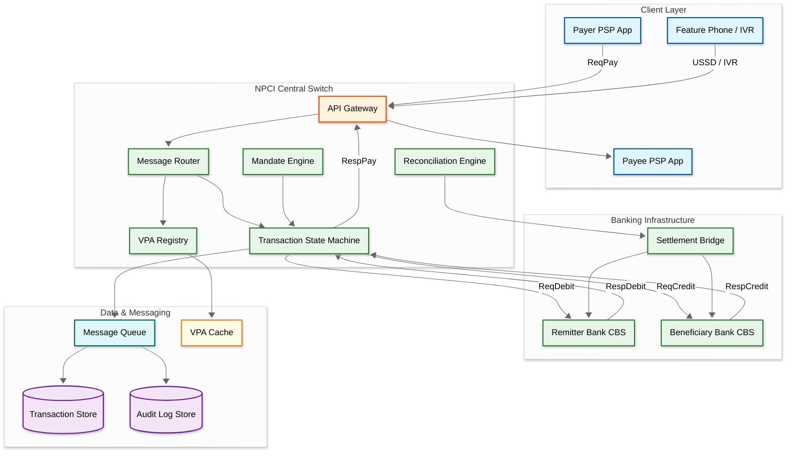

# UPI Real-Time Payment System Design

## System Overview

UPI (Unified Payments Interface) is India's real-time payment system built by NPCI that processed 228.3 billion transactions worth ₹299.7 lakh crore in 2025, averaging 698 million daily transactions. It is a four-party model (payer PSP, payee PSP, remitter bank, beneficiary bank) with NPCI's central switch orchestrating all message routing. The system uniquely combines a virtual payment address (VPA) layer that decouples identity from bank accounts, multiple payment modes (P2P, P2M, QR, intent, collect, mandate), and extensions like UPI Lite (offline NFC), credit line on UPI, and Project Nexus (cross-border linkage).

---

## Key Characteristics

| Characteristic | Description |
|---------------|-------------|
| **Read/Write Pattern** | Write-heavy---each transaction involves 4--6 message hops across multiple banks and NPCI switch |
| **Latency Sensitivity** | Very High---end-to-end transaction must complete within 30 seconds per NPCI SLA, with sub-2-second p50 target |
| **Consistency Model** | Strong consistency for financial debits/credits; eventual consistency for transaction status reconciliation |
| **Financial Integrity** | Zero tolerance---double-debit prevention, idempotent processing, reconciliation at T+0 |
| **Data Volume** | Very High---700M+ daily transactions, 400M+ registered VPAs, 500+ member banks |
| **Architecture Model** | Hub-and-spoke with NPCI central switch; ISO 8583/XML messaging; PKI-based encryption |
| **Regulatory Framework** | RBI-regulated, PPI guidelines, data localization mandate, two-factor authentication |
| **Complexity Rating** | **Very High** |

---

## Quick Navigation

| Document | Description |
|----------|-------------|
| [01 - Requirements & Estimations](./01-requirements-and-estimations.md) | Functional/non-functional requirements, capacity planning, SLOs |
| [02 - High-Level Design](./02-high-level-design.md) | Architecture diagrams, data flow, key decisions |
| [03 - Low-Level Design](./03-low-level-design.md) | Data models, API design, algorithms (pseudocode) |
| [04 - Deep Dive & Bottlenecks](./04-deep-dive-and-bottlenecks.md) | Transaction lifecycle deep dive, double-debit prevention, timeout handling |
| [05 - Scalability & Reliability](./05-scalability-and-reliability.md) | Scaling strategies, fault tolerance, disaster recovery |
| [06 - Security & Compliance](./06-security-and-compliance.md) | Threat model, RBI compliance, PKI infrastructure, data localization |
| [07 - Observability](./07-observability.md) | Metrics, logging, tracing, alerting, SLI/SLO dashboards |
| [08 - Interview Guide](./08-interview-guide.md) | 45-min pacing, trade-offs, trap questions, scoring rubric |
| [09 - Insights](./09-insights.md) | Key architectural insights, patterns, lessons |

---

## What Differentiates This from Related Systems

| Aspect | UPI (This) | Credit Card Networks | SWIFT | Mobile Wallets | ACH/NEFT |
|--------|------------|---------------------|-------|----------------|----------|
| **Settlement Speed** | Real-time (instant credit to beneficiary) | T+1 to T+3 batch settlement via acquirer/issuer network | T+1 to T+5 via correspondent banking chain | Instant within wallet ecosystem; delayed for bank withdrawal | T+0 to T+1 batch settlement in defined windows |
| **Architecture** | Hub-and-spoke with NPCI central switch; 4-party model (payer PSP, payee PSP, remitter bank, beneficiary bank) | 4-party model (issuer, acquirer, merchant, network) with global switches | Store-and-forward messaging via correspondent banks | Closed-loop within provider; PSP integration for off-ramp | Batch file exchange between banks via clearing house |
| **Identity Layer** | VPA decouples identity from bank account; user@psp syntax eliminates sharing account numbers | PAN (card number) tied to issuer; tokenization adds abstraction layer | SWIFT/BIC codes identify institutions; IBAN identifies accounts | Phone number or user ID within wallet ecosystem | Account number + IFSC required; no abstraction layer |
| **Authentication** | Two-factor: device binding (possession) + UPI PIN (knowledge) per transaction | CVV + OTP or 3DS challenge for online; chip + PIN at POS | No end-user auth; bank-level authorization only | Wallet PIN or biometric within app | Single-factor: net banking credentials or MPIN |
| **Transaction Cost** | Zero MDR for P2P; ≤ 0.3% for P2M (interchange-based, RBI-mandated caps) | 1.5--3% MDR split across interchange, network fee, acquirer markup | $15--$45 per wire transfer plus FX markup | 0--1.5% depending on funding source | Flat fee per transaction (₹2--₹25 based on amount) |
| **Use Cases** | P2P transfers, merchant QR payments, bill payments, mandates, IPO applications, tax payments | Online/offline merchant payments, recurring subscriptions, cross-border commerce | High-value cross-border institutional transfers, trade finance | Small-value P2P, in-app purchases, transit payments | Salary disbursement, vendor payments, bulk transfers |
| **Offline Capability** | UPI Lite supports NFC-based offline transactions up to ₹500 without PIN | Contactless tap (offline floor limits vary by issuer) | Not applicable (institutional system) | Limited offline via pre-loaded balance on device | No offline capability |
| **Cross-Border** | Project Nexus linking UPI to Singapore PayNow, UAE, France, etc. | Global acceptance via Visa/Mastercard network | Primary mechanism for cross-border institutional transfers | Typically domestic only; select bilateral partnerships | Domestic only; SWIFT used for cross-border |
| **Regulatory Model** | RBI-regulated; NPCI as non-profit operator; data localization mandatory | Multi-jurisdictional; PCI-DSS for data; Reg II for debit interchange | SWIFT oversight by G10 central banks; sanctions compliance | PPI guidelines per country; lighter regulation than banking | Central bank regulated; Payments Council oversight |

---

## High-Level Architecture Overview

---

## Transaction Flow Summary

The UPI payment lifecycle follows a strict message sequence through the four-party model:

1. **Initiation**: Payer opens PSP app, enters payee VPA/QR/mobile, amount, and selects funding account
2. **PIN Authentication**: PSP app encrypts UPI PIN with device-bound key and sends ReqPay to NPCI switch
3. **VPA Resolution**: NPCI resolves payee VPA to beneficiary bank account via cached registry lookup
4. **Debit Leg**: NPCI sends ReqDebit to remitter bank CBS; bank validates balance, debits account, responds with RespDebit
5. **Credit Leg**: NPCI sends ReqCredit to beneficiary bank CBS; bank credits payee account, responds with RespCredit
6. **Confirmation**: NPCI sends RespPay to both payer and payee PSP apps with final transaction status
7. **Reconciliation**: T+0 net settlement file generated; banks settle net positions via RBI settlement system

If any leg fails or times out (30s hard cutoff), the transaction state machine triggers an auto-reversal flow that mirrors the original path in reverse.

---

## What Makes This System Unique

1. **Four-Party Hub-and-Spoke with Central Switch**: Unlike card networks where the acquirer and issuer communicate bilaterally through the network, UPI routes every transaction through NPCI's central switch, which orchestrates the entire message flow---ReqPay from payer PSP, debit at remitter bank, credit at beneficiary bank, and ReqCredit to payee PSP. This centralization simplifies interoperability across 500+ banks but makes the NPCI switch a single point of throughput constraint, requiring extreme horizontal scaling of the switch fabric.

2. **VPA as an Identity Abstraction Layer**: The Virtual Payment Address (user@psp) completely decouples the payer's identity from their underlying bank account. A single VPA can be mapped to any of up to 5 linked bank accounts, and the mapping can change without notifying counterparties. This creates a DNS-like resolution layer where the PSP app performs VPA-to-account resolution at transaction time, adding a lookup hop but eliminating the need to share sensitive account numbers.

3. **Sub-Second Debit with 30-Second End-to-End SLA**: The system must debit the payer's account within milliseconds of PIN validation but allows up to 30 seconds for end-to-end completion (including credit to beneficiary). This asymmetry creates a critical "debit-without-credit" window where the payer's money has left their account but hasn't reached the beneficiary---requiring robust reversal mechanisms, timeout-based auto-reversals, and T+0 reconciliation to ensure no funds are permanently stuck.

4. **UPI Lite: On-Device Wallet for Micropayments**: UPI Lite maintains a small-value wallet (up to ₹2,000 balance, transactions up to ₹500) on the device itself, bypassing the CBS (Core Banking System) entirely. Transactions complete in under 200ms without UPI PIN, and the on-device ledger syncs with the issuer bank periodically. This architecture trades consistency for speed, accepting that the on-device balance may briefly diverge from the bank's view.

5. **Mandate Engine for Recurring Payments**: UPI AutoPay allows merchants to register e-mandates that auto-debit consumers on scheduled dates. The mandate registration requires one-time UPI PIN authentication, after which subsequent debits execute without user intervention. This creates a scheduled batch processing system layered on top of a real-time payment rail, with pre-debit notifications (24 hours before) and consumer-revocable controls.

6. **Credit Line on UPI: Lending Rails Without a Card**: RBI's 2023 framework allows pre-approved credit lines from banks to be accessed directly via UPI, turning the payment rail into a lending distribution channel. The PSP app displays available credit alongside bank balances, and selecting it triggers a credit disbursal + UPI payment in a single atomic flow. This blurs the boundary between payment and lending infrastructure.

7. **Multi-Modal Payment Initiation**: UPI supports an unusually wide range of initiation methods---QR scan, deep link intent, collect request, NFC tap, IVR voice, missed call, USSD menu---all converging into the same four-party message flow at the NPCI switch. Each initiation mode has different latency profiles, security characteristics, and user demographics (smartphone vs. feature phone). The switch must normalize all these entry points into a uniform transaction format while respecting mode-specific constraints (e.g., UPI 123PAY transactions have lower limits and simplified authentication).

8. **T+0 Net Settlement Across 500+ Banks**: Unlike card networks that settle in T+1 or T+2 cycles, UPI computes net settlement positions across all member banks multiple times per day. NPCI generates a multilateral net settlement file where each bank's net payable/receivable position is calculated from millions of individual transactions. This file is submitted to RBI's settlement system, which executes the actual fund transfers between banks' settlement accounts. The reconciliation must achieve 100% accuracy---any mismatch triggers a hold on the entire settlement batch.

---

## Key Engineering Challenges

| Challenge | Why It Matters | Design Implication |
|-----------|---------------|-------------------|
| **Central switch as throughput bottleneck** | Every transaction traverses NPCI; no bilateral shortcuts | Horizontal partitioning of switch by bank-pair or VPA-hash; active-active multi-datacenter deployment |
| **Heterogeneous bank CBS latency** | Large banks respond in < 500ms; small banks take 5--10s | Timeout tiering per bank; circuit breakers to isolate slow banks from affecting system-wide latency |
| **Double-debit prevention** | Network retries can cause same transaction to be processed twice | Idempotency keys at every hop; transaction reference number (TRN) as global dedup key |
| **Debit-credit atomicity gap** | Money debited from payer but not yet credited to payee | Saga pattern with compensating transactions; auto-reversal state machine with exponential backoff |
| **VPA resolution at scale** | 400M+ VPAs must resolve in < 100ms per lookup | Distributed cache partitioned by PSP handle; near-real-time invalidation on VPA re-mapping |
| **Device binding security** | SIM swap and device cloning attacks | Hardware-backed key storage; SIM change detection; re-registration with full KYC re-verification |
| **Festival-day capacity planning** | 4x traffic spikes on predictable dates | Pre-provisioned capacity pools; bank CBS warm-up protocols; graceful degradation for non-critical flows |
| **Regulatory data localization** | All data must stay within India | Domestic-only datacenter topology; no CDN caching of transaction data; audit trail for data residency |

---

## Quick Reference: Scale Numbers

| Metric | Value | Notes |
|--------|-------|-------|
| Registered VPAs | ~400M+ | Unique virtual payment addresses across all PSPs |
| Monthly active users | ~300M | Users with at least one transaction per month |
| Daily transactions | ~700M | Average across P2P, P2M, mandates, and bill payments |
| Peak daily transactions | ~1B+ | During festival days (Diwali, salary days, IPO windows) |
| Member banks | 500+ | Banks connected to NPCI switch as issuers/acquirers |
| PSP apps | 30+ | Third-party apps with UPI integration (phone-based) |
| Average TPS | ~8,100 | 700M transactions / 86,400 seconds |
| Peak TPS | ~32,000+ | 4x average during concentrated peak hours |
| Transaction success rate | ~97%+ | NPCI-reported technical success rate |
| Average transaction value | ~₹1,800 | Blended across P2P (higher) and P2M (lower) |
| P2M share of volume | ~60% | Merchant payments dominate transaction count |
| UPI Lite transactions/day | ~15M | Growing rapidly for small-value payments |
| Mandate registrations | ~100M+ | Active recurring payment mandates |
| End-to-end latency (p50) | ~2s | Including all 4--6 message hops |
| MDR cap (P2M) | ≤ 0.3% | RBI-mandated; zero for transactions under ₹2,000 |

---

## Related Designs

| Design | Relevance |
|--------|-----------|
| [8.2 - Stripe/Razorpay](../8.2-stripe-razorpay/) | Payment gateway patterns, idempotency, PSP integration architecture |
| [8.4 - Digital Wallet](../8.4-digital-wallet/) | Ledger patterns, double-entry bookkeeping, on-device wallet (UPI Lite parallel) |
| [8.5 - Fraud Detection System](../8.5-fraud-detection-system/) | Real-time fraud scoring for transaction risk assessment |
| [8.6 - Distributed Ledger Core Banking](../8.6-distributed-ledger-core-banking/) | CBS integration patterns, account management, debit/credit operations |
| [8.9 - Buy Now Pay Later](../8.9-buy-now-pay-later/) | Mandate/AutoPay patterns, recurring payment collection |
| [1.5 - Distributed Log-Based Broker](../1.5-distributed-log-based-broker/) | Event streaming for transaction state machine, audit trail |
| [1.17 - Distributed Transaction Coordinator](../1.17-distributed-transaction-coordinator/) | Saga/2PC patterns for multi-party transaction orchestration |

---

## UPI Ecosystem Participants

Understanding the roles in the UPI ecosystem is critical for system design interviews:

| Participant | Role | Examples |
|-------------|------|----------|
| **NPCI** | Central switch operator; defines standards, manages VPA registry, performs settlement | Non-profit; owned by consortium of banks |
| **Payer PSP** | Hosts payer's UPI app; manages device binding, PIN encryption, VPA creation | Third-party app providers, bank apps |
| **Payee PSP** | Receives payment notifications; manages payee's VPA and QR generation | Same set of PSP apps (any app can be payer or payee) |
| **Remitter Bank** | Holds payer's account; executes debit on NPCI instruction after PIN validation | Any RBI-licensed bank connected to UPI |
| **Beneficiary Bank** | Holds payee's account; executes credit on NPCI instruction | Any RBI-licensed bank connected to UPI |
| **TPAP (Third-Party App Provider)** | Builds consumer-facing UPI app; operates under a sponsor bank's PSP license | Major fintech apps; must partner with a PSP bank |
| **Payment Aggregator** | Aggregates merchant onboarding; provides unified API for merchants to accept UPI | Licensed by RBI; connects merchants to acquiring banks |
| **RBI** | Regulator; sets transaction limits, MDR caps, data localization rules, dispute resolution timelines | Central bank of India |

---

## Sources

- NPCI --- UPI Product Statistics and Ecosystem Reports (2025)
- Reserve Bank of India --- Guidelines on Regulation of Payment Aggregators and Payment Gateways
- NPCI --- UPI Technical Specifications and API Documentation (v2.0)
- RBI --- Framework for Facilitating Small Value Digital Payments in Offline Mode (UPI Lite)
- NPCI --- UPI AutoPay: Mandate Management Technical Standards
- RBI --- Circular on Enabling Credit Line on UPI (2023)
- BIS --- Project Nexus: Connecting Fast Payment Systems Across Borders
- NPCI --- BHIM UPI Architecture and Security Framework
- Indian Banks' Association --- UPI Ecosystem: Technology and Regulatory Landscape
- Digital Payments Council of India --- UPI Scalability and Performance Benchmarks
- RBI --- Master Direction on Digital Payment Security Controls (2021)
- NPCI --- UPI 123PAY: Feature Phone Payment Architecture Specifications
- RBI --- Tokenisation Framework for Card and UPI Transactions
- NPCI --- UPI Transaction and Technical Decline Code Reference Guide
