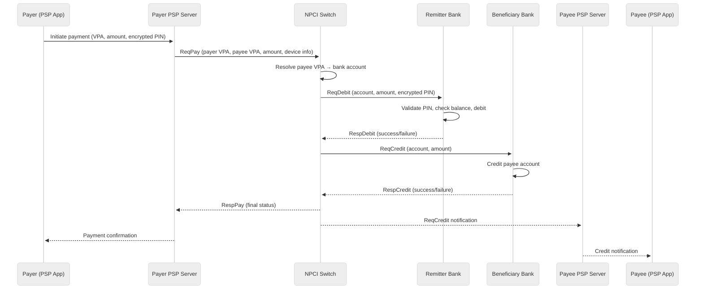

# Requirements & Estimations

## Functional Requirements

### Core Features

| # | Feature | Description |
|---|---------|-------------|
| F1 | **P2P Money Transfer** | Send money to any UPI user via VPA (user@psp), mobile number, or bank account number + IFSC; supports send (push) and collect (pull) flows |
| F2 | **P2M QR Payments** | Pay merchants via static Bharat QR (merchant VPA embedded), dynamic QR (amount pre-filled), or interoperable QR standards; support both scan-and-pay and show-and-pay |
| F3 | **Intent and Deep Link Payments** | Process payments triggered via intent URIs (upi://pay?pa=merchant@psp&am=100) from merchant apps, enabling in-app payment without QR scanning |
| F4 | **Collect Requests** | Allow payees to initiate payment requests that appear on payer's PSP app for approval; payer authenticates with UPI PIN to authorize debit |
| F5 | **VPA Management** | Create, modify, and delete virtual payment addresses; link and unlink up to 5 bank accounts per VPA; set default account for transactions |
| F6 | **Mandate / AutoPay** | Create, modify, and revoke recurring payment mandates with e-mandate registration; support one-time UPI PIN auth at creation, pre-debit notification (24h before), and auto-execution on schedule |
| F7 | **UPI Lite** | Maintain on-device wallet (≤ ₹2,000 balance) for small-value transactions (≤ ₹500) without UPI PIN; top-up from linked bank with PIN; NFC-based offline payments |
| F8 | **UPI 123PAY** | Enable feature phone payments via IVR (interactive voice response), missed call to predefined number, app-based USSD flow, and proximity sound-based payments |
| F9 | **Credit Line on UPI** | Display pre-approved credit lines from linked banks alongside account balances; select credit line as funding source; execute credit disbursal + payment as atomic operation |
| F10 | **Balance Inquiry** | Query real-time balance from linked bank accounts via encrypted request through NPCI switch to issuer CBS |
| F11 | **Transaction History** | Display paginated transaction history with status (success, failed, pending), counterparty details, timestamps, and transaction reference numbers |
| F12 | **Dispute Resolution** | Raise disputes for failed/incorrect transactions; track dispute status; auto-reversal for timeout-based failures; manual escalation to bank/NPCI for unresolved cases |
| F13 | **Multi-Bank Account Linking** | Link up to 5 bank accounts from different banks to a single VPA; select funding account per transaction; manage account nicknames and preferences |

### Out of Scope

| Feature | Reason |
|---------|--------|
| Merchant onboarding portal | Handled by acquiring banks and payment aggregators, not the UPI switch |
| Marketing and loyalty programs | Managed by individual PSP apps, not the core UPI rail |
| KYC verification | Performed by banks during account opening; UPI relies on existing bank KYC |
| Card-based payments | Separate rail (RuPay/Visa/Mastercard); UPI is account-to-account |
| International remittances | Handled by SWIFT/correspondent banking; Project Nexus covers limited corridors |

### User Roles

| Role | Capabilities |
|------|-------------|
| **Payer (Consumer)** | Initiate P2P/P2M payments, approve collect requests, manage VPAs, set mandates, view history, raise disputes |
| **Payee (Consumer/Merchant)** | Receive payments, send collect requests, generate QR codes, view settlement reports |
| **PSP App** | Host UPI functionality, manage device binding, route transactions to NPCI, display UI, handle notifications |
| **Remitter Bank** | Validate payer account, execute debit, respond to NPCI with debit confirmation or decline |
| **Beneficiary Bank** | Execute credit to payee account, respond to NPCI with credit confirmation |
| **NPCI Switch** | Route messages between PSPs and banks, enforce transaction rules, manage VPA registry, perform reconciliation |
| **RBI (Regulator)** | Set MDR caps, mandate two-factor auth, enforce data localization, define dispute resolution timelines |

---

## Transaction Flow: P2P Pay (Push)

The following diagram illustrates the message sequence for a standard P2P push payment, which is the most common UPI transaction type:



**Critical timing constraints:**
- Steps 1--2 (device to NPCI): < 500ms
- Steps 3--6 (NPCI to remitter bank round-trip): < 3s (CBS-dependent)
- Steps 7--9 (NPCI to beneficiary bank round-trip): < 3s
- Steps 10--12 (notifications): < 1s
- Total end-to-end hard timeout: 30 seconds

---

## Non-Functional Requirements

| Requirement | Target | Rationale |
|-------------|--------|-----------|
| **CAP Trade-off** | CP for financial transactions | Consistency over availability for debit operations; a user must never be double-debited even during network partitions |
| **Consistency** | Strong for debit/credit operations | Every debit must have a corresponding credit or reversal; eventual consistency acceptable for analytics and reporting pipelines |
| **Availability** | 99.95% (NPCI SLA) | Downtime of even 0.05% at 700M daily transactions means 350K failed transactions per day |
| **Latency (p50)** | < 2 seconds | End-to-end including device-to-PSP, PSP-to-NPCI, NPCI-to-bank CBS, and reverse path |
| **Latency (p95)** | < 5 seconds | Accounts for slower CBS responses from smaller banks |
| **Latency (p99)** | < 15 seconds | Upper bound before timeout-based reversal triggers |
| **Transaction Timeout** | 30 seconds | NPCI-mandated hard cutoff; transactions not completed within window trigger auto-reversal |
| **Durability** | Zero data loss | Every financial transaction must be persisted to durable storage before acknowledgment; WAL + synchronous replication |
| **Two-Factor Authentication** | Mandatory per debit | Device binding (something you have) + UPI PIN (something you know) for every debit transaction; UPI Lite exempted for ≤ ₹500 |
| **Data Localization** | 100% domestic storage | RBI mandate: all payment data must be stored and processed within India; no cross-border data transfer for transaction records |
| **Idempotency** | Guaranteed | Duplicate transaction requests (due to retries, network issues) must produce exactly-once financial effect |
| **Throughput** | 32,000+ TPS at peak | Must handle festival-day and salary-day spikes without degradation |

---

## Capacity Estimations

### Traffic

```
Registered VPAs:              400,000,000 (400M)
Monthly active users:         300,000,000 (300M)
Daily active users:           350,000,000+ (350M)
  (Note: DAU can exceed MAU fraction due to passive mandate executions)

Daily transactions:           700,000,000 (700M)
  P2P transfers:              210M (30%)
  P2M QR payments:            350M (50%)
  Mandate/AutoPay:            56M (8%)
  Bill payments:              42M (6%)
  Collect requests:           28M (4%)
  UPI Lite:                   14M (2%)

Average TPS:                  700M / 86,400 ≈ 8,100 TPS
Peak TPS:                     8,100 × 4 = ~32,000 TPS
  (Peaks during Diwali, salary days 1st/7th, IPO application windows)

Message hops per transaction: 4-6 (ReqPay → ReqDebit → RespDebit → ReqCredit → RespCredit → RespPay)
Effective message TPS (peak): 32,000 × 5 avg hops = 160,000 messages/sec at NPCI switch
```

### Storage

```
--- Transaction Records ---
Record size per transaction:   ~700 bytes (transaction ID, payer/payee VPA, amounts,
                               timestamps, status, bank refs, device fingerprint)
Daily growth:                  700M × 700 B = ~490 GB/day
Annual growth:                 ~180 TB/year
Retention:                     10 years (RBI mandate for financial records)

--- VPA Registry ---
VPA record size:               ~1.2 KB (VPA, linked accounts, default account,
                               PSP handle, creation date, status)
Total VPA storage:             400M × 1.2 KB = ~480 GB
Cache requirement:             ~500 GB (hot VPA mappings for resolution)

--- Mandate Registry ---
Mandate record size:           ~800 bytes (mandate ID, payer/payee, amount, frequency,
                               start/end date, status, last execution)
Total mandate storage:         100M × 800 B = ~80 GB

--- Bank Account Mappings ---
Account record size:           ~500 bytes (account number encrypted, IFSC, bank code,
                               account holder name, linked VPAs)
Total account storage:         600M accounts × 500 B = ~300 GB

--- UPI Lite Ledger (Aggregated) ---
On-device wallet state:        Stored on device; bank maintains shadow ledger
Shadow ledger per user:        ~200 bytes × 50M UPI Lite users = ~10 GB

--- Dispute Records ---
Dispute record size:           ~2 KB (dispute ID, transaction ref, reason, status,
                               timestamps, resolution details)
Daily disputes:                ~3.5M (0.5% of transactions)
Annual dispute storage:        3.5M × 365 × 2 KB = ~2.5 TB/year

--- Audit Logs ---
Log entry per message hop:     ~300 bytes
Daily audit log volume:        700M × 5 hops × 300 B = ~1 TB/day
Annual audit storage:          ~365 TB/year (compressed to ~70 TB with columnar encoding)
```

### Bandwidth

```
Average message size:          ~2 KB (XML/ISO 8583 payload + PKI headers + digital signature)
Peak message throughput:       160,000 messages/sec × 2 KB = ~320 MB/s = ~2.5 Gbps

Encryption overhead:           ~30% additional for PKI envelope
Effective peak bandwidth:      2.5 Gbps × 1.3 = ~3.25 Gbps (per NPCI switch cluster)

Multi-datacenter replication:  3.25 Gbps × 2 DCs = ~6.5 Gbps cross-DC
Bank CBS connectivity:         500+ banks × avg 50 Mbps per bank = ~25 Gbps aggregate

Total NPCI switch bandwidth:   ~45 Gbps peak (including internal routing, replication,
                               bank connectivity, and monitoring traffic)

VPA resolution cache sync:     ~500 GB dataset with ~5M updates/day × 1.2 KB = ~6 GB/day
```

---

## Capacity Summary Table

| Metric | Estimation | Calculation |
|--------|-----------|-------------|
| **DAU** | 350M+ users | 400M registered, ~85% monthly active, ~60% daily active |
| **Read:Write Ratio** | 1:3 (write-heavy) | Each payment = 4--6 write operations across participants |
| **QPS (average)** | ~8,100 TPS | 700M txns/day / 86,400s |
| **QPS (peak)** | ~32,000 TPS | 4x average during festival/salary days |
| **Storage (Year 1)** | ~180 TB | 700M × 365 × 700 bytes per transaction record |
| **Storage (Year 5)** | ~1.2 PB | 30% YoY growth compounded |
| **Bandwidth** | ~45 Gbps peak | 32K TPS × 4 message hops × 2KB avg message + overhead |
| **Cache Size** | ~500 GB | 400M VPA mappings × ~1.2KB each |

---

## SLO / SLA Table

| Metric | Target | Measurement |
|--------|--------|-------------|
| **Availability** | 99.95% | Measured at NPCI switch uptime; ≤ 4.38 hours downtime/year |
| **Latency (p50)** | < 2s | End-to-end from payer PIN entry to payee credit confirmation |
| **Latency (p95)** | < 5s | Including slower CBS responses from cooperative/small banks |
| **Latency (p99)** | < 15s | Upper bound before timeout-triggered auto-reversal |
| **Transaction Success Rate** | > 99.5% | Excluding user-initiated declines and insufficient balance |
| **Settlement Accuracy** | 100% | Zero mismatch in T+0 net settlement files between NPCI and member banks |
| **Dispute Resolution** | < 5 business days | RBI-mandated TAT for transaction reversal claims |
| **Auto-Reversal (Timeout)** | < 24 hours | Automatic reversal for transactions stuck beyond 30s timeout |
| **VPA Resolution** | < 100ms (p99) | Cached lookup from VPA to bank account mapping |
| **Mandate Execution** | 99.9% on-schedule | Pre-registered mandates must execute within the scheduled window |

---

## Key Estimation Insights

1. **Message amplification makes the switch the bottleneck**: A single user-initiated transaction generates 4--6 internal message hops at the NPCI switch. At 32,000 peak TPS, the switch must handle 160,000+ messages per second---each requiring cryptographic verification, routing lookup, and state machine advancement. The switch fabric's throughput, not individual bank CBS capacity, is the primary scaling constraint.

2. **Audit log volume dwarfs transaction storage**: At ~1 TB/day of audit logs (every message hop logged for regulatory compliance), audit storage grows 2x faster than transaction records. Efficient columnar compression and tiered storage (hot/warm/cold) are essential to manage the 10-year retention mandate without prohibitive storage costs.

3. **VPA resolution is the most latency-sensitive read path**: Every transaction begins with resolving the payee's VPA to a bank account. With 400M+ VPAs and 8,100+ TPS, this lookup must complete in under 100ms. A distributed cache layer (partitioned by PSP handle suffix) with near-100% hit rate is critical---cache misses that fall through to the VPA registry database would add unacceptable latency.

4. **Peak-to-average ratio is moderate but concentrated**: The 4x peak-to-average ratio is driven by predictable patterns (month-start salary days, festival days, IPO application deadlines). Unlike random spikes, these peaks are forecastable, enabling pre-scaling of switch capacity and pre-warming of bank CBS connection pools hours before anticipated load.

5. **The 30-second timeout creates a "limbo window" problem**: Between debit and credit, funds exist in a neither-here-nor-there state. With 700M daily transactions and ~1% entering this limbo (7M transactions/day), the auto-reversal and reconciliation system must process millions of "stuck" transactions daily. Each requires a reversal message chain as complex as the original payment, effectively increasing system load by 1--2%.

6. **UPI Lite trades consistency for throughput**: By moving small-value transactions off-CBS to on-device wallets, UPI Lite eliminates the bank round-trip entirely. This converts a 4-hop distributed transaction into a local device operation completing in < 200ms. However, the periodic sync between device ledger and bank shadow ledger introduces a reconciliation challenge at scale (50M+ UPI Lite users syncing asynchronously).

---

## Failure Modes & Recovery Requirements

| Failure Scenario | Expected Behavior | Recovery Mechanism |
|-----------------|-------------------|-------------------|
| **Debit success, credit timeout** | Payer debited but payee not credited within 30s | Auto-reversal triggered by NPCI; refund to payer within T+1; reconciliation flags mismatch |
| **Duplicate ReqPay** | Network retry sends same transaction twice | Idempotency key (transaction reference number) ensures exactly-once processing at NPCI switch |
| **Remitter bank CBS down** | Debit request times out | NPCI returns RespPay with failure code; payer sees "bank unavailable"; no financial impact |
| **Beneficiary bank CBS down** | Debit completed but credit cannot be posted | NPCI holds debit and retries credit for up to 30s; if still failing, triggers reversal at remitter bank |
| **NPCI switch partial failure** | One switch node fails mid-transaction | Active-active switch fabric routes subsequent hops through healthy node; transaction state persisted in shared store |
| **PSP app crash after PIN entry** | User closes app or app crashes after submitting PIN | Transaction continues server-side; PSP server polls NPCI for status; result delivered via push notification |
| **VPA cache stale** | VPA recently re-mapped to different bank account | Cache miss triggers synchronous lookup to VPA registry; adds ~200ms latency but ensures correctness |
| **UPI Lite offline sync failure** | Device unable to sync on-device ledger with bank | Transactions still valid locally; sync retried on next connectivity; bank shadow ledger updated on reconciliation |
| **Mandate execution on holiday** | Scheduled mandate falls on bank holiday | Execution deferred to next business day; pre-debit notification adjusted accordingly |

---

## Regulatory & Compliance Requirements

| Regulation | Requirement | System Impact |
|-----------|-------------|---------------|
| **RBI Data Localization** | All payment data stored and processed within India | No cross-border data replication; domestic-only datacenter deployment |
| **Two-Factor Authentication** | Device binding + UPI PIN for every debit | Device registration flow; PIN encryption with device-bound keys; hardware security module integration |
| **Zero MDR (< ₹2,000)** | No merchant discount rate for small-value P2M transactions | Revenue model relies on government subsidy; interchange calculation engine must enforce caps |
| **Transaction Limits** | ₹1 lakh per transaction (₹2 lakh for specific categories like capital markets, taxes) | Limit enforcement at PSP and NPCI layers; category-based limit lookup |
| **Grievance Redressal** | Customer complaints resolved within 30 days; escalation to RBI ombudsman | Dispute tracking system with SLA timers; auto-escalation workflows |
| **Fraud Reporting** | Suspicious transactions reported to FIU-IND within prescribed timelines | Real-time fraud scoring; STR (Suspicious Transaction Report) generation pipeline |
| **Accessibility** | UPI 123PAY for feature phone users; inclusive design mandate | IVR-based payment flow; USSD fallback; missed-call payment initiation |
| **Interoperability** | Any PSP app can pay any other PSP app; no walled gardens | NPCI switch ensures full mesh interoperability; no bilateral PSP agreements needed |

---

## Key Assumptions

1. **NPCI operates the central switch** as a non-profit entity owned by a consortium of banks; the system design focuses on the switch and ecosystem, not a single bank's internal CBS architecture.
2. **Bank CBS response times vary significantly**: large private banks respond in < 500ms while small cooperative banks may take 5--10 seconds, creating a long-tail latency distribution.
3. **Device binding is already established**: the PSP app has completed device registration, SIM binding, and initial account linking before the first transaction.
4. **PKI infrastructure is pre-provisioned**: digital certificates for message signing and encryption are managed by NPCI's certificate authority and distributed to all participants.
5. **Net settlement happens via RBI's RTGS**: NPCI calculates net positions across all member banks and submits settlement instructions to RBI's Real-Time Gross Settlement system at end of day.
