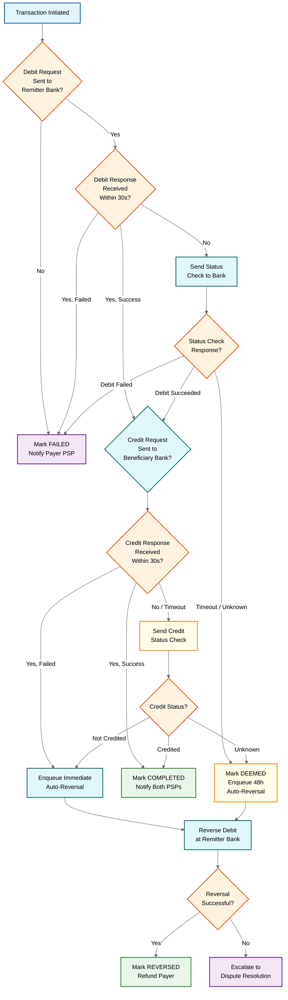

# UPI Real-Time Payment System: Deep Dive & Bottlenecks

## Overview

This document examines the three most critical components of a UPI-scale real-time payment system: the central routing switch, double-debit prevention via idempotency, and the multilateral net settlement engine. Each component is analyzed for failure modes, race conditions, and mitigation strategies.

---

## Critical Component 1: NPCI Central Switch

### Why Critical

The central switch is the single routing hub for every UPI transaction — over 700 million per day at peak. Every payment, regardless of originating or destination bank, flows through this switch. Any downtime or degradation directly translates to a national payment outage affecting hundreds of millions of users.

### How It Works

The switch is a stateless message router. It receives ISO 8583/XML-formatted messages from Payment Service Providers (PSPs), resolves the payee's Virtual Payment Address (VPA) to the correct destination PSP and bank, routes the debit and credit legs of the transaction, and records transaction state in an external persistent store.

**Message Processing Pipeline:**

1. **Parse** — Deserialize incoming ISO 8583/XML payload, extract transaction metadata (amount, payer VPA, payee VPA, request ID)
2. **Validate** — Check message integrity (HMAC signature), verify PSP registration, enforce transaction limits (per-transaction, daily cumulative)
3. **Resolve Destination** — Look up payee VPA in the distributed VPA registry to determine the destination PSP and bank code
4. **Route** — Forward the debit request to the remitter bank's CBS, await acknowledgment, then forward the credit request to the beneficiary bank
5. **Await Response** — Hold transaction state (in external store, not in-process memory) while waiting for bank CBS responses within the 30-second SLA window
6. **Complete** — Aggregate debit and credit responses, send final status callback to the originating PSP, log for settlement

```
FUNCTION ProcessUPITransaction(message):
    parsed = ParseISO8583(message)
    IF NOT ValidateSignature(parsed, parsed.pspKey):
        RETURN TechnicalDecline("INVALID_SIGNATURE")

    IF ExceedsTransactionLimit(parsed.payerVPA, parsed.amount):
        RETURN BusinessDecline("LIMIT_EXCEEDED")

    destination = VPARegistry.Resolve(parsed.payeeVPA)
    IF destination IS NULL:
        RETURN TechnicalDecline("VPA_NOT_FOUND")

    txnState = TransactionStore.Create(parsed.requestId, INITIATED)

    debitResponse = RouteToBank(destination.remitterBank, DebitRequest(parsed))
    IF debitResponse.status != SUCCESS:
        TransactionStore.Update(parsed.requestId, FAILED)
        RETURN debitResponse

    TransactionStore.Update(parsed.requestId, DEBIT_COMPLETE)

    creditResponse = RouteToBank(destination.beneficiaryBank, CreditRequest(parsed))
    IF creditResponse.status != SUCCESS:
        TransactionStore.Update(parsed.requestId, CREDIT_FAILED)
        EnqueueAutoReversal(parsed.requestId)
        RETURN PendingResponse("CREDIT_PENDING")

    TransactionStore.Update(parsed.requestId, COMPLETED)
    RETURN SuccessResponse(parsed.requestId)
```

### Failure Modes & Handling

| Failure Mode | Impact | Mitigation |
|---|---|---|
| Switch overload during festivals (Diwali peaks at 4-5x normal) | Transaction timeouts, user-facing failures | Horizontal scaling of stateless switch instances; pre-scaling before known events |
| CBS timeout from member banks | Individual bank's transactions stall | Circuit breaker per bank; timeout with auto-reversal after 30s |
| VPA resolution cache miss | Added latency for destination lookup | Fallback to synchronous VPA resolution against source-of-truth registry |
| Network partition between switch and banks | Debit/credit leg cannot complete | Transaction timeout triggers auto-reversal; idempotent retry from PSP side |

---

## Critical Component 2: Double-Debit Prevention & Idempotency

### Why Critical

In UPI's 4-party model (payer PSP, remitter bank, beneficiary bank, payee PSP) with asynchronous messaging, the same debit request can reach the remitter bank more than once. This happens due to network retries, switch failovers, or PSP-level retries after ambiguous timeouts. Without idempotency, a user could be debited twice for a single payment.

### How It Works

Every UPI transaction carries two identifiers that together guarantee exactly-once processing:

- **Transaction Reference Number (RRN)** — A 12-digit unique reference generated by the remitter bank for each debit leg
- **UPI Request ID** — A globally unique identifier assigned by NPCI's switch for the end-to-end transaction

At the remitter bank, every incoming debit request is checked against a deduplication store keyed by the RRN + Request ID combination before any balance mutation occurs.

```
FUNCTION ProcessDebitRequest(request):
    idempotencyKey = Hash(request.rrn, request.upiRequestId)

    // Atomic check-and-insert in deduplication store
    existingResult = DeduplicationStore.GetOrInsert(idempotencyKey, PROCESSING)

    IF existingResult IS NOT NULL:
        // This is a duplicate request
        IF existingResult.status == COMPLETED:
            RETURN existingResult.response   // Return cached success
        IF existingResult.status == FAILED:
            RETURN existingResult.response   // Return cached failure
        IF existingResult.status == PROCESSING:
            RETURN TechnicalDecline("IN_PROGRESS")  // Original still running

    // First time seeing this request — proceed with debit
    BEGIN ATOMIC TRANSACTION:
        balance = AccountStore.GetBalanceForUpdate(request.payerAccount)  // Row-level lock
        IF balance < request.amount:
            DeduplicationStore.Update(idempotencyKey, FAILED, InsufficientFundsResponse())
            RETURN InsufficientFundsResponse()

        AccountStore.Debit(request.payerAccount, request.amount)
        DeduplicationStore.Update(idempotencyKey, COMPLETED, SuccessResponse())
    COMMIT

    RETURN SuccessResponse()
```

### Failure Modes & Handling

**Duplicate request after switch failover:** When the primary switch instance fails mid-transaction, the standby instance may re-route the same request. The remitter bank's deduplication store catches this and returns the cached result.

**Partial completion (debit succeeded, credit failed):** The switch detects this state and enqueues an auto-reversal. The reversal itself is also idempotent — it carries a unique reversal reference, and the remitter bank's reversal handler checks for duplicate reversals.

**Timeout ambiguity (did the debit happen?):** If the switch times out waiting for the remitter bank's debit response, it issues a Transaction Status Check. If the check also times out, NPCI marks the transaction as a Technical Decline and initiates a reversal within 48 hours. The remitter bank processes the reversal only if the original debit actually succeeded.

### Auto-Reversal Decision Logic



---

## Critical Component 3: Settlement Engine

### Why Critical

Over 500 member banks participate in UPI. At end of each settlement cycle, NPCI must calculate the exact net amount each bank owes or is owed and instruct the central bank's settlement system. An error in settlement means a bank's books don't balance — a regulatory violation that can trigger audits and penalties.

### How It Works

NPCI uses Multilateral Net Settlement (MNS) at T+0. Instead of settling each of the 700M+ daily transactions individually, NPCI aggregates all transactions between each bank pair, calculates net positions, and instructs the central bank's Real-Time Gross Settlement (RTGS) system to move the net amounts.

**Settlement Windows:** The day is divided into 4-6 settlement cycles (e.g., every 4 hours). At each cycle boundary:

1. **Aggregate** — Sum all successful transactions per ordered bank pair (Bank A to Bank B, Bank B to Bank A)
2. **Net** — Calculate the net position: if Bank A sent 500Cr to Bank B and Bank B sent 300Cr to Bank A, net = Bank A owes Bank B 200Cr
3. **Generate Settlement File** — Create a hash-chained settlement instruction file
4. **Submit to Central Bank** — Send the file to RTGS for actual fund movement
5. **Confirm** — Receive confirmation and update settlement status

```
FUNCTION RunSettlementCycle(cycleId, startTime, endTime):
    transactions = TransactionStore.GetCompleted(startTime, endTime)

    netPositions = HashMap<BankPair, Amount>()
    FOR EACH txn IN transactions:
        pair = OrderedPair(txn.remitterBank, txn.beneficiaryBank)
        IF txn.remitterBank < txn.beneficiaryBank:
            netPositions[pair] += txn.amount   // Remitter owes beneficiary
        ELSE:
            netPositions[pair] -= txn.amount   // Reverse direction

    settlementFile = SettlementFile.Create(cycleId)
    previousHash = GetPreviousCycleHash(cycleId - 1)

    FOR EACH (pair, netAmount) IN netPositions:
        entry = SettlementEntry(pair.bank1, pair.bank2, netAmount)
        entryHash = Hash(entry, previousHash)   // Chain to previous entry
        settlementFile.AddEntry(entry, entryHash)
        previousHash = entryHash

    settlementFile.SetFileHash(previousHash)
    ReplicateToStandby(settlementFile)

    response = SubmitToRTGS(settlementFile)
    IF response.status == ACCEPTED:
        MarkCycleSettled(cycleId)
    ELSE:
        AlertSettlementOps(cycleId, response.error)
        EnqueueForNextCycle(cycleId)
```

### Failure Modes & Handling

| Failure Mode | Impact | Mitigation |
|---|---|---|
| Settlement file corruption | Central bank rejects the batch | Hash-chained entries detect tampering; regenerate from transaction log |
| Bank CBS reconciliation mismatch | Bank disputes net position | T+1 reconciliation window with bilateral dispute resolution |
| Late-arriving transactions | Transactions miss their settlement cycle | Included in next cycle; no financial impact, only timing |
| RTGS system unavailable | Settlement delayed | Queue and retry; notify member banks of delayed settlement |

---

## Concurrency & Race Conditions

### Concurrent Payments from Same VPA

When a user initiates two payments simultaneously (e.g., tapping "Pay" twice), both reach the remitter bank's CBS nearly at the same time. The balance check and debit must be atomic.

```
// Without atomicity — race condition
balance = GetBalance(account)       // Thread 1 reads 1000
balance = GetBalance(account)       // Thread 2 reads 1000
Debit(account, 800)                 // Thread 1 debits — balance = 200
Debit(account, 500)                 // Thread 2 debits — balance = -300 (OVERDRAFT!)

// With row-level locking — safe
BEGIN TRANSACTION:
    balance = GetBalanceForUpdate(account)  // Acquires row lock
    IF balance >= amount:
        Debit(account, amount)
    ELSE:
        RETURN InsufficientFunds
COMMIT  // Releases lock — next transaction sees updated balance
```

### Mandate Execution + Manual Payment Overlap

When a recurring mandate (auto-debit) executes at the same time the user initiates a manual payment, both compete for the same balance. The mandate execution engine acquires a pessimistic lock on the account during the execution window, forcing the manual payment to wait or fail gracefully.

### UPI Lite Balance: Device vs Server Sync

UPI Lite maintains a small balance on-device for offline small-value payments. When the device reconnects, its local transaction log may conflict with the server's view. Resolution strategy: the server treats the device log as authoritative for UPI Lite transactions (since they were pre-authorized up to the wallet limit), applies them in timestamp order, and adjusts the server-side Lite balance accordingly.

---

## Bottleneck Analysis

### 1. Bank CBS Response Time

**The bottleneck:** Bank Core Banking Systems were designed for batch processing, not real-time APIs. During peak hours, CBS p99 latency can reach 10-15 seconds, well beyond the 30-second end-to-end SLA.

**Why it's hard to fix:** CBS systems are legacy mainframes owned by individual banks. NPCI cannot directly optimize them.

**Mitigation:** NPCI maintains a bank health scorecard. Banks with consistently high latency receive reduced traffic allocation. A circuit breaker trips if timeout rate exceeds 5%, temporarily halting new transactions to that bank and returning "Bank temporarily unavailable."

### 2. VPA Resolution at Scale

**The bottleneck:** With 400M+ registered VPAs, resolving `user@bankpsp` to the actual bank account and routing code must happen in single-digit milliseconds to stay within SLA.

**Why it's hard to fix:** VPAs can be created, deleted, and reassigned across PSPs. The registry must be strongly consistent to prevent routing to stale destinations.

**Mitigation:** Distributed cache partitioned by PSP handle suffix (`@okaxis`, `@ybl`, etc.). Cache hit rate target is 95%+. On miss, synchronous lookup against the authoritative VPA registry with a p99 budget of 50ms. PSPs push VPA change events to NPCI for near-real-time cache invalidation.

### 3. NPCI Switch Throughput During Festival Peaks

**The bottleneck:** Normal daily peak is ~8,000 TPS. During Diwali or New Year, this surges to 32,000+ TPS — a 4x spike within minutes.

**Why it's hard to fix:** The spike is unpredictable in exact timing (it follows cultural moments, not clock time) and affects all banks simultaneously.

**Mitigation:** Pre-scaling based on historical patterns. NPCI coordinates with top 20 banks to pre-warm CBS connection pools. The switch uses a priority queue — payment transactions get priority over balance checks, status queries, and mandate registrations. UPI Lite absorbs 10-15% of small-value transactions on-device, reducing switch load.

---

## Interview Tips

- **"Why not make the switch stateful?"** — Stateless design allows horizontal scaling without sticky sessions. Transaction state lives in an external store, so any switch instance can handle any transaction at any point.
- **"Why batch settlement instead of real-time?"** — Netting reduces the number of actual fund movements from millions to thousands per cycle. Real-time gross settlement for every transaction would overwhelm RTGS and increase costs.
- **"How do you handle a bank going completely offline?"** — Circuit breaker stops routing. Transactions queue with a TTL. If the bank recovers within TTL, transactions resume. Otherwise, they are declined and users are notified.
