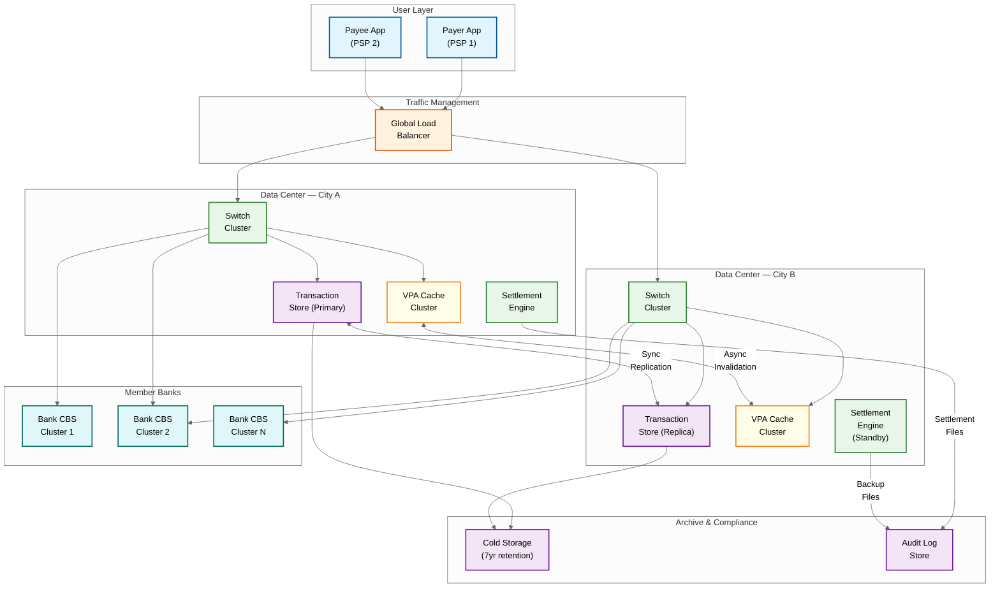

# UPI Real-Time Payment System: Scalability & Reliability

## Overview

A UPI-scale payment system processes 700M+ transactions daily across 500+ member banks with sub-second user-facing latency. This document covers horizontal scaling strategies, auto-scaling triggers, fault tolerance mechanisms, and disaster recovery planning to meet these demands.

---

## Scalability

### NPCI Central Switch: Horizontal Scaling

The central switch is designed as a fleet of stateless worker instances behind a load balancer. Since no in-process state is held (transaction state lives in an external distributed store), any instance can handle any request.

**Partitioning Strategy:** Incoming requests are partitioned by bank code prefix. Each bank code maps to a consistent hash ring of switch instances. This ensures:
- Requests for the same bank tend to hit the same subset of instances, improving connection pool reuse to that bank's CBS
- Adding or removing instances only redistributes a fraction of traffic (consistent hashing property)
- No single instance is a bottleneck for a popular bank — the ring assigns multiple instances per bank

```
FUNCTION RouteToSwitchInstance(request):
    bankCode = ExtractRemitterBankCode(request)
    instanceRing = ConsistentHashRing(activeSwitchInstances)
    targetInstance = instanceRing.GetNode(bankCode)

    IF targetInstance.IsHealthy():
        RETURN targetInstance.Forward(request)
    ELSE:
        nextInstance = instanceRing.GetNextNode(bankCode)
        RETURN nextInstance.Forward(request)
```

### Database Scaling: Time-Partitioned Transaction Store

UPI generates billions of transaction records. The storage strategy uses time-based tiering:

| Tier | Data Age | Storage Type | Access Pattern |
|---|---|---|---|
| **Hot** | 0-7 days | In-memory distributed store with disk persistence | Real-time status checks, duplicate detection, reversals |
| **Warm** | 7-90 days | Row-oriented relational store on fast disks | Settlement reconciliation, dispute resolution, reporting |
| **Cold** | 90+ days | Columnar archive on cost-efficient storage | Regulatory audits, annual reporting, analytics |

**Partition key:** `(transaction_date, remitter_bank_code)` — this ensures queries like "show all transactions for Bank X on date Y" hit a single partition.

**Migration:** A background compaction process continuously moves aging data from hot to warm to cold. Metadata pointers in the hot tier allow transparent reads across tiers when needed (e.g., a dispute on a 60-day-old transaction).

### VPA Resolution Cache

With 400M+ registered Virtual Payment Addresses, the VPA resolution service is one of the most latency-sensitive components.

**Architecture:**
- Distributed in-memory cache cluster, partitioned by PSP handle suffix (`@okaxis`, `@ybl`, `@ibl`, etc.)
- Each partition holds all VPAs for that PSP handle — typically 10-50M entries per partition
- LRU eviction within each partition; inactive VPAs (no transaction in 90 days) are evicted first
- Cache entries store: VPA -> (bank_code, account_reference, IFSC, last_verified_timestamp)

**Consistency:**
- PSPs push VPA change events (create, delete, reassign) to NPCI via an event stream
- Cache invalidation happens within 5 seconds of the event
- On cache miss, the switch performs a synchronous lookup against the authoritative VPA registry hosted by the relevant PSP
- A background validator samples 0.1% of cached entries daily and verifies against the source of truth

### Bank CBS Scaling via Health Scoring

NPCI cannot directly scale member banks' Core Banking Systems, but it can manage traffic intelligently.

**Bank Health Score** (0-100, recalculated every 30 seconds):

```
FUNCTION CalculateBankHealthScore(bankCode):
    metrics = Last60Seconds(bankCode)

    successRate = metrics.successfulTxns / metrics.totalTxns
    avgLatency = metrics.totalLatency / metrics.totalTxns
    timeoutRate = metrics.timedOutTxns / metrics.totalTxns

    score = 0
    score += successRate * 50          // 50 points for success rate
    score += Max(0, (1 - avgLatency / 5000)) * 30  // 30 points for latency under 5s
    score += Max(0, (1 - timeoutRate / 0.10)) * 20  // 20 points for timeout rate under 10%

    RETURN Clamp(score, 0, 100)
```

**Actions based on health score:**

| Score Range | Action |
|---|---|
| 80-100 | Normal routing, full traffic |
| 60-79 | Warn bank ops team; log elevated monitoring |
| 40-59 | Apply backpressure — rate-limit new transactions to this bank to 70% of normal |
| 20-39 | Circuit breaker HALF-OPEN — allow only 10% probe traffic |
| 0-19 | Circuit breaker OPEN — reject new transactions, return "Bank temporarily unavailable" |

### Peak Handling: Pre-Scaling for Known Events

UPI traffic follows predictable seasonal patterns. NPCI coordinates pre-scaling:

- **Diwali / New Year:** 4-5x normal peak. Pre-scale switch instances 48 hours ahead. Coordinate with top 20 banks to expand CBS connection pools and pre-warm caches.
- **Salary Days (1st, 7th, 15th):** 1.5-2x normal. Automated scaling triggered by calendar rules.
- **IPL Matches / Flash Sales:** 2-3x for P2M (merchant) payments. Scale merchant-facing processing pools independently.
- **Month-End:** UPI AutoPay mandate executions spike. Dedicated mandate processing pool scaled independently.

### UPI Lite: On-Device Offloading

UPI Lite maintains a small pre-loaded balance (capped at a regulatory limit) on the user's device. Transactions below a threshold are processed entirely on-device without hitting the central switch.

**Impact on scalability:**
- Offloads 10-15% of total transaction volume (small-value payments like transit, tea, parking)
- Reduces switch TPS requirement by ~1,000-1,500 during peak
- Device syncs with the server periodically (every 15 minutes or on manual trigger) to reconcile Lite balance and upload the local transaction log

---

## Auto-Scaling Triggers

| Metric | Threshold | Action | Cooldown |
|---|---|---|---|
| Switch TPS > 70% capacity | Sustained for 60 seconds | Add 20% more switch instances | 5 minutes |
| Switch TPS > 90% capacity | Sustained for 30 seconds | Emergency scale — double instances | 10 minutes |
| VPA cache hit rate < 95% | Sustained for 5 minutes | Expand cache cluster by 1 node per affected partition | 15 minutes |
| Per-bank timeout rate > 5% | Sustained for 2 minutes | Activate circuit breaker for that bank | 30 seconds |
| Settlement queue depth > 10M | Any occurrence | Add settlement worker instances | 5 minutes |
| Transaction store write latency p99 > 100ms | Sustained for 3 minutes | Add write replicas to hot tier | 10 minutes |
| Deduplication store lookup latency p99 > 10ms | Sustained for 1 minute | Expand dedup store cluster | 5 minutes |

---

## Reliability & Fault Tolerance

### Single Point of Failure (SPOF) Analysis

| Component | SPOF Risk | Mitigation |
|---|---|---|
| NPCI Central Switch | HIGH — all traffic flows through it | Active-active deployment across two data centers |
| VPA Resolution Service | HIGH — payments cannot route without it | Multi-tier: local cache -> distributed cache -> authoritative registry |
| Transaction State Store | HIGH — loss means unknown transaction status | Synchronous replication across data centers; WAL-based durability |
| Settlement Engine | MEDIUM — delay is tolerable, loss is not | Hash-chained files replicated to standby; automated reconciliation |
| Bank CBS Connectivity | LOW per bank, HIGH in aggregate | Per-bank circuit breakers; health scoring; graceful degradation |

### Active-Active NPCI Data Centers

NPCI operates two data centers in geographically separated cities (different seismic zones). Both are fully active — not primary/standby.

**Traffic distribution:** Under normal conditions, traffic is split approximately 50/50 by bank code prefix ranges. If one data center degrades, traffic automatically shifts to the surviving center.

**State synchronization:** The transaction state store uses synchronous replication between data centers for committed transactions. This ensures zero data loss on failover but adds ~2-5ms latency per write. Given the 30-second end-to-end SLA, this overhead is acceptable.

### Failover Mechanisms

**Switch failover (< 30 seconds):**
- Health check probes run every 5 seconds between data centers
- If 3 consecutive probes fail, the load balancer redirects traffic
- In-flight transactions at the failed center are detected via timeout and retried at the surviving center (idempotency ensures no double-processing)

**PSP-level failover:**
- Handled independently by each bank/PSP
- NPCI detects PSP unavailability via health scoring and stops routing to it
- User-facing apps show "Payment service temporarily unavailable" for that PSP

### Circuit Breaker Per Bank

```
FUNCTION CircuitBreakerCheck(bankCode, request):
    state = CircuitBreakerStore.GetState(bankCode)

    MATCH state:
        CASE CLOSED:
            response = ForwardToBank(bankCode, request)
            IF response.isTimeout:
                CircuitBreakerStore.IncrementFailure(bankCode)
                IF CircuitBreakerStore.GetFailureRate(bankCode) > 0.05:
                    CircuitBreakerStore.SetState(bankCode, OPEN)
                    CircuitBreakerStore.SetRetryAfter(bankCode, NOW + 30 SECONDS)
            RETURN response

        CASE OPEN:
            IF NOW > CircuitBreakerStore.GetRetryAfter(bankCode):
                CircuitBreakerStore.SetState(bankCode, HALF_OPEN)
                RETURN ForwardToBank(bankCode, request)  // Probe request
            RETURN Decline("BANK_TEMPORARILY_UNAVAILABLE")

        CASE HALF_OPEN:
            response = ForwardToBank(bankCode, request)
            IF response.isSuccess:
                CircuitBreakerStore.SetState(bankCode, CLOSED)
                CircuitBreakerStore.ResetFailures(bankCode)
            ELSE:
                CircuitBreakerStore.SetState(bankCode, OPEN)
                CircuitBreakerStore.SetRetryAfter(bankCode, NOW + 60 SECONDS)
            RETURN response
```

### Retry Strategy: Exactly-Once via RRN Deduplication

Blind retries are never used. Every retry carries the same RRN + UPI Request ID as the original. The remitter bank's deduplication store ensures the debit is applied at most once. If a retry arrives after the original succeeded, the cached result is returned without re-executing the debit.

### Graceful Degradation Under Extreme Load

When the system approaches capacity limits, non-critical operations are shed first:

| Priority | Operation | Action Under Load |
|---|---|---|
| P0 (Critical) | P2P payments, P2M payments | Always processed; never shed |
| P1 (Important) | UPI AutoPay mandate execution | Delayed to next execution window if necessary |
| P2 (Normal) | Balance inquiry, transaction history | Rate-limited; return cached results if available |
| P3 (Low) | VPA registration, mandate setup | Queued for processing when load subsides |

### Bulkhead Isolation

Separate processing pools prevent one transaction type from starving others:

- **P2P Pool** — Person-to-person transfers (40% of traffic)
- **P2M Pool** — Merchant payments (45% of traffic)
- **Mandate Pool** — Recurring auto-debits (10% of traffic)
- **UPI Lite Pool** — Lite sync and reconciliation (5% of traffic)

Each pool has independent scaling, circuit breakers, and monitoring. A surge in P2M traffic during a flash sale cannot consume resources allocated to P2P payments.

---

## Disaster Recovery

### Recovery Objectives

| Metric | Target | How Achieved |
|---|---|---|
| **RTO** (Recovery Time Objective) | < 30 minutes | Active-active architecture means the surviving data center absorbs traffic immediately; 30-minute target accounts for full traffic convergence and verification |
| **RPO** (Recovery Point Objective) | Zero for committed transactions | Synchronous replication of transaction state store; no committed transaction is lost |

### Backup Strategy

**Continuous WAL (Write-Ahead Log) Shipping:**
- Every write to the transaction store is first recorded in a WAL
- WAL entries are synchronously shipped to the standby data center
- On the standby, WAL entries are applied to maintain a hot replica

**Daily Full Snapshots:**
- A consistent snapshot of the entire transaction store is taken daily during the lowest-traffic window (typically 2-4 AM)
- Snapshots are stored in durable object storage with 30-day retention
- Settlement files are archived independently with 7-year retention (regulatory requirement)

**Snapshot Verification:**
- Weekly restore drills: a snapshot is restored to an isolated environment and transaction counts are verified against the production audit log
- Any discrepancy triggers an immediate investigation

### Multi-Region Architecture



**Key design decisions:**
- Both data centers are in different seismic zones to survive regional natural disasters
- Transaction store replication is synchronous (zero RPO) at the cost of ~2-5ms write latency
- VPA cache synchronization is asynchronous — a brief inconsistency window (< 5s) is acceptable since stale VPA entries only cause a routing miss, not data corruption
- Settlement engine runs active in one data center and standby in the other; settlement files are replicated to both before submission to the central bank

---

## Capacity Planning

| Metric | Normal Day | Peak (Festival) | Design Target |
|---|---|---|---|
| Daily transactions | 700M | 1.2B | 2B |
| Peak TPS | 8,000 | 32,000 | 50,000 |
| VPA registry size | 400M | 400M | 1B |
| Member banks | 500+ | 500+ | 1,000 |

Transaction volume grows ~40% YoY; infrastructure is planned 18 months ahead. UPI Lite adoption is expected to offload 20-25% of transactions within 2 years, reducing central switch pressure.

---

## Interview Tips

- **"How would you handle a 10x traffic spike?"** — The system already handles 4-5x spikes during festivals. For 10x, the key levers are: UPI Lite absorbing more small-value transactions, aggressive graceful degradation (shed P2-P3 operations), and pre-negotiated burst capacity with the infrastructure provider. The stateless switch architecture means scaling is a matter of adding instances, not re-architecting.
- **"Why synchronous replication for the transaction store?"** — Money cannot be lost. If DC-A commits a debit and fails before asynchronous replication reaches DC-B, the user has been debited but the system has no record. The 2-5ms latency cost is negligible against the 30-second SLA.
- **"What's the hardest part of this system to scale?"** — Bank CBS systems. They are legacy, outside NPCI's control, and their performance directly determines the system's end-to-end latency. The health scoring and circuit breaker mechanisms are compensating controls, not solutions.
