# UPI Real-Time Payment System: Security & Compliance

## 1. Authentication & Authorization

### 1.1 Two-Factor Authentication Model

UPI mandates two-factor authentication for every financial transaction:

| Factor | Mechanism | Verified By |
|--------|-----------|-------------|
| **Factor 1: Device Binding** | Device fingerprint (IMEI hash + SIM serial) bound to user's VPA during onboarding | PSP server |
| **Factor 2: UPI PIN** | 4 or 6 digit PIN set by user, encrypted on-device using issuer bank's public key | Issuer bank CBS |

Both factors must pass before any debit instruction executes. Non-financial operations (balance inquiry, VPA lookup) may require only Factor 1.

### 1.2 UPI PIN Security

The UPI PIN never leaves the device in cleartext. The encryption flow:

1. User enters PIN on the TPAP's secure PIN pad (Common Library / CL)
2. CL encrypts PIN using the issuer bank's RSA public key (2048-bit minimum)
3. Encrypted PIN blob is transmitted alongside the transaction payload
4. Only the issuer bank's HSM holds the corresponding private key to decrypt

```
FUNCTION encrypt_upi_pin(pin, device_token, issuer_bank_public_key):
    padded_pin = PKCS1_v1_5_PAD(pin + device_token + timestamp)
    encrypted_blob = RSA_ENCRYPT(padded_pin, issuer_bank_public_key)
    RETURN base64_encode(encrypted_blob)
```

Intermediate parties (PSP, NPCI) pass the encrypted blob opaquely. They cannot decrypt or inspect the PIN.

### 1.3 Device Binding

During onboarding, the TPAP generates a device fingerprint:

```
FUNCTION generate_device_fingerprint():
    imei_hash = SHA256(device_imei + hardware_serial)
    sim_id = READ_SIM_SERIAL()
    fingerprint = HMAC_SHA256(imei_hash + sim_id, app_secret)
    RETURN fingerprint
```

This fingerprint is registered with the PSP and stored against the user's VPA. Every subsequent request carries the fingerprint; the PSP validates it before forwarding to NPCI. A SIM change or device change triggers a re-registration flow requiring full KYC re-verification.

### 1.4 PSP-to-NPCI Authentication

NPCI issues X.509 digital certificates to each registered PSP. All communication uses mutual TLS (mTLS):

- PSP presents its NPCI-issued client certificate
- NPCI validates the certificate chain and revocation status (via CRL/OCSP)
- Session keys are negotiated per connection using TLS 1.3
- Certificate rotation occurs every 12 months with a 30-day overlap window

### 1.5 NPCI-to-Bank Authentication

Banks connect to the NPCI switch via dedicated secure channels:

- Leased lines or encrypted VPN tunnels (no public internet)
- SFTP for batch settlement files with PGP encryption
- Real-time API calls over mTLS with bank-specific certificates
- IP whitelisting at both NPCI and bank firewalls

---

## 2. Data Security

### 2.1 Encryption at Rest

| Data Type | Encryption Method | Key Management |
|-----------|-------------------|----------------|
| Transaction records | AES-256-GCM | HSM-managed, rotated quarterly |
| VPA-to-account mappings | AES-256-CBC | HSM-managed, bank-specific keys |
| Mandate/recurring data | AES-256-GCM | HSM-managed, per-mandate key envelope |
| Audit logs | AES-256-GCM | Separate HSM partition, write-once |
| Device fingerprints | HMAC + AES-256 | PSP-specific HSM keys |

All encryption keys are generated and stored inside FIPS 140-2 Level 3 certified HSMs. Key hierarchy follows envelope encryption: a master key encrypts data encryption keys (DEKs), and DEKs encrypt actual data.

### 2.2 Encryption in Transit

```
TPAP ──TLS 1.3──▶ PSP ──mTLS──▶ NPCI Switch ──mTLS──▶ Bank CBS
```

- TLS 1.3 is mandatory on all hops; TLS 1.2 accepted only for legacy bank integrations with a deprecation timeline
- Certificate pinning recommended for TPAP-to-PSP communication
- Perfect Forward Secrecy (PFS) enforced via ephemeral Diffie-Hellman key exchange

### 2.3 UPI PIN End-to-End Encryption

```mermaid
---
config:
  theme: neutral
---
flowchart LR
    subgraph Device["User Device"]
        A["PIN Pad\n(Common Library)"]
        B["RSA Encrypt\nwith Issuer\nBank Public Key"]
    end

    subgraph PSP_Layer["PSP"]
        C["Pass-through\n(Cannot Decrypt)"]
    end

    subgraph NPCI_Layer["NPCI Switch"]
        D["Route by\nBank Code\n(Cannot Decrypt)"]
    end

    subgraph Bank["Issuer Bank"]
        E["HSM Decrypts\nwith Private Key"]
        F["PIN Validation\nagainst Stored Hash"]
    end

    A -->|"Plaintext PIN"| B
    B -->|"Encrypted Blob"| C
    C -->|"Encrypted Blob\n(Opaque)"| D
    D -->|"Encrypted Blob\n(Opaque)"| E
    E -->|"Decrypted PIN"| F

    classDef client fill:#e1f5fe,stroke:#01579b,stroke-width:2px
    classDef api fill:#fff3e0,stroke:#e65100,stroke-width:2px
    classDef service fill:#e8f5e9,stroke:#2e7d32,stroke-width:2px
    classDef data fill:#f3e5f5,stroke:#6a1b9a,stroke-width:2px

    class A,B client
    class C api
    class D service
    class E,F data
```



The issuer bank's HSM decrypts the PIN blob and validates it against the stored PIN hash. The decrypted PIN exists only within the HSM boundary and is never written to disk or logs.

### 2.4 PII Handling and VPA Privacy Layer

VPA (Virtual Payment Address) acts as a privacy abstraction:

- **Payee never sees** the payer's bank account number, IFSC, or account type
- **Payer never sees** the payee's bank account details (in P2P via VPA)
- Account resolution happens inside NPCI's VPA mapper, which is not exposed to either party
- Transaction receipts show only VPA, transaction ID, and amount

### 2.5 Data Localization

Per RBI mandate (April 2018 circular), all payment system data must be stored exclusively within India:

- Transaction data, metadata, and audit logs stored in domestic data centers
- No replication to overseas regions, even for disaster recovery
- Foreign PSP participants must establish India-based processing infrastructure
- NPCI conducts periodic audits to verify localization compliance

---

## 3. Threat Model

### 3.1 Phishing and Social Engineering

**Attack:** Fraudster sends fake collect requests from VPAs resembling legitimate merchants (e.g., `paytm-refund@fraud` instead of `merchant@paytm`). Fraudulent QR codes redirect payments to attacker-controlled VPAs.

**Mitigations:**
- Collect request displays full beneficiary VPA and registered name before PIN entry
- NPCI-verified merchant badge for registered merchants in QR payments
- Rate limiting on collect requests: max 20 pending collects per VPA
- User-side controls: block specific VPAs, disable collect requests entirely
- TPAP-level spam detection using ML models on collect request patterns

### 3.2 SIM Swap Attacks

**Attack:** Attacker social-engineers the telecom provider to issue a duplicate SIM, hijacking SMS-based verification and breaking device binding.

**Mitigations:**
- Device binding uses SIM serial + IMEI hash; SIM swap changes the SIM serial, invalidating the binding
- Re-registration after SIM change requires full debit card + OTP re-authentication
- 24-hour cooling period after SIM change before UPI transactions are allowed
- NPCI maintains a SIM change notification feed from telecom operators
- PSPs subscribe to this feed and proactively freeze accounts on SIM change events

### 3.3 Man-in-the-Middle on Public Networks

**Attack:** Attacker intercepts communication between TPAP and PSP on unsecured Wi-Fi or compromised networks.

**Mitigations:**
- TLS 1.3 on all hops with certificate pinning at the TPAP level
- UPI PIN encrypted end-to-end; even if TLS is broken, PIN remains protected
- Transaction payload includes HMAC signature; tampering is detectable
- Common Library (CL) validates server certificates independently of OS trust store

### 3.4 Replay Attacks

**Attack:** Attacker captures a valid transaction request and resubmits it to duplicate the payment.

**Mitigations:**
- Every transaction carries a unique RRN (Retrieval Reference Number) + timestamp
- NPCI switch enforces RRN uniqueness within a rolling 48-hour window
- Duplicate RRN submissions are rejected with error code `U69` (duplicate transaction)
- Transaction messages include monotonically increasing sequence numbers per session
- Message expiry: transactions older than 3 minutes from origination timestamp are rejected

### 3.5 Insider Threats at PSP/Bank Level

**Attack:** Malicious employee at PSP or bank extracts customer data, VPA mappings, or manipulates transaction routing.

**Mitigations:**
- Role-based access control (RBAC) with principle of least privilege
- All database access via privileged access management (PAM) gateways with session recording
- HSM-bound keys: no single administrator can extract encryption keys
- Dual-control and split-knowledge for key ceremonies
- Audit logs are tamper-proof (write-once storage, cryptographically chained)
- Mandatory background checks and periodic access reviews for privileged roles

---

## 4. UPI-Specific Security Features

### 4.1 Transaction Signing

Every UPI message (request and response) is digitally signed:

```
FUNCTION sign_transaction(message, originator_private_key):
    canonical_payload = CANONICALIZE(message)
    digest = SHA256(canonical_payload)
    signature = RSA_SIGN(digest, originator_private_key)
    message.signature = base64_encode(signature)
    RETURN message
```

The receiving party validates the signature using the originator's NPCI-registered public certificate. Invalid signatures cause immediate rejection with a non-retryable error.

### 4.2 Replay Protection

| Mechanism | Scope | Window |
|-----------|-------|--------|
| RRN uniqueness | NPCI switch | 48 hours |
| Timestamp validation | All hops | 3 minutes |
| Sequence number | Per session | Session lifetime |
| Idempotency key | PSP level | 24 hours |

### 4.3 Amount Tampering Detection

The transaction amount is embedded within the signed payload. Any modification to the amount field between origination and execution invalidates the digital signature:

```
FUNCTION validate_transaction_integrity(message, sender_public_key):
    expected_digest = SHA256(CANONICALIZE(message.payload))
    actual_digest = RSA_VERIFY(message.signature, sender_public_key)
    IF expected_digest != actual_digest:
        REJECT("SIGNATURE_MISMATCH", non_retryable=true)
        RAISE_ALERT("amount_tampering_suspected", message.rrn)
    RETURN VALID
```

### 4.4 Collect Request Spam Protection

- **Rate limits:** Maximum 20 pending collect requests per VPA at any time
- **Cooldown:** After 3 consecutive rejected collects, 15-minute cooldown imposed on the requesting VPA
- **User controls:** Block specific VPAs, disable collect requests, whitelist-only mode
- **ML-based filtering:** PSPs deploy anomaly detection models trained on collect request velocity, amount patterns, and cross-VPA behavior

### 4.5 QR Code Security

| QR Type | Security Mechanism |
|---------|-------------------|
| **Dynamic QR** | Contains one-time-use token with 10-minute expiry; token is server-validated before processing |
| **Static QR** | Contains merchant VPA only; merchant registration verified at scan time via NPCI merchant registry |
| **Signed QR** | QR payload includes digital signature; TPAP validates before displaying payment screen |

---

## 5. Compliance Framework

### 5.1 RBI Payment Systems Regulations

| Requirement | UPI Implementation |
|-------------|-------------------|
| Authorization under PSS Act, 2007 | NPCI operates UPI under RBI authorization; PSPs require RBI approval |
| Settlement within T+0 | UPI provides real-time credit; settlement between banks via NPCI within T+0/T+1 |
| Grievance redressal | Mandatory escalation matrix: PSP (30 days) then Banking Ombudsman |
| Transaction limits | Per-transaction and daily limits enforced at NPCI switch level |

### 5.2 Data Localization (RBI Circular 2018)

- All transaction data, including metadata and audit trails, stored within India
- PSPs and banks submit annual compliance certificates
- NPCI conducts surprise audits on data storage locations
- Foreign entities must process through India-based infrastructure

### 5.3 PCI-DSS (Card-Linked UPI)

When UPI transactions are linked to credit/debit cards:

- Card number tokenization (no raw PAN storage at PSP or NPCI)
- PCI-DSS Level 1 certification required for all parties handling card data
- Quarterly vulnerability scans and annual penetration testing
- Secure coding practices mandated for TPAP Common Library

### 5.4 CERT-In Incident Reporting

- **6-hour reporting window** for cybersecurity incidents (as per CERT-In April 2022 directive)
- Incidents include: data breaches, unauthorized access, DDoS attacks, malware infections
- NPCI maintains a dedicated CERT-In liaison team; PSPs must report to both NPCI and CERT-In simultaneously

### 5.5 KYC/AML Requirements

| Transaction Tier | KYC Level | Daily Limit |
|-----------------|-----------|-------------|
| UPI Lite (small value) | Minimum KYC | 500 per transaction, 2000 daily |
| Standard UPI | Full KYC via bank account | 100,000 per transaction |
| UPI for merchants | Full KYC + merchant verification | Higher limits per NPCI policy |

- Suspicious transaction monitoring using rule-based and ML-based systems
- Currency Transaction Reports (CTR) and Suspicious Transaction Reports (STR) filed with FIU-IND

### 5.6 NPCI Circular Compliance

Member banks and PSPs must comply with:

- **Technical specifications:** API versioning, message format adherence (ISO 8583 derivative)
- **Uptime SLAs:** 99.5% availability for bank CBS endpoints; penalties for non-compliance
- **Dispute resolution timelines:** Auto-reversal within 5 business days for failed transactions
- **Security audits:** Annual NPCI-mandated security assessment by empaneled auditors
- **Incident response:** Participation in NPCI-coordinated incident response drills quarterly

---

## 6. Security Audit and Penetration Testing Cadence

| Activity | Frequency | Conducted By |
|----------|-----------|-------------|
| VAPT (Vulnerability Assessment + Pen Testing) | Quarterly | CERT-In empaneled auditor |
| Application security audit | Semi-annual | Independent security firm |
| HSM key ceremony audit | Annual | Dual-control witnesses + auditor |
| Data localization verification | Annual | NPCI compliance team |
| Red team exercise | Annual | Specialized red team vendor |
| Incident response drill | Quarterly | Joint NPCI + PSP + bank teams |

---

## 7. Interview Checklist

- Explain why UPI PIN encryption is end-to-end and why NPCI cannot see the PIN
- Describe the two-factor authentication model and how device binding prevents unauthorized access
- Walk through the SIM swap attack vector and the multi-layered defense
- Explain how transaction signing and RRN uniqueness prevent replay and tampering attacks
- Discuss the data localization mandate and its impact on system architecture
- Describe the compliance landscape: RBI regulations, PCI-DSS, CERT-In reporting
- Articulate the difference between dynamic and static QR security models
