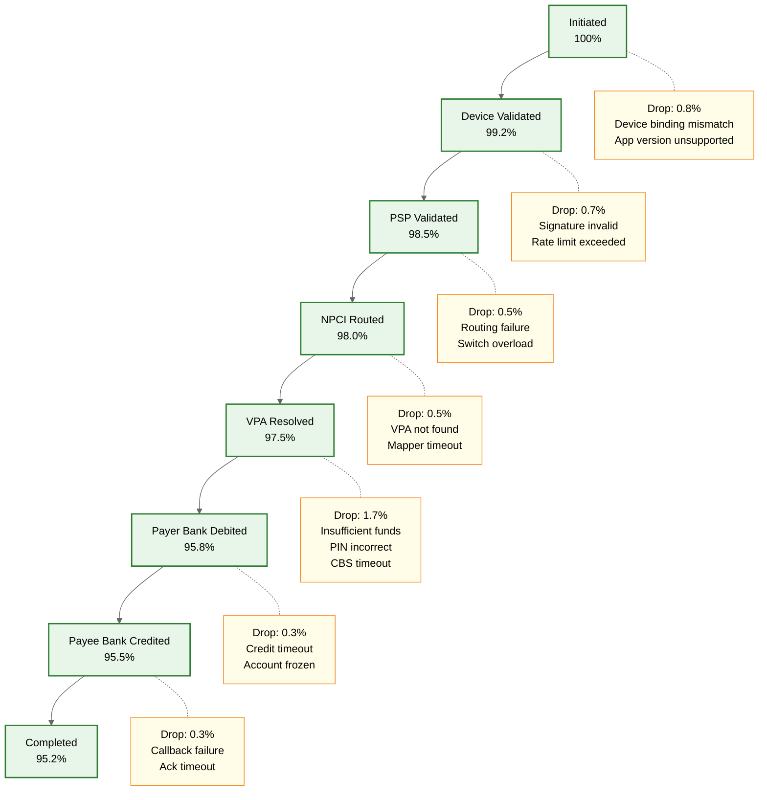

# UPI Real-Time Payment System: Observability

## 1. Metrics Strategy (USE/RED Framework)

### 1.1 NPCI Switch Metrics

The NPCI switch is the central nervous system of UPI. Its health determines the health of the entire ecosystem.

| Metric | Type | Dimensions | Alert Threshold |
|--------|------|------------|-----------------|
| `txn.success_rate` | RED - Rate/Error | bank, psp, txn_type (P2P, P2M, mandate, UPI Lite) | < 98% overall, < 95% per bank |
| `txn.tps` | RED - Rate | payment_mode, direction (pay/collect) | Drop > 20% from rolling 5-min baseline |
| `txn.latency_p50` | RED - Duration | leg (tpap_psp, psp_npci, npci_bank, end_to_end) | p50 > 800ms end-to-end |
| `txn.latency_p95` | RED - Duration | leg, bank, psp | p95 > 2s end-to-end |
| `txn.latency_p99` | RED - Duration | leg, bank, psp | p99 > 5s end-to-end |
| `txn.error_rate` | RED - Error | error_code (insufficient_funds, cbs_timeout, vpa_not_found, pin_incorrect) | Any single code > 5% |
| `vpa.cache_hit_rate` | USE - Utilization | cache_region | < 90% |
| `settlement.reconciliation_accuracy` | Custom | batch_id, bank | < 99.99% |
| `switch.cpu_utilization` | USE - Utilization | node_id | > 80% sustained |
| `switch.connection_pool` | USE - Saturation | bank_endpoint | > 85% utilized |

### 1.2 PSP Metrics

| Metric | Type | Dimensions | Alert Threshold |
|--------|------|------------|-----------------|
| `psp.api_availability` | USE - Errors | endpoint | < 99.5% per 5-min window |
| `psp.request_queue_depth` | USE - Saturation | queue_name | > 10,000 pending |
| `psp.device_registration_success_rate` | RED - Error | os_type, app_version | < 95% |
| `psp.collect_delivery_rate` | RED - Rate | direction | < 98% |
| `psp.callback_latency` | RED - Duration | bank | p95 > 1s |
| `psp.concurrent_sessions` | USE - Utilization | region | > 80% capacity |

### 1.3 Bank Metrics

| Metric | Type | Dimensions | Alert Threshold |
|--------|------|------------|-----------------|
| `bank.cbs_response_time` | RED - Duration | operation (debit, credit, balance) | p95 > 1.5s |
| `bank.debit_success_rate` | RED - Error | account_type | < 97% |
| `bank.credit_success_rate` | RED - Error | account_type | < 99% |
| `bank.account_validation_latency` | RED - Duration | validation_type | p95 > 500ms |
| `bank.balance_inquiry_time` | RED - Duration | channel | p95 > 300ms |
| `bank.cbs_connection_pool` | USE - Saturation | pool_id | > 90% utilized |

---

## 2. Transaction Funnel Analysis

The UPI transaction lifecycle has distinct stages where failures can occur. Tracking conversion rates between stages reveals systemic issues.



### Funnel Metrics Table

| Stage Transition | Key Metric | Top Failure Reasons |
|-----------------|------------|---------------------|
| Initiated to Device Validated | `device.validation_pass_rate` | Binding mismatch, rooted device, outdated app |
| Device Validated to PSP Validated | `psp.validation_pass_rate` | Signature invalid, rate limit, duplicate request |
| PSP Validated to NPCI Routed | `npci.routing_success_rate` | Switch overload, bank endpoint down |
| NPCI Routed to VPA Resolved | `vpa.resolution_success_rate` | VPA not found, mapper timeout, stale cache |
| VPA Resolved to Debited | `bank.debit_success_rate` | Insufficient funds, PIN incorrect, CBS timeout |
| Debited to Credited | `bank.credit_success_rate` | Account frozen, credit timeout, beneficiary bank down |
| Credited to Completed | `txn.completion_rate` | Callback failure, acknowledgment timeout |

---

## 3. Dashboard Design

### 3.1 National UPI Health Dashboard (NPCI Operations Center)

**Purpose:** Real-time national view of UPI ecosystem health for NPCI operations team.

**Layout:**

| Panel | Visualization | Refresh Rate |
|-------|--------------|-------------|
| Overall Success Rate (last 5 min) | Single stat gauge with threshold coloring | 10s |
| Live TPS | Time-series line chart, stacked by payment mode | 5s |
| End-to-End Latency Distribution | Heatmap (time vs latency bucket) | 30s |
| Bank-wise Health Matrix | Table with color-coded cells (green/yellow/red) | 30s |
| Error Code Breakdown | Stacked bar chart, top 10 error codes | 1 min |
| Transaction Funnel | Funnel visualization with stage-wise conversion | 1 min |
| Active Incidents | Incident list with severity, affected bank, start time | Real-time |
| Settlement Status | Batch progress bars with reconciliation accuracy | 5 min |

### 3.2 Per-Bank Health Scorecard

**Purpose:** Drill-down view for monitoring individual bank performance.

**Key Panels:**
- CBS response time distribution (histogram)
- Debit/credit success rate trend (24-hour rolling)
- Error code distribution specific to this bank
- Comparison against ecosystem average
- SLA compliance indicator (uptime vs 99.5% target)
- Queue depth for pending transactions to this bank

### 3.3 PSP Performance Dashboard

**Purpose:** Monitor individual PSP health and user-facing quality.

**Key Panels:**
- API endpoint availability per endpoint
- Device registration funnel (attempt to success to first transaction)
- Collect request delivery and response rates
- User-reported failure rate vs system-detected failure rate
- App version distribution and version-specific error rates

### 3.4 Transaction Funnel Analysis Dashboard

**Purpose:** Identify drop-off points and diagnose systemic issues.

**Key Panels:**
- Stage-wise conversion rate (real-time and 24-hour trend)
- Drop-off reasons per stage (pie chart)
- Bank-specific funnel comparison
- Time-of-day patterns (heatmap of failures by hour and stage)
- Correlation view: latency spikes vs drop-off increases

---

## 4. Logging Strategy

### 4.1 Structured Log Schema

Every transaction produces structured log entries at each participant:

```
STRUCTURED_LOG_ENTRY:
    timestamp:          ISO-8601 with microsecond precision
    transaction_id:     UPI transaction reference (UUID)
    rrn:                Retrieval Reference Number
    payer_vpa_hash:     SHA256(payer_vpa) -- never raw VPA
    payee_vpa_hash:     SHA256(payee_vpa) -- never raw VPA
    amount_range:       Bucketed range (0-100, 100-1000, 1000-10000, 10000+)
    payer_psp:          PSP identifier
    payee_psp:          PSP identifier
    remitter_bank:      Bank IFSC prefix (first 4 chars)
    beneficiary_bank:   Bank IFSC prefix (first 4 chars)
    txn_type:           PAY | COLLECT | MANDATE | LITE
    status:             INITIATED | PROCESSING | SUCCESS | FAILED | TIMEOUT
    error_code:         UPI error code (if applicable)
    latency_ms:         Processing time at this hop
    leg:                TPAP_PSP | PSP_NPCI | NPCI_BANK | BANK_CBS
    trace_id:           Distributed trace identifier
    span_id:            Current span identifier
    node_id:            Processing node identifier
```

### 4.2 Log Levels

| Level | Criteria | Examples | Retention |
|-------|----------|----------|-----------|
| **ERROR** | Transaction failure or system error | CBS timeout, debit failed, signature invalid | 1 year |
| **WARN** | Degraded performance or near-threshold | CBS response > 1s, cache miss, retry triggered | 6 months |
| **INFO** | Successful transaction completion | Transaction completed, settlement batch processed | 90 days |
| **DEBUG** | Detailed processing steps | VPA cache lookup, routing decision, queue enqueue | 7 days (staging only) |

### 4.3 PII Masking Rules

| Data Element | Masking Rule | Log Output |
|-------------|-------------|------------|
| VPA | SHA256 hash | `a3f2b8c1d4...` |
| Bank account number | Never logged | `[REDACTED]` |
| UPI PIN | Never logged | `[REDACTED]` |
| Phone number | Never logged | `[REDACTED]` |
| Amount | Bucketed range | `range:1000-10000` |
| Device fingerprint | First 8 chars only | `a3f2b8c1...` |
| IP address | Last octet masked | `192.168.1.xxx` |

### 4.4 Log Aggregation Architecture

```
TPAP Logs ──▶ PSP Log Collector ──▶ Central Log Pipeline ──▶ Search Index
PSP Logs  ──▶ PSP Log Collector ──▶ Central Log Pipeline ──▶ Search Index
NPCI Logs ──▶ NPCI Log Collector ──▶ NPCI Log Pipeline ──▶ NPCI Search Index
Bank Logs ──▶ Bank-internal systems (not shared externally)
```

Each participant maintains its own log infrastructure. NPCI aggregates logs from its own switch and receives sanitized error reports from PSPs and banks for ecosystem-level analysis.

---

## 5. Distributed Tracing

### 5.1 Trace Propagation

The UPI transaction ID serves as the trace context that flows across organizational boundaries:

```
FUNCTION propagate_trace(upi_request):
    trace_id = upi_request.transaction_id
    parent_span_id = upi_request.headers["x-trace-span"]

    current_span = CREATE_SPAN(
        trace_id = trace_id,
        parent_span_id = parent_span_id,
        span_name = current_processing_stage,
        start_time = NOW()
    )

    // Process request
    result = PROCESS(upi_request)

    current_span.end_time = NOW()
    current_span.status = result.status
    current_span.attributes = {
        "bank": upi_request.bank_code,
        "error_code": result.error_code,
        "latency_ms": current_span.duration()
    }

    EXPORT_SPAN(current_span)
    RETURN result
```

### 5.2 Key Spans in a UPI Transaction

| Span Name | Owner | Typical Duration | What It Captures |
|-----------|-------|-----------------|------------------|
| `device_encryption` | TPAP | 50-100ms | PIN encryption, payload signing |
| `psp_validation` | PSP | 20-50ms | Device binding check, signature validation, rate limit check |
| `npci_routing` | NPCI | 5-15ms | Bank endpoint lookup, load balancing decision |
| `vpa_resolution` | NPCI | 10-30ms | VPA-to-account mapping lookup (cache or DB) |
| `bank_debit` | Remitter Bank | 200-800ms | CBS debit operation, PIN validation, balance check |
| `bank_credit` | Beneficiary Bank | 100-500ms | CBS credit operation, account validation |
| `settlement_batch` | NPCI | Minutes | End-of-cycle net settlement computation |
| `callback_delivery` | PSP | 50-200ms | Push notification to TPAP, status callback |

### 5.3 Cross-Organization Tracing

Since UPI spans multiple organizations, full end-to-end traces require cooperation:

- **NPCI** maintains the authoritative trace for the switch-internal spans
- **PSPs** report their span data to NPCI via a standardized trace export API
- **Banks** provide CBS timing data in the response payload (not full spans)
- NPCI correlates all spans using the `transaction_id` as the join key
- A **trace correlation dashboard** at NPCI allows support teams to reconstruct the full transaction timeline

---

## 6. Alerting Framework

### 6.1 Critical Alerts (Page-Worthy)

| Alert | Condition | Action |
|-------|-----------|--------|
| `overall_success_rate_critical` | Success rate < 98% for 2 consecutive minutes | Page on-call SRE; initiate war room |
| `switch_tps_drop` | TPS drops > 20% from 5-min rolling baseline | Page on-call; check for upstream outage |
| `bank_offline` | Zero successful transactions to a bank for 3 minutes | Page on-call; notify bank liaison |
| `settlement_batch_failure` | Settlement batch fails to complete within SLA | Page settlement team; manual reconciliation |
| `hsm_unavailable` | HSM cluster health check fails | Page security team; halt new transactions |
| `certificate_expiry_imminent` | Any mTLS certificate expires within 48 hours | Page security team; initiate rotation |

### 6.2 Warning Alerts

| Alert | Condition | Action |
|-------|-----------|--------|
| `bank_timeout_elevated` | Per-bank timeout rate > 3% for 5 minutes | Notify bank liaison; increase timeout budget |
| `vpa_cache_hit_low` | VPA cache hit rate < 90% for 10 minutes | Investigate cache eviction; check for cache node failure |
| `mandate_failure_elevated` | Mandate execution failure rate > 5% | Notify mandate operations team |
| `psp_queue_depth_high` | Any PSP queue depth > 10,000 for 5 minutes | Notify PSP; check for downstream bottleneck |
| `latency_p99_elevated` | End-to-end p99 > 5s for 5 minutes | Investigate slowest leg; check CBS health |
| `error_code_spike` | Any error code rate doubles within 5-min window | Auto-tag affected bank or PSP; notify |

### 6.3 Runbook References

Each alert links to a runbook stored in the operations knowledge base:

| Alert | Runbook | Key Steps |
|-------|---------|-----------|
| `overall_success_rate_critical` | `RB-001` | 1. Check bank-wise breakdown 2. Identify failing banks 3. Check NPCI switch health 4. Escalate to affected banks |
| `switch_tps_drop` | `RB-002` | 1. Check upstream PSP connectivity 2. Verify switch node health 3. Check for DDoS indicators 4. Scale if capacity issue |
| `bank_offline` | `RB-003` | 1. Verify bank CBS status 2. Check network connectivity 3. Contact bank NOC 4. Enable graceful degradation (queue transactions) |
| `settlement_batch_failure` | `RB-004` | 1. Check batch input data completeness 2. Verify reconciliation mismatches 3. Rerun batch with corrections 4. Notify affected banks |
| `vpa_cache_hit_low` | `RB-005` | 1. Check cache node health 2. Verify eviction policy 3. Check for cache stampede 4. Warm cache if needed |
| `mandate_failure_elevated` | `RB-006` | 1. Check mandate DB health 2. Verify bank mandate APIs 3. Check for expired mandates 4. Notify PSPs |

---

## 7. Operational Playbooks

### 7.1 Incident Severity Classification

| Severity | Criteria | Response Time | Escalation |
|----------|----------|--------------|------------|
| **SEV-1** | Overall success rate < 95% or major bank offline | 5 minutes | NPCI CTO, bank heads |
| **SEV-2** | Overall success rate < 98% or multiple PSPs degraded | 15 minutes | NPCI operations lead |
| **SEV-3** | Single bank degraded or elevated error rates | 30 minutes | On-call SRE |
| **SEV-4** | Minor anomaly, no user impact | Next business day | Monitoring team |

### 7.2 Capacity Planning Metrics

| Metric | Current Baseline | Growth Trigger | Action |
|--------|-----------------|----------------|--------|
| Peak TPS | Monitor daily peak | Sustained > 70% of provisioned capacity | Scale switch nodes, notify banks |
| VPA mapper DB size | Track monthly growth | > 75% storage utilized | Expand storage, archive inactive VPAs |
| Log storage | Track daily ingest rate | > 80% retention storage | Adjust retention policy or expand |
| Bank connection pool | Monitor per-bank utilization | > 70% sustained | Negotiate additional connections with bank |

---

## 8. Interview Checklist

- Explain the RED metrics framework and why it is suited for a request-driven system like UPI
- Describe how you would design the transaction funnel dashboard and what insights each stage provides
- Walk through how distributed tracing works across organizational boundaries in UPI
- Discuss PII masking in logs: why VPAs are hashed, why amounts are bucketed
- Explain the alerting hierarchy and why certain conditions are page-worthy vs warning-level
- Describe how you would diagnose a sudden drop in success rate using the observability stack
- Discuss capacity planning metrics and how they feed into scaling decisions
