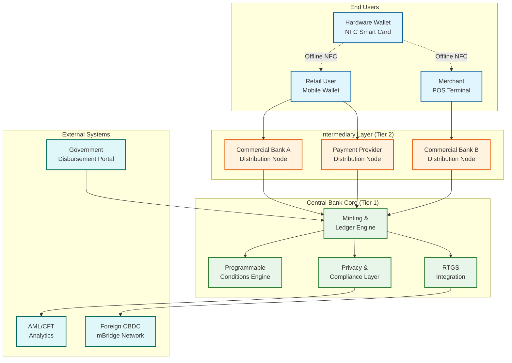

# CBDC / Digital Currency Platform System Design

## System Overview

A Central Bank Digital Currency (CBDC) platform is a sovereign digital money system issued and backed by a nation's central bank---the digital equivalent of physical cash with the programmability of electronic payments. Real-world implementations include India's Digital Rupee (e₹), China's e-CNY (Digital Yuan), Brazil's Drex, the EU's Digital Euro project, and the Bahamas' Sand Dollar. At scale, e-CNY has reached 325M+ wallets with 7.3T yuan in cumulative transactions, while over 130 countries are actively exploring or piloting CBDC programs.

The core engineering challenge spans several critical dimensions:

- **Two-tier distribution**: The central bank mints and redeems tokens through licensed intermediaries---commercial banks and payment providers---who then distribute to end users. This preserves the existing financial system's structure, prevents bank disintermediation, and avoids concentrating operational risk at the central bank. The central bank maintains the authoritative ledger while intermediaries handle customer-facing operations semi-autonomously.

- **Token-based vs account-based models**: Token-based designs provide cash-like bearer instruments where possession equals ownership, enabling offline transfers and stronger privacy. Account-based designs tie balances to verified identities, simplifying AML compliance but requiring online verification for every transaction. Most production systems adopt a hybrid: account-based for online and token-based for offline.

- **Offline NFC payments with double-spend prevention**: Enabling transactions without internet connectivity using secure hardware elements (tamper-resistant chips in phones or smart cards). The system must prevent double-spending without real-time ledger consultation---a challenge no existing digital payment system has fully solved. Techniques include hardware-enforced spending limits, monotonic transaction counters, and deferred reconciliation with conflict resolution upon reconnection.

- **Programmable money**: Conditional payments that execute only when predefined criteria are met. Stimulus payments that expire after 90 days (encouraging immediate spending over hoarding), agricultural subsidies spendable only at authorized fertilizer merchants, salary advances released in weekly tranches, or trade finance payments released upon customs clearance confirmation. The programmability engine evaluates conditions at transaction time.

- **Cross-border interoperability**: Projects like mBridge (connecting Hong Kong, Thailand, UAE, Saudi Arabia, and China central banks) enable direct multi-CBDC settlement between central banks, eliminating correspondent banking chains and reducing cross-border settlement from 2--5 days to under 10 seconds with costs dropping from 3--7% to near-zero.

- **Privacy-preserving design with tiered KYC**: Balancing financial surveillance obligations (AML/CFT) with citizens' privacy expectations (cash is anonymous). Tiered KYC enables anonymous small-value wallets, semi-identified medium wallets, and fully identified high-value wallets. The cryptographic challenge is enabling the central bank to monitor aggregate flows for monetary policy without deanonymizing individual low-tier transactions.

- **Integration with existing payment rails**: CBDC must coexist with UPI, card networks, real-time gross settlement (RTGS), and commercial bank systems without disrupting the monetary transmission mechanism or creating arbitrage opportunities between CBDC and commercial bank deposits.

---

## Key Characteristics

| Characteristic | Description |
|---------------|-------------|
| **Read/Write Pattern** | Write-heavy for token minting, transfers, and redemption; read-heavy for balance queries, audit, and analytics |
| **Latency Sensitivity** | Very High---online transfers must settle in < 200ms; offline NFC tap-to-pay in < 500ms to rival physical cash |
| **Consistency Model** | Strong consistency for token ledger (no double-spend); eventual consistency for analytics, reporting, and cross-border settlement reconciliation |
| **Financial Integrity** | Absolute---total tokens in circulation must equal central bank's minted supply minus redeemed tokens at all times; supply invariant is verified every settlement cycle |
| **Data Volume** | Very High---500M+ wallets, 200M+ daily transactions, complete audit trail of every token's lifecycle from minting to redemption |
| **Architecture Model** | Two-tier hierarchical: central bank core ledger with intermediary distribution nodes; event-sourced token lifecycle; permissioned network topology |
| **Regulatory Burden** | Extreme---monetary policy implications, AML/CFT compliance, financial stability oversight, data privacy legislation, international coordination treaties |
| **Complexity Rating** | **Very High** |

---

## Quick Navigation

| Document | Description |
|----------|-------------|
| [01 - Requirements & Estimations](./01-requirements-and-estimations.md) | Functional/non-functional requirements, capacity planning, SLOs |
| [02 - High-Level Design](./02-high-level-design.md) | Architecture diagrams, two-tier distribution flow, key design decisions |
| [03 - Low-Level Design](./03-low-level-design.md) | Data models, API design, token lifecycle algorithms (pseudocode) |
| [04 - Deep Dive & Bottlenecks](./04-deep-dive-and-bottlenecks.md) | Offline payments, double-spend prevention, programmable money engine |
| [05 - Scalability & Reliability](./05-scalability-and-reliability.md) | Scaling strategies, fault tolerance, disaster recovery |
| [06 - Security & Compliance](./06-security-and-compliance.md) | Threat model, privacy architecture, AML/CFT, monetary policy controls |
| [07 - Observability](./07-observability.md) | Metrics, logging, tracing, alerting, monetary supply dashboards |
| [08 - Interview Guide](./08-interview-guide.md) | 45-min pacing, trade-offs, trap questions, scoring rubric |
| [09 - Insights](./09-insights.md) | Key architectural insights, patterns, lessons |

---

## System Context Diagram



---

## What Differentiates This from Related Systems

| Aspect | CBDC (This) | Cryptocurrency | Stablecoin | Digital Wallet | Traditional Banking |
|--------|-------------|----------------|------------|----------------|---------------------|
| **Issuer** | Central bank (sole legal authority) | Decentralized miners/validators | Private company (backed by reserves) | No issuance; holds existing currency | Commercial bank (fractional reserve) |
| **Legal Tender** | Yes---must be accepted for all debts by law | No legal tender status anywhere | No legal tender status | Holds legal tender digitally | Deposits insured, not legal tender per se |
| **Consensus Model** | Centralized ledger or permissioned DLT (BFT variants) | Proof-of-Work / Proof-of-Stake (open, permissionless) | Varies: centralized issuer or blockchain-based | Centralized database | Centralized core banking system |
| **Supply Control** | Central bank controls minting/burning aligned with monetary policy targets | Algorithmic or capped supply (Bitcoin: 21M cap) | Pegged 1:1 to fiat reserves held by issuer | N/A---reflects underlying account balance | Money multiplier through fractional reserve lending |
| **Privacy Model** | Tiered: anonymous for small values, fully identified for large; central bank sees aggregates only | Pseudonymous (all transactions on public ledger) | Varies (mostly KYC-required at issuer level) | Full KYC required at account creation | Full KYC and continuous transaction monitoring |
| **Offline Capability** | Yes---NFC hardware wallets with local double-spend prevention | No (requires network consensus for every transaction) | No (requires blockchain confirmation) | Limited (pre-authorized transactions only) | No (requires bank authorization for each transaction) |
| **Cross-Border** | mBridge-style multi-CBDC direct atomic settlement in seconds | Native (borderless by design, no FX needed for same token) | Exchange-mediated; requires on/off ramps | Depends on payment network (card, wire) | Correspondent banking via SWIFT (2--5 days, 3--7% fees) |
| **Programmability** | Policy-enforced: expiry, purpose-binding, geo-fence, conditional release | Smart contracts (Turing-complete, arbitrary logic) | Limited (issuer-controlled freeze/unfreeze) | None (plain value transfer) | None (manual compliance and conditions) |
| **Interest Bearing** | Configurable by central bank (positive, zero, or negative rates) | N/A (no interest by protocol) | May pass through yield from reserves | No (stored value, no interest) | Deposit interest rates set by commercial bank |
| **Finality** | Immediate and irrevocable (central bank guarantee) | Probabilistic (deeper confirmations = higher certainty) | Depends on underlying chain finality | Immediate within wallet system | Settlement via clearing house (T+0 to T+2) |
| **Systemic Risk** | Central bank backstop; can inject liquidity | No backstop; exchange collapses cause total loss | Reserve de-pegging risk (TerraUST collapse) | Limited to wallet balance | Deposit insurance up to statutory limit |

---

## What Makes This System Unique

1. **Central Bank as Sole Issuer (Monetary Sovereignty)**: Unlike every other digital payment system where private entities create digital representations of money, a CBDC is the money itself---a direct liability of the central bank. The system must guarantee that the total supply of tokens exactly matches the central bank's issuance ledger at all times. This supply invariant is the most critical system property: any discrepancy (phantom tokens or missing tokens) constitutes a monetary policy failure. The system requires cryptographic supply verification at every settlement cycle, with the central bank's balance sheet serving as the ultimate source of truth.

2. **Two-Tier Distribution Preserving Commercial Bank Role**: CBDC architectures deliberately avoid disintermediating commercial banks. If citizens could hold unlimited CBDC directly at the central bank, they might withdraw deposits from commercial banks during crises (digital bank runs), collapsing the fractional reserve system. The two-tier model requires the central bank core to handle token minting/redemption while delegating wallet provisioning, customer onboarding, and transaction routing to intermediaries. This creates a unique distributed system where the central ledger is authoritative but intermediary nodes must operate semi-autonomously---processing retail transactions locally and settling with the central bank in batches.

3. **Offline Payment Capability Rivaling Physical Cash**: The defining technical challenge that separates CBDC from all other digital payment systems. Offline CBDC payments must work when both sender and receiver have no internet connectivity---using NFC between secure hardware elements (tamper-resistant chips). The system must prevent double-spending without real-time ledger consultation. Solutions include: hardware-enforced monotonic counters (each offline wallet can only authorize N transactions before requiring re-sync), value-limiting (offline balance capped at a fraction of total wallet balance), and deferred reconciliation with cryptographic proofs that enable conflict resolution upon reconnection. The offline subsystem is essentially a separate consensus mechanism optimized for two-party transactions.

4. **Programmable Money Enabling Policy Enforcement**: Unlike static value transfers, CBDC tokens can carry embedded conditions that are evaluated at transaction time. This enables entirely new monetary policy tools: stimulus payments that expire after 90 days (combating hoarding during recession), agricultural subsidies restricted to specific merchant categories (preventing fund diversion), salary advances released in weekly tranches (protecting vulnerable workers), trade finance payments released upon digital customs clearance, and escrow-like conditional payments for real estate transactions. The programmability engine must be expressive enough for policy needs yet constrained enough to prevent abuse, evaluate in < 20ms to stay within the latency budget, and handle edge cases like expired conditions mid-transfer.

5. **Controlled Anonymity with Tiered KYC**: CBDC must balance citizens' privacy expectations (physical cash is anonymous) with regulatory obligations (AML/CFT requires transaction monitoring). Tiered KYC solves this: Tier 1 wallets (phone number only, balance < $500, transaction limit < $100) provide cash-like anonymity; Tier 2 wallets (basic ID verification, higher limits) enable moderate monitoring; Tier 3 wallets (full KYC, unlimited) enable complete AML surveillance. The cryptographic challenge is ensuring the central bank can monitor aggregate monetary flows (velocity, geographic distribution, sectoral allocation) without deanonymizing individual Tier 1 transactions---requiring techniques like zero-knowledge proofs or trusted execution environments.

6. **Cross-Border Interoperability Without Correspondent Banking**: The mBridge project demonstrates direct multi-CBDC settlement between central banks of Hong Kong, Thailand, UAE, Saudi Arabia, and China. Instead of routing through 3--5 correspondent banks (each adding fees and delays), participating central banks maintain shared infrastructure for atomic cross-currency settlement. The technical challenge involves: atomic swaps across independent sovereign ledgers (neither party trusts the other's ledger), real-time FX rate determination (who provides the rate and how disputes are resolved), simultaneous compliance with both jurisdictions' AML rules, and achieving settlement finality in < 30 seconds while preserving each central bank's monetary sovereignty.

---

## Quick Reference: Scale Numbers

| Metric | Value | Notes |
|--------|-------|-------|
| Registered wallets (e-CNY benchmark) | 325M+ | As of late 2024; India targeting 500M for e₹ at national rollout |
| Cumulative transaction value (e-CNY) | 7.3T yuan (~$1T) | Since pilot launch in Shenzhen, Suzhou, Chengdu, Xiong'an in 2020 |
| Countries exploring CBDC | 130+ | Per Atlantic Council CBDC Tracker; 11 fully launched, 21 in pilot |
| Target daily transactions (national) | 200M+ | At full scale, comparable to India's UPI daily volume |
| Online transfer latency (p99) | < 200ms | End-to-end settlement finality, including condition evaluation |
| Offline NFC payment latency | < 500ms | Tap-to-confirmation on hardware wallet or NFC-enabled phone |
| Token minting throughput | 100K tokens/batch | Central bank batch minting during monetary operations |
| Intermediary nodes | 50--200 | Licensed commercial banks and authorized payment service providers |
| Tiered KYC wallet limits | $500 / $5,000 / unlimited | Tier 1 (anonymous) / Tier 2 (semi-identified) / Tier 3 (fully identified) |
| Cross-border settlement (mBridge) | < 10 seconds | Compared to 2--5 days and 3--7% fees for correspondent banking |
| Peak TPS (national scale) | 50,000+ | Holiday and salary-day peaks; average ~2,300 TPS |
| Programmable conditions per token | 1--5 | Expiry, geo-fence, merchant category restriction, time-lock, amount cap |
| Offline transaction capacity per device | 50--200 txns | Before mandatory re-sync with central ledger |
| Annual transaction data growth | ~36.5 TB | Primary ledger data before replication |
| Government disbursement batch size | 10M+ recipients | Completed within 2-hour window for mass welfare payments |

---

## CBDC Models: Global Approaches

| Country/Region | Project Name | Model | Status | Key Innovation |
|----------------|-------------|-------|--------|----------------|
| China | e-CNY | Two-tier, account-based hybrid | Expanded pilot (26 cities) | Offline NFC on SIM cards; programmable spending conditions |
| India | Digital Rupee (e₹) | Two-tier, token-based | Pilot with 5M+ users | Integration with UPI ecosystem; feature phone support |
| EU | Digital Euro | Two-tier, account-based | Preparation phase | Privacy-by-design with holding limits to prevent bank disintermediation |
| Brazil | Drex | DLT-based (Hyperledger Besu) | Pilot phase | Programmable finance on permissioned blockchain; tokenized deposits |
| Bahamas | Sand Dollar | Two-tier, account-based | Fully launched (2020) | First nationally launched CBDC; geo-fenced spending for island economy |
| Nigeria | eNaira | Two-tier, account-based | Launched (2021) | Agent-based distribution for unbanked population |
| Multi-country | mBridge | Multi-CBDC bridge | Testing phase | Cross-border atomic settlement between 4+ central banks |

---

## Key Architecture Decisions

Understanding CBDC platform design requires grappling with several fundamental architectural trade-offs that shape every subsequent design choice.

### Token Model: Account-Based vs Token-Based vs Hybrid

The most consequential architectural decision. **Account-based** systems maintain balances in a central ledger (like a bank account)---every transaction requires online verification against the ledger, simplifying double-spend prevention but making offline payments impossible and reducing privacy. **Token-based** systems create discrete digital tokens (like physical banknotes) that can be transferred peer-to-peer---enabling offline payments and stronger privacy but introducing double-spend risk without hardware security. **Hybrid** approaches (used by e-CNY and Digital Euro proposals) use account-based for online transactions and token-based (stored in secure hardware elements) for offline transactions, combining the strengths of both at the cost of maintaining two parallel subsystems.

### Ledger Technology: Traditional Database vs Permissioned DLT

Traditional relational databases offer proven performance (100K+ TPS), mature tooling, and simpler operations---but centralize trust entirely in the central bank's infrastructure. Permissioned DLT (used by Brazil's Drex on Hyperledger Besu) distributes the ledger across intermediary nodes, providing transparency and reducing single-point-of-failure risk---but at the cost of throughput (typically 1,000--10,000 TPS) and operational complexity. Most high-throughput CBDC designs (e-CNY, Digital Euro) favor centralized databases for the core ledger with DLT-inspired audit trails for transparency.

### Privacy Architecture: Full Visibility vs Tiered Anonymity vs Zero-Knowledge

**Full visibility** (all transactions visible to central bank) simplifies AML but raises surveillance concerns and public resistance. **Tiered anonymity** (small transactions anonymous, large transactions identified) balances privacy and compliance---adopted by e-CNY and proposed for Digital Euro with anonymity vouchers. **Zero-knowledge proofs** enable cryptographic verification that a transaction is valid without revealing sender, receiver, or amount---theoretically ideal but computationally expensive (50--200ms per proof generation), adding significant latency for real-time retail payments.

### Holding Limits: Preventing Digital Bank Runs

If citizens can hold unlimited CBDC (a risk-free central bank liability), they may withdraw deposits from commercial banks during financial stress---triggering a digital bank run. Design mitigations include: hard caps on individual CBDC holdings (ECB proposes €3,000), tiered remuneration (holdings above threshold earn 0% or negative interest, discouraging hoarding), and waterfall mechanisms (excess CBDC automatically sweeps to a linked bank account). The holding limit design directly impacts monetary stability and must be configurable as a monetary policy parameter.

### Interoperability Model: Hub-and-Spoke vs Peer-to-Peer

Cross-border CBDC settlement can follow a **hub-and-spoke** model (a central platform like mBridge that all participating central banks connect to) or a **peer-to-peer** model (bilateral agreements with point-to-point connections). Hub-and-spoke reduces integration complexity from O(n²) to O(n) but introduces a single governance challenge: who controls the hub? Peer-to-peer preserves sovereignty but becomes unwieldy beyond a handful of bilateral connections.

---

## Token Lifecycle

A CBDC token passes through well-defined lifecycle stages, each with distinct system requirements:

```
MINTING → DISTRIBUTION → CIRCULATION → REDEMPTION → DESTRUCTION
   ↑                          ↓
   └── RE-ISSUANCE ←── EXPIRATION (if programmable)
```

| Stage | Actor | Description | System Requirement |
|-------|-------|-------------|-------------------|
| **Minting** | Central bank | Creates new tokens aligned with monetary policy; updates supply ledger | Atomic supply update; cryptographic signing; audit trail |
| **Distribution** | Central bank → intermediary | Transfers tokens to commercial bank reserve accounts | Two-phase commit; intermediary reserve verification |
| **Wallet Loading** | Intermediary → retail user | User exchanges bank deposit for CBDC tokens in wallet | KYC tier enforcement; balance limit check; debit bank account |
| **Circulation** | User ↔ user / merchant | P2P/P2M transfers (online or offline) | Settlement finality < 200ms; condition evaluation; double-spend check |
| **Condition Evaluation** | System (automatic) | Checks programmable conditions (expiry, purpose, geo-fence) at transfer time | < 20ms evaluation; deterministic outcome; audit log |
| **Offline Sync** | Device → intermediary | Queued offline transactions reconciled with central ledger | Conflict detection; double-spend resolution; counter verification |
| **Redemption** | User → intermediary → central bank | User converts CBDC back to bank deposit; intermediary returns tokens to central bank | Balance update; supply decrement; bank credit |
| **Destruction** | Central bank | Removes redeemed tokens from circulation; updates supply ledger | Irreversible supply update; audit finality |

---

## Key Trade-offs for Interview Discussion

| Trade-off | Option A | Option B | CBDC Typical Choice |
|-----------|----------|----------|---------------------|
| Throughput vs decentralization | Centralized DB (100K+ TPS) | Permissioned DLT (1--10K TPS) | Centralized for core ledger; DLT optional for audit |
| Privacy vs compliance | Full anonymity (cash-like) | Full transparency (account-like) | Tiered anonymity with KYC tiers |
| Offline capability vs double-spend risk | No offline (zero risk) | Offline with hardware security (residual risk) | Offline with hardware limits and deferred reconciliation |
| Holding limits vs usability | Strict caps (€3,000) | No limits | Configurable caps with waterfall to bank account |
| Programmability vs simplicity | Rich conditions (expiry, geo, purpose) | Simple value transfer only | Programmable with constrained condition language |
| Interest bearing vs cash equivalence | Apply interest (monetary policy tool) | Zero interest (true cash equivalent) | Configurable per policy; most pilots start at 0% |
| Cross-border integration vs sovereignty | Shared platform (mBridge hub) | Bilateral agreements only | Hub with governance framework preserving sovereignty |

---

## Related Designs

| Design | Relevance |
|--------|-----------|
| [8.4 - Digital Wallet](../8.4-digital-wallet/) | Wallet lifecycle management, balance tracking, tiered KYC models, multi-currency support |
| [8.6 - Core Banking System](../8.6-distributed-ledger-core-banking/) | Ledger architecture, double-entry bookkeeping, settlement cycles, RTGS integration |
| [8.8 - Blockchain Network](../8.8-blockchain-network/) | Permissioned DLT patterns, consensus mechanisms (PBFT), token models, smart contract execution |
| [8.2 - Stripe/Razorpay](../8.2-stripe-razorpay/) | Payment rail integration, idempotency patterns, merchant settlement workflows |
| [8.7 - Cryptocurrency Exchange](../8.7-cryptocurrency-exchange/) | Token exchange patterns, atomic swaps, cross-ledger settlement, order matching |

---

## Sources

- Bank for International Settlements (BIS) --- CBDC Technology Considerations (2023)
- BIS Innovation Hub --- Project mBridge: Multi-CBDC Platform for Cross-Border Payments (2024)
- BIS Innovation Hub --- Project Hamilton: High-Performance CBDC Transaction Processor
- International Monetary Fund (IMF) --- Behind the Scenes of Central Bank Digital Currency (2022)
- International Monetary Fund (IMF) --- CBDC: Progress and Key Lessons from Pilot Programs (2024)
- People's Bank of China (PBoC) --- Progress of Research and Development of e-CNY (2021, 2023 updates)
- Reserve Bank of India (RBI) --- Digital Rupee (e₹) Pilot Framework and Concept Note (2022)
- European Central Bank (ECB) --- Digital Euro: Preparation Phase Reports (2023--2025)
- European Central Bank (ECB) --- Digital Euro Rulebook (Privacy and Holding Limits Framework)
- Atlantic Council --- CBDC Tracker: Global Landscape of Central Bank Digital Currencies (updated quarterly)
- MIT Digital Currency Initiative --- Hamilton Project: Retail CBDC Research (2022)
- Bank of England --- Digital Pound Consultation Paper and Technology Working Papers (2023)
- Federal Reserve --- Money and Payments: The U.S. Dollar in the Age of Digital Transformation (2022)
- Central Bank of Brazil --- Drex (Digital Real) Technical Architecture Documentation (2024)
- Central Bank of the Bahamas --- Sand Dollar: First Sovereign CBDC Implementation Report (2021)
- Central Bank of Nigeria --- eNaira Design Paper: Agent-Based Distribution for Financial Inclusion (2022)
- World Economic Forum --- Central Bank Digital Currency Policy-Maker Toolkit (2020)
- Auer, R. & Boehme, R. --- The Technology of Retail Central Bank Digital Currency, BIS Quarterly Review (2020)
