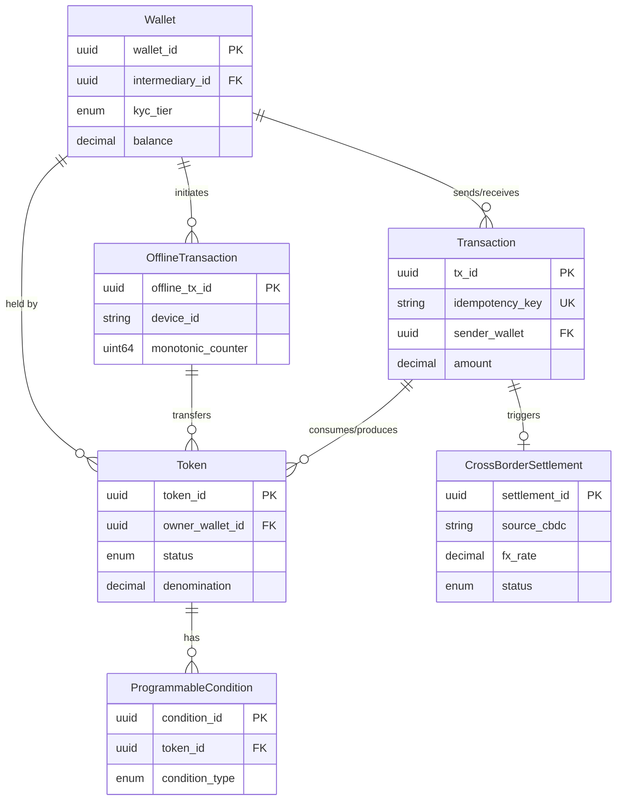

# Low-Level Design

## Data Models

```
Token:
  token_id:                uuid        // Globally unique identifier
  denomination:            decimal     // Face value (1.00, 5.00, 10.00, 50.00)
  serial_number:           string      // Audit trail (CB-prefix + sequence)
  issuer:                  string      // Central bank ID ("CB-IN", "CB-US")
  status:                  enum        // MINTED | DISTRIBUTED | ACTIVE | SPENT | REDEEMED | DESTROYED
  owner_wallet_id:         uuid        // Current holder
  programmable_conditions: []uuid      // References to ProgrammableCondition
  created_at:              timestamp
  destroyed_at:            timestamp   // Nullable
  batch_id:                uuid        // Mint batch reference
  version:                 uint64      // Optimistic concurrency

Wallet:
  wallet_id:             uuid
  owner_id:              string        // National ID / entity number
  kyc_tier:              enum          // TIER_0 (anonymous) | TIER_1 | TIER_2 | TIER_3 (institutional)
  balance:               decimal       // Online CBDC balance
  wallet_type:           enum          // INDIVIDUAL | MERCHANT | GOVERNMENT | INTERMEDIARY
  intermediary_id:       uuid          // Issuing bank/PSP
  offline_balance_limit: decimal
  offline_balance:       decimal
  status:                enum          // ACTIVE | SUSPENDED | FROZEN | CLOSED
  daily_tx_limit:        decimal
  monthly_tx_limit:      decimal

Transaction:
  tx_id:             uuid
  idempotency_key:   string            // Client-provided dedup key
  sender_wallet:     uuid
  receiver_wallet:   uuid
  amount:            decimal
  token_ids:         []uuid            // UTXO tokens consumed
  tx_type:           enum              // P2P | P2M | MINT | REDEEM | DISTRIBUTE | CROSS_BORDER | DISBURSEMENT
  status:            enum              // PENDING | COMPLETED | FAILED | REVERSED
  offline_flag:      bool
  timestamp:         timestamp
  intermediary_id:   uuid
  fx_rate:           decimal           // Nullable, for cross-border

ProgrammableCondition:
  condition_id:    uuid
  token_id:        uuid
  condition_type:  enum                // EXPIRY | GEO_FENCE | MERCHANT_CATEGORY | INCOME_TIER | PURPOSE_LOCK
  parameters:      json                // e.g. {"allowed_mcc":["5411"]}, {"expiry_date":"2027-03-31"}
  expiry:          timestamp           // Nullable
  is_active:       bool

OfflineTransaction:
  offline_tx_id:       uuid            // Generated on device
  device_id:           string          // Secure element ID
  counterparty_device: string
  amount:              decimal
  token_ids:           []uuid
  monotonic_counter:   uint64          // SE counter at time of spend
  signature:           bytes           // SE-signed payload
  local_timestamp:     timestamp
  synced_at:           timestamp       // Nullable
  sync_status:         enum            // PENDING_SYNC | SYNCED | CONFLICT | REJECTED

CrossBorderSettlement:
  settlement_id:    uuid
  source_cbdc:      string             // e.g. "eCNY", "eINR"
  target_cbdc:      string
  fx_rate:          decimal
  source_amount:    decimal
  target_amount:    decimal
  mbridge_tx_ref:   string
  status:           enum               // INITIATED | FX_LOCKED | EXECUTING | SETTLED | ROLLED_BACK
  initiator_wallet: uuid
  beneficiary_ref:  string
  ttl:              duration           // FX rate lock window
```

### Entity Relationship Diagram



---

## Indexing and Sharding Strategy

| Table | Index | Purpose |
|-------|-------|---------|
| Token | `(owner_wallet_id, status)` | Active tokens per wallet |
| Token | `(serial_number)` UNIQUE | Audit lookup |
| Transaction | `(sender_wallet, timestamp DESC)` | Sender history |
| Transaction | `(idempotency_key)` UNIQUE | Deduplication |
| OfflineTransaction | `(device_id, monotonic_counter)` UNIQUE | Double-spend detection |
| CrossBorderSettlement | `(status, initiated_at)` | Monitor in-flight settlements |

**Partitioning:** Hash-partition Transaction and Token by `intermediary_id`; time-range partition on `timestamp` (monthly, archived after 7 years).

**Sharding:** Core ledger shards by `wallet_id` hash (consistent hashing with virtual nodes) for transaction lookups. Analytics pipelines use range sharding by `timestamp` on read replicas.

---

## API Design

### Token Minting (Central Bank Only)

```
POST /api/v1/mint/tokens          [mTLS + central-bank-role]
Request:  { batch_id, total_amount, denominations: {"1.00": 10000, "50.00": 1000}, purpose, programmable_conditions[] }
Response: 201 { batch_id, tokens_created, total_value, status: "MINTED" }
```

### Wallet Management

```
POST /api/v1/wallets              [Bearer intermediary_token]
Request:  { owner_id, wallet_type, kyc_tier }
Response: 201 { wallet_id, kyc_tier, daily_tx_limit, offline_balance_limit }

PUT  /api/v1/wallets/{id}/kyc-upgrade   { target_tier, verification_ref }
GET  /api/v1/wallets/{id}/balance  -->  { online_balance, offline_balance, pending_sync }
```

### Transfer (P2P / P2M)

```
POST /api/v1/transfers            [Bearer user_token, Idempotency-Key header]
Request:  { sender_wallet, receiver_wallet, amount, tx_type, metadata }
Response: 201 { tx_id, status: "COMPLETED", timestamp, receipt_hash }
Errors:   409 (duplicate key) | 422 (insufficient balance / limit exceeded) | 403 (suspended / KYC)
```

### Offline Sync

```
POST /api/v1/offline/sync         [Bearer device_token]
Request:  { device_id, transactions[]: { offline_tx_id, counterparty_device, amount, token_ids, monotonic_counter, signature } }
Response: 200 { synced: int, rejected: int, results[]: { offline_tx_id, status, reason } }
```

### Programmable Token

```
POST /api/v1/tokens/conditions    [mTLS + policy-role]
Request:  { token_ids[], condition_type, parameters, expiry }
GET  /api/v1/tokens/{id}/eligibility?receiver_wallet={id}&merchant_mcc={mcc}
Response: { eligible: bool, blocking_conditions[] }
```

### Cross-Border

```
POST /api/v1/cross-border/quote   { source_cbdc, target_cbdc, amount, direction }
Response: { fx_rate, source_amount, target_amount, quote_ttl, quote_id }

POST /api/v1/cross-border/execute [Idempotency-Key]
Request:  { quote_id, sender_wallet, beneficiary_ref }
Response: 202 { settlement_id, status: "INITIATED", estimated_completion }
```

### Bulk Disbursement

```
POST /api/v1/disbursements        [mTLS + government-role]
Request:  { disbursement_id, purpose, recipients[]: {wallet_id, amount}, programmable_conditions[], total_amount }
Response: 202 { disbursement_id, status: "PROCESSING", recipient_count }
```

---

## Core Algorithms

### 1. Token Lifecycle (UTXO Model)

```
FUNCTION transferTokens(senderWallet, receiverWallet, amount, idempotencyKey):
    existing = lookupByIdempotencyKey(idempotencyKey)
    IF existing: RETURN existing.result

    tokens = getTokensByWallet(senderWallet, status=ACTIVE)
    SORT tokens BY denomination DESC
    selected = []; total = 0
    FOR token IN tokens:
        IF total >= amount: BREAK
        IF NOT evaluateConditions(token, receiverWallet): CONTINUE
        selected.append(token); total += token.denomination
    IF total < amount: FAIL "Insufficient eligible balance"

    changeAmount = total - amount
    BEGIN ATOMIC:
        FOR token IN selected: token.status = SPENT; updateToken(token)
        FOR rt IN splitIntoDenominations(amount): createToken(rt, owner=receiverWallet)
        IF changeAmount > 0:
            FOR ct IN splitIntoDenominations(changeAmount): createToken(ct, owner=senderWallet)
        tx = createTransaction(senderWallet, receiverWallet, amount, selected, idempotencyKey)
    COMMIT
    RETURN tx

FUNCTION splitIntoDenominations(amount):
    denoms = [50.00, 10.00, 5.00, 1.00, 0.50, 0.10, 0.01]
    result = []; remaining = amount
    FOR d IN denoms:
        WHILE remaining >= d: result.append(newToken(d)); remaining = ROUND(remaining - d, 2)
    RETURN result
```

**Complexity:** O(T) token selection + O(D) denomination split. Space: O(T + D).

### 2. Offline Double-Spend Prevention

```
FUNCTION offlineSpend(senderSE, receiverSE, amount):
    selected = selectTokensForAmount(senderSE.getAvailableTokens(), amount)
    IF selected is null: FAIL "Insufficient offline balance"
    counter = senderSE.incrementCounter()           // Hardware-enforced, irreversible
    payload = { tokens: selected, counter, sender: senderSE.deviceId,
                receiver: receiverSE.deviceId, amount, timestamp: senderSE.getSecureClock() }
    signature = senderSE.sign(payload)               // Key never leaves SE
    nfcTransfer(receiverSE, payload, signature)
    receiverSE.verifyCertificateChain(senderSE.certificate)
    receiverSE.verifySignature(payload, signature, senderSE.publicKey)
    receiverSE.storeReceivedTokens(selected, payload, signature)
    senderSE.markTokensSpent(selected)

FUNCTION syncOfflineTransactions(deviceId, transactions):
    device = getDeviceRecord(deviceId)
    lastCounter = device.last_synced_counter
    SORT transactions BY monotonic_counter ASC
    results = []
    FOR tx IN transactions:
        expected = lastCounter + 1
        IF tx.monotonic_counter < expected:
            results.append({tx.offline_tx_id, "REJECTED", "counter_replay"}); CONTINUE
        IF tx.monotonic_counter > expected:
            flagForInvestigation(deviceId, expected, tx.monotonic_counter)
            results.append({tx.offline_tx_id, "REJECTED", "counter_gap"}); CONTINUE
        IF NOT verifyDeviceSignature(tx):
            results.append({tx.offline_tx_id, "REJECTED", "invalid_signature"}); CONTINUE
        settleOnCoreLedger(tx)
        lastCounter = tx.monotonic_counter
        results.append({tx.offline_tx_id, "SYNCED"})
    device.last_synced_counter = lastCounter
    RETURN results
```

**Complexity:** O(N log N) sort + O(N) validation. Space: O(N).

### 3. Programmable Money Evaluation Engine

```
FUNCTION evaluateConditions(token, receiverWallet):
    conditions = getActiveConditions(token.token_id)
    FOR cond IN conditions:
        IF NOT cond.is_active: CONTINUE
        IF cond.expiry AND cond.expiry < NOW(): deactivateCondition(cond); CONTINUE
        SWITCH cond.condition_type:
            CASE EXPIRY:
                IF NOW() > cond.parameters.expiry_date: RETURN {eligible: false, reason: "Expired"}
            CASE GEO_FENCE:
                IF getWalletRegion(receiverWallet) NOT IN cond.parameters.allowed_regions:
                    RETURN {eligible: false, reason: "Outside allowed region"}
            CASE MERCHANT_CATEGORY:
                IF receiverWallet.wallet_type != MERCHANT: RETURN {eligible: false}
                IF getMerchantMCC(receiverWallet) NOT IN cond.parameters.allowed_mcc:
                    RETURN {eligible: false, reason: "Merchant category not permitted"}
            CASE PURPOSE_LOCK:
                IF NOT checkPurposeEligibility(receiverWallet, cond.parameters.purpose):
                    RETURN {eligible: false, reason: "Purpose mismatch"}
            CASE INCOME_TIER:
                IF getOwnerIncomeTier(token.owner_wallet_id) NOT IN cond.parameters.allowed_tiers:
                    RETURN {eligible: false, reason: "Income tier ineligible"}
    RETURN {eligible: true}
```

**Complexity:** O(C) per token where C = active conditions. Each check is O(1) via hash-map lookups.

### 4. Cross-Border FX Atomic Swap (PvP)

```
FUNCTION initiateCrossBorderTransfer(senderWallet, beneficiaryRef, quoteId):
    quote = getAndLockQuote(quoteId)
    IF quote.expired: FAIL "FX quote expired"
    settlement = createSettlement(source_cbdc=quote.source_cbdc, target_cbdc=quote.target_cbdc,
        fx_rate=quote.fx_rate, source_amount=quote.source_amount,
        target_amount=quote.target_amount, status=INITIATED, ttl=quote.quote_ttl)

    escrow = escrowTokens(senderWallet, quote.source_amount)  // Move to escrow wallet
    IF escrow.failed: settlement.status = FAILED; RETURN {error: "Insufficient balance"}
    settlement.status = FX_LOCKED
    publishToGateway("cross-border.swap.request", {settlement.id, escrow.ref, quote})
    RETURN settlement

FUNCTION handleSwapResponse(response):
    settlement = getSettlement(response.settlement_id)
    IF response.status == "TARGET_CREDITED":
        releaseEscrow(settlement, action=DESTROY)     // Remove from source circulation
        settlement.status = SETTLED
    ELSE IF response.status IN ["TARGET_FAILED", "TIMEOUT"]:
        releaseEscrow(settlement, action=RETURN_TO_SENDER)
        settlement.status = ROLLED_BACK
    updateSettlement(settlement)
    notifyWallet(settlement.initiator_wallet, settlement.status)

FUNCTION escrowTokens(walletId, amount):
    tokens = selectTokensForAmount(getTokensByWallet(walletId, ACTIVE), amount)
    IF tokens is null: RETURN {failed: true}
    escrowWallet = getEscrowWallet()
    BEGIN ATOMIC:
        FOR token IN tokens: token.owner_wallet_id = escrowWallet.wallet_id; updateToken(token)
        ref = createEscrowRecord(walletId, tokens, amount)
    COMMIT
    RETURN {failed: false, escrow_ref: ref}
```

**Complexity:** O(T) token selection, O(K) escrow/release where K = escrowed tokens. Gateway is async and latency-dominated.

---

## Capacity Estimation

| Metric | Estimate | Basis |
|--------|----------|-------|
| Active wallets | 500M | ~50% adult population over 5 years |
| Daily transactions | 2B | ~4 per active wallet per day |
| Peak TPS | 50,000 | 2x average during salary/holiday |
| Active token count | 10B | ~20 tokens per wallet |
| Daily storage growth | ~1 TB | 2B txns x 500 bytes |
| Cross-border volume | 20M/day | ~1% of daily transactions |
