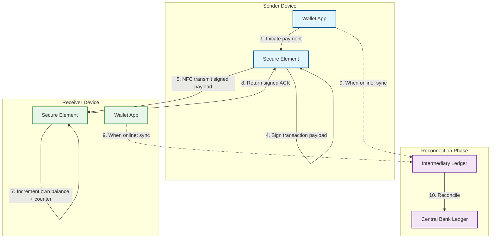

# Deep Dive & Bottlenecks

## 1. Offline NFC Payment Engine

### Why This Is Critical

A Central Bank Digital Currency must replicate the usability of physical cash---including payments without network connectivity. Rural areas, underground transit, disaster zones, and developing regions with intermittent connectivity all require offline capability. Without it, CBDC adoption faces resistance from populations that rely on cash precisely because it works everywhere. The offline payment engine must guarantee value transfer integrity without any server-side validation at the time of transaction.

### Architecture Deep Dive

The offline payment engine relies on a **Secure Element (SE)** or **Trusted Execution Environment (TEE)** embedded in the user's device. These hardware-isolated environments store the wallet's offline balance, a monotonic transaction counter, and cryptographic keys that never leave the secure boundary.

**Token Storage Model**: The SE maintains a local balance ledger with three fields: `available_balance`, `monotonic_counter`, and `last_sync_timestamp`. The monotonic counter increments with every transaction (send or receive) and cannot be decremented or reset, providing replay protection.

**NFC Tap Payment Flow**:



**Transaction Payload Structure**: Each offline transaction contains the sender's wallet ID, receiver's wallet ID, amount, sender's current counter value, timestamp, and a digital signature produced by the SE using the wallet's private key. The receiver's SE validates the signature against the sender's public key (pre-exchanged during NFC handshake) before accepting funds.

**Sync Protocol**: When either device reconnects to the network, the SE exports a batch of signed offline transactions to the intermediary. The intermediary validates each transaction against its records and forwards the net balance changes to the central bank ledger. Conflicts (e.g., double-spend attempts detected during sync) are resolved by timestamp and counter ordering.

**Split-Transaction Recovery**: If a transaction is interrupted (battery death, NFC range break), the recovery protocol handles the partial state:

```
FUNCTION recover_split_transaction(device):
    pending = device.SE.get_pending_transactions()

    FOR EACH txn IN pending:
        IF txn.state == SENDER_DECREMENTED_NO_ACK:
            -- Sender decremented balance but never received ACK
            -- On sync, query counterpart via intermediary
            counterpart_status = intermediary.query_txn(txn.id)
            IF counterpart_status == RECEIVED:
                txn.mark_complete()
            ELSE:
                txn.rollback()  -- Restore sender balance
                device.SE.increment_balance(txn.amount)

        IF txn.state == RECEIVER_PENDING_VERIFY:
            -- Receiver received payload but SE crashed before verification
            txn.discard()  -- Receiver never incremented, no harm done
```

**Offline Chain Depth Limit**: To contain risk, the system limits how many times a token can change hands offline before requiring a sync. Each offline transaction increments a `chain_depth` counter on the token. When chain depth reaches the configured maximum (default: 5 hops), the receiving device's SE requires the sender to sync before accepting the payment. This prevents tokens from circulating offline indefinitely, accumulating unreconciled risk.

### Failure Modes and Mitigations

| Failure Mode | Impact | Mitigation |
|-------------|--------|------------|
| SE extraction / device compromise | Attacker clones wallet with full offline balance | Hardware-backed attestation; remote kill on next sync; offline spending cap ($500) limits exposure |
| Double-spend replay attack | Attacker replays a signed transaction to a second receiver | Monotonic counter embedded in signature; receiver SE rejects any counter value it has seen before |
| Counter overflow | Counter reaches max integer, device cannot transact | 64-bit counter supports 18 quintillion transactions; practically inexhaustible |
| Battery death mid-transaction | Partial state update on sender or receiver | Atomic two-phase commit within SE: balance is only decremented after ACK received; receiver only increments after signature verification |
| Prolonged offline period | Accumulated risk of undetected fraud or balance inconsistency | Forced resync after 7 days max offline; offline balance frozen if sync deadline exceeded |

### Race Condition: Offline-to-Online Transition

**Scenario**: A user has $200 offline balance and $300 online balance. They spend $180 offline, then immediately go online and attempt to spend $400 (which exceeds their actual total of $320 but appears valid against the $300 online balance).

**Solution**: When a device reconnects, the first operation is a mandatory sync of offline transactions before any online transaction is permitted. The sync deducts the $180 from the intermediary ledger, updating the user's online-visible balance to $120 before any new spend is authorized.

---

## 2. Programmable Money Engine

### Why This Is Critical

Programmable money is what distinguishes CBDC from simple digital cash. Governments can issue stimulus payments that must be spent within 90 days, agricultural subsidies redeemable only at approved seed and fertilizer merchants, or disaster relief funds restricted to a geographic region. Without programmable conditions, these policy goals require separate administrative systems, manual verification, and are prone to leakage and fraud.

### Architecture Deep Dive

Each CBDC token carries a **condition set**---a structured rule bundle attached at minting time by the issuing authority. Conditions are immutable once attached; they cannot be modified by intermediaries or end users.

**Condition Structure**:

```
CONDITION_SET:
    expiry_timestamp:       UNIX timestamp (0 = no expiry)
    geo_fence:              LIST of allowed region codes (empty = unrestricted)
    merchant_categories:    LIST of allowed MCC codes (empty = unrestricted)
    max_single_txn:         Maximum amount per transaction (0 = unlimited)
    purpose_code:           Enum (GENERAL, STIMULUS, SUBSIDY, RELIEF, PENSION)
    min_recipient_tier:     Minimum KYC tier of recipient (0 = any)
```

**Condition Evaluation Pipeline**: Before any transfer, the token passes through the condition evaluator:

```
FUNCTION evaluate_conditions(token, transaction):
    conditions = token.condition_set

    IF conditions.expiry_timestamp > 0 AND NOW() > conditions.expiry_timestamp:
        RETURN REJECT("Token expired", return_to=ISSUER)

    IF conditions.geo_fence IS NOT EMPTY:
        IF transaction.merchant_region NOT IN conditions.geo_fence:
            RETURN REJECT("Geographic restriction")

    IF conditions.merchant_categories IS NOT EMPTY:
        IF transaction.merchant_mcc NOT IN conditions.merchant_categories:
            RETURN REJECT("Merchant category restricted")

    IF conditions.max_single_txn > 0 AND transaction.amount > conditions.max_single_txn:
        RETURN REJECT("Exceeds single transaction limit")

    IF conditions.min_recipient_tier > 0:
        IF recipient.kyc_tier < conditions.min_recipient_tier:
            RETURN REJECT("Recipient KYC tier insufficient")

    RETURN ALLOW
```

**Pre-Compiled Condition Bytecode**: To avoid evaluation latency at payment time, conditions are compiled into a compact bytecode representation at minting. The bytecode evaluator executes in under 0.1ms, compared to 2-5ms for interpreted rule evaluation. The bytecode is signed by the minting authority, so intermediaries can verify that conditions have not been tampered with without re-fetching the original condition definition.

**Token Split and Merge Rules**: When a conditioned token is partially spent, the change token inherits all conditions from the parent. When tokens with different conditions are merged (e.g., user receives both general and stimulus tokens), they remain in separate logical buckets within the wallet---they are never truly merged. The wallet presents a unified balance view but tracks conditioned and unconditioned tokens separately.

**Spending Priority Algorithm**: When a user makes a payment, the wallet must decide which token bucket to draw from. The priority order is:

```
FUNCTION select_tokens_for_payment(wallet, amount, merchant):
    -- Priority 1: Conditioned tokens that match this merchant and are nearest expiry
    matching_conditioned = wallet.get_conditioned_tokens()
        .filter(t => evaluate_conditions(t, merchant) == ALLOW)
        .sort_by(t => t.expiry_timestamp ASC)

    remaining = amount
    selected = []

    FOR EACH token IN matching_conditioned:
        IF remaining <= 0: BREAK
        use_amount = MIN(token.balance, remaining)
        selected.add(token, use_amount)
        remaining -= use_amount

    -- Priority 2: General-purpose tokens (no conditions)
    IF remaining > 0:
        general = wallet.get_general_tokens()
        FOR EACH token IN general:
            IF remaining <= 0: BREAK
            use_amount = MIN(token.balance, remaining)
            selected.add(token, use_amount)
            remaining -= use_amount

    IF remaining > 0:
        RETURN INSUFFICIENT_FUNDS
    RETURN selected
```

This ensures conditioned tokens are consumed before they expire, maximizing the policy effectiveness of programmatic disbursements.

### Failure Modes and Mitigations

| Failure Mode | Impact | Mitigation |
|-------------|--------|------------|
| Condition evaluation latency | Blocks payment completion | Pre-compiled bytecode; evaluation cached per token-type + transaction-type pair |
| Conflicting conditions on split tokens | Ambiguous which conditions apply to change | Strict inheritance: child tokens always carry parent conditions; no condition mixing |
| Condition bypass via intermediary collusion | Merchant miscategorizes purchase to evade MCC restriction | Condition enforcement at intermediary ledger level, not merchant POS; audit trail with merchant transaction details |
| Clock drift affecting time-based conditions | Token accepted past expiry or rejected prematurely | NTP sync requirement for intermediary nodes; 5-minute tolerance window on expiry checks |
| Expired token fund recovery | Funds locked in expired tokens are effectively destroyed | Automatic return-to-issuer flow: expired tokens trigger a credit back to the issuing authority's account |

---

## 3. Two-Tier Ledger Reconciliation

### Why This Is Critical

The CBDC architecture uses a two-tier model: the central bank maintains the wholesale ledger (total money supply, intermediary aggregate balances), while licensed intermediaries maintain retail sub-ledgers (individual wallet balances). Any discrepancy between the sum of all retail balances at an intermediary and that intermediary's aggregate balance at the central bank means money has been created or destroyed outside central bank control---a fundamental violation of monetary sovereignty.

### Architecture Deep Dive

**Real-Time Event Streaming**: Every transaction processed by an intermediary emits an event to the central bank's reconciliation pipeline. Events include: wallet-to-wallet transfers, offline sync batches, token minting distributions, and token expirations. The central bank consumes these events to maintain a shadow aggregate balance for each intermediary.

**Periodic Reconciliation**: Every 15 minutes, a reconciliation job executes:

```
FUNCTION reconcile_intermediary(intermediary_id):
    cb_aggregate = central_bank_ledger.get_balance(intermediary_id)
    intermediary_reported = intermediary.report_aggregate_balance()
    event_stream_computed = event_processor.compute_aggregate(intermediary_id)

    discrepancy_1 = ABS(cb_aggregate - intermediary_reported)
    discrepancy_2 = ABS(cb_aggregate - event_stream_computed)

    IF discrepancy_1 > TOLERANCE_THRESHOLD:
        trigger_investigation(intermediary_id, "reported vs CB", discrepancy_1)

    IF discrepancy_2 > TOLERANCE_THRESHOLD:
        trigger_investigation(intermediary_id, "event stream vs CB", discrepancy_2)

    IF discrepancy_1 == 0 AND discrepancy_2 == 0:
        record_clean_reconciliation(intermediary_id, timestamp=NOW())
```

**Hash-Chain Audit Trail**: Each intermediary maintains a hash chain of all transactions. Every block in the chain contains a batch of transactions and the Merkle root of the intermediary's complete wallet state after those transactions. The central bank periodically requests Merkle proofs to verify that the intermediary's reported state is consistent with its transaction history.

**Merkle Proof Verification**:

```
FUNCTION verify_intermediary_state(intermediary_id):
    reported_root = intermediary.get_current_merkle_root()
    transaction_log = intermediary.get_transactions_since(last_verified_block)

    recomputed_root = compute_merkle_root(
        last_verified_root,
        apply_transactions(transaction_log)
    )

    IF reported_root != recomputed_root:
        ESCALATE("Merkle root mismatch", intermediary_id, severity=CRITICAL)
        activate_circuit_breaker(intermediary_id)

    RETURN match_status
```

### Failure Modes and Mitigations

| Failure Mode | Impact | Mitigation |
|-------------|--------|------------|
| Split-brain between tiers | Central bank and intermediary disagree on balances | Continuous event streaming with sequence numbers; gap detection triggers full state sync |
| Intermediary ledger corruption | Wallet balances silently altered | Merkle tree proofs detect any retroactive tampering; corrupted intermediary is suspended |
| Delayed sync creating temporary supply inconsistency | Offline transactions not yet reflected at central bank | Tolerance window (configurable per intermediary); offline transaction reserves pre-deducted from intermediary aggregate |
| Hash chain fork | Intermediary presents two conflicting transaction histories | Central bank maintains its own copy of intermediary event stream; any fork is detected immediately |
| Reconciliation job failure | Missed reconciliation window | Automated retry with alerting; maximum 2 consecutive missed windows before intermediary circuit breaker activates |

---

## 4. Critical Race Conditions

| Race Condition | Trigger | Impact | Resolution |
|---------------|---------|--------|------------|
| **Online double-spend** | Two simultaneous spends from same wallet | Balance goes negative; money created from nothing | Pessimistic lock on wallet balance row; serialize spends per wallet |
| **Offline-to-online transition** | Offline balance syncs while online spend is in-flight | Balance inconsistency between offline SE and intermediary ledger | Mandatory sync-before-spend on reconnection; online transactions blocked until sync completes |
| **Cross-border atomic settlement** | FX rate changes during multi-step settlement | Sender debited at old rate, receiver credited at new rate | Lock FX rate at initiation with 30-second validity window; abort and re-quote if window expires |
| **Programmable condition race** | Token expires during in-flight transfer | Transfer succeeds but token should have been returned to issuer | Condition check at both initiation and finalization; expiry during transfer triggers automatic reversal |
| **Concurrent minting and reconciliation** | Central bank mints new tokens while reconciliation job runs | Reconciliation detects false discrepancy | Minting events carry sequence numbers; reconciliation job reads up to a consistent sequence point |

---

## 5. Bottleneck Analysis

### Bottleneck 1: Core Ledger Write Throughput

**Problem**: A national-scale CBDC serving 200M+ wallets generates millions of transactions per second during peak hours. A single ledger database cannot sustain this write throughput.

**Solution**: Shard the ledger by wallet ID hash. Each shard handles transactions where the sender's wallet falls in its range. Cross-shard transactions (sender and receiver on different shards) use a two-phase commit coordinated by a lightweight transaction manager. Sharding by wallet ensures that balance reads (the most frequent operation) are always single-shard.

**Target**: 64 shards, each handling ~15K TPS, for an aggregate capacity of ~1M TPS.

### Bottleneck 2: Cross-Border FX Settlement Latency

**Problem**: Cross-border CBDC transfers require foreign exchange conversion, compliance checks in both jurisdictions, and settlement across two separate central bank ledgers. End-to-end latency can exceed 30 seconds, unacceptable for retail payments.

**Solution**: Pre-positioned liquidity pools. Each participating central bank pre-funds a pool in the counterpart's currency. Retail transactions draw from the pool instantly (sub-second settlement) while the pools are rebalanced periodically (every 15 minutes) via wholesale settlement. Pool depletion triggers automatic top-up from the wholesale channel.

### Bottleneck 3: Offline Sync Storm After Network Recovery

**Problem**: After a regional network outage (e.g., natural disaster), millions of devices reconnect simultaneously and attempt to sync offline transactions. This creates a thundering herd that can overwhelm intermediary sync endpoints.

**Solution**: Staggered sync with jitter. Each device calculates a random backoff window (0 to 30 minutes) before initiating sync. Devices with older `last_sync_timestamp` get priority (shorter backoff). The intermediary's sync endpoint has a token-bucket rate limiter that queues excess sync requests rather than rejecting them. A progress indicator shows users their position in the sync queue.

---

## 6. Failure Modes and Degradation Summary

| Failure | Impact | Graceful Degradation |
|---------|--------|---------------------|
| Intermediary node down | Retail transactions through that intermediary fail | Automatic failover to backup intermediary; wallets fall back to offline mode |
| Central bank core unavailable | No new token minting; no wholesale settlement | Intermediaries continue processing retail transactions from existing token supply; minting queued |
| HSM cluster failure | Cannot sign new tokens or verify high-value transactions | Standby HSM cluster promoted; high-value transactions queued until signing restored |
| Cross-border gateway down | International transfers fail | Domestic transactions continue; cross-border transactions queued with user notification |
| Programmable condition evaluator overloaded | Payment latency spikes | Bypass condition evaluation for general-purpose tokens; queue conditioned token transactions |
| Merkle verification failure at intermediary | Potential data integrity breach | Circuit breaker suspends intermediary; user wallets rerouted to backup intermediary |
