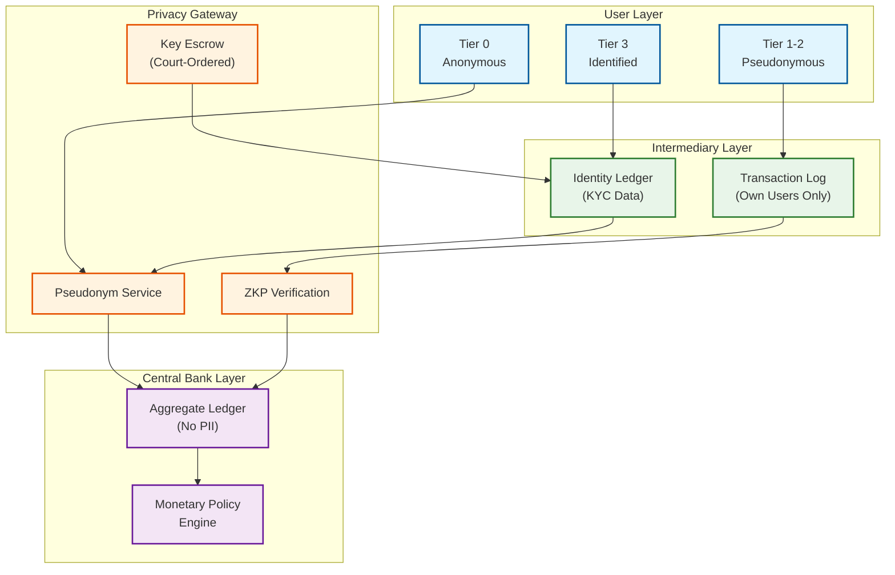

# Security & Compliance

## Authentication & Authorization

### Central Bank Operators

```
Multi-Party Authorization (M-of-N HSM Key Ceremony):

Token minting requires 3-of-5 key holders to authenticate simultaneously:
  - Governor's Office, CTO, Head of Currency Ops, External Auditor,
    Disaster Recovery Custodian (offline cold storage)

  Ceremony:
    1. Request submitted via air-gapped secure terminal
    2. Each key holder authenticates: smartcard + PIN + biometric
    3. HSM reconstructs signing key from M shards (Shamir's Secret Sharing)
    4. HSM signs the minting batch, immediately purges reconstructed key
    5. Immutable audit log entry with all participant IDs, timestamps, amounts

  Destruction follows identical M-of-N process
  No single individual can mint or destroy tokens under any circumstance
```

### Intermediary Institutions

```
Mutual TLS with Certificate Pinning:
  Central Bank Root CA → Intermediary Issuing CA → Institution certificates

  Controls:
    - Certificate rotation every 90 days (automated)
    - IP whitelisting per institution (primary + DR ranges)
    - Institutional API keys with per-endpoint rate limits
    - Certificate revocation via CRL + OCSP stapling
    - Hardware-bound keys (private key in institution's HSM)
```

### End User Tiered Authentication

```
Tier 0 — Anonymous:  NFC tap only, $50/tx, $200/day
Tier 1 — Phone-verified:  PIN auth, $500/day, $2,000/month
Tier 2 — ID-verified:  Biometric + PIN, $5,000/day, $20,000/month
Tier 3 — Full KYC:  Biometric + PIN + device attestation, unlimited
```

### Authorization Model

```
Hybrid RBAC + ABAC:

RBAC (Institutional):
  CENTRAL_BANK_OPERATOR → Mint, destroy, set monetary policy
  CENTRAL_BANK_AUDITOR  → Read-only ledger access
  INTERMEDIARY_ADMIN    → Manage wallets, view own transactions
  COMPLIANCE_OFFICER    → SAR reports, AML queries

ABAC (Transaction-Level):
  FUNCTION evaluate_transaction(tx, user, context):
    CHECK user.kyc_tier >= required_tier_for(tx.amount)
    CHECK tx.amount <= daily_limit[user.kyc_tier] - user.daily_spent
    CHECK tx.destination_country NOT IN sanctioned_countries
    CHECK user.geographic_location WITHIN allowed_regions
    IF tx.amount > high_value_threshold:
      REQUIRE step_up_authentication(user, "biometric")
```

---

## Data Security

### Encryption Architecture

```
At Rest:
  - AES-256-GCM with HSM-managed DEKs
  - Key hierarchy: Master Key (HSM) → Key Encryption Key → Data Encryption Key
  - DEK rotation every 30 days, backup uses separate HSM cluster
  - Device secure element: hardware-protected key storage, tamper-evident

In Transit:
  - TLS 1.3 with forward secrecy on all channels
  - Wallet ↔ Intermediary: TLS 1.3 + application-layer payload encryption
  - Intermediary ↔ Central Bank: Mutual TLS + signed message envelopes
  - Cross-border: bilateral key agreement between participating central banks

Token Security:
  - Each token signed by central bank HSM (ECDSA P-384)
  - Signature verified on every transfer by receiving intermediary
  - Serial number + denomination + timestamp all covered by signature
  - Offline tokens: additional monotonic counter signed by secure element
```

### PII Separation

```
Identity Store (intermediary):  Name, ID, address, phone, biometrics
  → Indexed by internal user ID (never exposed to central bank)

Transaction Ledger (central bank):  Pseudonymous wallet ID, amount, timestamp
  → NO link to identity — only intermediary can map wallet → user
  → Central bank sees: "Wallet W7x9k sent 50.00 to Wallet M3p2q"
  → Central bank does NOT see: "Alice sent 50.00 to Bob"
```

---

## Privacy Model

### Controlled Anonymity Architecture



### Zero-Knowledge Proof Applications

```
1. Balance Sufficiency Proof:
   Prover (wallet): "I have >= X tokens"
   Verifier (merchant): learns ONLY that balance is sufficient
   Protocol: Range proof using Bulletproofs or Groth16

   FUNCTION prove_balance_sufficient(wallet, amount):
     commitment = Pedersen_Commit(wallet.balance, blinding_factor)
     proof = ZK_RangeProof(wallet.balance >= amount)
     RETURN (commitment, proof)

2. KYC Compliance Proof:
   Prover (user): "I am KYC-verified at Tier 2+"
   Verifier (merchant): learns tier compliance, NOT identity or name
   Protocol: ZKP over signed KYC attestation from intermediary

3. Transaction Limit Compliance:
   Prover (wallet): "My daily spending is within limit"
   Verifier: learns compliance status, NOT exact amount spent elsewhere
```

### Tiered Privacy vs. Limits

```
Tier 0: Central bank sees nothing (offline NFC). Law enforcement
        requires physical device seizure. Limits: $50/tx, $200/day.

Tier 1: Central bank sees pseudonymous activity. Intermediary knows
        phone number only. Court order needed. Limits: $500/day.

Tier 2: Intermediary knows verified identity. Court order to
        intermediary yields identity. Limits: $5,000/day.

Tier 3: Full transaction history + verified identity at intermediary.
        Standard legal process for disclosure. Limits: Unlimited.
```

### Anti-Surveillance Guarantees

```
1. No Central Transaction Database — individual transaction details stored
   ONLY at the user's intermediary, not at central bank level
2. Pseudonym Rotation — wallet IDs rotated every 30 days, unlinkable
   without intermediary cooperation
3. Data Minimization — central bank receives only settlement aggregates,
   never sender/recipient identity or purchase details
4. Cryptographic Enforcement — privacy enforced by math, not policy;
   compromised central bank employee cannot access identities without
   intermediary cooperation AND court order
```

---

## Threat Model

### Top 5 Attack Vectors

```
1. TOKEN COUNTERFEITING → HSM-only minting with M-of-N ceremony,
   every token signed, signature verified on every transfer,
   serial numbers tracked in central bank registry

2. DOUBLE-SPEND (online) → Real-time balance verification with
   optimistic locking, transaction serialization per wallet,
   settlement finality within 2 seconds

3. DOUBLE-SPEND (offline) → Monotonic counter in secure element,
   offline caps ($50/tx, $200 cumulative), SE hardware attestation,
   post-sync detection, intermediary absorbs losses up to cap

4. PRIVACY BREACH (mass surveillance) → Pseudonymous wallet IDs,
   ZKP for balance/compliance proofs, data minimization,
   pseudonym rotation, cryptographic enforcement

5. STATE-LEVEL ATTACK (rogue CB employee) → M-of-N authorization,
   HSM-enforced ceremony, immutable audit trail, real-time supply
   reconciliation alerts, external auditor holds one key shard
```

### Infrastructure Threats

```
DDoS: Rate limiting per intermediary, traffic prioritization
  (retail payments > analytics > bulk queries), separate endpoints
  for real-time vs. batch operations

Supply-Chain: SE certification program, hardware attestation before
  provisioning, central-bank-signed firmware only, tamper-detection
  circuitry, vendor diversity (2+ approved SE manufacturers)
```

---

## Compliance

### AML/CFT

```
Transaction Monitoring (at intermediary level):
  - Rule-based: amount thresholds, velocity checks, geographic risk
  - Pattern detection: structuring, rapid wallet movement, dormant activation
  - SAR generation and filing
  - Travel rule for cross-border > $1,000: originator name + account + address

Cross-Border AML:
  - Each central bank runs own AML checks
  - Identity disclosure only via bilateral legal assistance treaty
  - Sanctions screening against consolidated watchlists
```

### Monetary Policy Controls

```
  - Total supply: Mint/destroy operations govern M0 supply
  - Interest on CBDC: Positive (incentivize), zero (neutral), negative (stimulate)
  - Holding limits: Max per wallet prevents bank disintermediation
  - Programmable expiry: Stimulus tokens with 90-day use-by date
```

### Data Sovereignty & Privacy Laws

```
  - All transaction data within issuing country's jurisdiction
  - Cross-border: replicated summary data only, no bulk sharing
  - GDPR right to erasure → crypto-shredding (delete per-user encryption key;
    ledger entries remain but become unlinkable to identity)
  - Data retention: 7 years (regulatory), PII deleted after closure + retention
```

---

## Security Incident Response

| Severity | Example | Response | Action |
|----------|---------|----------|--------|
| P0 | Supply mismatch, HSM compromise | Immediate | Halt minting, key rotation, notify intermediaries |
| P1 | Double-spend detected, intermediary breach | < 30 min | Isolate intermediary, freeze suspicious wallets |
| P2 | Elevated failed auth, SE attestation failure | < 4 hours | Block affected devices, issue advisory |
| P3 | Reconciliation delay, certificate expiry | < 24 hours | Schedule in next maintenance window |

### Emergency Playbook (Token Supply Anomaly)

```
1. Detection: Supply mismatch > 0.01% alert fires
2. Containment: Pause minting (1-of-5 emergency key), hold settlement
3. Investigation: Compare mint/destroy logs, check HSM audit trail
4. Resolution: If unauthorized → rotate HSM keys (full ceremony)
   If settlement error → correct balances with auditor approval
5. Post-incident: Transparency report, threshold updates, tabletop exercise
```

---

## Security Summary

| Layer | Primary Threats | Key Defenses |
|-------|----------------|--------------|
| Token Integrity | Counterfeiting, unauthorized minting | HSM signing, M-of-N ceremony, signature verification |
| Transaction Safety | Double-spend (online/offline) | Optimistic locking, SE counters, post-sync detection |
| User Privacy | Mass surveillance, PII exposure | Pseudonymous IDs, ZKP, data minimization, crypto-shredding |
| Institutional | Insider threats, certificate compromise | M-of-N auth, mutual TLS, IP whitelisting, audit trails |
| Compliance | AML evasion, sanctions violations | Tiered monitoring, travel rule, SAR automation |
| Monetary Integrity | Supply manipulation, policy circumvention | Supply reconciliation, programmable controls, holding limits |
