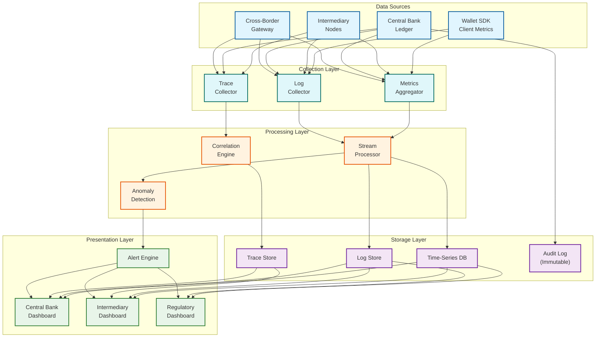

# Observability

## Metrics (USE/RED Method)

### Core Ledger Metrics

| Metric | Type | Description | Alert Threshold |
|--------|------|-------------|-----------------|
| `ledger.tps` | Gauge | Transactions per second | > 80% capacity |
| `ledger.token_supply.total` | Gauge | Total minted minus destroyed | Mismatch > 0.01% |
| `ledger.settlement_latency_ms` | Histogram | Submit to ledger commit | p50 > 500ms, p95 > 2s, p99 > 5s |
| `ledger.failed_transaction_rate` | Gauge | Failed validation percentage | > 5% |
| `ledger.transaction_rollback` | Counter | Rollbacks after acceptance | Any occurrence |

### Intermediary Metrics

| Metric | Type | Description | Alert Threshold |
|--------|------|-------------|-----------------|
| `intermediary.{id}.tps` | Gauge | Per-intermediary TPS | > 90% of quota |
| `intermediary.{id}.wallet_creation_rate` | Counter | New wallets per hour | Spike > 10x baseline |
| `intermediary.{id}.offline_sync_backlog` | Gauge | Pending offline transactions | > 10,000 |
| `intermediary.{id}.reconciliation_delta` | Gauge | Expected vs actual balance | > 0 (any discrepancy) |
| `intermediary.{id}.connection_status` | Gauge | Health (1=up, 0=down) | 0 for > 5 minutes |

### Monetary Policy Metrics

| Metric | Type | Description | Alert Threshold |
|--------|------|-------------|-----------------|
| `monetary.cbdc_in_circulation` | Gauge | Total CBDC in all wallets | Deviation > 0.1% from supply |
| `monetary.velocity` | Gauge | Turnover rate (value / avg supply) | N/A (policy indicator) |
| `monetary.cross_border_flow_volume` | Gauge | Cross-border volume per hour | Spike > 5x baseline |
| `monetary.programmable_token_utilization` | Gauge | Tokens spent before expiry | < 50% (stimulus ineffective) |
| `monetary.holding_limit_breach_attempts` | Counter | Rejected by holding limit | Spike > 10x |

### Offline Metrics

| Metric | Type | Description | Alert Threshold |
|--------|------|-------------|-----------------|
| `offline.transaction_volume` | Counter | Offline txns processed post-sync | N/A (usage tracking) |
| `offline.avg_offline_duration_hours` | Histogram | Time offline before syncing | p95 > 72 hours |
| `offline.double_spend_detected` | Counter | Double-spend attempts caught | Any occurrence |
| `offline.se_attestation_failure` | Counter | Secure element attestation fail | Any occurrence |

### Dashboard Design

```
Central Bank Dashboard (Macro Monetary View):
  - Total supply, in circulation, held at CB, last mint event
  - Supply vs. circulation trend (30-day), velocity of money (90-day)
  - Cross-border flows by corridor (24h net inflow/outflow)
  - Intermediary health grid (connection, reconciliation, TPS headroom)

Intermediary Dashboard (Operational):
  - Active wallets, current TPS vs. quota, offline backlog
  - Transaction latency distribution (p50/p95/p99)
  - Wallet distribution by KYC tier, offline sync queue
  - Error rate trend with breakdown by error type

Regulatory Dashboard (AML/Compliance):
  - SAR filings (MTD), under review, escalated
  - Travel rule compliance rate for cross-border
  - AML alert volume (rule-based vs. pattern), false positive rate
  - KYC tier migration trends (upgrades/downgrades per month)
```

---

## Logging

### What to Log vs. What NOT to Log

```
ALWAYS LOG:
  - Token state transitions: mint, transfer, redeem, destroy
  - Wallet lifecycle: creation, tier change, suspension, closure
  - Programmable condition evaluations (condition ID, result)
  - Cross-border settlement events (corridor, amounts, FX rate)
  - Offline sync reconciliations (wallet ID, txn count, discrepancies)
  - HSM operations: signing requests, key ceremonies, attestation
  - Authorization decisions: policy evaluations, step-up triggers

NEVER LOG:
  - Individual user transaction details at central bank level (privacy)
  - Biometric data or match scores
  - Raw PII — only pseudonymous references
  - HSM key material or shards
  - Device-level location data
```

### Log Levels

```
CRITICAL: Double-spend detected, supply mismatch, HSM failure,
          M-of-N ceremony anomaly, SE attestation failure

ERROR:    Transaction rollback, intermediary disconnect, certificate
          validation failure, settlement batch rejected

WARNING:  Reconciliation delay >1min, offline backlog >5K, TPS >80%
          quota, certificate expiry <14 days

INFO:     Settlement batch completed, token batch minted, intermediary
          reconnected, KYC tier upgrade, corridor settlement done

DEBUG:    Condition evaluation details, cache hit/miss, ZKP verification
          timing, certificate chain validation, rate limiter state
```

### Structured Log Format with Correlation IDs

```
{
  "timestamp": "2026-03-09T14:30:22.456Z",
  "level": "INFO",
  "component": "settlement_engine",
  "event": "batch_completed",
  "trace_id": "cbdc-tr-7f3a9b2c-e4d1",
  "intermediary_id": "BANK-A-001",
  "batch_id": "B-20260309-143022-001",
  "transaction_count": 5420,
  "processing_time_ms": 1240,
  "reconciliation_status": "balanced"
}

Correlation: TraceID spans wallet → intermediary → central bank → back
Format: cbdc-tr-{uuid-short}-{origin} (w=wallet, i=intermediary, c=CB, x=cross-border)
```

### Immutable Audit Log

```
Hash-chained append-only log:
  Each entry: sequence_number, timestamp, event_type (MINT|TRANSFER|
  REDEEM|DESTROY|POLICY_CHANGE), event_hash (SHA-256), previous_hash,
  chain_hash, HSM signature on chain_hash

Properties: Tamper-evident (broken hash = detected), non-repudiable
  (HSM signature), externally verifiable, 10-year retention,
  3 geographically distributed replicas
```

---

## Distributed Tracing

### Trace Propagation

```
Domestic: Wallet → Intermediary → Balance Check → Condition Evaluate
  → Ledger Commit → Central Bank Settlement → Response

Cross-border: Wallet → Originating Intermediary → Originating CB
  → mBridge Gateway → Destination CB → Destination Intermediary → Recipient

Context: W3C Trace Context between intermediary and CB, custom context
  for wallet ↔ intermediary, new span at mBridge to avoid topology leaks
```

### Key Spans

```
wallet_auth (5-50ms):        biometric (device-local), PIN, device attestation
balance_check (2-15ms):      cache lookup, ledger query (miss), hold placement
condition_evaluate (1-50ms): rule fetch, KYC/amount/geo checks, sanctions screen,
                             ZKP verify (10-20ms if proof provided)
ledger_commit (5-20ms):      validate, double-spend check, write, audit append
intermediary_settle (50-500ms): batch aggregate, net position, CB submit, confirm
cross_border_route (500-3000ms): originating CB, FX lookup, mBridge relay,
                                  destination CB, destination intermediary credit
offline_sync (100-5000ms):   SE attestation, counter validation, batch replay,
                              double-spend scan, balance reconcile
```

### Trace Sampling

```
100% sampled: Cross-border (low volume, high value), offline sync
  (double-spend risk), minting/destruction (audit), all error cases

10% sampled: Domestic retail online (high volume, well-understood)

Adaptive: IF error_rate > 5% → domestic to 50%
          IF intermediary_latency > p99 → 100% for that intermediary
          IF supply_delta > 0 → 100% for all settlement operations
```

---

## Observability Architecture



---

## Alerting

### Critical Alerts (Page Immediately)

| Alert | Condition | Impact |
|-------|-----------|--------|
| Supply mismatch | CB supply != SUM(intermediary balances) by > 0.01% | Potential counterfeiting or settlement error |
| HSM signing failure | Health check fails or signing timeout | Minting halted, token verification degraded |
| Double-spend detected | Offline sync finds conflicting spends | Financial loss, trust degradation |
| Intermediary disconnected | No heartbeat for > 5 minutes | Settlement stalled, backlog growing |
| Cross-border timeout | mBridge settlement exceeds 30s SLA | Transfer stuck, FX exposure |

### Warning Alerts (Investigate Within 1 Hour)

| Alert | Condition | Impact |
|-------|-----------|--------|
| Reconciliation delta > 0 | Any non-zero balance difference | Early settlement issue indicator |
| Offline backlog > 10K | Pending sync transactions accumulating | Undetected double-spend risk |
| TPS > 80% capacity | Approaching system limits | Transaction rejection risk |
| Condition eval > 50ms | Programmable rule evaluation slow | Payment delays |
| Wallet creation spike | Rate > 10x rolling 24h average | Bot-driven wallet farming |

### Runbooks

```
Token Supply Reconciliation:
  1. Verify: Re-run with forced fresh data; close if timing artifact
  2. Isolate: Compare each intermediary vs. CB records, find delta source
  3. Root cause: Settlement error → replay batch; unauthorized mint → P0
  4. Resolve: Corrective entry (auditor-approved), verify, document

HSM Failover:
  1. Check primary HSM health, network, temperature, tamper sensors
  2. Activate standby HSM, verify signatures, redirect requests
  3. Recover primary (hardware → vendor; software → restart; tamper → inspect)
  4. Post-incident: verify no dropped requests, update test schedule

Mass Offline Sync (e.g., post-disaster, backlog > 50K):
  1. Estimate total backlog and growth trajectory
  2. Scale sync workers, prioritize oldest transactions, batch checks
  3. Monitor double-spend rate during processing (alert if > 0.1%)
  4. Full reconciliation after completion, report detected anomalies
```

---

## SLI/SLO Framework

| Service Level Indicator | Target SLO | Window |
|------------------------|------------|--------|
| Domestic settlement latency | 99.95% within 2 seconds | Rolling 24h |
| Cross-border settlement | 99.9% within 30 seconds | Rolling 24h |
| Supply reconciliation accuracy | 100% zero discrepancy | Per cycle |
| Intermediary API availability | 99.99% uptime | Rolling 30d |
| Offline sync processing | 99.9% within 60s of reconnection | Rolling 7d |
| Double-spend detection | 100% within 1 sync cycle | Per incident |
| HSM signing availability | 99.999% uptime | Rolling 30d |
