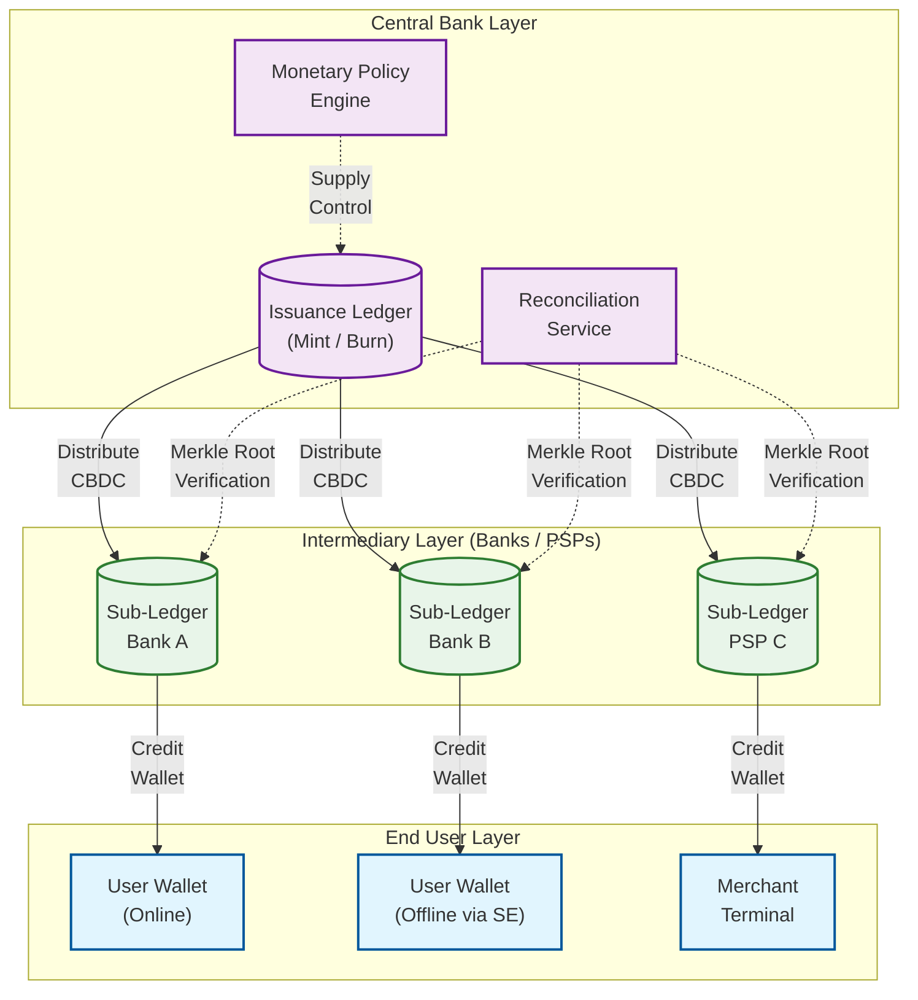
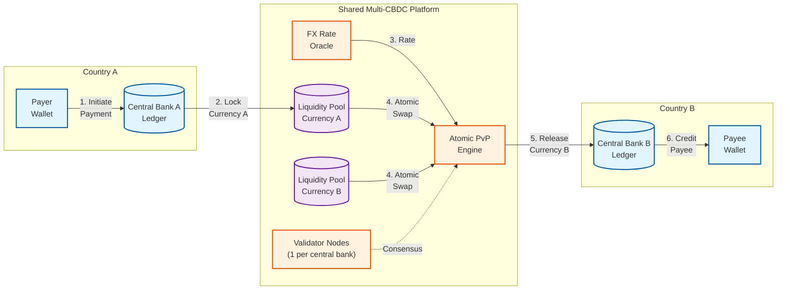
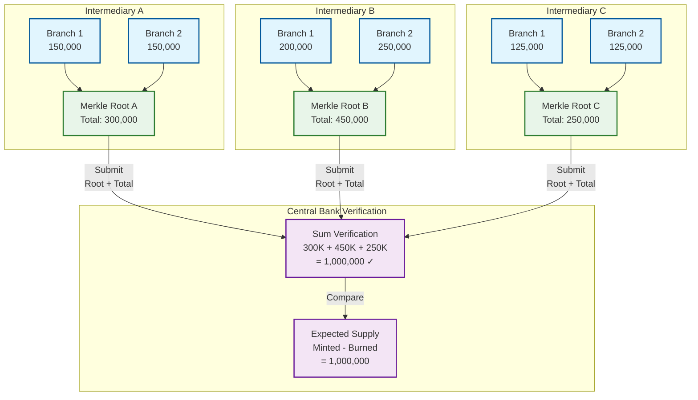

# Key Architectural Insights

## 1. The Two-Tier Architecture is Not Optional---It's a Systemic Stability Requirement

**Category:** System Modeling
**One-liner:** Routing all CBDC through intermediaries (banks/PSPs) rather than directly from central bank to users prevents bank disintermediation, preserves credit creation, and avoids making the central bank a single point of failure for an entire economy's payment system.

**Why it matters:**
If citizens could hold unlimited CBDC directly at the central bank, they would move deposits out of commercial banks during any crisis---a "digital bank run" at the speed of a tap. Commercial banks fund 60--70% of their lending through deposits; if that base evaporates, credit creation collapses---businesses cannot get loans, mortgages dry up, economic activity contracts. The two-tier model forces CBDC to flow through intermediaries who handle KYC, customer service, wallet management, and transaction routing, preserving the existing banking structure while adding the benefits of digital central bank money. This is why every major CBDC project (e-CNY, Digital Euro, Digital Rupee) uses the two-tier model. The intermediary layer also distributes operational risk: if one intermediary fails, its users can migrate to another, whereas a direct model makes the central bank's infrastructure a catastrophic single point of failure for the entire economy's payment system.



**Architectural lesson:** When designing a system that could displace existing infrastructure (banks, in this case), the architecture must explicitly preserve the roles of existing participants. This is not a technical constraint---it is a systemic stability constraint that overrides pure efficiency arguments.

---

## 2. Offline Double-Spend Prevention Requires Hardware Trust, Not Cryptographic Consensus

**Category:** Security
**One-liner:** Without network connectivity, no cryptographic protocol alone can prevent a user from spending the same token twice---the only solution is a tamper-resistant hardware module (Secure Element) that physically prevents balance manipulation.

**Why it matters:**
Online double-spend prevention is straightforward: check the ledger before committing the transaction. Offline is fundamentally different---there is no ledger to check. The solution borrows from hardware security: a Secure Element (like those embedded in SIM cards and payment cards) maintains a monotonic counter and balance that the device operating system cannot read or modify directly. Each offline payment increments the counter and decrements the balance atomically within the SE. The SE signs each transaction with a device-specific key, creating a chain of custody. If a user clones their device, the counter will not match on resync---the intermediary detects the fork and flags the duplicate. This hardware-rooted trust model is why major CBDC research programs all require SE or TEE for offline operation; software-only solutions cannot provide equivalent guarantees because any software state can be copied, replayed, or rolled back.

```
OFFLINE PAYMENT FLOW:

Sender Device (SE)                    Receiver Device (SE)
┌─────────────────┐                   ┌─────────────────┐
│ Balance: 100    │                   │ Balance: 50     │
│ Counter: 42     │                   │ Counter: 17     │
│                 │                   │                 │
│ 1. Decrement    │   NFC/BLE        │                 │
│    balance: -30 │ ─────────────►   │ 4. Verify sig   │
│ 2. Increment    │  Signed Token:   │    chain        │
│    counter: 43  │  {amount: 30,    │ 5. Increment    │
│ 3. Sign with    │   counter: 43,   │    balance: +30 │
│    device key   │   prev_hash,     │ 6. Increment    │
│                 │   signature}     │    counter: 18  │
│ Balance: 70     │                   │ Balance: 80     │
│ Counter: 43     │                   │ Counter: 18     │
└─────────────────┘                   └─────────────────┘

ON RESYNC: Both devices submit transaction logs.
Intermediary verifies counter continuity.
If counter gap detected → double-spend alert.
```

**Architectural lesson:** When a system must operate without connectivity to a source of truth, trust must be anchored in hardware, not protocol. This pattern applies beyond CBDC to any offline-capable value transfer: transit cards, offline ticketing, and device-to-device credential exchange.

---

## 3. Programmable Money Must Be Constrained to Prevent Monetary Dystopia

**Category:** System Modeling
**One-liner:** While programmable conditions on tokens (expiry dates, spending categories, geographic limits) enable powerful policy tools, unrestricted programmability risks creating a surveillance and control infrastructure that undermines money's fungibility.

**Why it matters:**
The ability to program conditions into money is CBDC's most powerful---and most dangerous---feature. Stimulus payments that expire in 90 days encourage spending rather than saving, directly boosting economic activity during downturns. Agricultural subsidies restricted to approved input suppliers prevent diversion to non-agricultural purchases. Disaster relief funds geo-fenced to affected regions ensure aid reaches the right areas. But the same technology could restrict where citizens spend based on their behavior, discriminate based on social metrics, or create money with different "classes" of usability---effectively ending money's fungibility, which is a foundational property of any currency.

The architectural safeguard is a constrained condition language (not Turing-complete) that can express only a fixed set of approved condition types. Conditions are immutable once set at mint time---they cannot be retroactively changed after issuance. Every condition carries a mandatory sunset clause; no permanent restrictions on money are expressible. A public registry lists all approved condition types, ensuring no secret conditions exist. The condition evaluation engine is deliberately simple: a priority-ordered rule set with explicit conflict resolution, not an arbitrary computation platform.

```
CONDITION LANGUAGE (CONSTRAINED, NOT TURING-COMPLETE):

Approved Condition Types (v1):
┌──────────────────────────────────────────────────────┐
│ EXPIRY(date)           - Token invalid after date    │
│ CATEGORY(list)         - Spendable only at merchants │
│                          in listed categories        │
│ GEOGRAPHY(region)      - Spendable only within       │
│                          defined geographic boundary │
│ RECIPIENT(whitelist)   - Transferable only to listed │
│                          recipients                  │
│ MIN_HOLD(duration)     - Cannot be spent before      │
│                          duration elapses            │
│ MAX_SINGLE(amount)     - Per-transaction cap         │
└──────────────────────────────────────────────────────┘

NOT Expressible (by design):
  ✗ Conditions based on holder identity or behavior
  ✗ Conditions that reference external data at evaluation time
  ✗ Conditions without sunset clauses
  ✗ Retroactive condition modifications

Every condition: immutable + sunset clause + public registry
```

**Architectural lesson:** The most important "feature" of a powerful system is often its limitations. Deliberately constraining what the system CAN do---and making those constraints protocol-level, not policy-level---is what makes it safe for deployment at societal scale. This applies to any system where capability and risk scale together: permissions systems, AI guardrails, and financial controls.

---

## 4. CBDC Holding Limits Are the Circuit Breaker Against Digital Bank Runs

**Category:** Resilience
**One-liner:** Without caps on CBDC balances, a loss of confidence in the banking system would trigger instant, frictionless conversion of bank deposits to central bank money---a digital bank run completing in minutes instead of days.

**Why it matters:**
Traditional bank runs require physically visiting branches or navigating slow transfer systems, giving regulators hours or days to intervene (declare bank holidays, arrange emergency liquidity, coordinate takeovers). CBDC eliminates that friction entirely: a smartphone tap could convert a checking account to central bank money instantly. During any financial stress---a bank failure rumor, a sovereign debt scare, a geopolitical shock---rational citizens would race to convert deposits to the safest asset available (central bank money), draining commercial bank liquidity in minutes rather than days.

The architectural solution is multi-layered, enforced at the ledger level as system invariants, not as bypassable business rules. Hard balance caps (e.g., 3,000 currency units per person) prevent accumulation beyond a threshold. Waterfall mechanisms automatically route excess CBDC back to a linked bank account---if a payment would push a wallet above the cap, the excess overflows to the bank account seamlessly. Tiered remuneration applies negative interest to CBDC held above the cap, making hoarding economically irrational. Conversion rate limits throttle how fast deposits can become CBDC (e.g., maximum 500 units per hour). These are not configuration parameters---they are ledger-level invariants enforced in the transaction validation layer, because during a crisis, any limit that can be bypassed WILL be bypassed.

```
HOLDING LIMIT ENFORCEMENT (LEDGER-LEVEL INVARIANT):

Transaction Validation Pipeline:

  Incoming     ┌──────────┐   ┌──────────┐   ┌──────────┐
  Transaction  │ Signature│   │ Balance  │   │ Holding  │
  ────────────►│ Verify   ├──►│ Check    ├──►│ Cap Check├──►
               └──────────┘   └──────────┘   └──────────┘
                                                   │
                                          ┌────────┴────────┐
                                          │                 │
                                     Under Cap          Over Cap
                                          │                 │
                                     ┌────▼────┐      ┌─────▼─────┐
                                     │ Credit  │      │ Waterfall │
                                     │ Wallet  │      │ Mechanism │
                                     └─────────┘      └─────┬─────┘
                                                            │
                                                   ┌────────┴────────┐
                                                   │ Cap amount →    │
                                                   │   CBDC wallet   │
                                                   │ Excess →        │
                                                   │   Bank account  │
                                                   └─────────────────┘

Rate Limiting (per user, per hour):
  Deposit → CBDC conversion: max 500 units/hour
  Enforced at intermediary AND central bank layers
```

**Architectural lesson:** In financial systems, the most important resilience mechanisms are the ones that constrain user behavior during stress events. Circuit breakers, rate limits, and caps are not limitations---they are stability guarantees. The same principle applies to API rate limiting during traffic spikes, resource quotas during cloud outages, and trading halts during market crashes.

---

## 5. Cross-Border CBDC Settlement Eliminates Correspondent Banking's Biggest Costs---But Creates New Sovereignty Challenges

**Category:** Distributed Transactions
**One-liner:** Atomic Payment-versus-Payment (PvP) on a shared multi-CBDC ledger reduces cross-border settlement from 2--5 days to seconds and eliminates the significant annual cost of correspondent banking---but requires central banks to agree on shared infrastructure they do not individually control.

**Why it matters:**
Today's cross-border payments traverse 2--5 correspondent banks, each adding fees (averaging $44 per transaction) and delays. The total annual cost of correspondent banking exceeds $120 billion. Multi-CBDC platforms (mBridge, Project Dunbar, Project Icebreaker) replace this chain with atomic PvP: two central bank digital currencies swap simultaneously on a shared ledger, eliminating settlement risk and intermediary fees. If Country A wants to pay Country B in B's currency, the platform locks A's CBDC, converts at the agreed FX rate, issues B's CBDC, and releases both---or neither. Settlement is final in seconds, not days.

The technical challenge is not the atomic swap itself (well-understood in distributed systems) but the governance model. No single central bank controls the shared ledger. Consensus must span sovereign entities with potentially conflicting interests (monetary policy, sanctions compliance, capital controls). The FX rate oracle must be trusted by all parties---using the median of central bank-published rates is one approach, but rate manipulation by a participant is a game-theoretic concern. Protocol upgrades require multi-sovereign agreement. Adding a new currency requires consensus from existing participants. This is why early implementations use a neutral coordinating body and why each participating central bank runs its own validator nodes---sovereignty is preserved through infrastructure participation, not infrastructure control.



**Architectural lesson:** When building shared infrastructure across organizational (or sovereign) boundaries, the governance model is more complex than the technical architecture. Atomic operations, consensus protocols, and shared ledgers are well-understood engineering; getting independent entities to agree on upgrade procedures, dispute resolution, and access control is the harder problem. This applies to any multi-organization platform: industry data exchanges, shared compliance utilities, and federated identity systems.

---

## 6. The Token-Account Hybrid Is the Only Architecture That Achieves Both Cash Equivalence and Regulatory Compliance

**Category:** Data Structures
**One-liner:** Pure token-based models (UTXO) enable offline payments and cash-like privacy but make AML monitoring difficult; pure account-based models enable compliance but cannot work offline---the winning architecture uses tokens for offline/low-value and accounts for online/high-value.

**Why it matters:**
The e-CNY pioneered this hybrid approach, and most subsequent CBDC designs have adopted it. The token component uses a UTXO-like model where each "digital banknote" is a cryptographically signed object transferred between Secure Elements. Tokens are bearer instruments: whoever holds the valid token owns the value, just like physical cash. This enables offline peer-to-peer transfer without intermediary involvement. The account component uses a traditional balance ledger maintained by intermediaries, with full KYC-linked identities.

The tier structure maps directly to this hybrid:
- **Tier 1 (anonymous, low-limit)**: Token-based. Minimal identity (phone number). Offline-capable. Capped at low amounts (e.g., 2,000 units balance, 5,000 units daily transaction). Serves the unbanked and cash-like use cases.
- **Tier 2 (pseudonymous, medium-limit)**: Hybrid. Basic KYC. Online-only. Higher caps. Intermediary sees transactions; central bank sees aggregates.
- **Tier 3 (identified, high-limit)**: Account-based. Full KYC. Full AML monitoring. No balance cap (or high cap). Used for business and high-value personal transactions.

This dual-model approach lets the same platform serve both the unbanked person buying groceries with an NFC tap and the corporation making million-dollar treasury transfers---with appropriate privacy and compliance controls for each. The wallet seamlessly switches between token and account mode based on the transaction context.

```
HYBRID TOKEN-ACCOUNT MODEL:

┌────────────────────────────────────────────────────────────┐
│                    CBDC Wallet                             │
│                                                            │
│  ┌──────────────────────┐  ┌───────────────────────────┐  │
│  │   TOKEN COMPONENT    │  │   ACCOUNT COMPONENT       │  │
│  │   (Secure Element)   │  │   (Intermediary Ledger)   │  │
│  │                      │  │                           │  │
│  │  • UTXO-like tokens  │  │  • Balance ledger         │  │
│  │  • Offline-capable   │  │  • Online-only            │  │
│  │  • Bearer instrument │  │  • Identity-linked        │  │
│  │  • Low-value / Tier1 │  │  • High-value / Tier2-3   │  │
│  │  • Privacy-preserving│  │  • AML-monitored          │  │
│  │                      │  │                           │  │
│  │  Cap: 2,000 units    │  │  Cap: per KYC tier        │  │
│  └──────────────────────┘  └───────────────────────────┘  │
│                                                            │
│  Auto-conversion: Token ↔ Account on connectivity change   │
└────────────────────────────────────────────────────────────┘

Tier 1: Token only     │ Phone number │ 2K bal  │ Offline OK
Tier 2: Token + Account│ Basic KYC    │ 50K bal │ Online only
Tier 3: Account only   │ Full KYC     │ High/No │ Full AML
```

**Architectural lesson:** When a system must serve fundamentally different user segments with conflicting requirements (privacy vs. compliance, offline vs. online), a single unified data model will fail. A hybrid architecture with clean interfaces between models---and automatic bridging between them---lets each model optimize for its segment while maintaining system coherence. This pattern appears in databases (row-store + column-store hybrids), storage (hot + cold tiers), and APIs (REST + streaming for different access patterns).

---

## 7. Merkle-Tree Reconciliation Between Tiers Prevents Silent Money Creation

**Category:** Consistency
**One-liner:** If the sum of all intermediary sub-ledger balances ever exceeds the central bank's issued supply, money has been created outside central bank control---Merkle proofs enable real-time verification without exposing individual transaction data.

**Why it matters:**
The central bank's most critical invariant is that total CBDC in circulation equals total minted minus total destroyed. In a two-tier system, this total is distributed across dozens of intermediary sub-ledgers, each maintained independently. Any bug, hack, fraud, or rounding error at an intermediary could silently inflate the money supply---creating money that the central bank did not authorize. Unlike a single-database system where a `SUM(balances)` query catches discrepancies instantly, the distributed nature of the two-tier model means the central bank cannot simply scan all balances.

The solution uses Merkle trees for hierarchical verification. Each intermediary computes a Merkle root of their ledger state at fixed intervals (e.g., every 15 minutes) and submits it along with their total balance to the central bank. The central bank verifies that the sum of all intermediary totals equals the expected supply (total minted minus total burned). If there is a discrepancy, the central bank requests Merkle proofs for specific branches from the suspect intermediary, narrowing down the problematic accounts without seeing all individual transaction data. This preserves privacy (the central bank never sees individual balances) while ensuring supply integrity.



**Architectural lesson:** When critical invariants span multiple independent systems, you need a verification mechanism that can detect violations without requiring full data access. Merkle trees provide exactly this: hierarchical verification with logarithmic proof size and privacy preservation. This is the same pattern used in certificate transparency logs (detecting rogue certificates without scanning all certificates), blockchain light clients (verifying transactions without downloading the full chain), and distributed file systems (detecting corruption without checksumming every block). The key insight is that verification and visibility are separable---you can prove correctness without revealing contents.

---

## Cross-Cutting Themes

| Theme | Insights | Key Takeaway |
|-------|----------|-------------|
| **Sovereignty vs. Innovation** | #1, #5 | CBDC design is fundamentally constrained by monetary sovereignty---every architectural choice must preserve the central bank's ability to control money supply and enforce monetary policy, even when pure efficiency would suggest a different design |
| **Hardware-rooted trust** | #2, #6 | Offline capability requires trust anchored in tamper-resistant hardware, not just cryptographic protocols---this is a departure from pure software architecture and introduces physical security into system design |
| **Constraint as feature** | #3, #4 | The most important "features" of CBDC are its limitations---holding caps, programmability constraints, and privacy boundaries are what make it safe for nation-scale deployment; without them, the system becomes a tool for control or instability |
| **Multi-party verification** | #5, #7 | When no single entity can be fully trusted (not even the central bank with individual transaction data), architectural verification mechanisms (Merkle proofs, atomic swaps, multi-party validation) replace organizational trust with mathematical guarantees |
