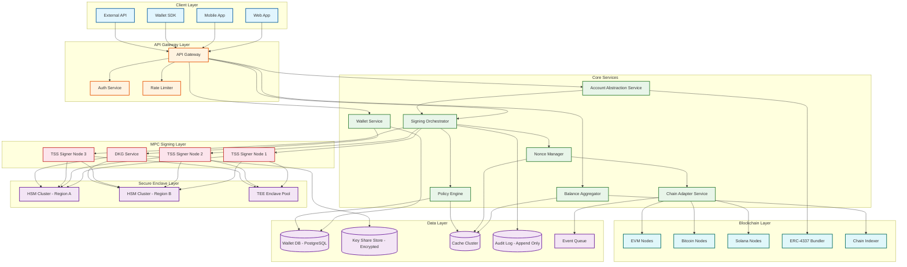
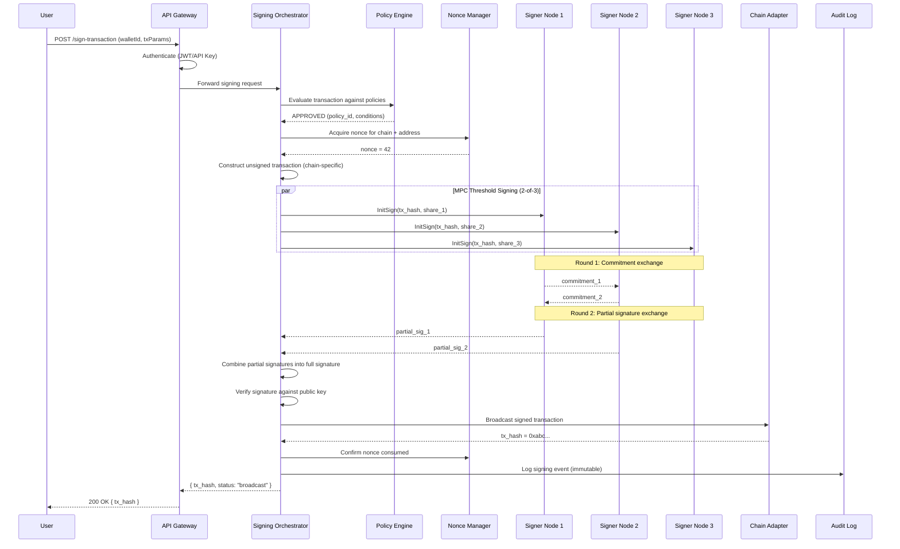
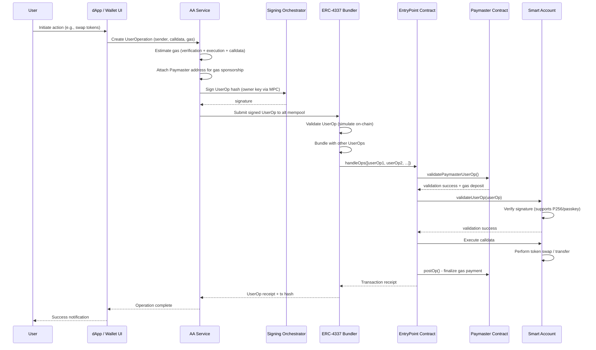
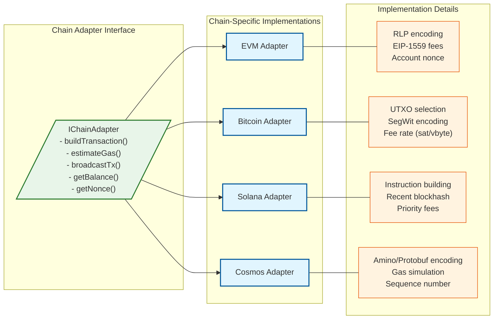

# High-Level Design

## System Architecture

---

## Data Flow: Transaction Signing (MPC Path)

---

## Data Flow: Account Abstraction (ERC-4337 Path)

---

## Key Architectural Decisions

### 1. Wallet Custody Model Selection

| Model | How Keys Are Managed | Trust Assumption | Best For |
|-------|---------------------|------------------|----------|
| **Custodial** | Platform holds complete private keys in HSM | User trusts platform completely | Novice users, regulatory compliance, exchange wallets |
| **Non-Custodial** | User holds keys on device or hardware wallet | Platform has zero access to keys | Privacy-focused users, DeFi power users |
| **Hybrid MPC** | Key split into shares: user device + platform server + backup | No single party holds complete key | Enterprise custody, retail wallet apps, institutional |

**Decision: Hybrid MPC as the primary model** with support for custodial (institutional clients with regulatory requirements) and non-custodial (hardware wallet integration via WalletConnect).

**Justification:** MPC eliminates the single-point-of-compromise of custodial wallets and the single-point-of-loss of non-custodial wallets. A 2-of-3 threshold means: (a) if the user loses their device, the platform + backup share can recover, (b) if the platform is compromised, the attacker cannot sign without the user's share, (c) if the backup is compromised, signing still requires user + platform cooperation.

### 2. MPC Protocol Selection

| Protocol | Rounds | Key Gen | Signing | Security Assumption |
|----------|--------|---------|---------|---------------------|
| GG18 | 8 rounds | Interactive DKG | Interactive TSS | DDH in random oracle model |
| GG20 | 4 rounds | Interactive DKG | Interactive TSS | Strong RSA + DDH |
| **MPC-CMP (Canetti-Makriyannis-Peled)** | **4 rounds** | **Efficient DKG** | **Pre-signing + online** | **CDH in standard model** |
| FROST | 2 rounds | Trusted dealer or DKG | 2-round TSS | Schnorr assumption |

**Decision: MPC-CMP** for ECDSA (EVM, Bitcoin) and **FROST** for Schnorr/Ed25519 (Solana, Cosmos).

**Justification:** MPC-CMP (used by Fireblocks) offers a pre-signing phase that moves most computation offline, reducing online signing to a single round of communication. This achieves < 200ms signing latency. FROST provides native 2-round signing for Schnorr-compatible chains.

### 3. Database Strategy

| Component | Database | Justification |
|-----------|----------|---------------|
| Wallet metadata | PostgreSQL | Relational queries for user-wallet-policy relationships |
| Key shares | Encrypted blob store + HSM | Key material never in general-purpose DB; encrypted at rest with HSM-managed keys |
| Nonce state | Redis (primary) + PostgreSQL (durable) | Redis for low-latency atomic increment; PostgreSQL for crash recovery |
| Transaction history | Time-series store | Append-heavy, time-range queries, chain-specific indexing |
| Policy rules | PostgreSQL + in-memory cache | Complex rule evaluation; cached for sub-10ms policy checks |
| Audit logs | Append-only log store | Immutable, hash-chained entries; compliance-grade retention |
| Balance cache | Redis | Multi-chain balance aggregation with TTL-based invalidation |

### 4. Synchronous vs. Asynchronous Communication

| Flow | Pattern | Justification |
|------|---------|---------------|
| MPC signing ceremony | Synchronous (gRPC streaming) | Interactive protocol requires real-time round-trip between signer nodes |
| Policy evaluation | Synchronous | Must complete before signing proceeds |
| Transaction broadcast | Asynchronous (fire-and-forget with callback) | Blockchain confirmation is inherently async; webhook on confirmation |
| Balance aggregation | Asynchronous (polling + cache) | Multi-chain queries aggregated periodically |
| Key refresh | Asynchronous (scheduled batch) | Non-latency-sensitive; can run during off-peak hours |
| Audit logging | Asynchronous (buffered write) | Fire-and-forget from hot path; guaranteed delivery via queue |

### 5. Multi-Chain Adapter Pattern

**Decision: Strategy pattern** with a common interface and chain-specific adapters.

**Justification:** Each blockchain has fundamentally different transaction models (account-based vs. UTXO), fee mechanisms (EIP-1559 vs. fee rate), and encoding formats. A unified interface abstracts these differences from the signing orchestrator while allowing chain-specific optimizations (UTXO consolidation, gas price oracles, priority fee estimation).

---

## Architecture Pattern Checklist

- [x] **Sync vs Async**: MPC signing is synchronous (interactive protocol); transaction broadcast and balance updates are asynchronous
- [x] **Event-driven vs Request-response**: Request-response for signing; event-driven for balance updates, confirmations, and policy change propagation
- [x] **Push vs Pull**: Pull for balance (polling + cache); push for transaction confirmations (webhooks)
- [x] **Stateless vs Stateful**: API gateway and policy engine are stateless; MPC signer nodes are stateful during a signing session (ephemeral state)
- [x] **Read-heavy vs Write-heavy**: Balance queries are 50x more frequent than signing operations; separate read and write paths
- [x] **Real-time vs Batch**: Signing is real-time; key refresh, balance aggregation, and compliance reporting are batch
- [x] **Edge vs Origin**: Passkey verification can happen on-device (edge); MPC signing requires origin servers with HSM access

---

## Component Responsibilities

| Component | Responsibility | Scaling Strategy |
|-----------|---------------|-----------------|
| **API Gateway** | Authentication, rate limiting, request routing | Horizontal; stateless |
| **Wallet Service** | CRUD for wallets, user-wallet mapping, configuration | Horizontal; shard by user_id |
| **Signing Orchestrator** | Coordinate MPC ceremony, construct transactions, manage signing sessions | Horizontal; session affinity via consistent hashing |
| **Policy Engine** | Evaluate transaction approval rules, multi-sig quorum | Horizontal; in-memory policy cache per instance |
| **MPC Signer Nodes** | Hold key shares, participate in DKG and TSS protocols | Fixed topology (one node per share location); vertical scaling within each |
| **Nonce Manager** | Atomic nonce acquisition, pending transaction tracking, gap detection | Single-writer per chain+address (partitioned) |
| **Chain Adapter** | Transaction construction, gas estimation, broadcast, balance query | Horizontal per chain; separate node pools per chain |
| **Balance Aggregator** | Multi-chain balance polling, caching, push updates | Horizontal; shard by wallet_id |
| **AA Service** | UserOp construction, Paymaster selection, bundler submission | Horizontal; stateless |
| **Audit Logger** | Immutable event recording, hash chaining, compliance queries | Append-only; partition by time |
