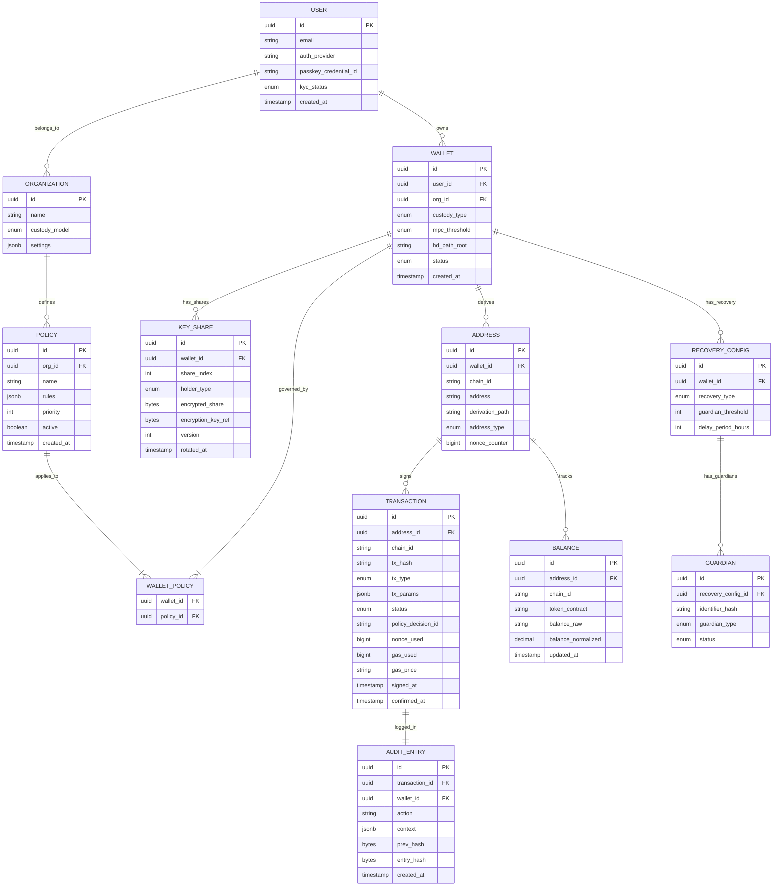

# Low-Level Design

## Data Model

### Entity Relationship Diagram



### Key Schema Details

**Key Share Storage** (encrypted, separate from main DB):

```
key_share:
  id: UUID
  wallet_id: UUID
  share_index: INT (1, 2, or 3 for 2-of-3)
  holder_type: ENUM(USER_DEVICE, PLATFORM_SERVER, BACKUP_ENCLAVE)
  encrypted_share: BYTES (AES-256-GCM encrypted)
  encryption_key_ref: STRING (HSM key identifier for share encryption key)
  share_version: INT (incremented on key refresh)
  public_verification_key: BYTES (for zero-knowledge share verification)
  created_at: TIMESTAMP
  rotated_at: TIMESTAMP
```

**Policy Rules (JSON Schema)**:

```
policy_rules:
  - type: "amount_limit"
    params:
      max_per_tx: "10000 USD"
      max_daily: "50000 USD"
      max_monthly: "500000 USD"
  - type: "address_whitelist"
    params:
      addresses: ["0x...", "0x..."]
      mode: "allow_only"
  - type: "multi_approval"
    params:
      threshold: 2
      approvers: ["user_1", "user_2", "user_3"]
      timeout_hours: 24
  - type: "velocity"
    params:
      max_tx_count: 10
      window_minutes: 60
  - type: "chain_restriction"
    params:
      allowed_chains: ["ethereum", "polygon", "arbitrum"]
```

### Indexing Strategy

| Table | Index | Type | Purpose |
|-------|-------|------|---------|
| `wallet` | `(user_id, status)` | B-tree | User's active wallets lookup |
| `address` | `(chain_id, address)` | B-tree, unique | Address resolution from chain events |
| `address` | `(wallet_id, chain_id)` | B-tree | All addresses for a wallet on a chain |
| `transaction` | `(address_id, signed_at DESC)` | B-tree | Transaction history per address |
| `transaction` | `(chain_id, tx_hash)` | B-tree, unique | Transaction lookup by hash |
| `transaction` | `(status, chain_id)` | B-tree, partial | Pending transaction monitoring |
| `key_share` | `(wallet_id, share_version)` | B-tree | Current share version lookup |
| `audit_entry` | `(wallet_id, created_at)` | B-tree | Compliance audit queries |
| `balance` | `(address_id, chain_id, token_contract)` | B-tree, unique | Balance lookup |

### Partitioning Strategy

| Table | Partition Key | Strategy | Justification |
|-------|--------------|----------|---------------|
| `transaction` | `signed_at` (monthly) | Range partitioning | Time-range queries for history; older partitions archived |
| `audit_entry` | `created_at` (monthly) | Range partitioning | Compliance queries are time-bounded; 7-year retention with cold archive |
| `balance` | `chain_id` | List partitioning | Chain-specific balance updates don't cross partitions |
| `address` | `wallet_id` hash | Hash partitioning | Even distribution; co-located with wallet data |

---

## API Design

### Transaction Signing API

```
POST /v1/wallets/{wallet_id}/sign
Authorization: Bearer {jwt_token}
Idempotency-Key: {uuid}
Content-Type: application/json

Request:
{
  "chain": "ethereum",
  "transaction": {
    "to": "0x742d35Cc6634C0532925a3b844Bc9e7595f2bD18",
    "value": "1000000000000000000",       // 1 ETH in wei
    "data": "0xa9059cbb...",               // ERC-20 transfer calldata
    "gas_limit": 65000,
    "max_fee_per_gas": "30000000000",      // 30 gwei
    "max_priority_fee": "2000000000"       // 2 gwei
  },
  "note": "Payment to vendor"
}

Response (200 OK):
{
  "id": "txn_abc123",
  "wallet_id": "wlt_xyz789",
  "chain": "ethereum",
  "tx_hash": "0xdef456...",
  "status": "broadcast",
  "nonce": 42,
  "signed_at": "2026-03-09T14:30:00Z",
  "policy_decision": {
    "id": "pol_dec_001",
    "result": "approved",
    "rules_evaluated": 3,
    "approvals_required": 0
  }
}

Response (202 Accepted - Multi-approval required):
{
  "id": "txn_abc123",
  "status": "pending_approval",
  "policy_decision": {
    "result": "pending",
    "approvals_received": 1,
    "approvals_required": 2,
    "approvers_pending": ["user_2", "user_3"],
    "expires_at": "2026-03-10T14:30:00Z"
  }
}
```

### UserOperation (ERC-4337) API

```
POST /v1/wallets/{wallet_id}/user-operations
Authorization: Bearer {jwt_token}

Request:
{
  "chain": "ethereum",
  "calls": [
    {
      "to": "0xTokenContract...",
      "data": "0xapprove...",
      "value": "0"
    },
    {
      "to": "0xDEXRouter...",
      "data": "0xswap...",
      "value": "0"
    }
  ],
  "paymaster": {
    "type": "sponsored",          // or "erc20" for token payment
    "sponsor_policy_id": "sp_001"
  }
}

Response (200 OK):
{
  "user_op_hash": "0xuop789...",
  "tx_hash": "0xbundle_tx...",
  "status": "bundled",
  "gas_sponsored": true,
  "gas_cost_usd": "0.42",
  "calls_executed": 2
}
```

### Wallet Creation API

```
POST /v1/wallets
Authorization: Bearer {jwt_token}

Request:
{
  "name": "Treasury Wallet",
  "custody_type": "mpc",
  "mpc_config": {
    "threshold": 2,
    "total_shares": 3,
    "share_holders": [
      { "type": "user_device", "device_id": "dev_001" },
      { "type": "platform_server" },
      { "type": "backup_enclave" }
    ]
  },
  "chains": ["ethereum", "bitcoin", "solana"],
  "policies": ["pol_default_001"]
}

Response (201 Created):
{
  "id": "wlt_new123",
  "name": "Treasury Wallet",
  "custody_type": "mpc",
  "status": "active",
  "addresses": {
    "ethereum": "0x1234...abcd",
    "bitcoin": "bc1q5678...efgh",
    "solana": "4rJ2K...9pQm"
  },
  "mpc_config": {
    "threshold": 2,
    "total_shares": 3,
    "key_version": 1
  }
}
```

### Balance Query API

```
GET /v1/wallets/{wallet_id}/balances?chains=ethereum,solana&include_tokens=true
Authorization: Bearer {jwt_token}

Response (200 OK):
{
  "wallet_id": "wlt_xyz789",
  "total_usd": "125430.50",
  "balances": [
    {
      "chain": "ethereum",
      "address": "0x1234...",
      "native": { "symbol": "ETH", "balance": "10.5", "usd": "42000.00" },
      "tokens": [
        { "contract": "0xA0b8...", "symbol": "USDC", "balance": "50000", "usd": "50000.00" }
      ]
    },
    {
      "chain": "solana",
      "address": "4rJ2K...",
      "native": { "symbol": "SOL", "balance": "200", "usd": "33430.50" }
    }
  ],
  "cached_at": "2026-03-09T14:29:55Z",
  "freshness": "5s"
}
```

### Idempotency Strategy

| Endpoint | Idempotency Key | Behavior |
|----------|----------------|----------|
| `POST /sign` | `Idempotency-Key` header (UUID) | Return cached result if key seen within 24h; prevents double-signing |
| `POST /wallets` | `Idempotency-Key` header | Return existing wallet if DKG already completed for this key |
| `POST /user-operations` | `Idempotency-Key` header | Return existing UserOp if already submitted to bundler |
| `POST /approve` | `(tx_id, approver_id)` composite | Idempotent by nature; re-approval is no-op |

### Rate Limiting

| Endpoint | Rate Limit | Justification |
|----------|-----------|---------------|
| `POST /sign` | 100/min per wallet | Prevent runaway signing from compromised API key |
| `POST /wallets` | 10/min per user | DKG is expensive; prevent abuse |
| `GET /balances` | 600/min per user | Allow frequent polling; served from cache |
| `POST /user-operations` | 50/min per wallet | Bundler submission rate limiting |

### API Versioning

**Strategy: URL path versioning** (`/v1/`, `/v2/`)

Justification: Crypto wallet APIs are consumed by embedded SDKs in mobile apps that may not update for months. Path versioning provides explicit version targeting, allows running multiple versions concurrently, and makes version deprecation visible in access logs.

---

## Core Algorithms

### Algorithm 1: Distributed Key Generation (DKG) Protocol

```
FUNCTION distributed_key_generation(threshold, total_parties):
    // Phase 1: Each party generates a random polynomial
    FOR each party P_i in [1..total_parties]:
        secret_i = RANDOM_SCALAR()
        polynomial_i = GENERATE_POLYNOMIAL(degree=threshold-1, constant=secret_i)
        commitments_i = [polynomial_i[j] * G for j in 0..threshold-1]
        BROADCAST(commitments_i)  // Feldman VSS commitments

    // Phase 2: Each party distributes shares to all other parties
    FOR each party P_i:
        FOR each party P_j (j != i):
            share_ij = EVALUATE_POLYNOMIAL(polynomial_i, j)
            SEND_ENCRYPTED(share_ij, TO=P_j)

    // Phase 3: Each party verifies received shares
    FOR each party P_j:
        FOR each share_ij received from P_i:
            expected = SUM(commitments_i[k] * (j^k) for k in 0..threshold-1)
            IF share_ij * G != expected:
                BROADCAST_COMPLAINT(P_i)
                ABORT_OR_RECONSTRUCT()

    // Phase 4: Each party computes their final key share
    FOR each party P_j:
        final_share_j = SUM(share_ij for all i)
        public_key = SUM(commitments_i[0] for all i)  // Combined public key

    RETURN (public_key, {final_share_1, ..., final_share_n})

// Time Complexity: O(n^2) communication rounds where n = total_parties
// Space Complexity: O(n * threshold) per party for polynomial coefficients
```

### Algorithm 2: MPC Threshold Signing (CMP Protocol - Simplified)

```
FUNCTION mpc_threshold_sign(message_hash, signing_parties, key_shares):
    // Pre-signing phase (can be done ahead of time)
    FOR each party P_i in signing_parties:
        k_i = RANDOM_SCALAR()           // Nonce share
        gamma_i = RANDOM_SCALAR()        // Randomness share
        K_i = k_i * G                    // Nonce commitment
        BROADCAST(K_i)

    // Round 1: Commitment and MtA (Multiplicative-to-Additive) conversion
    R = COMBINE_POINTS(K_1, K_2, ..., K_t)
    r = R.x_coordinate MOD curve_order

    FOR each pair (P_i, P_j):
        // MtA protocol: convert k_i * x_j to additive shares
        (alpha_ij, beta_ij) = MTA_PROTOCOL(k_i, x_j)
        // After MtA: alpha_ij + beta_ij = k_i * x_j

    // Round 2: Partial signature generation
    FOR each party P_i:
        sigma_i = k_i * message_hash + r * (SUM(alpha_ij) + k_i * x_i)
        sigma_i = sigma_i MOD curve_order
        BROADCAST(sigma_i)

    // Combine partial signatures
    s = SUM(sigma_i for all i in signing_parties) MOD curve_order

    signature = (r, s)

    // Verify before returning
    IF NOT VERIFY_ECDSA(public_key, message_hash, signature):
        ABORT("Signature verification failed - potential malicious party")

    RETURN signature

// Time Complexity: O(t^2) for t signing parties (dominated by MtA rounds)
// Space Complexity: O(t) per party
// Network: 2-4 rounds of interactive communication
```

### Algorithm 3: Nonce Management with Gap Prevention

```
FUNCTION acquire_nonce(chain_id, address):
    lock_key = "nonce:" + chain_id + ":" + address

    // Acquire distributed lock for this address
    ACQUIRE_LOCK(lock_key, ttl=30s)

    TRY:
        // Get highest committed nonce from local state
        local_nonce = CACHE_GET("nonce_counter:" + chain_id + ":" + address)

        IF local_nonce IS NULL:
            // Cold start: fetch from chain
            on_chain_nonce = CHAIN_ADAPTER.get_nonce(chain_id, address)
            pending_count = PENDING_TX_STORE.count(chain_id, address)
            local_nonce = on_chain_nonce + pending_count

        next_nonce = local_nonce + 1

        // Reserve nonce with TTL (prevent gaps from failed txns)
        CACHE_SET("nonce_counter:" + chain_id + ":" + address, next_nonce)
        PENDING_TX_STORE.add(chain_id, address, next_nonce, ttl=300s)

        RETURN next_nonce
    FINALLY:
        RELEASE_LOCK(lock_key)

FUNCTION handle_nonce_gap(chain_id, address):
    on_chain_nonce = CHAIN_ADAPTER.get_nonce(chain_id, address)
    pending_txns = PENDING_TX_STORE.get_all(chain_id, address)

    FOR each expected_nonce in range(on_chain_nonce, max(pending_txns)):
        IF expected_nonce NOT IN pending_txns:
            // Gap detected: submit zero-value self-transfer to fill gap
            filler_tx = BUILD_FILLER_TX(address, nonce=expected_nonce)
            SIGN_AND_BROADCAST(filler_tx)
            LOG_WARNING("Nonce gap filled", chain_id, address, expected_nonce)

// Time Complexity: O(1) for nonce acquisition; O(n) for gap detection where n = gap size
// Space Complexity: O(p) where p = number of pending transactions per address
```

### Algorithm 4: Policy Evaluation Engine

```
FUNCTION evaluate_policies(wallet_id, transaction, user_context):
    policies = LOAD_POLICIES(wallet_id)  // Ordered by priority
    decision = ALLOW
    conditions = []

    FOR each policy in policies (sorted by priority DESC):
        IF NOT policy.active:
            CONTINUE

        FOR each rule in policy.rules:
            result = EVALUATE_RULE(rule, transaction, user_context)

            SWITCH result.action:
                CASE DENY:
                    RETURN PolicyDecision(DENIED, rule.name, result.reason)
                CASE REQUIRE_APPROVAL:
                    conditions.APPEND(ApprovalCondition(
                        approvers=rule.params.approvers,
                        threshold=rule.params.threshold,
                        timeout=rule.params.timeout
                    ))
                CASE ALLOW:
                    CONTINUE

    IF conditions.length > 0:
        RETURN PolicyDecision(PENDING_APPROVAL, conditions)

    RETURN PolicyDecision(APPROVED)

FUNCTION evaluate_rule(rule, transaction, context):
    SWITCH rule.type:
        CASE "amount_limit":
            usd_value = PRICE_ORACLE.convert(transaction.value, transaction.chain)
            daily_total = VELOCITY_STORE.get_daily_total(context.wallet_id)
            IF usd_value > rule.params.max_per_tx:
                RETURN DENY("Exceeds per-transaction limit")
            IF daily_total + usd_value > rule.params.max_daily:
                RETURN REQUIRE_APPROVAL

        CASE "address_whitelist":
            IF transaction.to NOT IN rule.params.addresses:
                IF rule.params.mode == "deny_unlisted":
                    RETURN DENY("Destination not whitelisted")
                ELSE:
                    RETURN REQUIRE_APPROVAL

        CASE "velocity":
            tx_count = VELOCITY_STORE.get_count(
                context.wallet_id, window=rule.params.window_minutes
            )
            IF tx_count >= rule.params.max_tx_count:
                RETURN DENY("Velocity limit exceeded")

    RETURN ALLOW

// Time Complexity: O(P * R) where P = policies, R = rules per policy
// Space Complexity: O(1) per evaluation (stateless)
```

### Algorithm 5: Social Recovery via Guardians

```
FUNCTION initiate_recovery(wallet_id, new_owner_public_key):
    config = LOAD_RECOVERY_CONFIG(wallet_id)

    recovery_request = {
        id: GENERATE_UUID(),
        wallet_id: wallet_id,
        new_owner: new_owner_public_key,
        threshold: config.guardian_threshold,
        delay_period: config.delay_period_hours,
        approvals: [],
        status: PENDING,
        created_at: NOW(),
        executable_after: NOW() + config.delay_period_hours
    }

    STORE(recovery_request)
    NOTIFY_GUARDIANS(config.guardians, recovery_request)

    RETURN recovery_request.id

FUNCTION guardian_approve(recovery_id, guardian_id, signature):
    request = LOAD(recovery_id)
    guardian = VERIFY_GUARDIAN(guardian_id, request.wallet_id)

    // Verify guardian's signature over the recovery request
    IF NOT VERIFY_SIGNATURE(guardian.public_key, recovery_id + request.new_owner, signature):
        RETURN ERROR("Invalid guardian signature")

    request.approvals.APPEND({guardian_id, signature, timestamp: NOW()})

    IF request.approvals.length >= request.threshold:
        request.status = APPROVED_PENDING_DELAY
        SCHEDULE_EXECUTION(recovery_id, request.executable_after)

    STORE(request)

FUNCTION execute_recovery(recovery_id):
    request = LOAD(recovery_id)

    IF NOW() < request.executable_after:
        RETURN ERROR("Delay period not elapsed")

    IF request.status == CANCELLED:
        RETURN ERROR("Recovery was cancelled by current owner")

    // For MPC wallets: re-run DKG with new owner's device
    new_shares = DKG(threshold=2, parties=[
        new_owner_device,
        platform_server,
        backup_enclave
    ])

    // Deactivate old key shares
    DEACTIVATE_KEY_SHARES(request.wallet_id, reason="recovery")

    // Store new key shares
    STORE_KEY_SHARES(request.wallet_id, new_shares, version=current+1)

    request.status = EXECUTED
    STORE(request)
    AUDIT_LOG("wallet_recovered", request)

// The delay period allows the legitimate owner to cancel a fraudulent recovery
```
