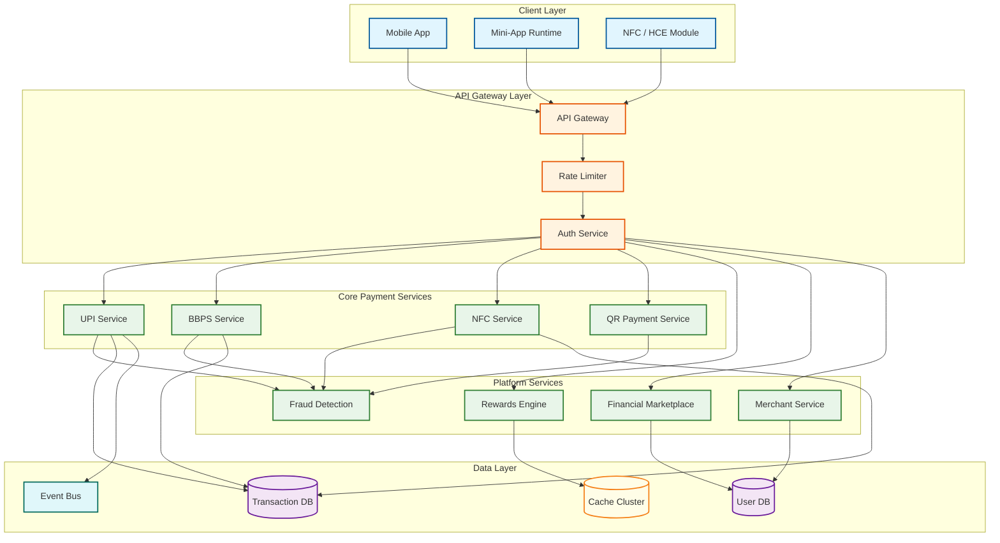
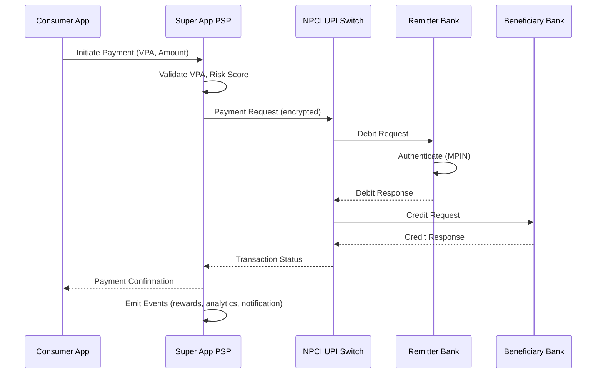

# Super App Payment Platform System Design

## System Overview

A Super App Payment Platform---exemplified by GPay, PhonePe, and Paytm in India, and WeChat Pay and GrabPay in Southeast Asia---is a single mobile application that consolidates payments, financial services, and an entire merchant ecosystem into one unified platform. Unlike standalone payment apps that handle a single payment rail, a super app orchestrates dozens of payment methods, financial products, and third-party mini-apps under a single user identity, creating network effects where each new service increases the stickiness of the entire platform. The core engineering challenges span multiple domains:

1. **UPI Third-Party Processor (TPP) Architecture** --- The app acts as a frontend to NPCI's UPI switch, managing VPA handles (@gpay, @ybl, @paytm), routing transactions through sponsor banks, and handling PSP (Payment Service Provider) responsibilities including device binding, MPIN management, and multi-bank account linking.

2. **Bill Payment Aggregation (BBPS)** --- Integration with Bharat BillPay's central unit for 20,000+ billers across categories such as electricity, telecom, DTH, insurance, municipal taxes, and water with real-time bill fetch, payment confirmation, and T+1 settlement.

3. **NFC Contactless and Tap-to-Pay** --- Host Card Emulation (HCE) for cardless NFC payments, tokenization via card networks, and navigating Secure Element vs HCE trade-offs for secure, sub-second contactless transactions.

4. **Rewards and Cashback Engine** --- A points economy with configurable earn/burn rules, gamified engagement through scratch cards, streaks, and referral chains, and cashback budget management with real-time constraint enforcement to prevent over-disbursement.

5. **AI-Driven Fraud Detection** --- Real-time ML risk scoring for every transaction, behavioral biometrics analysis, device fingerprinting, and graph-based fraud ring detection operating within a 100ms latency budget.

6. **Multi-Bank Integration** --- Account Aggregation (AA) framework supporting balance checks, statement fetches, consent management, and seamless switching between linked bank accounts.

7. **Merchant Ecosystem** --- QR code payments (both static and dynamic), POS SDKs for offline merchants, online checkout widgets, merchant settlements, and real-time analytics.

8. **Financial Services Marketplace** --- Embedded finance products including pre-approved personal loans, insurance policies, mutual fund SIP investments, and digital gold---all with in-app origination, KYC, and lifecycle tracking.

9. **Mini-App/Applet Framework** --- Third-party services running within the super app's sandboxed environment, with resource isolation, permission management, and a discovery marketplace.

The result is a platform that functions simultaneously as a payment processor, a financial marketplace, a merchant acquirer, and an application runtime---all operating at nation-scale with sub-second latency requirements.

---

## Key Characteristics

| Characteristic | Description |
|---------------|-------------|
| **Read/Write Pattern** | Mixed---write-heavy for transactions (P2P, P2M, bill payments); read-heavy for balance checks, transaction history, merchant discovery, and rewards status |
| **Latency Sensitivity** | Very High---UPI transactions must complete in < 2s end-to-end; NFC tap-to-pay must respond in < 500ms; bill fetch must return in < 3s |
| **Consistency Model** | Strong consistency for financial transactions and ledger entries; eventual consistency for rewards, recommendations, and analytics |
| **Data Volume** | Very High---20B+ UPI transactions/month at scale; 500M+ registered users; petabytes of transaction history and behavioral data |
| **Architecture Model** | Event-driven microservices with saga orchestration for payment flows; mini-app sandbox with containerized isolation; CQRS for read-heavy paths |
| **Regulatory Burden** | High---RBI guidelines for UPI/PPI, NPCI compliance, BBPS operating unit rules, KYC/AML mandates, data localization requirements |
| **Complexity Rating** | **Very High** |

---

## Quick Navigation

| Document | Description |
|----------|-------------|
| [01 - Requirements & Estimations](./01-requirements-and-estimations.md) | Functional/non-functional requirements, capacity planning, SLOs |
| [02 - High-Level Design](./02-high-level-design.md) | Architecture diagrams, data flow, key decisions |
| [03 - Low-Level Design](./03-low-level-design.md) | Data models, API design, algorithms (pseudocode) |
| [04 - Deep Dive & Bottlenecks](./04-deep-dive-and-bottlenecks.md) | UPI routing deep dive, NFC tokenization, reward constraint enforcement |
| [05 - Scalability & Reliability](./05-scalability-and-reliability.md) | Scaling strategies, fault tolerance, disaster recovery |
| [06 - Security & Compliance](./06-security-and-compliance.md) | Threat model, UPI security, data privacy, fraud prevention |
| [07 - Observability](./07-observability.md) | Metrics, logging, tracing, alerting, SLI/SLO dashboards |
| [08 - Interview Guide](./08-interview-guide.md) | 45-min pacing, trade-offs, trap questions, scoring rubric |
| [09 - Insights](./09-insights.md) | Key architectural insights, patterns, lessons |

---

## What Differentiates This from Related Systems

| Aspect | Super App (This) | Digital Wallet | Payment Gateway | Neobank | Traditional Bank App |
|--------|-----------------|----------------|-----------------|---------|---------------------|
| **Payment Rails** | All rails---UPI, NFC, BBPS, cards, wallets, QR; acts as an aggregator of aggregators | Single stored-value wallet; limited rail diversity | Routes card/bank transactions for merchants; no consumer-facing app | Banking rails with modern UX; single institution | Own bank's rails only; limited interoperability |
| **User Relationship** | Primary financial interface; handles identity, payments, and services in one app | Transaction-focused; limited beyond payments | No direct consumer relationship; merchant-facing | Bank account holder; full banking relationship | Existing bank customers only |
| **Merchant Integration** | QR codes (static/dynamic), POS SDK, checkout widget, mini-app commerce | Basic merchant payments via wallet transfer | Deep merchant integration via APIs and SDKs | Limited merchant ecosystem; focuses on consumer banking | Branch-centric; limited digital merchant tools |
| **Financial Services** | Embedded marketplace---loans, insurance, mutual funds, gold as in-app features | None or minimal; focused on stored value | None; pure payment routing | Core banking products (savings, cards, loans) | Full banking suite but siloed experience |
| **Platform Extensibility** | Mini-app framework; third-party services run inside the app sandbox | Closed ecosystem; no third-party extension | Merchant plugins only | Limited partner integrations | No extensibility; monolithic app |
| **Revenue Model** | Transaction fees, merchant MDR, financial product commissions, advertising, mini-app platform fees | Float income, MDR, limited fees | Processing fees per transaction | Interchange, interest income, subscription fees | Interest spread, account fees, branch operations |
| **Scale Characteristics** | 500M+ users, 700M+ daily transactions, 30M+ merchants | 50--200M users, moderate transaction volume | Millions of merchants, variable transaction volume | 5--20M users, moderate transaction volume | Varies widely; legacy infrastructure limits scale |

---

## What Makes This System Unique

1. **Multi-Rail Payment Orchestration at National Scale**: Unlike payment gateways that route through card networks or wallets that manage stored value, a super app must simultaneously orchestrate UPI, NFC, BBPS, card tokenization, and wallet transactions---each with different protocols, timeout behaviors, settlement cycles, and failure recovery mechanisms. The routing layer must dynamically select the optimal rail based on success rates, latency, cost, and user preference, while maintaining a consistent experience across all rails.

2. **PSP Responsibilities Create a Regulatory Surface Area**: As a UPI Third-Party Processor, the super app takes on Payment Service Provider obligations---device binding, MPIN lifecycle, complaint handling, and transaction dispute resolution. This is not just a technical integration; it creates regulatory accountability where the platform is responsible for transaction security even though the actual funds move between banks the platform does not control.

3. **Mini-App Runtime as a Platform-Within-a-Platform**: The mini-app framework effectively makes the super app an operating system for third-party services. This requires a sandboxed execution environment with memory limits, API permission scoping, and resource isolation---ensuring that a misbehaving mini-app cannot degrade the core payment experience. The framework must also handle mini-app discovery, ranking, and lifecycle management at scale.

4. **Reward Budget as a Distributed Consensus Problem**: Cashback campaigns with fixed budgets (e.g., "first 1M users get 50 INR cashback") require real-time budget decrement across distributed nodes---making it effectively a distributed counter with financial consequences for over-counting. The system must guarantee that total disbursals never exceed the campaign budget, even under race conditions during peak traffic.

5. **Financial Services Marketplace with Regulatory Partitioning**: Embedding lending, insurance, and investment products within a payment app requires careful architectural boundaries. Each financial product has different regulatory requirements (RBI for lending, IRDAI for insurance, SEBI for mutual funds), and the platform must maintain clear data boundaries, consent flows, and audit trails for each product category while presenting a seamless user experience.

6. **Dual-Sided Network Effects with Three-Way Dependencies**: The platform creates value through a three-way network: consumers attract merchants, merchants attract consumers, and both attract financial service partners. The system must optimize all three sides simultaneously---a merchant settlement delay impacts consumer trust, which impacts financial partner willingness to offer products.

---

## Quick Reference: Scale Numbers

| Metric | Value | Notes |
|--------|-------|-------|
| Registered users | ~500M | Across all linked bank accounts and KYC tiers |
| Monthly active users | ~200M | Users with at least one transaction or app session |
| Daily UPI transactions | ~700M | At PhonePe/GPay scale; includes P2P and P2M |
| Peak TPS | ~15,000 | Sustained during festival peaks (Diwali, New Year) |
| Burst TPS | ~50,000 | Flash cashback campaigns and New Year midnight spike |
| Bill payment categories | 20,000+ billers | Electricity, telecom, insurance, municipal taxes, etc. |
| Active merchant QR codes | ~30M | Static and dynamic QR codes across India |
| Reward/cashback disbursals per day | ~50M | Scratch cards, cashback credits, referral bonuses |
| NFC tap-to-pay transactions/day | ~5M | Growing at ~30% quarter-over-quarter |
| Monthly financial services originations | ~2M | Pre-approved loans, mutual fund SIPs, insurance policies |
| Mini-apps hosted | ~500+ | Travel, food delivery, shopping, utilities, and more |
| Average transaction value (UPI) | ~1,200 INR | Varies significantly between P2P (~2,000 INR) and P2M (~500 INR) |
| Daily bill payments | ~20M | ~10% of active users pay a bill on any given day |
| Push notifications sent per day | ~500M | Transaction confirmations, offers, reminders |
| App sessions per user per day | ~4.5 | High engagement driven by payments + discovery |
| VPA handles managed | ~800M | Multiple VPAs per user across different sponsor banks |
| Linked bank accounts | ~600M | Average 1.2 accounts per active user |
| Daily merchant settlements | ~30M | Individual settlement records to merchant accounts |
| Fraud alerts generated per day | ~500K | ML-flagged transactions requiring review or blocking |

---

## Architecture Overview (Conceptual)

---

## Key Trade-Offs in Super App Design

| Trade-Off | Option A | Option B | This System's Choice |
|-----------|----------|----------|---------------------|
| **Wallet vs Pass-Through** | Maintain stored-value wallet (pre-loaded balance) | Pure pass-through to bank accounts via UPI | Hybrid: UPI as primary rail with optional wallet for micro-transactions and cashback credits |
| **NFC: Secure Element vs HCE** | Secure Element (hardware-backed, higher security) | Host Card Emulation (software-based, wider device support) | HCE with cloud-based tokenization; SE reserved for high-value transactions on supported devices |
| **Mini-App Isolation** | Full containerized isolation (stronger security, higher resource cost) | Shared runtime with permission scoping (lighter, faster launch) | Containerized for payment-handling mini-apps; shared runtime for read-only/display mini-apps |
| **Fraud Scoring: Inline vs Async** | Inline scoring blocks transaction until risk score is computed | Async scoring allows transaction and reverses if flagged | Inline for all transactions; 100ms budget enforced via pre-computed feature store and model caching |
| **Reward Consistency** | Strong consistency (no over-disbursal, higher latency) | Eventual consistency (faster, risk of slight over-spend) | Strong consistency with distributed budget counters; small over-spend tolerance (0.1%) during extreme bursts |
| **Settlement Frequency** | Real-time settlement (expensive, complex reconciliation) | Batch settlement (T+1, simpler, lower cost) | T+0 for large merchants (> 1000 txns/day); T+1 batch for smaller merchants |
| **Multi-Bank Routing** | Fixed sponsor bank per VPA handle | Dynamic routing based on success rate and latency | Dynamic routing with fallback; each VPA handle has a primary sponsor bank but can route through alternates during outages |

---

## UPI Transaction Flow (Simplified)

---

## Related Designs

| Design | Relevance |
|--------|-----------|
| [8.2 - Stripe/Razorpay](../8.2-stripe-razorpay/) | Payment orchestration, idempotency patterns, merchant onboarding |
| [8.4 - Digital Wallet](../8.4-digital-wallet/) | Ledger patterns, double-entry bookkeeping, stored-value management |
| [8.5 - Fraud Detection System](../8.5-fraud-detection-system/) | ML-based risk scoring, feature stores, real-time fraud assessment |
| [8.6 - Core Banking System](../8.6-core-banking-system/) | Account management, multi-bank integration, settlement flows |

---

## Sources

- NPCI --- UPI Product & Technical Specifications (2.0)
- NPCI --- Bharat BillPay System (BBPS) Operating Procedures
- NPCI --- UPI AutoPay and Mandate Management Specifications
- PhonePe Engineering Blog --- Scaling UPI to 700M Daily Transactions
- Google Pay India --- Architecture and Infrastructure at Scale
- WeChat Mini Programs --- Technical Architecture and Sandboxing Model
- GrabPay --- Building a Super App Payment Platform in Southeast Asia
- RBI --- Guidelines on Regulation of Payment Aggregators and Payment Gateways
- RBI --- Master Direction on Prepaid Payment Instruments (PPIs)
- EMVCo --- Host Card Emulation (HCE) Architecture Specification
- Sahamati --- Account Aggregator Ecosystem Technical Standards
- IRDAI --- Guidelines on Insurance Distribution through Digital Platforms
- SEBI --- Regulations on Mutual Fund Distribution via Digital Channels
