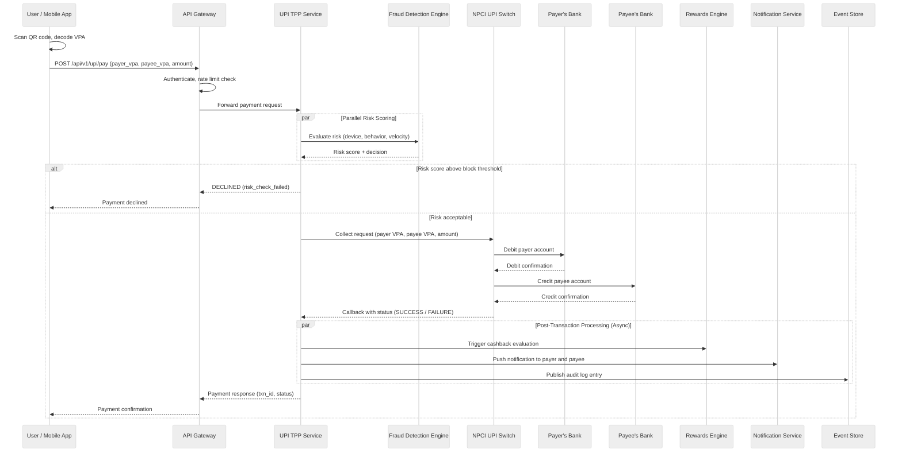
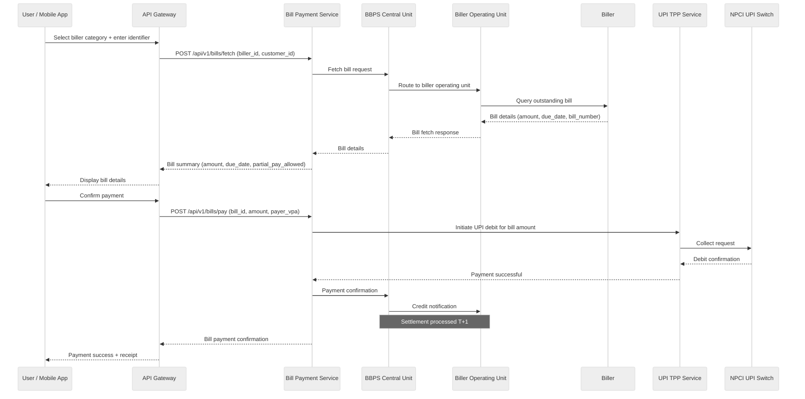

# High-Level Design

## Architecture Overview

The Super App Payment Platform is decomposed into seven logical layers: **Client Layer** (mobile app with UPI SDK, NFC module, mini-app runtime, push notification handler), **API Gateway Layer** (authentication, rate limiting, request routing), **Core Payment Services** (UPI TPP, bill payments, NFC/tap-to-pay, P2P transfers), **Platform Services** (rewards engine, fraud detection, merchant management, mini-app platform, financial services marketplace), **Integration Layer** (NPCI UPI switch, BBPS central unit, card networks, bank APIs, account aggregator), **Data Layer** (sharded transaction DB, user profiles, merchant DB, rewards ledger, event store), and **Infrastructure** (message queue, cache cluster, push notifications, CDN). The architecture uses a hybrid event-driven and request-response pattern: synchronous flows for latency-critical payment paths (UPI, NFC tap) and asynchronous processing for rewards evaluation, notifications, analytics, and reconciliation.

---

## System Architecture Diagram

```mermaid
%%{init: {'theme': 'neutral'}}%%
flowchart TB
    subgraph Clients["Client Layer"]
        MA[Mobile App - Android/iOS]
        UPI_SDK[UPI SDK]
        NFC_MOD[NFC Module]
        MINI_RT[Mini-App Runtime]
        PUSH_H[Push Notification Handler]
    end

    subgraph Gateway["API Gateway Layer"]
        AG[API Gateway]
        RL[Rate Limiter]
        AUTH[Auth Service]
        RR[Request Router]
    end

    subgraph CorePayment["Core Payment Services"]
        UPI_SVC[UPI TPP Service]
        BILL_SVC[Bill Payment Service]
        NFC_SVC[NFC / Tap-to-Pay Service]
        P2P_SVC[P2P Transfer Service]
    end

    subgraph Platform["Platform Services"]
        REWARD[Rewards Engine]
        FRAUD[Fraud Detection Engine]
        MERCH[Merchant Service]
        MINI_P[Mini-App Platform]
        FIN_MKT[Financial Services Marketplace]
    end

    subgraph Integration["Integration Layer"]
        NPCI[NPCI UPI Switch]
        BBPS[BBPS Central Unit]
        CARD_GW[Card Network Gateway]
        BANK_API[Bank APIs - IMPS/NEFT]
        AA[Account Aggregator]
    end

    subgraph Data["Data Layer"]
        TXN_DB[(Transaction DB - Sharded)]
        USER_DB[(User Profile DB)]
        MERCH_DB[(Merchant DB)]
        REWARD_DB[(Rewards Ledger)]
        EVT_STORE[(Event Store)]
    end

    subgraph Infra["Infrastructure"]
        MQ[[Message Queue]]
        CACHE[(Cache Cluster)]
        PUSH_SVC[Push Notification Service]
        CDN[CDN]
    end

    MA --> UPI_SDK & NFC_MOD & MINI_RT
    MA --> AG
    AG --> RL & AUTH & RR
    RR --> UPI_SVC & BILL_SVC & NFC_SVC & P2P_SVC
    RR --> REWARD & MERCH & MINI_P & FIN_MKT

    UPI_SVC --> FRAUD
    NFC_SVC --> FRAUD
    P2P_SVC --> FRAUD

    UPI_SVC --> NPCI
    BILL_SVC --> BBPS
    NFC_SVC --> CARD_GW
    P2P_SVC --> BANK_API
    FIN_MKT --> AA

    UPI_SVC & BILL_SVC & NFC_SVC & P2P_SVC --> TXN_DB
    UPI_SVC & P2P_SVC --> USER_DB
    MERCH --> MERCH_DB
    REWARD --> REWARD_DB

    UPI_SVC & BILL_SVC & NFC_SVC & P2P_SVC --> MQ
    MQ --> REWARD & EVT_STORE & PUSH_SVC
    PUSH_SVC --> PUSH_H

    UPI_SVC & NFC_SVC --> CACHE
    CDN --> MINI_RT

    classDef client fill:#e1f5fe,stroke:#01579b,stroke-width:2px
    classDef gateway fill:#fff3e0,stroke:#e65100,stroke-width:2px
    classDef service fill:#e8f5e9,stroke:#2e7d32,stroke-width:2px
    classDef platform fill:#fffde7,stroke:#f57f17,stroke-width:2px
    classDef data fill:#f3e5f5,stroke:#6a1b9a,stroke-width:2px
    classDef infra fill:#e0f7fa,stroke:#00695c,stroke-width:2px

    class MA,UPI_SDK,NFC_MOD,MINI_RT,PUSH_H client
    class AG,RL,AUTH,RR gateway
    class UPI_SVC,BILL_SVC,NFC_SVC,P2P_SVC service
    class REWARD,FRAUD,MERCH,MINI_P,FIN_MKT platform
    class NPCI,BBPS,CARD_GW,BANK_API,AA infra
    class TXN_DB,USER_DB,MERCH_DB,REWARD_DB,EVT_STORE,CACHE data
    class MQ,PUSH_SVC,CDN infra
```

---

## Data Flow: UPI Payment (P2M)

---

## Data Flow: Bill Payment (BBPS)

---

## Key Design Decisions

### 1. Microservices over Monolith

| Option | Pros | Cons |
|--------|------|------|
| **Microservices** (chosen) | Independent scaling for 15+ domains (UPI, bills, NFC, rewards, merchants); team autonomy; isolated failure blast radius | Distributed system complexity; inter-service latency; operational overhead |
| Monolith | Simpler deployment; lower latency for intra-process calls; easier debugging | Scaling bottleneck when UPI peaks at 10x bill payment traffic; single deployment blocks all teams; any failure takes down entire platform |

**Decision**: Microservices decomposition aligned to business domains. UPI, NFC, bill payments, rewards, and merchant management each scale independently. UPI service scales horizontally to handle festival-season spikes without over-provisioning the bill payment service.

### 2. Event-Driven + Request-Response Hybrid

| Option | Pros | Cons |
|--------|------|------|
| **Hybrid** (chosen) | Sync for latency-critical payment paths (< 2s SLO); async for eventual consistency in rewards, notifications, analytics | Dual communication pattern adds complexity; requires both RPC framework and message queue |
| Pure event-driven | Loose coupling; natural audit trail; easy to add consumers | Unsuitable for payment flows where user waits for confirmation; complex error handling |
| Pure request-response | Simple mental model; immediate error propagation | Tight coupling; reward calculation blocking payment response; notification failures affecting payment latency |

**Decision**: Synchronous request-response for payment initiation through settlement confirmation. Asynchronous event-driven for post-transaction processing: rewards evaluation, push notifications, analytics ingestion, fraud model retraining data, and reconciliation. Every transaction emits domain events to the event store.

### 3. Polyglot Persistence

| Option | Pros | Cons |
|--------|------|------|
| **Polyglot persistence** (chosen) | Each data store optimized for its access pattern; relational ACID for transactions; wide-column for user activity timelines; document store for merchant profiles; time-series for metrics | Operational overhead of managing multiple database engines; cross-store queries require application-level joins |
| Single relational DB | Uniform querying; ACID everywhere; simpler operations | Poor fit for time-series metrics and activity feeds; scaling limits; schema rigidity for merchant profiles |

**Decision**: Relational database (sharded) for transactions and financial records requiring ACID. Wide-column store for user activity feeds and transaction history reads. Document store for merchant profiles with varied schemas. Time-series database for system metrics and fraud detection signals.

### 4. CQRS for Transaction History

| Option | Pros | Cons |
|--------|------|------|
| **CQRS** (chosen) | Write path optimized for append-only transaction inserts; read path uses denormalized materialized views for instant history rendering; independent scaling | Eventual consistency between write and read models (sub-second lag acceptable for history); additional infrastructure |
| Single model | Simpler architecture; strong consistency | Read-heavy transaction history queries (user checking passbook) compete with write-heavy payment processing; index bloat |

**Decision**: Write to normalized transaction tables optimized for insert throughput and ACID guarantees. Asynchronously project into denormalized materialized views partitioned by user_id for fast passbook-style reads. Acceptable lag: under 2 seconds for history to reflect a completed transaction.

### 5. Saga Pattern for Cross-Service Transactions

| Option | Pros | Cons |
|--------|------|------|
| **Choreography-based saga** (chosen) | No central coordinator bottleneck; each service reacts to events; natural fit for payment + reward + notification flow | Harder to trace full saga; requires compensating transactions for rollback |
| Orchestrator saga | Central visibility; easier to reason about flow | Orchestrator becomes bottleneck and single point of failure at super-app scale |
| Distributed transactions (2PC) | Strong consistency | Unacceptable latency; locks across services; poor availability under partition |

**Decision**: Choreography-based saga for cross-service flows. Example: UPI payment success event triggers reward evaluation; if reward credit fails, a compensation event reverses the pending reward. Each service publishes outcome events that downstream services consume idempotently.

### 6. Edge-First for NFC Payments

| Option | Pros | Cons |
|--------|------|------|
| **Edge-first with pre-computed tokens** (chosen) | Sub-500ms tap-to-done latency; works in weak connectivity; tokenized credentials cached on device | Token refresh complexity; secure element integration varies by device; limited offline transaction amount |
| Server-first NFC | Simpler architecture; real-time risk check | 1-3 second latency unacceptable for tap-to-pay; fails without connectivity |

**Decision**: Pre-compute tokenized card credentials and cache them in the device's secure element. NFC tap uses the local token for authorization, with the terminal forwarding to the card network. Server reconciliation happens asynchronously. Offline cap limits exposure for transactions processed without real-time fraud check.

---

## Data Flow Summary

| Flow | Source | Destination | Pattern | Volume |
|------|--------|-------------|---------|--------|
| UPI P2M payment | Mobile App | UPI TPP → NPCI → Banks | Sync request-response | 12,000 peak TPS |
| UPI P2P transfer | Mobile App | P2P Service → NPCI → Banks | Sync request-response | 3,500 peak TPS |
| Bill payment (BBPS) | Mobile App | Bill Service → BBPS → Biller | Sync request-response | 800 peak TPS |
| NFC tap payment | NFC Module | NFC Service → Card Network | Sync (sub-500ms SLO) | 2,000 peak TPS |
| Reward evaluation | Event Store | Rewards Engine → Rewards Ledger | Async event-driven | 18,000 events/sec |
| Push notification | Notification Service | Mobile App | Async fire-and-forget | 25,000/sec peak |
| Fraud scoring | Payment Services | Fraud Detection Engine | Sync (inline with payment) | 18,300 peak TPS |
| Merchant settlement | Settlement Scheduler | Bank APIs (NEFT/IMPS) | Batch (daily) | 2M merchants/day |
| Mini-app launch | Mobile App | Mini-App Platform → CDN | Sync + CDN cached | 5,000 peak TPS |
| Transaction history | Mobile App | Read-optimized views (CQRS) | Sync read | 20,000 peak TPS |

---

## Architecture Pattern Checklist

| Pattern | Applied | Justification |
|---------|---------|---------------|
| Microservices | Yes | 15+ independent domains with different scaling profiles; UPI peaks at 12K TPS while bills peak at 800 TPS |
| API Gateway | Yes | Single entry point for rate limiting (per-user, per-API), JWT authentication, request routing, and API versioning |
| Event-Driven Architecture | Yes | Post-transaction workflows (rewards, notifications, analytics) decoupled via message queue; event store provides audit trail |
| CQRS | Yes | Separate write-optimized transaction tables from read-optimized passbook views; independent scaling of read and write paths |
| Saga Pattern | Yes | Cross-service consistency for payment + reward + notification flows via choreography-based sagas with compensating transactions |
| Circuit Breaker | Yes | Protects against NPCI switch downtime, bank API failures, and BBPS outages; graceful degradation with cached responses where applicable |
| Bulkhead Isolation | Yes | Each payment type (UPI, NFC, bills, P2P) has isolated thread pools and connection pools; NFC failure does not degrade UPI |
| Cache-Aside | Yes | VPA resolution cached at two levels (local 10s TTL, distributed 5min TTL); merchant profiles cached; reward campaign rules cached |
| Polyglot Persistence | Yes | Relational for transactions, wide-column for activity feeds, document store for merchant profiles, time-series for metrics |
| Edge Computing | Yes | NFC tokens pre-computed and cached in device secure element for sub-500ms tap latency; works in weak connectivity |
| Idempotency | Yes | Client-generated transaction IDs as idempotency keys; all payment APIs are idempotent to handle network retries safely |
| Blue-Green Deployment | Yes | Zero-downtime deployments critical for 24/7 payment platform; canary releases for new payment features |

---

## Component Responsibilities

| Component | Responsibilities | Key Dependencies |
|-----------|-----------------|------------------|
| **UPI TPP Service** | Process UPI collect/pay requests, resolve VPAs, manage UPI mandates, handle NPCI callbacks, enforce per-user transaction limits | NPCI Switch, Fraud Detection, Transaction DB, Cache |
| **Bill Payment Service** | Fetch bills from BBPS, process bill payments, manage recurring bill schedules, handle partial payments, store payment receipts | BBPS Central Unit, UPI TPP Service, Transaction DB |
| **NFC / Tap-to-Pay Service** | Manage tokenized credentials, process contactless payments, handle terminal authorization, reconcile offline transactions | Card Network Gateway, Fraud Detection, Secure Element |
| **P2P Transfer Service** | Process person-to-person transfers, split bill flows, manage contact-based payments, enforce daily P2P limits | NPCI Switch, Bank APIs, Fraud Detection |
| **Rewards Engine** | Evaluate cashback eligibility, enforce campaign budgets atomically, manage scratch cards, process referral rewards, prevent abuse | Rewards Ledger, Campaign DB, Transaction Events |
| **Fraud Detection Engine** | Real-time risk scoring (device + behavior + velocity), ML model serving, block/flag suspicious transactions, feed false positive corrections | Cache (velocity counters), ML Model Store, User Profile DB |
| **Merchant Service** | Onboard merchants, generate QR codes, manage settlement accounts, provide merchant analytics dashboard, handle disputes | Merchant DB, Settlement Service, Bank APIs |
| **Mini-App Platform** | Host third-party mini-apps in sandboxed runtime, manage permissions, serve app bundles via CDN, handle in-app payments | CDN, Payment Services, App Registry |
| **Financial Services Marketplace** | Aggregate mutual funds, insurance, loans via account aggregator, manage consent flows, display portfolio | Account Aggregator, Partner APIs, User Profile DB |
