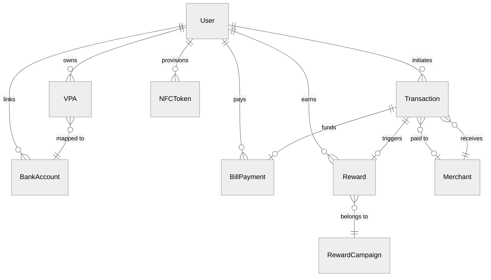

# Low-Level Design

## Data Models

```
User {
    user_id             UUID        PRIMARY KEY
    phone               STRING      UNIQUE, encrypted
    name                STRING      encrypted
    kyc_level           ENUM        (min_kyc, full_kyc, enhanced_kyc)
    device_fingerprint  STRING
    pin_hash            STRING      -- UPI PIN hash (never plaintext)
    status              ENUM        (active, suspended, blocked, closed)
    created_at          TIMESTAMP
}

VPA {
    vpa_id              UUID        PRIMARY KEY
    handle              STRING      UNIQUE   -- e.g., user@superapp
    user_id             UUID        FK -> User
    bank_account_id     UUID        FK -> BankAccount
    is_primary          BOOLEAN     DEFAULT false
    status              ENUM        (active, inactive, deregistered)
}

BankAccount {
    account_id          UUID        PRIMARY KEY
    user_id             UUID        FK -> User
    ifsc                STRING
    account_number_enc  STRING      -- AES-256 encrypted
    bank_name           STRING
    is_verified         BOOLEAN     DEFAULT false
    status              ENUM        (active, unlinked, frozen)
}

Transaction {
    txn_id              UUID        PRIMARY KEY
    upi_txn_id          STRING      UNIQUE        -- NPCI reference number
    payer_vpa           STRING
    payee_vpa           STRING
    amount              DECIMAL(12,2)
    currency            STRING      DEFAULT 'INR'
    type                ENUM        (P2P, P2M, BILL, NFC, MANDATE)
    status              ENUM        (initiated, pending, success, failed, refunded)
    risk_score          DECIMAL(4,3)
    merchant_id         UUID        FK -> Merchant (nullable)
    device_context      JSON        -- device_id, ip, geolocation, app_version
    initiated_at        TIMESTAMP
    completed_at        TIMESTAMP
    idempotency_key     STRING      UNIQUE
}

Merchant {
    merchant_id         UUID        PRIMARY KEY
    name                STRING
    category_code       STRING      -- MCC (Merchant Category Code)
    vpa                 STRING      UNIQUE
    settlement_account  JSON        encrypted
    qr_code_id          STRING      UNIQUE
    tier                ENUM        (micro, small, medium, large, enterprise)
    settlement_cycle    ENUM        (t0, t1, t2)
    status              ENUM        (onboarding, active, suspended, terminated)
}

BillPayment {
    bill_id             UUID        PRIMARY KEY
    user_id             UUID        FK -> User
    biller_id           STRING
    biller_category     ENUM        (electricity, water, gas, telecom, broadband, insurance)
    bill_amount         DECIMAL(12,2)
    bbps_txn_id         STRING      UNIQUE
    txn_id              UUID        FK -> Transaction
    status              ENUM        (bill_fetched, payment_initiated, payment_success, settled)
    due_date            DATE
    is_recurring        BOOLEAN     DEFAULT false
}

Reward {
    reward_id           UUID        PRIMARY KEY
    user_id             UUID        FK -> User
    txn_id              UUID        FK -> Transaction
    type                ENUM        (cashback, scratch_card, referral, merchant_offer)
    amount              DECIMAL(10,2)
    status              ENUM        (pending, credited, expired, reversed)
    campaign_id         UUID        FK -> RewardCampaign
    expires_at          TIMESTAMP
}

RewardCampaign {
    campaign_id         UUID        PRIMARY KEY
    name                STRING
    rules_json          JSON        -- min_amount, merchant_category, txn_type, frequency
    cashback_type       ENUM        (fixed, percentage, tiered)
    max_cashback        DECIMAL
    per_user_daily_limit DECIMAL
    budget_total        DECIMAL
    budget_consumed     DECIMAL     DEFAULT 0
    start_date          TIMESTAMP
    end_date            TIMESTAMP
    status              ENUM        (draft, active, paused, exhausted, expired)
}

MiniApp {
    app_id              UUID        PRIMARY KEY
    developer_id        UUID
    name                STRING
    category            ENUM        (finance, shopping, travel, food, utilities)
    sandbox_permissions JSON        -- [payments, user_profile, location]
    version             STRING
    status              ENUM        (review, approved, published, suspended, deprecated)
}

NFCToken {
    token_id            UUID        PRIMARY KEY
    user_id             UUID        FK -> User
    card_ref            STRING      -- tokenized card reference
    token_value_enc     STRING      -- encrypted, stored in secure element
    network             ENUM        (visa, mastercard, rupay)
    expiry              DATE
    device_id           STRING      -- bound to specific device
    max_offline_amount  DECIMAL
    status              ENUM        (provisioned, active, suspended, deleted)
}
```

---

## Entity-Relationship Diagram



---

## Indexing Strategy

| Entity | Index | Purpose |
|--------|-------|---------|
| Transaction | `(payer_vpa, created_at DESC)` | User passbook / transaction history |
| Transaction | `(upi_txn_id)` UNIQUE | NPCI dedup and reconciliation |
| Transaction | `(merchant_id, created_at DESC)` | Merchant reports and analytics |
| Transaction | `(idempotency_key)` UNIQUE | Prevent duplicate processing |
| VPA | `(handle)` UNIQUE | VPA resolution (most frequent lookup) |
| VPA | `(user_id)` | Multi-VPA management per user |
| BillPayment | `(user_id, biller_category)` | User bills grouped by type |
| BillPayment | `(bbps_txn_id)` UNIQUE | BBPS reconciliation |
| Reward | `(user_id, status)` | Active rewards balance query |
| Reward | `(campaign_id, status)` | Budget tracking per campaign |
| NFCToken | `(device_id, status)` | Token lookup during NFC tap |

## Partitioning Strategy

| Entity | Strategy | Rationale |
|--------|----------|-----------|
| Transaction | Range by month + hash by user_id within month | Reconciliation is monthly; user-level hash distributes shard load evenly |
| User | Hash by user_id | Uniform distribution; co-locates VPA and BankAccount lookups |
| Merchant | Hash by merchant_id | Point lookups by ID or VPA; even distribution |
| Reward | Range by created_at (monthly) | Expired rewards archived; budget queries scoped to active window |
| BillPayment | Range by paid_at (monthly) | Settlement reconciliation is date-scoped |

---

## API Design

### 1. POST /api/v1/upi/pay -- Initiate UPI Payment

```
Headers: Authorization: Bearer <token>, X-Idempotency-Key
Rate Limit: 10 txns/min per user

Request: { payer_vpa, payee_vpa, amount, currency, remarks, txn_type, device_context }
Response: { txn_id, upi_ref, status, amount, timestamp, reward_hint }
Failure:  { txn_id, status: "failed", failure_code, failure_reason }

Idempotency: X-Idempotency-Key as dedup key; repeats within 24h return cached response.
```

### 2. POST /api/v1/bills/fetch -- Fetch Bill Details

```
Request: { biller_id, customer_identifier, biller_category }
Response: { bill_amount, due_date, bill_number, biller_name, partial_pay_allowed }
```

### 3. POST /api/v1/nfc/tap -- Process NFC Tap Payment

```
Headers: Authorization: Bearer <device_token>, X-Terminal-ID
Latency SLO: < 500ms

Request: { token_id, terminal_id, amount, merchant_id, cryptogram }
Response: { txn_id, auth_code, status, network, timestamp }
```

### 4. Additional Endpoints

| Endpoint | Method | Key Fields |
|----------|--------|------------|
| `/api/v1/rewards/balance` | GET | Response: total_earned, available, pending, scratch_cards, expiring_soon |
| `/api/v1/merchant/qr/generate` | POST | Request: merchant_id, qr_type, amount. Response: qr_id, qr_data (UPI deep link) |
| `/api/v1/transactions/history` | GET | Cursor-based pagination, reads from CQRS view. Filters: type, date range |
| `/api/v1/miniapp/launch` | POST | Request: app_id. Response: session_id, bundle_url, sandbox_config |

---

## Core Algorithms

### 1. UPI Transaction Routing

```
FUNCTION routeUPITransaction(txnRequest):
    -- Step 1: Idempotency check
    existing = lookupByIdempotencyKey(txnRequest.idempotencyKey)
    IF existing: RETURN existing.response

    -- Step 2: Resolve VPA to bank account
    payerBank = resolveVPA(txnRequest.payerVPA)
    payeeBank = resolveVPA(txnRequest.payeeVPA)
    IF NOT payerBank OR NOT payeeBank:
        RETURN {status: "FAILED", reason: "vpa_resolution_failed"}

    -- Step 3: Parallel risk assessment
    riskScore = PARALLEL:
        deviceRisk   = checkDeviceFingerprint(txnRequest.deviceContext)
        behaviorRisk = checkBehavioralPattern(txnRequest.payerVPA, txnRequest.amount)
        velocityRisk = checkVelocityLimits(txnRequest.payerVPA)
        geoRisk      = checkGeoAnomaly(txnRequest.deviceContext.geo)
        RETURN weightedScore(device=0.3, behavior=0.3, velocity=0.25, geo=0.15)

    IF riskScore > THRESHOLD_BLOCK:
        RETURN {status: "DECLINED", reason: "risk_check_failed"}
    IF riskScore > THRESHOLD_STEP_UP:
        requireAdditionalAuth(txnRequest)

    -- Step 4: Route through NPCI
    npciRequest = buildCollectRequest(payerBank, payeeBank, txnRequest)
    response = npciSwitch.send(npciRequest, timeout=1500ms)
    persistTransaction(txnRequest, response, riskScore)

    -- Step 5: Async post-processing
    ASYNC:
        evaluateRewards(txnRequest, response)
        sendNotifications(txnRequest.payerVPA, txnRequest.payeeVPA, response)
        publishToEventStore(txnRequest, response, riskScore)

    RETURN response
```

### 2. Cashback Budget Enforcement

```
FUNCTION evaluateCashback(txn, userId):
    activeCampaigns = cache.getOrLoad("active_campaigns", TTL=60s,
        loader = db.query("SELECT * FROM RewardCampaign WHERE status='active' AND NOW() BETWEEN start_date AND end_date"))

    FOR campaign IN activeCampaigns:
        IF NOT matchesRules(txn, campaign.rules_json): CONTINUE

        cashbackAmount = MIN(computeCashback(txn.amount, campaign), campaign.max_cashback)

        -- Atomic budget decrement (distributed counter)
        remaining = atomicDecrement(campaign.budgetKey, cashbackAmount)
        IF remaining < 0:
            atomicIncrement(campaign.budgetKey, cashbackAmount)
            CONTINUE

        -- Per-user limit checks
        userDaily = getCounter(userId + ":" + campaign.id + ":daily")
        IF userDaily + cashbackAmount > campaign.per_user_daily_limit:
            atomicIncrement(campaign.budgetKey, cashbackAmount)
            CONTINUE

        -- Credit reward
        reward = createReward(userId, txn.txn_id, cashbackAmount, campaign.id)
        incrementCounter(userId + ":" + campaign.id + ":daily", cashbackAmount, TTL=endOfDay())
        RETURN {eligible: true, amount: cashbackAmount, reward_id: reward.id}

    RETURN {eligible: false, reason: "no_matching_campaign"}
```

### 3. VPA Resolution with Multi-Level Cache

```
FUNCTION resolveVPA(vpaHandle):
    -- L1: Local in-process cache (10s TTL)
    cached = localCache.get(vpaHandle)
    IF cached: RETURN cached

    -- L2: Distributed cache (5min TTL)
    cached = distributedCache.get("vpa:" + vpaHandle)
    IF cached:
        localCache.set(vpaHandle, cached, TTL=10s)
        RETURN cached

    -- L3: Own database
    account = db.query("SELECT bank_account_id, ifsc FROM vpa_mapping WHERE handle = ? AND status = 'active'", vpaHandle)
    IF account:
        distributedCache.set("vpa:" + vpaHandle, account, TTL=300s)
        localCache.set(vpaHandle, account, TTL=10s)
        RETURN account

    -- L4: NPCI lookup (cross-app VPA)
    account = npciSwitch.resolveVPA(vpaHandle, timeout=500ms)
    IF account:
        distributedCache.set("vpa:" + vpaHandle, account, TTL=60s)  -- shorter for external
        localCache.set(vpaHandle, account, TTL=10s)
    RETURN account

FUNCTION invalidateVPA(vpaHandle):
    localCache.delete(vpaHandle)
    distributedCache.delete("vpa:" + vpaHandle)
    publishEvent("vpa_invalidated", vpaHandle)  -- peer instances clear L1
```

---

## Transaction Lifecycle State Machine

```
INITIATED → (risk passed) → PENDING → (NPCI success) → SUCCESS → SETTLED (T+0/T+1)
                                    → (NPCI failure) → FAILED
                                    → (timeout)      → PENDING (retry)
SUCCESS → (refund initiated) → REFUNDED
```

**States**: INITIATED (request received), PENDING (sent to NPCI switch), SUCCESS (debit+credit confirmed), FAILED (with NPCI reason code), SETTLED (funds settled to payee), REFUNDED (reversal completed). Timeout from PENDING triggers retry up to 3 attempts before marking FAILED.
