# Super App Payment Platform — Deep Dive & Bottlenecks

## 1. Critical Component: UPI TPP Transaction Engine

### Why Critical

Every rupee flowing through the app passes through the UPI Third-Party Processor (TPP) transaction engine. It must sustain 15,000+ TPS with sub-2-second end-to-end latency while coordinating four external parties — the NPCI switch, payer bank, payee bank, and the internal fraud detection pipeline. A single miscounted state transition can orphan money in transit.

### Internal Workings

**Transaction State Machine**

```
INITIATED → RISK_CHECK → NPCI_SUBMITTED → BANK_DEBIT → BANK_CREDIT → COMPLETED
                                              │               │
                                              └──► FAILED ◄───┘
                                                     │
                                                DISPUTE_RAISED → AUTO_REFUND
```

Each state transition is persisted before the next hop is triggered. The engine never advances without a durable write confirming the previous state.

**Idempotency Layer**

The client generates a unique transaction ID before submitting the request. This ID is inserted into a deduplication cache with a 24-hour TTL. If the same ID arrives again (network retry, double-tap), the engine returns the existing transaction status without re-initiating.

```
FUNCTION handle_payment(request):
    IF dedup_cache.exists(request.txn_id):
        RETURN fetch_status(request.txn_id)
    dedup_cache.set(request.txn_id, "INITIATED", ttl=24h)
    persist_transaction(request)
    RETURN initiate_risk_check(request)
```

**NPCI Callback Handling**

Callbacks from NPCI arrive with at-least-once delivery semantics. The engine processes each callback idempotently by keying on the UPI reference number (RRN). A status update is applied only if the new state logically follows the current state in the state machine — out-of-order or duplicate callbacks are safely discarded.

**Timeout Management**

| Condition | Timeout | Action |
|-----------|---------|--------|
| No NPCI callback | 30 seconds | Trigger NPCI status-check API |
| Status-check returns "pending" | 60 seconds | Retry status-check once more |
| Bank debited, credit pending | 48 hours | Auto-raise dispute per NPCI mandate |
| No resolution after dispute | 5 business days | Escalate to sponsor bank operations |

### Failure Modes

| Failure | Detection | Recovery |
|---------|-----------|----------|
| NPCI switch timeout | No callback within 30s | Queue for status-check retry; show "pending" to user |
| Bank debit success, credit failure | Asymmetric state after BANK_DEBIT | Compensation via auto-refund within 48 hours (NPCI mandate) |
| Duplicate NPCI callback | Dedup check on UPI reference number | Idempotent handler; second callback is a no-op |
| Device/network failure mid-transaction | App reopen detects pending txn in local cache | Transaction recovery flow fetches server-side status |

### Race Conditions

**Rapid duplicate payment**: Same user paying same merchant twice within seconds. Mitigated by dedup on the tuple `(payer_vpa, payee_vpa, amount)` within a 30-second sliding window. The second request receives a "duplicate detected" soft-decline with option to override.

**Stale balance check**: Balance shown to user may be seconds old. The UI labels it "approximate balance" and defers authoritative validation to the issuing bank. If the bank returns insufficient funds, the engine transitions to FAILED with a clear error code.

---

## 2. Critical Component: Rewards & Cashback Engine

### Why Critical

The rewards engine drives user engagement and retention while managing an annual cashback budget exceeding ₹1,000 crore. It must evaluate reward eligibility in sub-second latency per transaction, prevent budget overruns across concurrent campaigns, and handle reversals gracefully when transactions are refunded.

### Internal Workings

**Campaign Rules Engine**

Campaigns are defined as JSON rule sets with composable conditions:

```
CAMPAIGN_RULE:
    conditions:
        - txn_type IN [P2M, BILL_PAY]
        - amount_range: [100, 5000]
        - merchant_category IN [GROCERY, FUEL]
        - user_segment IN [NEW_USER, REACTIVATED]
        - time_window: [2024-10-01T00:00, 2024-10-31T23:59]
    reward:
        type: CASHBACK | SCRATCH_CARD | COUPON
        value_range: [10, 100]
        probability: 0.30
```

The rules engine evaluates all active campaigns against a completed transaction and selects the best applicable reward (highest value to user, or the one the business prioritizes via a priority field).

**Budget Management**

Budgets are hierarchical counters, each enforced atomically:

```
Global Campaign Budget (₹50 crore)
  └── Per-Day Budget (₹1.5 crore)
       └── Per-User Daily Limit (₹200)
            └── Per-User Per-Campaign Limit (₹500 lifetime)
```

Each reward disbursement atomically decrements all applicable counters. If any counter would go negative, the reward is declined.

**Probabilistic Rewards (Scratch Cards)**

Prize distributions are pre-computed using weighted random selection with a deterministic seed. The distribution is generated at campaign creation time and stored as a shuffled queue of prize values. Each scratch card event dequeues the next value, ensuring the overall distribution matches the configured probabilities without per-request randomness overhead.

**Two-Phase Cashback Crediting**

1. **Hold phase**: Reward amount is recorded in a pending ledger, visible to the user as "cashback pending."
2. **Credit phase**: After merchant settlement confirms (typically T+1 or T+2), the pending amount is moved to the user's wallet balance via a ledger transfer.

### Failure Modes

| Failure | Impact | Mitigation |
|---------|--------|------------|
| Budget race condition | Multiple users claiming last ₹100 | Distributed atomic counter with compare-and-swap (CAS); losing requests get "campaign exhausted" |
| Reward credited but txn reversed | Unearned cashback in wallet | Transaction reversal event triggers reward clawback from wallet |
| Campaign rules updated mid-flight | Users evaluated against inconsistent rules | Versioned rules; evaluation uses the rule version active at transaction initiation time |

### Concurrency Deep Dive

**Budget Counter Pattern**

```
FUNCTION claim_reward(campaign_id, user_id, amount):
    current = counter.get(campaign_id)
    IF current < amount:
        RETURN BUDGET_EXHAUSTED
    success = counter.compare_and_decrement(campaign_id, current, amount)
    IF NOT success:
        RETURN RETRY  // Another thread decremented first
    record_pending_reward(user_id, campaign_id, amount)
    RETURN REWARD_GRANTED
```

Per-user rate limiting uses a sliding-window counter keyed on `(user_id, campaign_id, date)` with atomic increment. This prevents abuse where a user rapidly completes many small transactions to drain rewards.

---

## 3. Critical Component: NFC Tap-to-Pay with HCE

### Why Critical

Contactless tap-to-pay must respond within 500ms at the payment terminal. The app uses Host Card Emulation (HCE) to emulate a contactless card without a hardware Secure Element, meaning credential management and cryptogram generation happen in software — raising both latency and security challenges.

### Internal Workings

**Host Card Emulation Flow**

The app registers as an HCE service on the device. When the user taps the device on a contactless terminal, the OS routes the NFC APDU commands to the app, which responds as if it were a physical contactless card.

```
Terminal ──[SELECT AID]──► Device NFC Antenna ──► OS HCE Router ──► Payment App
Terminal ◄──[CARD DATA]──◄ Payment App generates response with tokenized credentials
```

**Token Provisioning**

When a user adds a card, the app requests a device-specific payment token from the card network's tokenization service. This token replaces the actual card number for all NFC transactions. The token is stored in the device's Trusted Execution Environment (TEE) where available, or in an encrypted app-level keystore as fallback.

**Per-Transaction Cryptogram**

Each tap generates a unique cryptogram computed on-device:

```
FUNCTION generate_cryptogram(token, counter, timestamp):
    input = CONCAT(token.id, counter, timestamp, terminal_unpredictable_number)
    cryptogram = HMAC(token.cryptographic_key, input)
    INCREMENT counter
    RETURN cryptogram
```

The terminal forwards this cryptogram to the card network, which validates it against the token server's expected value. Replay is impossible because the counter and timestamp differ each time.

**Offline Capability**

For scenarios with intermittent connectivity, the app pre-computes a limited set of cryptograms (typically 5–10) during the last online session. These are consumed sequentially for offline taps, with a hard floor limit on offline transaction amounts.

### Failure Modes

| Failure | User Experience | Recovery |
|---------|----------------|----------|
| Token expired during tap | Transaction declined at terminal | Graceful fallback prompt: "Use QR code instead"; background token refresh |
| NFC antenna interference | No response at terminal | Retry with adjusted power; if second attempt fails, prompt QR fallback |
| Tokenization service unavailable | Cannot provision new token | Use cached token with reduced transaction count limit; alert user |
| TEE unavailable (rooted device) | Cannot store token securely | Decline NFC provisioning; restrict to QR-based payments only |

---

## 4. Concurrency & Race Conditions

### VPA Handle Creation Race

Two users simultaneously registering the same custom VPA handle (e.g., `niraj@superapp`). Mitigation: a distributed lock with 5-second TTL is acquired on the VPA string before the uniqueness check and database insert. The losing request receives "VPA already taken."

```
FUNCTION register_vpa(user_id, desired_vpa):
    lock = distributed_lock.acquire(key="vpa:" + desired_vpa, ttl=5s)
    IF NOT lock:
        RETURN VPA_TEMPORARILY_UNAVAILABLE
    IF vpa_store.exists(desired_vpa):
        lock.release()
        RETURN VPA_ALREADY_TAKEN
    vpa_store.insert(desired_vpa, user_id)
    lock.release()
    RETURN SUCCESS
```

### Multi-Device Login

Same user logged into two phones. Device binding ensures only the most recently authenticated device can initiate transactions. When a user authenticates on a new device, the previous device's session token is invalidated. Any in-flight transaction from the old device is rejected at the RISK_CHECK stage.

### Settlement Race

Merchant settlement is calculated at a daily cutoff time (e.g., 23:59:59). Transactions arriving within the cutoff window could be double-counted or missed. Solution: snapshot isolation with a deterministic cutoff timestamp. The settlement job reads from a read replica frozen at the cutoff instant. New transactions written after the cutoff are captured in the next settlement cycle.

---

## 5. Bottleneck Analysis

### Top 3 Bottlenecks

```mermaid
---
config:
  theme: neutral
---
flowchart TB
    subgraph B1["Bottleneck 1: NPCI Switch"]
        N1[All UPI txns route\nthrough single external switch]
        N2[Connection pooling\n+ request batching]
        N3[Circuit breaker\nper bank endpoint]
        N4[Pre-funded wallet\nfor instant P2P\nwithout NPCI]
        N1 --> N2 --> N3 --> N4
    end

    subgraph B2["Bottleneck 2: Reward Budget Hot Counter"]
        R1[Popular campaigns create\nhot counter contention]
        R2[Hierarchical sharded counters\nN shards per campaign]
        R3[Each shard handles\nbudget portion independently]
        R4[Periodic reconciliation\nacross shards]
        R1 --> R2 --> R3 --> R4
    end

    subgraph B3["Bottleneck 3: Transaction History Fan-out"]
        T1[History queries trigger\nexpensive range scans]
        T2[CQRS with pre-materialized\nper-user views]
        T3[Cursor-based pagination\nwith indexed cursors]
        T4[CDN caching for\nstatic statement portions]
        T1 --> T2 --> T3 --> T4
    end

    classDef bottleneck fill:#e1f5fe,stroke:#01579b,stroke-width:2px
    classDef mitigation fill:#e8f5e9,stroke:#2e7d32,stroke-width:2px

    class N1,R1,T1 bottleneck
    class N2,N3,N4,R2,R3,R4,T2,T3,T4 mitigation
```



### Bottleneck 1 — NPCI Switch as External Dependency

All UPI transactions must route through the NPCI switch, making it the single largest external bottleneck. During peak events (salary day, festival periods), NPCI itself throttles TPPs.

**Mitigations:**
- **Connection pooling**: Maintain persistent connections to NPCI, avoiding per-request TCP handshake overhead
- **Request batching**: Aggregate multiple collect requests in micro-batches (5ms window) to reduce round trips
- **Per-bank circuit breaker**: If a specific bank's success rate drops, circuit-break only that bank while keeping others operational
- **Pre-funded wallet P2P**: For small-value P2P transfers between app users, debit/credit internal wallet balances without hitting NPCI, settling net positions in batch

### Bottleneck 2 — Reward Budget Hot Counter

A ₹500-crore Diwali campaign with millions of concurrent transactions creates extreme write contention on the campaign budget counter.

**Mitigations:**
- **Hierarchical sharded counters**: Pre-allocate the campaign budget across N shards (e.g., 64 shards, each holding ₹7.8 crore). Each application instance is assigned a subset of shards and decrements independently
- **Shard rebalancing**: When a shard is exhausted, it borrows remaining budget from underutilized shards via a background rebalancer
- **Approximate counting**: Accept ±2% budget variance in exchange for eliminating cross-shard coordination; a reconciliation job runs every 60 seconds to true up

### Bottleneck 3 — Transaction History Fan-out

Users checking their transaction history trigger range queries on time-partitioned transaction tables. Power users with thousands of transactions per month generate expensive scans.

**Mitigations:**
- **CQRS pattern**: Transaction writes go to the primary store; a change-data-capture pipeline materializes per-user history views optimized for chronological read access
- **Cursor-based pagination**: Each page returns a cursor (encoded timestamp + txn_id) for fetching the next page, avoiding OFFSET-based scans
- **Tiered storage**: Recent 30 days served from hot cache; 30–90 days from warm replicas; older history from columnar cold storage with higher latency tolerance

---

## 6. Interview Checklist

| Topic | Key Points to Discuss |
|-------|----------------------|
| UPI TPP state machine | Six states, idempotent transitions, timeout escalation ladder |
| Idempotency | Client-generated txn ID, dedup cache with TTL, NPCI RRN dedup |
| Rewards budget | Hierarchical counters, CAS-based atomic decrement, shard rebalancing |
| HCE tap-to-pay | Token provisioning, per-tap cryptogram, offline pre-computation |
| Race conditions | VPA lock, device binding, settlement snapshot isolation |
| NPCI bottleneck | Connection pooling, per-bank circuit breaker, pre-funded wallet bypass |
