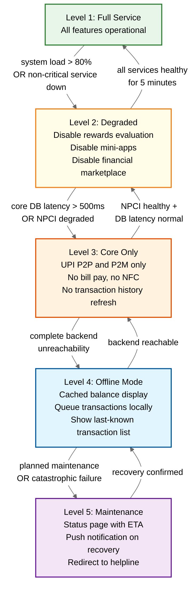

# Super App Payment Platform — Scalability & Reliability

## 1. Scalability

### Horizontal Scaling Strategy

| Service | Scaling Dimension | Baseline | Burst Target | Scale Trigger |
|---------|-------------------|----------|--------------|---------------|
| UPI TPP Service | TPS | 15,000 | 50,000 | CPU > 60% or p99 latency > 800ms |
| Fraud Detection | Queue depth | 5 inference pods | 20 pods | Pending queue > 5,000 items |
| Rewards Engine | Per-campaign | 3 pods per campaign | 12 pods (hot campaigns) | Campaign TPS > 2,000 |
| Bill Payment | Biller category | 4 pods per category | 15 pods | Month-end spike for electricity/telecom |
| Mini-App Runtime | Per-mini-app | 1 container per app | Resource-quota-capped | Memory > 80% or CPU > 70% |

**UPI TPP Service**: Fully stateless — any pod can handle any transaction since all state lives in the distributed transaction store. Horizontal scaling is pure pod replication behind a load balancer that routes by consistent hashing on `payer_vpa` to maximize cache locality.

**Fraud Detection**: The ML inference cluster scales independently from the transaction path. Transactions enqueue a fraud-check event; inference pods consume from the queue. Auto-scaling is driven by queue depth rather than CPU, ensuring evaluation latency stays under 200ms even during traffic spikes.

**Rewards Engine**: Hot campaigns (festival sales, new-user promotions) receive dedicated compute. Campaign-level isolation prevents a viral campaign from starving routine cashback evaluation.

**Bill Payment**: Biller categories exhibit predictable temporal patterns — electricity and gas peak at month-end, insurance premiums peak quarterly. Pre-scaling based on calendar heuristics supplements reactive auto-scaling.

**Mini-App Runtime**: Each third-party mini-app runs in an isolated container with enforced CPU, memory, and network quotas. A misbehaving mini-app is throttled or evicted without affecting the host payment app.

### Database Scaling

**Transaction Database**

```
256 hash shards (shard_key = hash(user_id) % 256)
  └── Each shard: monthly time-partitions
       ├── Current month: hot storage (NVMe-backed)
       ├── Previous 2 months: warm storage (SSD-backed replicas)
       └── Older: archived to columnar cold storage
```

- **Shard count rationale**: 256 shards accommodate 50,000 peak TPS with ~200 TPS per shard, well within single-node write throughput
- **Write path**: All writes go to the shard primary; synchronous replication to one standby for durability
- **Read path**: Three read replicas per shard serve history queries, balance checks, and analytics

**Time-Series Rollup**

| Granularity | Retention | Use Case |
|-------------|-----------|----------|
| Raw events | 7 days | Real-time debugging, dispute investigation |
| Hourly aggregates | 90 days | Operational dashboards, trend detection |
| Daily aggregates | 5 years | Regulatory reporting, annual analytics |
| Cold archive | Indefinite | Compliance, audit trail |

Rollup jobs run on a schedule: hourly aggregation at minute 5 of each hour; daily aggregation at 01:00; monthly archival on the 2nd of each month.

**VPA Mapping Store**

VPA-to-account mappings are cached aggressively because they change infrequently but are read on every transaction:
- Hot merchant VPAs (top 10,000 by transaction volume) are pinned in cache with no TTL — invalidated only on explicit update
- User VPAs use a 5-minute TTL with read-through on cache miss
- The backing database is a distributed key-value store optimized for point lookups

### Caching Layers

```mermaid
---
config:
  theme: neutral
---
flowchart LR
    subgraph L1["L1: Device/App Cache"]
        A1[User session]
        A2[Recent 10 transactions]
        A3[Tokenized credentials]
    end

    subgraph L2["L2: Service-Local Cache"]
        B1[VPA resolutions]
        B2[Merchant profiles]
        B3[Campaign rules snapshot]
    end

    subgraph L3["L3: Distributed Cache Cluster"]
        C1[Transaction dedup keys]
        C2[Rate-limit counters]
        C3[Feature flags]
        C4[Budget counters]
    end

    subgraph L4["L4: CDN"]
        D1[QR code images]
        D2[Merchant logos]
        D3[Mini-app static assets]
    end

    L1 -->|miss| L2 -->|miss| L3 -->|miss| DB[(Primary Database)]
    L4 -.->|static assets| Client([Client App])

    classDef device fill:#e1f5fe,stroke:#01579b,stroke-width:2px
    classDef service fill:#e8f5e9,stroke:#2e7d32,stroke-width:2px
    classDef distributed fill:#fffde7,stroke:#f57f17,stroke-width:2px
    classDef cdn fill:#e0f7fa,stroke:#00695c,stroke-width:2px
    classDef data fill:#f3e5f5,stroke:#6a1b9a,stroke-width:2px

    class A1,A2,A3 device
    class B1,B2,B3 service
    class C1,C2,C3,C4 distributed
    class D1,D2,D3 cdn
    class DB data
```



**TTL Strategy by Layer**

| Layer | Data | TTL | Invalidation |
|-------|------|-----|--------------|
| L1 (Device) | Session token | 10 minutes | Server-pushed revocation on logout/new device |
| L1 (Device) | Recent transactions | 30 seconds | Pull-refresh or push notification |
| L2 (Service) | VPA resolution | 5 minutes | Event-driven invalidation on VPA update |
| L2 (Service) | Campaign rules | 30 seconds | Version check; reload on mismatch |
| L3 (Distributed) | Dedup keys | 24 hours | No early invalidation; natural expiry |
| L3 (Distributed) | Rate-limit counters | Sliding window (1 min) | Atomic decrement on window slide |
| L4 (CDN) | Static assets | 24 hours | Cache-busting via versioned URLs |

### Hot Spot Mitigation

**Celebrity/Influencer VPAs**: When a public figure shares their VPA, millions of P2P payments arrive simultaneously. Mitigation: the system detects hot VPAs (>1,000 inbound TPS) and auto-migrates them to a dedicated shard with a read-through cache layer that batches NPCI submissions.

**Flash Sale Merchants**: A merchant running a flash sale generates massive concurrent P2M volume. Mitigation: pre-warm the merchant profile cache, allocate a dedicated connection pool to the merchant's acquiring bank, and apply client-side request coalescing for identical amount payments.

**Festival Spikes (Diwali, New Year)**: Historical data shows 3–5x traffic surges during major festivals. Mitigation: infrastructure is pre-scaled 2 weeks before the event based on prior-year baselines. Load tests simulating peak + 30% headroom run one week before. Non-critical batch jobs (analytics rollups, report generation) are paused during the peak window.

---

## 2. Reliability & Fault Tolerance

### Single Points of Failure

| Component | SPOF Risk | Mitigation | Failover Time |
|-----------|-----------|------------|---------------|
| NPCI Switch | External dependency; all UPI routes through it | Circuit breaker; fallback to IMPS/NEFT for non-UPI; offline queuing mode | N/A (external) |
| Sponsor Bank | Single bank API down halts transactions | Multi-bank failover; round-robin across 3+ sponsor banks; health-check every 10s | < 10 seconds |
| Fraud ML Model | Model serving pod failure | Rules-based fallback engine; stale model cache (up to 1 hour old); shadow model deployment | < 5 seconds |
| Rewards Database | Write bottleneck under campaign surge | Async reward crediting via durable queue; eventual consistency acceptable for rewards | < 30 seconds |
| Push Notifications | Third-party provider outage | Multi-provider routing (FCM + APNS + in-app notification center); graceful skip | Instant fallback |
| Token Service | Card network tokenization API down | Cached tokens remain valid for existing cards; new provisioning queued | Degraded mode |

### Circuit Breaker Configuration

| Dependency | Half-Open Threshold | Open Threshold | Cooldown | Fallback |
|------------|---------------------|----------------|----------|----------|
| NPCI Switch | 5% error rate | 10% error rate | 30 seconds | Queue transactions; show "pending" status |
| Bank API | 3% error rate | 8% error rate | 60 seconds | Route to alternate sponsor bank |
| BBPS (Bill Pay) | 5% error rate | 15% error rate | 45 seconds | Show "temporarily unavailable"; retry later |
| Fraud ML | 1% timeout rate | 5% timeout rate | 20 seconds | Fall back to deterministic rules engine |
| Tokenization | 2% error rate | 7% error rate | 90 seconds | Use cached token; block new provisioning |

**Circuit Breaker State Machine**

```
CLOSED ──[error_rate > half_open_threshold]──► HALF_OPEN
HALF_OPEN ──[probe_success]──► CLOSED
HALF_OPEN ──[probe_failure OR error_rate > open_threshold]──► OPEN
OPEN ──[cooldown_elapsed]──► HALF_OPEN
```

In HALF_OPEN state, a small percentage (5%) of requests are allowed through as probes. If probes succeed consistently for 3 consecutive checks, the circuit closes.

### Graceful Degradation Hierarchy



**Degradation Trigger Rules**

Each level transition is governed by automated health signals. The system never auto-escalates to Level 5 (maintenance) — that requires operator confirmation. De-escalation (recovery) requires the healthier state to be sustained for a minimum hold period (5 minutes for L2→L1, 2 minutes for others) to prevent flapping.

### Retry Strategies

| Operation | Strategy | Attempts | Backoff | Dead-Letter |
|-----------|----------|----------|---------|-------------|
| NPCI transaction submit | Exponential backoff | 3 | 1s → 3s → 9s | Mark as PENDING; alert ops |
| Bank callback missing | Polling | 2 | 30s → 60s | Auto-raise dispute with NPCI |
| Bill payment failure | Immediate retry + alternate | 2 | 0s (immediate) then 5s | Offer alternate payment method |
| Reward crediting | Persistent queue retry | Unlimited | 10s → 30s → 60s (capped) | Dead-letter after 24 hours; manual review |
| Push notification | Best-effort retry | 2 | 1s → 5s | Log and skip; user sees in-app on next open |

**Retry Safety Rules**
- Only idempotent operations are retried automatically
- Non-idempotent operations (bank debit) are never retried — instead, the system queries the current state before deciding next action
- All retries carry the original idempotency key to prevent duplicate side effects

---

## 3. Disaster Recovery

### RTO and RPO Targets

| System | RTO | RPO | Replication Mode |
|--------|-----|-----|-----------------|
| Transaction processing | < 5 minutes | 0 (zero data loss) | Synchronous replication to standby |
| User data (profiles, VPAs) | < 15 minutes | < 1 minute | Asynchronous replication with WAL shipping |
| Analytics and reporting | < 1 hour | < 5 minutes | Async batch replication |
| Audit logs | < 2 hours | 0 (append-only, replicated) | Synchronous append to immutable store |

### Multi-Region Strategy

**Regulatory constraint**: Financial transaction data must reside within the country. This rules out cross-border active-active for write paths.

```
Primary Region (Region A)                    Secondary Region (Region B)
┌─────────────────────────┐                 ┌─────────────────────────┐
│  Active for:            │                 │  Active for:            │
│  - Transaction writes   │ ──sync repl──► │  - Read replicas        │
│  - Settlement           │                 │  - Balance checks       │
│  - Fraud detection      │                 │  - Transaction history  │
│                         │                 │  - Standby for writes   │
└─────────────────────────┘                 └─────────────────────────┘
```

- **Write path**: Active-passive. All transaction writes go to the primary region. The secondary region maintains a hot standby with synchronous replication for the transaction database
- **Read path**: Active-active. Balance checks and transaction history queries are served from the nearest region's read replicas to minimize latency
- **Failover**: If the primary region is unavailable, the secondary region is promoted to primary. DNS failover completes within 60 seconds. In-flight transactions in the failed region are recovered from the replicated WAL

**Conflict Resolution**: During split-brain scenarios (rare, detected post-recovery), conflicts are resolved using:
1. Transaction ID uniqueness — duplicate IDs are deduplicated
2. Last-write-wins for user profile updates
3. Compensating transactions for any monetary inconsistencies, with human review for amounts above a configurable threshold

### Backup Strategy

| Backup Type | Frequency | Retention | Storage |
|-------------|-----------|-----------|---------|
| Continuous WAL archival | Real-time streaming | 7 days of WAL segments | Object storage (geo-replicated) |
| Full database snapshot | Daily at 02:00 | 30 days | Object storage with encryption at rest |
| Point-in-time recovery | On-demand | 7-day window from any WAL position | Reconstructed from snapshot + WAL replay |
| Configuration backup | On every change | 90 days of versions | Version-controlled config store |

**DR Drill Schedule**
- **Monthly**: Automated failover test for individual database shards (rolling, non-disruptive)
- **Quarterly**: Full region failover simulation with traffic replay from production logs (off-peak hours)
- **Annually**: Chaos engineering exercise simulating cascading failures across multiple components simultaneously

**Recovery Runbook (Abbreviated)**

```
PROCEDURE region_failover:
    1. Detect: Health check failures from primary region for > 60 seconds
    2. Confirm: Ops engineer confirms via out-of-band channel (not dependent on primary region)
    3. Promote: Secondary DB promoted to primary (< 30 seconds)
    4. DNS: Update DNS records to route traffic to secondary region (< 60 seconds)
    5. Validate: Run synthetic transactions to confirm end-to-end flow
    6. Notify: Alert all downstream consumers (banks, NPCI) of endpoint change
    7. Monitor: Elevated alerting thresholds for 4 hours post-failover
    8. Post-mortem: Root cause analysis within 24 hours
```

---

## 4. Interview Checklist

| Topic | Key Points to Discuss |
|-------|----------------------|
| Horizontal scaling | Stateless TPP pods, campaign-level isolation, calendar-based pre-scaling |
| Database sharding | 256 hash shards on user_id, monthly time-partitions, read replica fan-out |
| Caching layers | 4-layer hierarchy (device → service → distributed → CDN) with distinct TTLs |
| Hot spot mitigation | Celebrity VPA detection, flash-sale pre-warming, festival pre-scaling |
| SPOF elimination | Multi-bank failover, rules-based fraud fallback, multi-provider notifications |
| Circuit breakers | Per-dependency thresholds, HALF_OPEN probe strategy, cooldown tuning |
| Graceful degradation | 5-level hierarchy with automated transitions and hold periods |
| Retry safety | Idempotency keys, state query before retry, dead-letter escalation |
| DR strategy | Active-passive writes, active-active reads, synchronous replication for RPO=0 |
| Backup and recovery | Continuous WAL, daily snapshots, 7-day PITR, quarterly DR drills |
