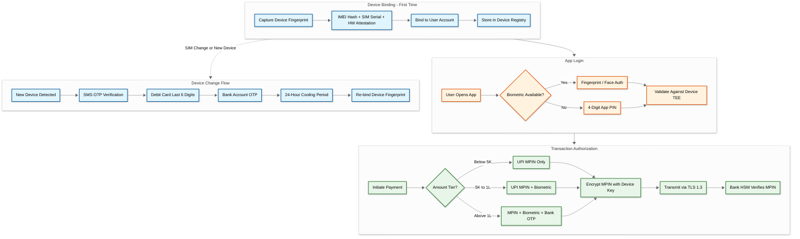
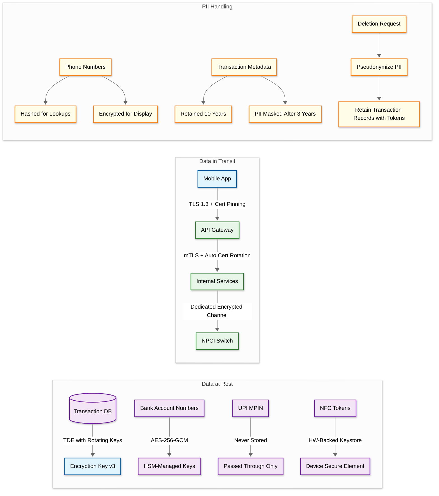

# Super App Payment Platform: Security and Compliance

## 1. Authentication & Authorization

### Multi-Layer Auth Model

A super app payment platform handles UPI, NFC tap-to-pay, bill payments, and mini-app commerce. Each surface area demands a distinct authentication layer while maintaining a unified user identity.



**Layer Breakdown**:

1. **Device Binding**: First-time setup captures device fingerprint (IMEI hash + SIM serial + hardware attestation) and binds it to the user account. This becomes the root of trust for all subsequent operations.
2. **App Login**: Biometric (fingerprint/face) or 4-digit app PIN validated against the device TEE (Trusted Execution Environment).
3. **UPI MPIN**: 4 or 6-digit UPI PIN for transaction authorization, encrypted end-to-end with device-specific keys, never stored on the platform server. Only the issuing bank's HSM can decrypt and verify it.
4. **Step-Up Auth**: Transactions above 5,000 INR require MPIN + biometric; above 1,00,000 INR require an additional OTP from the bank.
5. **Device Change**: Full re-verification via SMS OTP, debit card last 6 digits, and bank account OTP, followed by a mandatory 24-hour cooling period.

### Token Management

| Token Type | TTL | Storage | Binding |
|------------|-----|---------|---------|
| JWT Access Token | 15 minutes | In-memory on device | Device fingerprint embedded in claims |
| Refresh Token | 30 days | Encrypted in device keystore | Device-bound; rotated on each use |
| UPI MPIN Credential | Session-scoped | Never stored; ephemeral in TEE | Encrypted with device-specific key, decrypted only at bank HSM |
| NFC Payment Token | Provisioned by card network | Device TEE / Secure Element | Hardware-backed; cannot be extracted |

**Token Revocation Strategy**:
- Refresh token revocation is immediate via a server-side deny-list stored in a distributed cache with TTL matching the token's remaining validity.
- When a user reports a compromised account, all active sessions are invalidated by incrementing a per-user session version counter. All JWTs with a lower version are rejected at the API gateway.
- NFC token suspension is coordinated with the card network. The platform sends a token lifecycle management (TLM) request to deactivate the provisioned token, which takes effect within seconds.

### Authorization Model

- **RBAC for Internal Services**: Roles include admin, ops, support, developer. Each role maps to a set of permitted API operations with audit logging on all privileged actions. Role assignments require manager approval and are reviewed quarterly.
- **ABAC for User Actions**: Transaction limits governed by KYC level, device trust score, and account age. A newly registered device with minimum KYC cannot initiate high-value transactions regardless of user intent. Attributes are evaluated at runtime by a policy engine, allowing dynamic adjustment without code deployment.
- **Merchant Authorization**: API key + webhook signature verification + IP whitelisting. Merchants must pass security review before receiving production API credentials. API keys are rotated every 90 days; stale keys trigger escalating warnings before hard revocation.

**Permission Boundaries by Surface Area**:

| Surface | User Permissions | Mini-App Permissions | Merchant Permissions |
|---------|-----------------|---------------------|---------------------|
| UPI Payment | Initiate P2P/P2M, view history | Not accessible | Receive payments, initiate refunds |
| Bill Payment | Fetch bills, make payments | View bill summary (with consent) | Not applicable |
| NFC Tap | Tap-to-pay at terminal | Not accessible | Not accessible |
| Rewards | View offers, redeem cashback | Display offers (read-only) | Create campaigns via dashboard |
| Account Settings | Modify profile, link/delink bank | Not accessible | Manage webhook URLs, API keys |

---

## 2. Data Security

### Encryption Architecture



**At Rest**:
- **Database**: Transparent Data Encryption (TDE) with key rotation every 90 days.
- **Bank Account Numbers**: Application-level encryption using AES-256-GCM with HSM-managed keys. Decryption requires a service identity token scoped to the specific operation.
- **UPI MPIN**: Never stored anywhere on the platform. Passed through an encrypted pipe directly to the issuing bank's HSM.
- **NFC Tokens**: Stored in the device's hardware-backed keystore (Secure Element or TEE). Extraction is physically infeasible.

**In Transit**:
- **Client to Server**: TLS 1.3 with certificate pinning on the mobile app. Pin rotation managed via config push.
- **NPCI Communication**: Dedicated encrypted channel per RBI mandate, with mutual authentication.
- **Inter-Service**: mTLS with automatic certificate rotation (certificates valid for 72 hours, rotated at 48 hours).

**PII Handling**:
- Phone numbers are hashed (SHA-256 with salt) for lookups and encrypted (AES-256) for display contexts.
- Transaction metadata retained for 10 years per regulatory requirement; PII fields masked after 3 years.
- Right to deletion implemented via pseudonymization: PII replaced with opaque tokens while transaction records are retained for audit compliance.

---

## 3. Threat Model

### Top 5 Attack Vectors

| # | Attack Vector | Attack Description | Mitigations |
|---|--------------|---------------------|-------------|
| 1 | **SIM Swap / Account Takeover** | Fraudster obtains victim's SIM via social engineering at telecom, receives OTP, attempts UPI takeover | Device binding means SIM change triggers mandatory re-verification (debit card + bank OTP); 24-hour cooling period on new device; behavioral biometrics (typing cadence, swipe patterns) flag anomalies |
| 2 | **QR Code Tampering** | Replace merchant's QR sticker with attacker's QR, or dynamic QR displays inflated amount | QR codes include a digital signature from the platform; app verifies signature before rendering payment screen; merchant name displayed prominently for user verification |
| 3 | **Man-in-the-Middle on API** | Intercept and modify payment requests between app and server | Certificate pinning; request signing with device-bound key; payload encryption for sensitive fields; replay protection via nonce + timestamp window (5-minute tolerance) |
| 4 | **Reward / Cashback Abuse** | Create fake accounts or devices to farm cashback; collude with merchants for circular transactions | Graph-based fraud detection identifies rings of accounts transacting circularly; device fingerprinting detects multi-accounting; velocity limits on new accounts (7-day ramp); merchant collusion scoring based on transaction patterns |
| 5 | **Mini-App Data Exfiltration** | Malicious mini-app attempts to access user payment data, contacts, or transaction history | Sandboxed runtime with explicit permission model; no direct access to UPI/payment APIs from mini-app code; all sensitive operations require user consent dialog; automated security scanning + code review before listing |

### Rate Limiting & DDoS Protection

| Layer | Limit | Enforcement |
|-------|-------|-------------|
| API Gateway (per user) | 100 requests/second | Token bucket with sliding window |
| API Gateway (per merchant) | 1,000 requests/second | Leaky bucket with burst allowance |
| UPI Transactions (per user) | 10/minute | Hard limit per NPCI guideline |
| Login Attempts | 5 failures then 30-min lockout | Exponential backoff after 3rd failure |
| OTP Requests | 3/hour per phone number | Hard limit with 24-hour escalation |
| DDoS Protection | Adaptive | CDN-level filtering; geo-based rate limiting; challenge-based verification (CAPTCHA) for suspicious IP ranges |

**Velocity Controls**:
- New accounts (< 7 days old) have a daily transaction limit of 2,000 INR regardless of KYC tier, ramping to full limits linearly over the first week.
- Sudden spike detection: if a user's transaction count in the past hour exceeds 5x their 30-day hourly average, transactions are held for manual review.
- Cross-device velocity: if the same bank account receives payments from more than 5 distinct devices within a 24-hour window, the account is flagged for investigation.

---

## 4. Compliance

### Regulatory Framework

| Regulation | Key Requirements | Platform Implementation |
|------------|-----------------|------------------------|
| **RBI Payment Aggregator Guidelines** | KYC, escrow accounts, settlement norms | Tiered KYC (minimum/full), escrow account with scheduled bank, T+1 settlement cycle |
| **PCI-DSS** | Card data protection, access controls | Tokenization of all card data, zero raw card storage, HSM for key management, quarterly vulnerability scans |
| **NPCI UPI Circular** | Transaction limits, dispute handling | 1 lakh P2P limit, 2 lakh P2M limit, auto-refund within 48 hours for failed transactions |
| **IT Act 2000 + DPDPA** | Data protection, user consent | Consent management for Account Aggregator, data minimization, breach notification within 72 hours |
| **BBPS Operating Guidelines** | Bill payment settlement, complaints | T+1 settlement for bill payments, complaint resolution within 7 business days |
| **RBI Data Localization** | All payment data stored in India | In-country data centers only, no cross-border replication for any payment data |
| **AML / KYC / CFT** | Anti-money laundering, terror financing | Real-time transaction monitoring, Suspicious Transaction Report (STR) filing, Politically Exposed Person (PEP) screening |

### KYC Tiers

| Tier | Verification Method | Monthly Limits | Feature Access |
|------|---------------------|----------------|----------------|
| **Minimum KYC** | Phone OTP only | 10,000 INR/month | P2P transfers only |
| **Standard KYC** | Aadhaar e-KYC or video KYC | 1,00,000 INR/month | P2P, P2M, bill payments |
| **Full KYC** | In-person verification or Aadhaar-based | 2,00,000 INR/month | All features including NFC, mini-app payments, high-value transfers |

### Audit Trail Requirements

- Every transaction generates an immutable audit record: timestamp, actor, action, resource, outcome, IP, device fingerprint.
- Audit logs stored in append-only storage with cryptographic chaining (each record includes hash of previous record).
- Retention: 10 years for financial transactions, 5 years for access logs, 1 year for debug-level logs.
- Quarterly internal audits + annual external audit by RBI-empaneled auditor.

**Audit Record Schema**:
```
AuditRecord:
  record_id:        UUID
  prev_record_hash: SHA-256 (chain integrity)
  timestamp:        ISO8601 (nanosecond precision)
  actor_type:       USER | SYSTEM | ADMIN | MERCHANT
  actor_id:         Hashed identifier
  action:           TXN_INITIATE | TXN_COMPLETE | KYC_UPDATE | DEVICE_BIND | ...
  resource_type:    ACCOUNT | TRANSACTION | MERCHANT | DEVICE
  resource_id:      Internal reference
  outcome:          SUCCESS | FAILURE | PENDING
  ip_address:       Recorded for admin/merchant; omitted for user privacy
  device_fingerprint: Hash (user actions only)
  metadata:         Context-specific fields (encrypted if containing PII)
```

### Incident Response

| Severity | Example | Response Time | Notification |
|----------|---------|---------------|--------------|
| **P1 - Critical** | Mass account takeover, data breach, payment system compromise | Acknowledge within 5 min; mitigate within 30 min | CISO, CTO, regulatory compliance, board (if data breach) |
| **P2 - High** | Single-bank credential stuffing attack, elevated fraud rate | Acknowledge within 15 min; mitigate within 2 hours | Security team lead, payments head |
| **P3 - Medium** | Suspicious mini-app behavior, moderate reward abuse | Acknowledge within 1 hour; resolve within 24 hours | Security analyst, mini-app review team |
| **P4 - Low** | Failed penetration test finding, policy violation by employee | Acknowledge within 4 hours; resolve within 1 week | Assigned security engineer |

---

## 5. Interview Discussion Points

**Q: How do you handle the trade-off between security and user experience for high-frequency, low-value UPI payments?**

For transactions below 5,000 INR (which constitute over 85% of volume), single-factor MPIN authorization balances security with speed. The real protection comes from device binding and behavioral biometrics running passively. If the device trust score drops (unusual location, rooted device detected, SIM change), the system escalates to multi-factor even for small amounts. This risk-adaptive approach avoids fatiguing users with OTPs on every tea purchase while maintaining protection.

**Q: Why not store UPI MPIN on your servers behind encryption?**

The MPIN is the equivalent of an ATM PIN. Storing it, even encrypted, creates a honeypot. If the platform is breached, attackers get encrypted MPINs plus potentially the means to decrypt them. By never storing it and acting purely as a pass-through (encrypted end-to-end between device TEE and bank HSM), the platform eliminates an entire category of breach impact. This is also an explicit NPCI/RBI mandate.

**Q: How do you handle data localization when your mini-apps may be developed by international companies?**

Mini-apps operate in a sandboxed runtime. They never receive raw payment data. Any data they access (order history, user preferences) is served through platform APIs that enforce data residency. The mini-app backend may be hosted anywhere, but it only receives tokenized references, never PII or payment data. All payment processing occurs entirely within in-country infrastructure.
