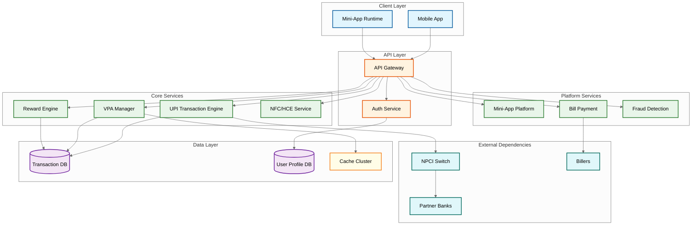

# Interview Guide

## 45-Minute Interview Pacing

| Phase | Duration | Focus | Key Deliverables |
|-------|----------|-------|-----------------|
| **1. Requirements** | 5 min | Super app scope (which features?), target market, transaction volume, regulatory context | Functional requirements, scale numbers, key SLOs |
| **2. High-Level Design** | 7 min | UPI TPP architecture, NPCI integration, core service decomposition | System diagram, UPI transaction flow, component responsibilities |
| **3. Deep Dive** | 13 min | Pick 1--2: UPI transaction engine, rewards/cashback, NFC tap-to-pay, fraud detection | Detailed design with trade-offs for selected areas |
| **4. Scale & Trade-offs** | 12 min | Festival spike handling, NPCI as bottleneck, multi-bank failover, budget contention | Scaling strategy, failure handling, degradation approach |
| **5. Wrap-Up** | 8 min | Observability, security posture, future evolution (CBDC, cross-border UPI) | Prioritized list of improvements |

---

## Phase 1: Requirements Gathering (5 min)

### Questions to Ask the Interviewer

1. **"Which market are we targeting---India (UPI-centric), Southeast Asia (e-wallet-centric), or China (QR-code-centric)?"**
   *Why*: Architectures differ significantly. India means UPI/NPCI integration as the critical path. Southeast Asia means multi-rail e-wallet orchestration. China means closed-loop QR ecosystems. This decision shapes every subsequent design choice.

2. **"Are we the TPP (frontend only) or do we also hold a bank/PPI license (can hold funds)?"**
   *Why*: A TPP routes transactions through NPCI to banks---it never holds money. A PPI license holder can maintain user wallets with stored value. This fundamentally changes the data model, settlement architecture, and regulatory obligations.

3. **"What's the target user base---10M or 500M? Architecture differs at 50x scale."**
   *Why*: At 10M users, a single-region deployment with vertical scaling may suffice. At 500M users, the system needs multi-region active-active, sharded databases, and pre-negotiated NPCI throughput allocations.

4. **"Which features are in scope---just payments, or full super app (mini-apps, lending, insurance)?"**
   *Why*: A payments-only app is a focused UPI client. A super app requires a mini-app platform with sandbox isolation, a financial marketplace with partner integrations, and a rewards engine---each a complex system in its own right.

5. **"Is NFC mandatory or optional?"**
   *Why*: NFC tap-to-pay requires HCE implementation, device TEE integration, tokenization infrastructure, and offline transaction capability. This significantly increases device requirements and architecture complexity.

6. **"What are the regulatory constraints---data localization, KYC levels, transaction limits?"**
   *Why*: RBI mandates data localization for payment data within the country. KYC tiers (minimum, full, video) determine transaction limits and available features. These are hard system invariants.

### Establishing Constraints

```
After discussion, state your assumptions clearly:

"Based on our discussion, I'll design a UPI-based super app payment platform that:
 - Operates as a Third-Party Payment Provider (TPP) on the UPI network
 - Targets 200M+ users with 5B+ monthly transactions
 - Supports UPI P2P, P2M (QR + NFC), bill payments, and rewards/cashback
 - Includes a mini-app marketplace for third-party services
 - Handles festival-scale traffic spikes of 3-4x normal volume
 - Complies with NPCI mandates, RBI data localization, and KYC tiers
 - Targets 99.95% availability for payment flows"
```

---

## Phase 2: High-Level Design (7 min)

### What Makes This System Unique/Challenging

1. **TPP is a Frontend, Not a Backend**: Unlike payment gateways that process payments, a UPI TPP app is a user-facing frontend to NPCI's central switch. The app does not move money---banks do. The TPP's role is device management, VPA lifecycle, fraud screening, and user experience.

2. **Regulatory-Constrained Architecture**: NPCI mandates transaction limits, timeout handling, dispute resolution timelines, and even the 30% market share cap. Architecture decisions are often driven by regulatory requirements, not just technical optimization.

3. **Super App = N Products in One Binary**: The challenge is not building a payment app---it is building a platform that hosts payments, bill pay, NFC, rewards, mini-apps, lending, insurance, and investments in a single mobile app without it becoming bloated or unstable.

4. **External Dependency Dominance**: The system's availability ceiling is set by NPCI and bank APIs, not by the platform itself. No amount of internal scaling helps if the bank's API is down.

### Recommended Approach

1. **Start with the UPI transaction flow** (the critical path). Draw the sequence: user initiates payment -> TPP validates -> request to NPCI switch -> NPCI routes to bank -> bank debits/credits -> response back through NPCI -> TPP notifies user.

2. **Identify core services**: VPA Management, Transaction Engine, Reward/Cashback Engine, NFC/HCE Service, Mini-App Platform, Bill Payment Service, Fraud Detection, Merchant Services.

3. **Draw the platform layers**: Show client layer (mobile app with mini-app runtime), API gateway, core payment services, partner integration layer (NPCI, banks, billers), and data layer.

4. **Highlight the key insight**: The TPP does not control the critical payment path---NPCI does. Show where the platform adds value: pre-transaction (fraud screening, VPA resolution), post-transaction (rewards, notifications), and around-transaction (mini-apps, financial marketplace).

### Quick Reference Architecture



---

## Phase 3: Deep Dive (13 min)

The interviewer will typically ask you to go deep on one or two of these areas.

### Deep Dive Option A: UPI Transaction Engine & NPCI Interaction

**Key points to cover:**
- **Transaction lifecycle**: Collect request -> fraud pre-screen -> VPA resolution -> NPCI submission -> bank processing -> callback handling -> user notification
- **Idempotency**: Client-generated transaction reference number (TxnID) used as idempotency key throughout the chain. Dedup cache prevents double-submission.
- **Timeout handling**: NPCI mandates specific timeout windows. If no response within the window, the transaction status is "pending." A background reconciliation job queries NPCI for final status.
- **Bank failover**: For multi-bank users, if the primary bank's API times out, offer retry through a different linked account (with user consent).
- **Callback processing**: Banks respond asynchronously via NPCI. The callback handler must be idempotent---the same success/failure callback may arrive multiple times.

**Impressive addition**: "We implement effectively-once processing via idempotency keys + dedup cache + idempotent callback handlers. We do not claim exactly-once---that is impossible in the presence of network partitions."

### Deep Dive Option B: Rewards/Cashback Engine

**Key points to cover:**
- **Async evaluation**: Reward evaluation happens post-payment, not inline. The payment flow publishes a transaction event to a message queue; the reward engine consumes it asynchronously.
- **Hierarchical budget counters**: A festival campaign with a global budget is sharded into K budget slices. Each shard independently decrements its allocation. When exhausted, it requests more from the central pool. Over-allocation is managed with a 5% reconciliation buffer.
- **Rule engine**: Campaigns are defined as rules (if merchant_category = "grocery" AND amount > 500 AND user_segment = "new", then cashback = 10%). Rules are versioned and A/B testable.
- **Fraud prevention**: Graph-based detection for circular transaction rings, velocity limits on new accounts, merchant collusion scoring.

### Deep Dive Option C: NFC/HCE Tap-to-Pay

**Key points to cover:**
- **HCE over Secure Element**: Software-based NFC works on all NFC-capable phones without carrier dependency. Keys are stored in device TEE (Trusted Execution Environment).
- **Tokenization**: Actual card/account credentials are never on the device. A cloud-based token service issues device-specific tokens with limited validity.
- **Offline transactions**: Limited offline capability (small amounts, pre-authorized) with deferred settlement when connectivity returns.
- **POS interaction**: The payment flow at a POS terminal follows ISO 14443 contactless protocol. The HCE service emulates a contactless card.

---

## Trade-Off Discussions

### 1. Synchronous vs. Asynchronous Reward Evaluation

| Dimension | Sync (Inline) | Async (Post-Payment) |
|-----------|---------------|---------------------|
| **Latency** | Adds 50--100ms to payment | Zero impact on payment latency |
| **User experience** | User sees cashback immediately | 2--5s delay before reward confirmation |
| **Complexity** | Couples reward logic to payment hot path | Decoupled; reward engine can fail independently |
| **Recommendation** | -- | Async with optimistic display ("checking rewards..." animation post-payment) |

### 2. HCE (Software) vs. Secure Element (Hardware) for NFC

| Dimension | HCE (Software) | Secure Element (Hardware) |
|-----------|----------------|--------------------------|
| **Device support** | All NFC phones | Limited; requires SE chip + carrier support |
| **Security** | Keys in software/TEE | Tamper-resistant hardware |
| **Update cycle** | OTA app updates | Requires carrier coordination |
| **Recommendation** | HCE with device TEE + cloud tokenization + limited offline transactions | -- |

### 3. Single Sponsor Bank vs. Multi-Bank PSP

| Dimension | Single Bank | Multi-Bank |
|-----------|-------------|------------|
| **Integration** | Simpler, better SLA | Complex routing, settlement reconciliation |
| **Resilience** | Single point of failure | Failover capability |
| **Cost** | Less negotiating leverage | Negotiate better rates via competition |
| **Recommendation** | -- | Multi-bank with primary/secondary routing and intelligent failover |

### 4. Monolithic Mini-App Runtime vs. Container-per-App

| Dimension | Shared Runtime (WebView) | Isolated Containers |
|-----------|--------------------------|---------------------|
| **Resource usage** | Lower memory footprint | Higher per-app overhead |
| **Isolation** | One bad mini-app can crash others | Full isolation, resource caps |
| **Launch time** | Fast (shared process) | Slower (process creation) |
| **Recommendation** | WebView-based with process isolation per mini-app + resource caps + watchdog | -- |

---

## Trap Questions and How to Handle Them

### "Why not just use the bank's own app for UPI?"

**Trap**: Tests understanding of the TPP value proposition beyond payments.

**Good answer**: "The TPP adds a unified multi-bank experience (one app, all bank accounts), a rewards and cashback layer (banks do not subsidize merchant cashback at this scale), merchant discovery (QR directory, nearby stores), a mini-app ecosystem (bill pay, travel, investments in one app), and superior UX. Bank apps lack aggregation and the platform play. The TPP's value is the ecosystem, not the payment pipe."

### "If NPCI goes down, what can you do?"

**Trap**: Tests external dependency thinking---whether you are honest about hard limits.

**Good answer**: "Nothing for UPI transactions---it is a hard dependency. Mitigations: show cached balance, queue payments for retry when NPCI recovers, offer IMPS/NEFT fallback for P2P transfers, enable wallet-to-wallet transfers for pre-funded PPI users. The app must still be useful: mini-apps, transaction history, merchant discovery, and bill reminders all work without NPCI. Be honest about the ceiling---over-promising availability when NPCI is down destroys credibility."

### "How do you prevent cashback fraud at scale?"

**Trap**: Tests fraud detection depth beyond basic rate limiting.

**Good answer**: "Graph-based detection identifies circular transaction rings (A pays B, B pays C, C pays A to generate cashback). Device fingerprinting catches multi-accounting (same device, multiple accounts). Velocity limits restrict new accounts for 30 days. Merchant collusion scoring flags unusual refund patterns (merchant refunds immediately after cashback credit). Behavioral analytics detect amount-splitting patterns designed to maximize per-transaction cashback. Human review for high-value anomalies above automated thresholds."

### "Why not build your own payment switch instead of depending on NPCI?"

**Trap**: Tests regulatory awareness---whether you understand that this is not a technical choice.

**Good answer**: "NPCI is a regulatory mandate. All UPI transactions must route through the NPCI switch---this is mandated by RBI. Building a parallel switch is not a technical option; it is a regulatory impossibility. The TPP can optimize everything around the switch---VPA resolution caching, fraud pre-screening, reward evaluation---but cannot bypass it. The same constraint exists in card networks (all transactions must traverse the card network switch) and SWIFT for international transfers."

### "Can you guarantee exactly-once payment processing?"

**Trap**: Tests distributed systems fundamentals.

**Good answer**: "No system can guarantee exactly-once in the presence of network partitions---this is a fundamental distributed systems result. We implement effectively-once via three mechanisms: client-generated idempotency keys (transaction reference number), a server-side dedup cache (check before processing), and idempotent bank callbacks (reprocessing the same callback is a no-op). The pattern is at-least-once delivery + idempotent handlers = effectively-once semantics."

### "How would you handle 10x growth during Diwali?"

**Trap**: Tests scaling thinking beyond "add more servers."

**Good answer**: "Pre-scale 2 weeks before using historical festival traffic data. Shed non-essential features (disable mini-app marketplace, reduce reward evaluation frequency, defer analytics pipelines). NPCI coordinates with banks for increased throughput allocations---this must be pre-negotiated, not reactive. Implement request prioritization: P2M merchant payments take priority over P2P transfers. Use circuit breakers aggressively to prevent cascade failures when individual banks become slow. Pre-warm all caches (VPA resolution, user profiles, fraud features) from production data."

---

## Common Mistakes to Avoid

| # | Mistake | Why It's Wrong |
|---|---------|---------------|
| 1 | Treating TPP as a payment processor | The TPP is a frontend to NPCI, not a money mover. It never holds or transfers funds. |
| 2 | Ignoring NPCI as an external hard dependency | NPCI caps your availability. No internal scaling bypasses this. |
| 3 | Designing rewards synchronously in the payment hot path | Adds latency to every payment. Reward evaluation should be async. |
| 4 | Forgetting regulatory constraints | Transaction limits, data localization, KYC tiers, and market share caps are system invariants, not business rules. |
| 5 | Over-engineering NFC when QR code dominates | QR code handles 80%+ of P2M transactions. NFC is a secondary channel. |
| 6 | Not discussing the mini-app sandbox security model | Untrusted third-party code running inside the app is a critical security boundary. |
| 7 | Ignoring two-sided marketplace dynamics | User acquisition and merchant acquisition are coupled. Losing one side degrades the other. |
| 8 | Designing for day-1 scale | Discuss progressive scaling: start with single-bank, single-region, and explain the scaling roadmap. |

---

## Meta-Commentary for Interview Strategy

- **Spend most time on UPI TPP architecture and NPCI interaction**---this is the unique differentiator of this system design. Candidates who treat it as a generic payment gateway miss the point entirely.
- **Rewards/cashback is a great deep-dive topic** showing distributed systems challenges: budget contention with hierarchical counters, fraud detection with graph analysis, and campaign rule engines.
- **NFC/HCE demonstrates embedded systems + distributed systems intersection**---discuss only if asked, as it is a specialized topic.
- **Do not forget the mini-app platform**---it shows platform thinking: sandbox design, permission models, resource isolation, and ecosystem growth strategy.
- **The strongest candidates** will articulate the TPP paradox: the platform's most critical dependency (NPCI) is entirely outside its control, and the architecture must maximize the value of everything around it.

---

## Scoring Rubric

### Junior Level (Meets Bar)
- Identifies UPI as a bank-to-bank transfer system routed through NPCI
- Designs basic payment flow with VPA resolution
- Mentions QR code scanning for P2M payments
- Basic understanding of transaction idempotency
- Recognizes the need for a rewards system

### Senior Level (Strong Hire)
- Designs the complete TPP architecture with NPCI integration
- Handles VPA resolution caching with staleness trade-offs
- Discusses effectively-once semantics with idempotency keys
- Designs async reward evaluation with budget contention handling
- Proposes multi-bank failover with intelligent routing
- Addresses regulatory constraints (transaction limits, data localization)
- Discusses graceful degradation when NPCI or banks are unavailable

### Staff Level (Exceptional)
- Articulates the TPP paradox and architects around external dependency dominance
- Designs hierarchical budget counters for festival-scale cashback campaigns
- Proposes HCE-based NFC with cloud tokenization and offline capability
- Designs the mini-app sandbox with process isolation and permission model
- Discusses festival spike engineering with predictive pre-scaling
- Analyzes the 30% market share cap as a system-level constraint
- Proposes CBDC and cross-border UPI as architectural evolution paths
