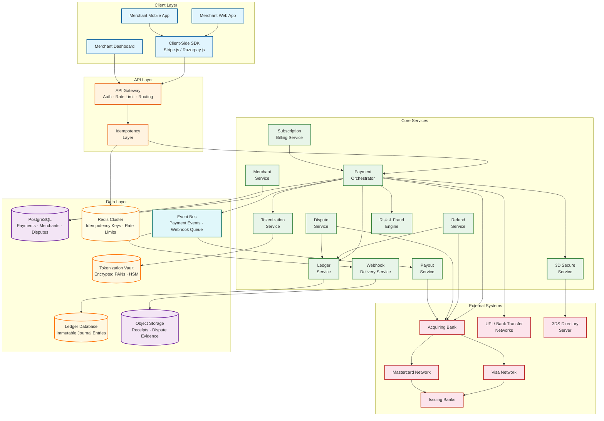
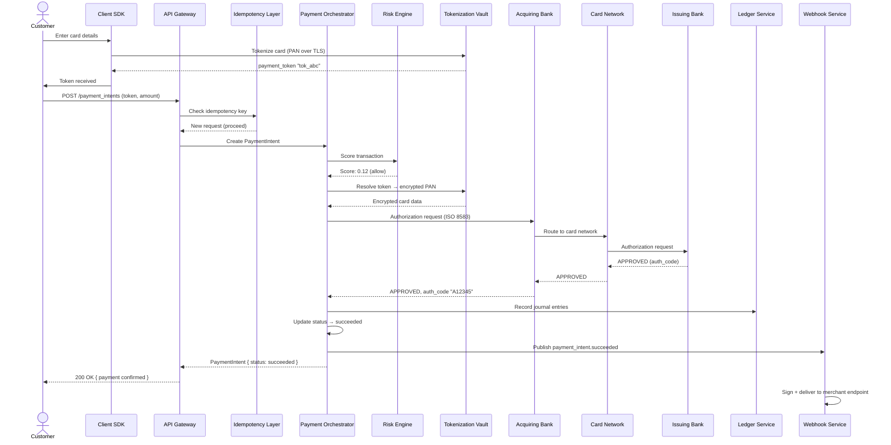
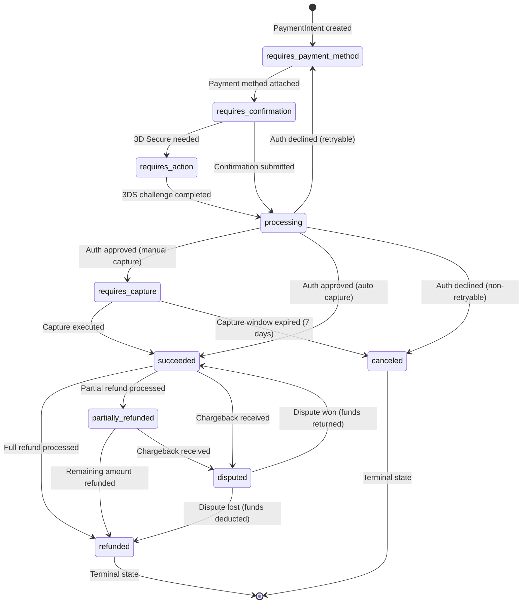

# High-Level Design

## Architecture Overview

The payment gateway follows a **state-machine-driven orchestration** pattern for payment processing and an **event-driven fan-out** pattern for webhook delivery. The architecture is shaped by three realities: (1) every payment operation must be idempotent because network failures are inevitable; (2) the card network is an external authority that controls authorization outcomes; (3) every financial movement must be recorded in a balanced double-entry ledger.



---

## Service Responsibilities

| Service | Responsibility | Key Characteristics |
|---------|---------------|---------------------|
| **Payment Orchestrator** | Coordinate payment lifecycle: create → authorize → capture → settle; manage state machine transitions | Stateful (per-payment state machine), idempotent, saga-based |
| **Tokenization Service** | Convert raw card data (PAN) into tokens; manage card-on-file; integrate with network tokenization | PCI-DSS scoped, HSM-backed encryption, isolated network segment |
| **3D Secure Service** | Orchestrate cardholder authentication via 3DS2 protocol; risk-based challenge decisions | Integrates with card network directory servers; adds 3-10s to flow |
| **Risk & Fraud Engine** | Real-time fraud scoring on every transaction; rule-based and ML-based detection | Sub-100ms decision latency; features: velocity, device fingerprint, geolocation |
| **Refund Service** | Process full/partial refunds; validate against original payment; update ledger | Idempotent, ledger-integrated, card network submission |
| **Dispute Service** | Receive chargebacks from card networks; manage representment evidence; track lifecycle | Event-driven from card network notifications; 9-30 day response windows |
| **Ledger Service** | Record every financial movement as balanced double-entry journal entries | Append-only, immutable, reconciliation-verified |
| **Payout Service** | Aggregate captured funds minus fees/refunds/reserves; disburse to merchant bank accounts | Batch processing, settlement cycle management (T+2) |
| **Webhook Delivery Service** | Fan-out payment events to merchant endpoints; retry with exponential backoff; signature verification | At-least-once delivery, per-endpoint circuit breaker, 3-day retry window |
| **Merchant Service** | Onboarding, KYC/KYB, API key management, configuration, rate assignment | CRUD, risk scoring, tiered access |
| **Subscription Billing** | Recurring payment scheduling, dunning, proration, plan management | Cron-based charge initiation, smart retry on failure |

---

## Data Flow 1: Card Payment --- Authorize and Capture

```
Customer clicks "Pay $99.00" on merchant's checkout page

1. Merchant's frontend → Client SDK (Stripe.js/Razorpay.js)
   - SDK collects card details in an iframe (merchant never sees raw PAN)
   - SDK sends card data directly to Tokenization Service over TLS 1.3
   - Tokenization Service returns a one-time payment token: "tok_abc123"

2. Merchant's backend → API Gateway: POST /v1/payment_intents
   - Headers: Idempotency-Key: "order_12345_attempt_1"
   - Body: { amount: 9900, currency: "usd", payment_method: "tok_abc123", capture_method: "automatic" }

3. API Gateway → Idempotency Layer:
   - Hash(idempotency_key + merchant_id) → check Redis
   - Cache MISS → proceed (first request)
   - Create idempotency record: { key, status: "in_progress", created_at }

4. Idempotency Layer → Payment Orchestrator:
   - Create PaymentIntent: { id: "pi_xyz789", status: "requires_confirmation" }
   - Persist to PostgreSQL

5. Payment Orchestrator → Risk Engine:
   - Fraud score: 0.12 (low risk) → proceed
   - High risk (>0.8) → block or require 3D Secure

6. Payment Orchestrator → Tokenization Service:
   - Resolve "tok_abc123" → retrieve encrypted PAN from vault
   - Decrypt PAN using HSM

7. Payment Orchestrator → Acquiring Bank (ISO 8583):
   - Authorization request: PAN, amount, currency, merchant ID, CVV
   - Acquiring Bank → Card Network (Visa/Mastercard)
   - Card Network → Issuing Bank: "Authorize $99.00 on card ending 4242"
   - Issuing Bank checks: sufficient funds, fraud rules, spending limits
   - Issuing Bank → Card Network → Acquiring Bank → Payment Orchestrator
   - Response: APPROVED, auth_code: "A12345"

8. Payment Orchestrator: transition PaymentIntent status
   - "requires_confirmation" → "succeeded" (if capture_method=automatic)
   - If capture_method=manual: → "requires_capture" (hold funds, capture later)

9. Payment Orchestrator → Ledger Service:
   - Journal entry: DEBIT merchant_receivable $99.00, CREDIT customer_payable $99.00
   - Journal entry: DEBIT platform_fee $2.87, CREDIT merchant_receivable $2.87

10. Payment Orchestrator → Event Bus: publish "payment_intent.succeeded"

11. Webhook Delivery Service (async):
    - Fetch merchant's configured endpoint: "https://merchant.com/webhooks/stripe"
    - Sign payload with merchant's webhook secret (HMAC-SHA256)
    - POST to endpoint; expect 2xx within 10 seconds
    - On failure: schedule retry with exponential backoff

12. Idempotency Layer: update record
    - { key, status: "complete", response_code: 200, response_body_hash }
```

---

## Data Flow 2: Webhook Delivery Pipeline

```
Payment event occurs (e.g., payment_intent.succeeded)

1. Payment Orchestrator → Event Bus: publish event
   - Event: { id: "evt_001", type: "payment_intent.succeeded", data: {...}, created: timestamp }

2. Webhook Delivery Service consumes from Event Bus:
   - Lookup merchant's webhook configuration:
     - Endpoint URL: "https://merchant.com/webhooks"
     - Active events: ["payment_intent.succeeded", "charge.refunded", ...]
     - Webhook secret: "whsec_..."
   - Filter: does this event match subscribed types? YES → deliver

3. Construct webhook payload:
   - Body: JSON event object
   - Timestamp: current Unix timestamp
   - Signature: HMAC-SHA256(timestamp + "." + body, webhook_secret)
   - Header: Stripe-Signature: t={timestamp},v1={signature}

4. Deliver via HTTPS POST:
   - Timeout: 10 seconds
   - Expect: HTTP 2xx response

5. On SUCCESS (2xx):
   - Mark delivery: { event_id, endpoint_id, attempt: 1, status: "delivered", response_code: 200 }

6. On FAILURE (non-2xx, timeout, connection error):
   - Schedule retry with exponential backoff + jitter:
     - Attempt 2: ~1 minute
     - Attempt 3: ~5 minutes
     - Attempt 4: ~30 minutes
     - Attempt 5: ~2 hours
     - Attempt 6: ~8 hours
     - Attempt 7: ~24 hours
     - Attempt 8: ~48 hours
     - Attempt 9: ~72 hours (final attempt)
   - After 3 days of continuous failure: disable endpoint, notify merchant via email

7. Dead Letter Queue:
   - Events that exhaust all retries → move to DLQ
   - Merchant can replay from DLQ via dashboard or API
```

---

## Data Flow 3: Payment Authorization Sequence



---

## PaymentIntent State Machine



---

## Key Architectural Decisions

| Decision | Choice | Rationale |
|----------|--------|-----------|
| **Idempotency implementation** | Client-provided key + server-side deduplication in Redis | Client controls retry semantics; Redis provides sub-ms lookup; 24h TTL prevents unbounded storage |
| **Payment state management** | Explicit state machine with persisted transitions | Every status change is auditable; prevents invalid transitions; enables recovery from any state |
| **Card data handling** | Client-side tokenization via SDK iframe | Raw PAN never touches merchant's servers; reduces merchant PCI scope to SAQ-A |
| **Ledger architecture** | Append-only double-entry with immutable journal | Financial integrity requires no updates/deletes; audit trail built in; reconciliation by summing entries |
| **Webhook delivery** | At-least-once with idempotency burden on consumer | Exactly-once delivery is impossible over HTTP; at-least-once with signed payloads is the practical choice |
| **Authorization flow** | Async via acquiring bank using ISO 8583 | Industry standard; acquiring bank manages card network connectivity and PCI infrastructure |
| **Capture strategy** | Support both automatic and manual capture | E-commerce needs auto-capture; marketplaces need manual capture (charge when shipped) |
| **Event streaming** | Event bus for all payment lifecycle events | Decouples webhook delivery, analytics, ledger recording from payment critical path |
| **Multi-currency** | FX rate locked at authorization time | Prevents rate fluctuation between auth and settlement; merchant sees predictable amounts |

---

## Technology Choices

| Component | Technology | Rationale |
|-----------|-----------|-----------|
| **Primary Database** | PostgreSQL | ACID for payment records, merchant data, disputes; strong consistency required |
| **Idempotency Store** | Redis Cluster | Sub-ms key lookup; native TTL support; 200 GB fits in cluster |
| **Tokenization Vault** | Dedicated encrypted datastore + HSM | PCI-DSS requires isolated storage; HSM for key management; network-segmented |
| **Ledger Database** | Append-only PostgreSQL or purpose-built ledger DB | Immutable writes; no UPDATE/DELETE; optimized for sequential inserts and sum queries |
| **Event Streaming** | Distributed event bus (log-based broker) | Durable event log; ordered delivery per partition; replay capability |
| **Webhook Queue** | Priority queue backed by event bus | Per-endpoint delivery tracking; retry scheduling; DLQ support |
| **Object Storage** | Cloud object storage | Receipts, dispute evidence files, compliance archives |
| **API Gateway** | Rate limiting, auth, TLS termination | Protect payment path; enforce per-merchant rate limits; API key validation |
| **Fraud Engine** | Real-time scoring service with ML model | Sub-100ms decision; feature store for velocity checks, device fingerprinting |
