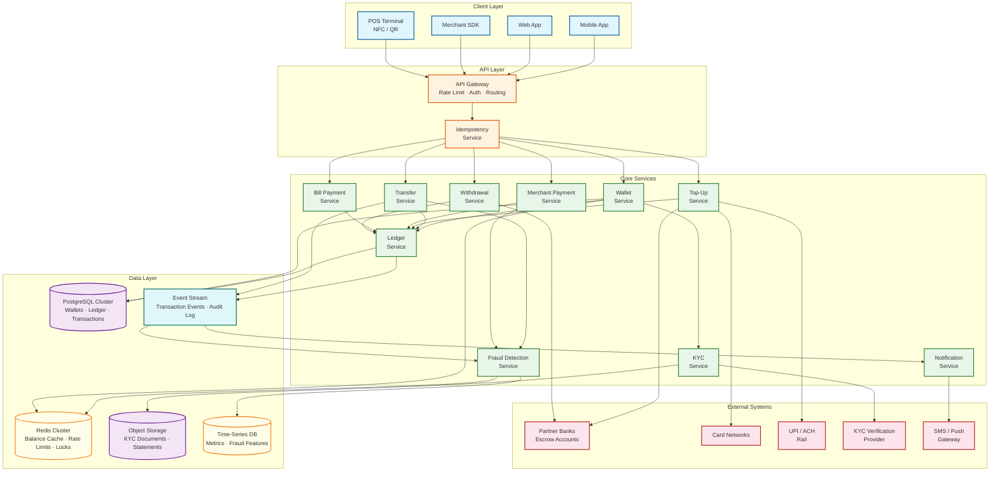
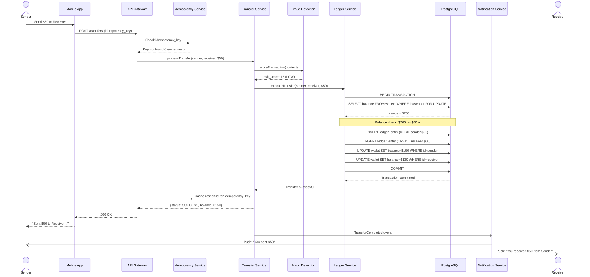
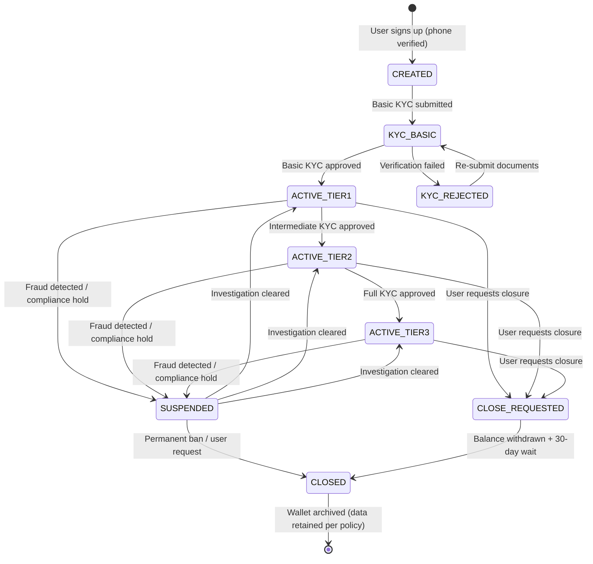
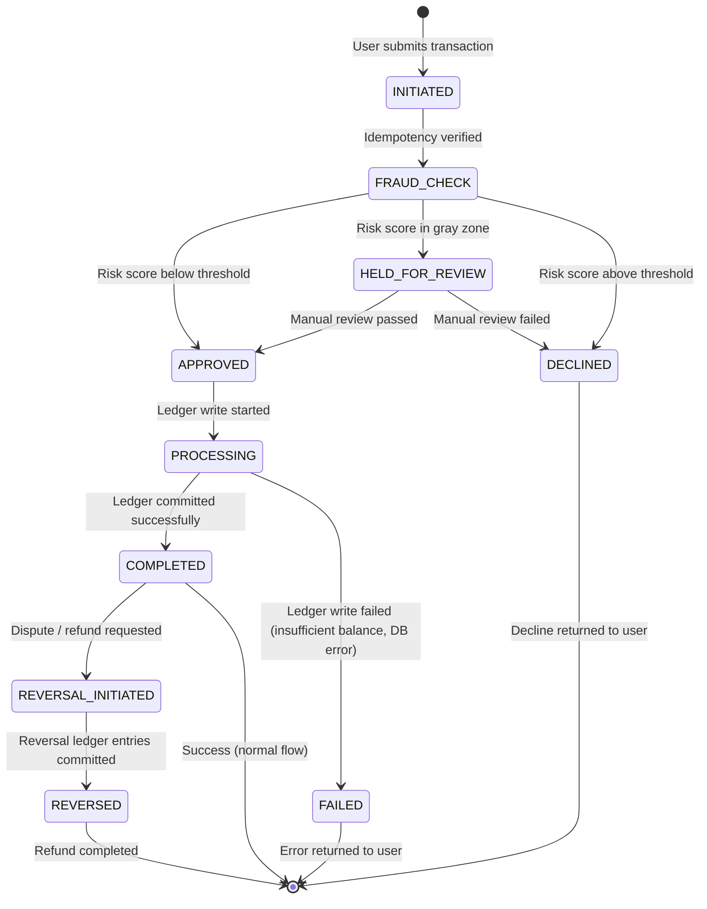

# High-Level Design

## Architecture Overview

The digital wallet system follows a **ledger-centric** architecture where the double-entry ledger is the single source of truth for all financial state. Every service that moves money does so by writing journal entries to the ledger. The architecture is shaped by three realities: (1) ledger consistency is non-negotiable---every debit must have a corresponding credit; (2) balance checks and debits must be atomic to prevent double-spend; (3) user funds are custodial, requiring clean separation between user balances and platform revenue.



---

## Service Responsibilities

| Service | Responsibility | Key Characteristics |
|---------|---------------|---------------------|
| **Wallet Service** | Wallet lifecycle (create, suspend, close), balance queries, KYC tier enforcement, linked instrument management | Read-heavy; owns wallet metadata; delegates financial ops to Ledger |
| **Ledger Service** | Append journal entries (double-entry), compute running balances, atomic balance-check-and-debit | Write-heavy; ACID; sharded by wallet ID; append-only |
| **Transfer Service** | Orchestrate P2P transfers: validate → fraud check → debit sender → credit receiver | Saga coordinator for cross-shard transfers; idempotent |
| **Top-Up Service** | Orchestrate wallet loading: initiate bank/card charge → on confirmation → credit wallet | Async confirmation from external payment rails |
| **Merchant Payment Service** | Process QR/NFC payments: decode payment request → debit user → credit merchant → record fee | Sub-second latency critical; inline fraud check |
| **Bill Payment Service** | Process bill payments to biller integrations; handle async confirmation and receipt | Integrates with biller aggregators |
| **Withdrawal Service** | Transfer wallet balance to linked bank account; enforce limits | Subject to KYC tier withdrawal limits; T+0 to T+1 |
| **KYC Service** | Manage identity verification lifecycle; document storage; tier assignment | Integrates with external verification providers |
| **Fraud Detection Service** | Real-time transaction risk scoring; velocity checks; device fingerprinting; behavioral analysis | ML model inference < 100ms; feature store in time-series DB |
| **Notification Service** | Transaction confirmations, payment requests, promotional notifications | Event-driven; multi-channel (push, SMS, email) |
| **Idempotency Service** | Deduplicate requests using client-provided idempotency keys | Redis-backed; prevents double-charges on network retries |

---

## Data Flow 1: P2P Transfer (Same Shard)

```
User A sends $50 to User B (both wallets on same database shard)

1. Mobile App → API Gateway → Transfer Service
   - Request includes: sender_wallet_id, receiver_phone, amount, idempotency_key
2. Idempotency Service: check if idempotency_key already processed
   - Key exists → return cached response (prevent double-transfer)
   - Key new → proceed
3. Transfer Service → Wallet Service: resolve receiver by phone number
   - Returns receiver_wallet_id
4. Transfer Service → Fraud Detection Service: score transaction
   - Input: sender profile, receiver profile, amount, device fingerprint, velocity features
   - Output: risk_score = 12 (low risk, threshold = 70) → proceed
5. Transfer Service → Ledger Service: execute atomic transfer
   BEGIN TRANSACTION
     a. Read sender balance (SELECT ... FOR UPDATE on wallet row)
        - balance = $200 → sufficient
     b. Insert ledger entry: DEBIT sender_wallet $50 (journal_id: J-001)
     c. Insert ledger entry: CREDIT receiver_wallet $50 (journal_id: J-001)
     d. Update sender cached balance: $200 → $150
     e. Update receiver cached balance: $80 → $130
   COMMIT
6. Transfer Service → Kafka: publish TransferCompleted event
7. Notification Service (async):
   - Push to sender: "You sent $50 to User B"
   - Push to receiver: "You received $50 from User A"
8. Return to sender: {status: "SUCCESS", new_balance: $150, txn_id: "TXN-123"}
```

---

## Data Flow 2: Merchant QR Payment

```
User scans merchant QR code to pay $25 for coffee

1. POS displays QR code containing: merchant_id, amount, order_ref, nonce
2. User's mobile app scans QR → decodes payment request
3. App displays: "Pay $25 to Coffee Shop?" → User confirms with biometric
4. Mobile App → API Gateway → Merchant Payment Service
   - Request: user_wallet_id, merchant_id, amount: $25, qr_nonce, idempotency_key
5. Idempotency check → new request → proceed
6. Fraud Detection: inline risk scoring (< 50ms)
   - Velocity check: user's 5th payment today (normal for this user) → low risk
7. Merchant Payment Service → Ledger Service: atomic payment
   BEGIN TRANSACTION
     a. SELECT sender balance FOR UPDATE: $150 ≥ $25 → proceed
     b. DEBIT user_wallet $25 (journal_id: J-002)
     c. CREDIT merchant_wallet $24.50 (journal_id: J-002, after 2% fee)
     d. CREDIT platform_fee_account $0.50 (journal_id: J-002)
     e. Update cached balances
   COMMIT
8. Kafka: publish MerchantPaymentCompleted event
9. Notifications (async):
   - Push to user: "Paid $25 to Coffee Shop"
   - Push to merchant POS: "Payment received $24.50"
   - Webhook to merchant backend: payment confirmation with order_ref
10. Return to user app: {status: "SUCCESS", new_balance: $125}
    → App shows green checkmark with amount
```

---

## Data Flow 3: Wallet Top-Up via Bank Transfer

```
User loads $500 into wallet from linked bank account

1. Mobile App → API Gateway → Top-Up Service
   - Request: wallet_id, amount: $500, source: linked_bank_account_id, idempotency_key
2. KYC tier check: user is Tier 2 (intermediate KYC)
   - Monthly top-up limit: $5,000; used this month: $2,000 → $500 allowed
3. Top-Up Service → Bank Integration: initiate debit from user's bank account
   - ACH/UPI/NEFT request with callback URL
4. Return to user: {status: "PROCESSING", estimated_time: "30 seconds to 2 minutes"}
5. --- Async bank confirmation ---
   Bank sends callback: {status: "SUCCESS", bank_ref: "BANK-789"}
6. Top-Up Service → Ledger Service: credit wallet
   BEGIN TRANSACTION
     a. INSERT ledger entry: DEBIT escrow_bank_account $500 (journal_id: J-003)
     b. INSERT ledger entry: CREDIT user_wallet $500 (journal_id: J-003)
     c. Update cached balance: $125 → $625
   COMMIT
7. Kafka: publish TopUpCompleted event
8. Notification → Push: "Your wallet has been loaded with $500. New balance: $625"
```

---

## Data Flow 4: P2P Transfer Sequence Diagram



---

## Wallet Lifecycle State Diagram



---

## Transaction State Diagram



---

## Key Architectural Decisions

| Decision | Choice | Rationale |
|----------|--------|-----------|
| **Ledger model** | Double-entry with immutable journal entries | Accounting standard; enables full audit trail; ensures books always balance |
| **Balance storage** | Materialized balance field + ledger entries | Balance = SUM(credits) - SUM(debits) is too slow for real-time queries; materialize and update atomically with ledger writes |
| **Concurrency control** | Pessimistic locking (SELECT FOR UPDATE) on wallet row | Prevents double-spend; acceptable contention for per-user serialization |
| **P2P cross-shard** | Saga with transfer ledger as intermediary | Sender and receiver on different shards cannot share a transaction; saga ensures atomicity |
| **Idempotency** | Client-provided idempotency key, server-side dedup | Network retries must not cause double-charges; Redis TTL for key expiry |
| **Fraud detection** | Inline (synchronous) for all transactions | Reject high-risk transactions before ledger write; < 100ms latency budget |
| **Event streaming** | Kafka for transaction lifecycle events | Decouples notifications, analytics, fraud feature updates from transaction critical path |
| **Top-up confirmation** | Async with bank callback | Bank transfers are inherently async (ACH/NEFT); wallet credit happens on confirmation |
| **KYC tiering** | Progressive unlock with per-tier limits | Regulatory requirement; balances friction (easy onboard) with compliance (full verification for high limits) |

---

## Technology Choices

| Component | Technology | Rationale |
|-----------|-----------|-----------|
| **Ledger Database** | PostgreSQL (sharded by wallet_id) | ACID for financial transactions; mature; row-level locking for concurrency control |
| **Balance Cache** | Redis Cluster | Sub-ms balance reads; distributed locks for cross-shard coordination |
| **Event Streaming** | Kafka | Durable event log for transaction events, audit trail, fraud feature pipeline |
| **Object Storage** | Cloud object storage | KYC documents, account statements, regulatory archives |
| **Time-Series DB** | Time-series database | Fraud feature store (velocity counters, behavioral timeseries), metrics |
| **API Gateway** | Rate limiting, JWT auth, TLS termination | Protect against abuse; authenticate; route to services |
| **Fraud ML Model** | Real-time inference service | Risk scoring within 100ms; feature store for model inputs |
| **Notification** | Push gateway + SMS provider | Multi-channel transaction alerts; regulatory requirement for debit notifications |

---

## Double-Entry Ledger: Conceptual Model

Every financial operation is expressed as a journal entry with balanced debits and credits:

```
Journal Entry J-001: P2P Transfer ($50, User A → User B)
┌─────────────────────┬──────────┬──────────┐
│ Account             │ Debit    │ Credit   │
├─────────────────────┼──────────┼──────────┤
│ User A Wallet       │ $50.00   │          │
│ User B Wallet       │          │ $50.00   │
├─────────────────────┼──────────┼──────────┤
│ Total               │ $50.00   │ $50.00   │ ← Must always balance
└─────────────────────┴──────────┴──────────┘

Journal Entry J-002: Merchant Payment ($25, User → Coffee Shop, 2% fee)
┌─────────────────────┬──────────┬──────────┐
│ Account             │ Debit    │ Credit   │
├─────────────────────┼──────────┼──────────┤
│ User Wallet         │ $25.00   │          │
│ Merchant Wallet     │          │ $24.50   │
│ Platform Fee Account│          │ $0.50    │
├─────────────────────┼──────────┼──────────┤
│ Total               │ $25.00   │ $25.00   │ ← Must always balance
└─────────────────────┴──────────┴──────────┘

Journal Entry J-003: Wallet Top-Up ($500, Bank → User)
┌─────────────────────┬──────────┬──────────┐
│ Account             │ Debit    │ Credit   │
├─────────────────────┼──────────┼──────────┤
│ Escrow Bank Account │ $500.00  │          │
│ User Wallet         │          │ $500.00  │
├─────────────────────┼──────────┼──────────┤
│ Total               │ $500.00  │ $500.00  │ ← Must always balance
└─────────────────────┴──────────┴──────────┘
```

### Chart of Accounts

```
Account Types in the Wallet System:
├── ASSET accounts
│   ├── Escrow Bank Account (money held at partner bank on behalf of users)
│   └── Receivables (pending bank settlements)
├── LIABILITY accounts
│   ├── User Wallet accounts (money owed to users)
│   └── Merchant Wallet accounts (money owed to merchants)
├── REVENUE accounts
│   ├── Transaction Fee Revenue
│   ├── Withdrawal Fee Revenue
│   └── FX Markup Revenue
└── EXPENSE accounts
    ├── Bank Transfer Costs
    ├── Payment Processing Costs
    └── Cashback/Promotional Expense
```
