# Security & Compliance

## Threat Model

### Attack Surface

```mermaid
flowchart TB
    subgraph External["External Threats"]
        AT[Account Takeover]
        SF[Synthetic Identity Fraud]
        FR[Fraud Rings]
        FT[Friendly Fraud]
        ME[Model Evasion]
        DI[Data Injection]
    end

    subgraph System["System Attack Surface"]
        API[Scoring API]
        RM[Rule Management]
        CM[Case Management Portal]
        FS[Feature Store]
        ML[ML Pipeline]
        GR[Graph Database]
    end

    subgraph Internal["Internal Threats"]
        IA[Insider Abuse]
        MP[Model Poisoning]
        DE[Data Exfiltration]
    end

    AT -->|Stolen credentials| API
    SF -->|Fabricated identities| API
    FR -->|Coordinated attacks| API
    FT -->|False chargebacks| CM
    ME -->|Adversarial inputs| API
    DI -->|Poisoned training data| ML

    IA -->|Privilege abuse| RM
    IA -->|Whitelist manipulation| CM
    MP -->|Label manipulation| ML
    DE -->|Bulk export| FS

    classDef external fill:#ffebee,stroke:#c62828,stroke-width:2px
    classDef system fill:#e8f5e9,stroke:#2e7d32,stroke-width:2px
    classDef internal fill:#fff3e0,stroke:#e65100,stroke-width:2px

    class AT,SF,FR,FT,ME,DI external
    class API,RM,CM,FS,ML,GR system
    class IA,MP,DE internal
```



### Threat Categories and Mitigations

| Threat | Severity | Likelihood | Mitigation |
|--------|----------|-----------|------------|
| **Model evasion** (adversarial inputs) | High | High | Ensemble diversity, adversarial training, rule safety net |
| **Model poisoning** (corrupted training data) | Critical | Medium | Label audit trail, analyst consistency checks, outlier detection in labels |
| **Insider whitelist abuse** | Critical | Low | Dual-approval for whitelist changes, audit logs, time-limited overrides |
| **Feature store data injection** | High | Low | Input validation, anomaly detection on feature distributions, write-path authentication |
| **Scoring API abuse** (probing) | Medium | High | Rate limiting, API key rotation, request signature verification |
| **Data exfiltration** (PII in features) | Critical | Medium | Field-level encryption, access logging, data masking in non-prod |
| **Rule manipulation** | High | Low | Version control, approval workflow, rollback capability |
| **Case management fraud** (false dispositions) | High | Low | Supervisor review sampling, disposition audit, analyst performance tracking |

---

## Authentication & Authorization

### Service-Level Authentication

The scoring API is called by internal payment services, not end users directly:

```
Authentication flow:
  1. Payment service authenticates with mutual TLS (mTLS)
  2. Service identity extracted from client certificate
  3. Service token validated against service registry
  4. Request signed with HMAC-SHA256 (prevents tampering in transit)

API key scoping:
  - scoring:read  — Call /v1/transactions/score (payment services)
  - rules:write   — Create/update rules (fraud ops team)
  - cases:write   — Update case dispositions (fraud analysts)
  - models:deploy — Deploy new model versions (ML engineers)
  - admin:*       — Full access (fraud system administrators)
```

### Role-Based Access Control (RBAC)

| Role | Scoring API | Rules | Cases | Models | Reports | Admin |
|------|-----------|-------|-------|--------|---------|-------|
| Payment Service | Read | — | — | — | — | — |
| Fraud Analyst | Read | Read | Read/Write own | Read | Read | — |
| Senior Analyst | Read | Read | Read/Write all | Read | Read/Write | — |
| Fraud Ops Manager | Read | Read/Write | Read/Write all | Read | Read/Write | — |
| ML Engineer | Read | Read | Read | Read/Write | Read | — |
| Compliance Officer | Read | Read | Read | Read | Read/Write | — |
| System Admin | Full | Full | Full | Full | Full | Full |

### Sensitive Operation Controls

```
Dual-Approval Required:
  - Adding entity to global whitelist
  - Disabling a rule with > 1000 triggers/day
  - Deploying model with AUC below threshold
  - Bulk case disposition (> 50 cases)
  - Modifying scoring thresholds in production

Time-Bounded Overrides:
  - Manual transaction allow-override: max 24 hours
  - Emergency rule disable: max 4 hours, auto-reactivated
  - Threshold relaxation: max 2 hours, requires incident ticket

Audit trail:
  - Every configuration change logged with: who, what, when, why, approval chain
  - Immutable audit log (append-only, separate storage with restricted access)
  - 7-year retention for regulatory compliance
```

---

## Data Protection

### Data Classification

| Classification | Examples | Storage | Access | Retention |
|---------------|---------|---------|--------|-----------|
| **Restricted** | Card numbers, SSN, bank account numbers | Encrypted at rest + in transit; tokenized | Need-to-know; audit-logged | PCI-DSS: minimize; delete after tokenization |
| **Confidential** | User PII (name, email, phone, address) | Encrypted at rest + in transit | Role-based; masked in logs | GDPR: until deletion request + legal hold |
| **Internal** | Transaction amounts, timestamps, scores | Encrypted at rest + in transit | Team-based access | 2-7 years (regulatory) |
| **Operational** | Model metrics, system logs, performance data | Standard encryption | Engineering teams | 90 days hot, 1 year archived |

### Encryption Strategy

```
At rest:
  - Feature store: AES-256 encryption with key rotation every 90 days
  - Database: Transparent data encryption (TDE)
  - Model artifacts: Encrypted with ML pipeline service key
  - Backups: Encrypted with separate backup key

In transit:
  - All inter-service: mTLS (TLS 1.3 minimum)
  - External API: TLS 1.2+ with certificate pinning
  - Event bus: Envelope encryption (per-message keys)

Key management:
  - Managed KMS for encryption keys
  - Separate key hierarchies for prod, staging, dev
  - Key rotation: automated, zero-downtime
```

### PII Handling in the ML Pipeline

The ML pipeline must handle PII carefully to prevent leakage into model artifacts:

```
FUNCTION prepare_training_data(raw_data):
    // Step 1: Tokenize PII before feature engineering
    FOR record IN raw_data:
        record.card_number = TOKEN_VAULT.tokenize(record.card_number)
        record.ssn = REDACT(record.ssn)  // Not used as feature
        record.name = REDACT(record.name)
        record.email = HASH(record.email)  // Used as entity key only
        record.phone = HASH(record.phone)
        record.ip_address = ANONYMIZE_TO_SUBNET(record.ip_address, prefix_length=24)

    // Step 2: Derived features use anonymized/aggregated data
    features = COMPUTE_FEATURES(raw_data)

    // Step 3: Verify no PII in feature vector
    FOR feature_name IN features.columns:
        ASSERT feature_name NOT IN PII_FIELD_REGISTRY
        ASSERT NOT CONTAINS_PII_PATTERN(features[feature_name])

    RETURN features
```

---

## Compliance Framework

### Regulatory Requirements

| Regulation | Scope | Key Requirements for Fraud Detection |
|-----------|-------|--------------------------------------|
| **PCI-DSS v4.0** | Payment card data | Encrypt cardholder data; restrict access; maintain audit trails; quarterly vulnerability scans |
| **GDPR / CCPA** | EU/California user data | Right to explanation of automated decisions; data minimization; right to erasure; consent for profiling |
| **BSA/AML** | US financial institutions | File SARs for suspicious activity > $5,000; maintain transaction records; implement CDD program |
| **PSD2 SCA** | EU payment services | Strong Customer Authentication for electronic payments; exemptions for low-risk transactions |
| **SOX** | Publicly traded companies | Internal controls over financial reporting; audit trail integrity |
| **FCRA** | Consumer credit decisions | Adverse action notice when declining based on consumer report data |

### SAR Filing Workflow

```mermaid
flowchart LR
    subgraph Detection["Detection"]
        CF[Confirmed Fraud Case]
        PT[Pattern Threshold<br/>Exceeded]
    end

    subgraph Evaluation["SAR Evaluation"]
        SE[SAR Evaluator]
        TA[Threshold Analysis<br/>Amount > $5,000?]
        PA[Pattern Analysis<br/>Structured to avoid<br/>reporting?]
    end

    subgraph Filing["Filing Process"]
        NG[Narrative Generation<br/>Auto-draft from case data]
        AR[Analyst Review<br/>Edit and approve narrative]
        CO[Compliance Officer<br/>Final review and sign-off]
        SF[Submit to<br/>Regulatory Authority]
    end

    subgraph Tracking["Post-Filing"]
        TR[Track Acknowledgment]
        FU[Follow-up Filing<br/>if ongoing activity]
    end

    CF --> SE
    PT --> SE
    SE --> TA
    SE --> PA
    TA -->|Yes| NG
    PA -->|Yes| NG
    NG --> AR --> CO --> SF --> TR --> FU

    classDef detection fill:#ffebee,stroke:#c62828,stroke-width:2px
    classDef eval fill:#fff3e0,stroke:#e65100,stroke-width:2px
    classDef filing fill:#e8f5e9,stroke:#2e7d32,stroke-width:2px
    classDef tracking fill:#e1f5fe,stroke:#01579b,stroke-width:2px

    class CF,PT detection
    class SE,TA,PA eval
    class NG,AR,CO,SF filing
    class TR,FU tracking
```



### SAR Narrative Auto-Generation

```
FUNCTION generate_sar_narrative(case):
    narrative_sections = []

    // Section 1: Subject Information
    narrative_sections.append(
        "Subject: " + ANONYMIZE(case.user_profile) +
        " Account opened: " + case.user_profile.account_created_date +
        " Verification level: " + case.user_profile.kyc_level
    )

    // Section 2: Suspicious Activity Description
    narrative_sections.append(
        "Between " + case.date_range.start + " and " + case.date_range.end +
        ", the subject conducted " + case.transaction_count + " transactions " +
        "totaling " + case.total_amount + " " + case.currency + ". " +
        DESCRIBE_PATTERNS(case.rules_triggered, case.top_features)
    )

    // Section 3: Detection Method
    narrative_sections.append(
        "Activity was flagged by automated monitoring system on " + case.created_at +
        " due to: " + JOIN(case.rules_triggered, ", ") + ". " +
        "ML risk score: " + case.ml_score + " (threshold: " + THRESHOLD + ")."
    )

    // Section 4: Investigation Summary
    narrative_sections.append(
        "Investigation by analyst " + case.assigned_analyst +
        " confirmed " + case.disposition + " on " + case.disposition_at + ". " +
        "Analyst notes: " + case.disposition_reason
    )

    RETURN JOIN(narrative_sections, "\n\n")
```

---

## Model Governance and Bias

### Model Risk Management

| Requirement | Implementation |
|------------|---------------|
| **Model inventory** | Registry of all active models with version, owner, last validation date |
| **Pre-deployment validation** | Automated test suite: AUC, precision/recall, latency, fairness metrics |
| **Ongoing monitoring** | Daily model performance dashboard; weekly drift detection; monthly bias audit |
| **Explainability** | SHAP values for every scoring decision; top-5 feature contributions returned in API |
| **Challenger models** | At least one challenger model in shadow mode at all times |
| **Documentation** | Model card for each version: training data, features, performance, limitations |

### Bias Detection and Fairness

Fraud models can inadvertently discriminate if features correlate with protected attributes:

```
FUNCTION audit_model_fairness(model, test_data, protected_attributes):
    FOR attribute IN protected_attributes:  // age_group, geo_region, account_type
        groups = PARTITION(test_data, BY attribute)

        FOR group IN groups:
            fpr = FALSE_POSITIVE_RATE(model, group.data)
            fnr = FALSE_NEGATIVE_RATE(model, group.data)
            block_rate = BLOCK_RATE(model, group.data)

            // Check equalized odds: FPR and FNR should be similar across groups
            IF ABS(fpr - OVERALL_FPR) > FAIRNESS_THRESHOLD:
                FLAG("Disparate false positive rate for " + attribute + "=" + group.name)

            IF ABS(block_rate - OVERALL_BLOCK_RATE) > BLOCK_RATE_THRESHOLD:
                FLAG("Disparate block rate for " + attribute + "=" + group.name)

    GENERATE_FAIRNESS_REPORT(results)
```

### Adversarial Robustness

Fraudsters probe the system to find evasion strategies:

| Attack Type | Description | Defense |
|------------|-------------|---------|
| **Feature probing** | Systematic variation of inputs to map decision boundaries | Rate limit scoring calls per entity; detect probing patterns |
| **Label poisoning** | File false chargebacks to corrupt training data | Cross-reference chargeback claims with transaction evidence; weight labels by source reliability |
| **Model extraction** | Observe score responses to reconstruct the model | Return coarse decisions (allow/block/review) not raw scores externally; rate limit |
| **Concept exploitation** | Mimic legitimate behavior on known features while deviating on unmeasured dimensions | Continuous feature expansion; unsupervised anomaly detection on raw data |

---

## Compliance Checklist

### PCI-DSS Requirements Relevant to Fraud Detection

| Requirement | Implementation |
|------------|---------------|
| **Req 3**: Protect stored cardholder data | Card numbers tokenized before entering fraud system; only tokens used in features |
| **Req 4**: Encrypt transmission of cardholder data | mTLS for all inter-service communication |
| **Req 7**: Restrict access to cardholder data | RBAC with least-privilege; no raw card data in analyst views |
| **Req 8**: Identify and authenticate access | mTLS for services; MFA for analyst portal |
| **Req 10**: Track and monitor all access | Immutable audit logs; SIEM integration; 1-year retention |
| **Req 11**: Regularly test security systems | Quarterly penetration testing; continuous vulnerability scanning |
| **Req 12**: Maintain security policy | Documented security policies; annual review; incident response plan |

### GDPR Right to Explanation

When a transaction is declined based on automated decision-making, the user has the right to understand why:

```
API Response to Payment Service (user-facing explanation):
{
    "decision": "block",
    "user_explanation": "This transaction was declined because it was flagged by our security system as potentially unauthorized. The transaction showed unusual patterns compared to your typical activity.",
    "next_steps": "If this was you, please verify your identity through the app to proceed.",
    "appeal_url": "/account/security/verify"
}

Internal Explanation (analyst view):
{
    "decision": "block",
    "score": 0.94,
    "top_factors": [
        "Transaction location 3,200 km from typical activity center",
        "New device not previously associated with this account",
        "Transaction amount 4.5 standard deviations above 30-day average",
        "3 transactions in last 2 minutes (velocity anomaly)",
        "Device fingerprint associated with 12 other accounts"
    ]
}
```
