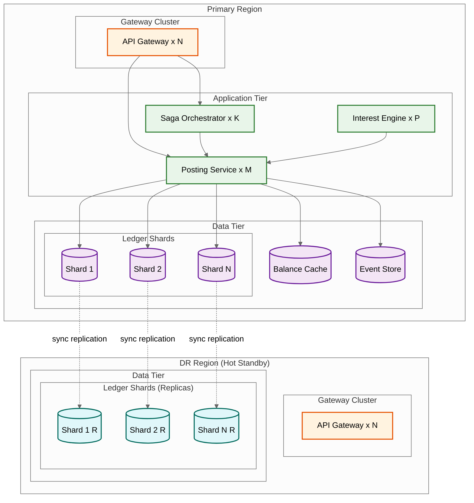

# Scalability & Reliability

## Scaling Architecture Overview



---

## Horizontal Scaling Strategy

### 1. Ledger Database Sharding

**Shard key**: `account_id` (hash-based)

**Why account_id**: All ledger entries for an account co-locate on the same shard, enabling single-shard ACID transactions for most operations (single-account debits, credits, balance queries). Only cross-account transfers may span shards.

**Shard sizing**: Target < 20,000 write TPS per shard to maintain sub-100ms posting latency. With 139,000 peak writes/sec total, minimum 7 shards---practically 16 shards for growth headroom and operational flexibility.

| Shard Count | Writes/Shard (Peak) | Accounts/Shard | Ledger Size/Shard (1yr) |
|-------------|---------------------|----------------|------------------------|
| 8 | ~17,400 | ~12.5M | ~17 TB |
| 16 | ~8,700 | ~6.25M | ~8.5 TB |
| 32 | ~4,350 | ~3.1M | ~4.3 TB |

**Shard splitting**: When a shard approaches capacity, split it by re-hashing accounts to two new shards. Use consistent hashing to minimize data movement. During split, route writes to both old and new shards (dual-write) until migration completes.

### 2. Application Tier Scaling

| Component | Scaling Model | Instances (Peak) | Notes |
|-----------|--------------|-------------------|-------|
| API Gateway | Horizontal, stateless | 20-40 | Auto-scale on request rate |
| Posting Service | Horizontal, stateless | 30-60 | Each instance handles any shard |
| Saga Orchestrator | Partitioned by saga_id | 8-16 | Each owns a partition of sagas |
| Interest Engine | Partitioned by shard | 16 | One worker per shard during batch |
| Balance View Service | Horizontal, stateless | 10-20 | Read-heavy, cache-backed |
| Reconciliation Engine | Single per entity | 1-5 | Sequential by entity, runs post-EOD |

### 3. Read Scaling with CQRS

The read path (balance queries, statement views, reporting) is separated from the write path (posting):

```
Write Path:                          Read Path:
Client → Posting Service → DB       Client → Balance Service → Cache → DB Replica
          (primary shard)                     (any replica, no locks)
```

- **Balance Cache**: Materialized balances cached in distributed cache. Updated synchronously on posting (write-through). Read latency: < 5ms (cache hit), < 50ms (cache miss → DB replica).
- **Reporting Replica**: Dedicated read replicas for statement generation, regulatory reporting, and analytics. Async replication lag: < 1s.
- **Statement Store**: Pre-generated statements stored in object storage. Statement generation runs as batch, results served directly.

### 4. Event Store Scaling

The event store receives every posting event and must handle 139,000+ events/sec at peak:

- Partition by account_id for ordered per-account event streams
- Retention: hot tier (7 days, fast access), warm tier (90 days), cold tier (10 years, compressed)
- Consumer groups for different downstream processors (notifications, fraud, reporting) read independently

---

## Multi-Region Architecture

### Active-Passive with Synchronous Replication

For a core banking system, **zero data loss** (RPO = 0) is non-negotiable. This requires synchronous replication to the DR region:

```
Primary Region          DR Region
┌─────────────┐        ┌─────────────┐
│ Shard 1 (RW)│──sync──│ Shard 1 (RO)│
│ Shard 2 (RW)│──sync──│ Shard 2 (RO)│
│ ...         │──sync──│ ...         │
│ Shard N (RW)│──sync──│ Shard N (RO)│
└─────────────┘        └─────────────┘
     ↑                       ↑
  All writes              Reads only
  go here                (reporting,
                          DR standby)
```

**Synchronous replication cost**: Each write waits for DR acknowledgment, adding 2-10ms latency (within-region sync) or 20-50ms (cross-region). For financial systems, this latency is acceptable given the RPO=0 requirement.

**Failover**: On primary region failure:
1. DR region detects failure (heartbeat timeout: 10s)
2. DR shards promoted to read-write (automated, < 30s)
3. DNS/routing updated to point to DR region (< 60s)
4. Total RTO: < 2 minutes for automated failover

### Multi-Region for Global Banks

For global banks operating across time zones, a **follow-the-sun** model:

| Region | Business Hours | Role | Accounts |
|--------|---------------|------|----------|
| Americas | 08:00-20:00 ET | Primary for USD, CAD, BRL accounts | 40M |
| EMEA | 08:00-20:00 CET | Primary for EUR, GBP, CHF accounts | 35M |
| APAC | 08:00-20:00 SGT | Primary for SGD, HKD, JPY accounts | 25M |

Cross-region transfers (e.g., USD account in Americas to EUR account in EMEA) use the saga pattern with inter-region messaging. Latency: 100-500ms including cross-region hop.

---

## Fault Tolerance

### Failure Mode Analysis

| Failure | Impact | Detection | Recovery |
|---------|--------|-----------|----------|
| **Single shard failure** | Accounts on that shard unavailable | Heartbeat, query timeout | Promote shard replica (< 30s) |
| **Posting service crash** | In-flight postings lost | Health check failure | Stateless: other instances take over; idempotency prevents duplicates on retry |
| **Saga orchestrator crash** | In-flight sagas paused | Heartbeat | Recovery process scans saga log, resumes incomplete sagas |
| **Cache failure** | Balance reads go to DB | Cache miss rate spike | Graceful degradation: read from DB replica (higher latency) |
| **Event store lag** | Downstream consumers delayed | Consumer lag metric | Consumers catch up; no data loss (events durable) |
| **Network partition (intra-region)** | Shard unreachable from app tier | Connection timeout | Route to DR region or queue requests; no split-brain (sync replication) |
| **Full region failure** | All services in region down | External health probe | Automated DR failover (< 2 min) |
| **Batch processing failure** | EOD accrual incomplete | Batch monitoring, heartbeat | Restart from last checkpoint; idempotent batch design |

### Circuit Breakers

```
Posting Service → Shard DB:
  - Open circuit after 5 consecutive failures or > 50% error rate in 10s window
  - Half-open: try 1 request every 5s
  - Close: 3 consecutive successes
  - When open: return 503 (Service Unavailable); client retries with backoff

Saga Orchestrator → Remote Shard:
  - Open circuit after 3 failures
  - When open: pause saga step, mark PENDING_RETRY
  - Background retry with exponential backoff (1s, 2s, 4s, 8s, max 60s)
```

### Idempotency as Reliability Infrastructure

Every operation in the system is designed to be safely retried:

| Operation | Idempotency Key | Dedup Mechanism |
|-----------|----------------|-----------------|
| Ledger posting | Client-generated UUID | Cache + DB unique constraint |
| Saga step | saga_id + step_name | Saga log state check |
| Interest accrual | batch_run_id + account_id | Accrual state date check |
| Fee posting | fee_schedule_id + account_id + period | Journal idempotency key |
| Statement generation | account_id + period | Statement existence check |

---

## Disaster Recovery

### RPO/RTO Targets

| Tier | Systems | RPO | RTO | Strategy |
|------|---------|-----|-----|----------|
| **Tier 1** | Ledger posting, balance queries | 0 | < 2 min | Sync replication + automated failover |
| **Tier 2** | Payment processing, transfers | 0 | < 5 min | Sync replication + semi-automated failover |
| **Tier 3** | Interest accrual, statements | < 1 hour | < 1 hour | Async replication + manual failover |
| **Tier 4** | Regulatory reporting, analytics | < 4 hours | < 4 hours | Backup restore from object storage |

### DR Testing

- **Monthly**: Automated failover drill for Tier 1 systems (verify < 2 min recovery)
- **Quarterly**: Full region failover simulation (all tiers)
- **Annually**: Chaos engineering exercises (random failure injection during business hours)

---

## Capacity Planning

### Growth Projections

| Metric | Current | +1 Year | +3 Years |
|--------|---------|---------|----------|
| Total accounts | 100M | 130M | 200M |
| Daily transactions | 500M | 700M | 1.2B |
| Peak TPS | 46K | 65K | 110K |
| Ledger entries/day | 1.5B | 2.1B | 3.6B |
| Hot storage (90d) | 34 TB | 48 TB | 82 TB |
| Shard count | 16 | 16-24 | 32-48 |

### Scaling Triggers

| Metric | Threshold | Action |
|--------|-----------|--------|
| Shard write latency p99 | > 200ms sustained | Add shards (split busiest) |
| Shard disk usage | > 70% | Archive older partitions or split |
| Cache hit rate | < 95% | Scale cache cluster |
| Saga queue depth | > 10,000 pending | Scale saga orchestrator instances |
| EOD batch duration | > 5 hours | Add batch worker parallelism |
| Balance query latency p99 | > 100ms | Scale read replicas + cache |
