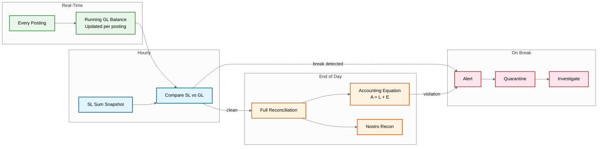

# Observability

## Observability Strategy

A core banking system requires **financial-grade observability**---the ability to detect, diagnose, and resolve issues before they impact the ledger's integrity or customer transactions. The observability stack must serve three audiences: **engineering** (system health, latency, errors), **operations** (batch processing, reconciliation status), and **compliance** (audit trails, regulatory reporting health).

---

## Key Metrics

### Ledger Posting Metrics

| Metric | Type | Description | Alert Threshold |
|--------|------|-------------|-----------------|
| `posting.latency.p50` | Histogram | Median posting latency | > 150ms |
| `posting.latency.p99` | Histogram | 99th percentile posting latency | > 500ms |
| `posting.rate` | Counter | Postings per second | < 1000 (below baseline) |
| `posting.error_rate` | Gauge | Percentage of failed postings | > 0.1% |
| `posting.double_entry_violations` | Counter | Journal entries that don't balance | > 0 (critical) |
| `posting.idempotency_hits` | Counter | Duplicate request detections | Informational |
| `posting.cross_shard_rate` | Gauge | % of postings requiring saga | > 40% (rebalance shards) |

### Balance & Account Metrics

| Metric | Type | Description | Alert Threshold |
|--------|------|-------------|-----------------|
| `balance.query_latency.p99` | Histogram | Balance read latency | > 50ms |
| `balance.cache_hit_rate` | Gauge | % served from cache | < 95% |
| `balance.negative_balance_count` | Gauge | Accounts with negative balance (excluding credit lines) | > 0 (investigate) |
| `accounts.active_count` | Gauge | Currently active accounts | Trend monitoring |
| `accounts.frozen_count` | Gauge | Frozen accounts | Spike = potential incident |

### Saga (Cross-Shard) Metrics

| Metric | Type | Description | Alert Threshold |
|--------|------|-------------|-----------------|
| `saga.in_flight` | Gauge | Currently executing sagas | > 50,000 |
| `saga.completion_latency.p99` | Histogram | Time from initiation to completion | > 5s |
| `saga.compensation_rate` | Gauge | % of sagas requiring compensation | > 1% |
| `saga.stuck_count` | Gauge | Sagas not progressing (timeout) | > 100 |
| `saga.manual_review_count` | Counter | Sagas escalated to manual review | > 0 |

### Interest Accrual Metrics

| Metric | Type | Description | Alert Threshold |
|--------|------|-------------|-----------------|
| `accrual.batch_duration` | Gauge | Total accrual batch time | > 5 hours |
| `accrual.accounts_processed` | Counter | Accounts processed per batch | < expected count |
| `accrual.errors` | Counter | Accounts failing accrual | > 100 |
| `accrual.total_interest_posted` | Gauge | Aggregate interest amount | Deviation > 5% from prior day |
| `accrual.shard_completion` | Gauge | Per-shard progress percentage | Any shard < 50% after 3 hours |

### Reconciliation Metrics

| Metric | Type | Description | Alert Threshold |
|--------|------|-------------|-----------------|
| `recon.gl_breaks` | Counter | GL control account mismatches | > 0 (critical) |
| `recon.break_amount` | Gauge | Total value of reconciliation breaks | > 0.01 (currency unit) |
| `recon.completion_time` | Gauge | Time to complete full reconciliation | > 3 hours |
| `recon.nostro_breaks` | Counter | Nostro account mismatches | > 0 |
| `recon.last_successful_run` | Gauge | Time since last clean reconciliation | > 26 hours |

### Infrastructure Metrics

| Metric | Type | Description | Alert Threshold |
|--------|------|-------------|-----------------|
| `db.shard.write_latency.p99` | Histogram | Per-shard write latency | > 100ms |
| `db.shard.disk_usage_pct` | Gauge | Per-shard disk utilization | > 70% |
| `db.shard.replication_lag` | Gauge | Replication lag to DR replica | > 1s |
| `db.shard.connection_pool_usage` | Gauge | Active connections / max | > 80% |
| `cache.memory_usage_pct` | Gauge | Cache memory utilization | > 85% |
| `cache.eviction_rate` | Counter | Cache evictions per second | > 1000 |
| `event_store.consumer_lag` | Gauge | Events behind head per consumer | > 100,000 |

---

## Logging Strategy

### Log Levels & Content

| Level | When | Content | Retention |
|-------|------|---------|-----------|
| **ERROR** | Posting failure, reconciliation break, saga compensation failure | Full context: account_id, journal_id, error code, stack trace | 1 year |
| **WARN** | Retry triggered, threshold approached, degraded performance | Metric value, threshold, affected component | 6 months |
| **INFO** | Successful posting, batch completion, reconciliation pass | Journal_id, posting_reference, summary metrics | 90 days |
| **DEBUG** | Balance calculation steps, rate lookups, cache operations | Detailed computation trace | 7 days |
| **AUDIT** | All state changes, access events, configuration changes | Actor, action, before/after state, timestamp | 7-10 years |

### Structured Log Format

```
{
  "timestamp": "2026-03-09T14:30:00.123Z",
  "level": "INFO",
  "service": "posting-service",
  "instance": "posting-3a7f",
  "trace_id": "abc123def456",
  "span_id": "span789",
  "entity_id": "entity-uuid",
  "event": "posting.completed",
  "journal_id": "jrn-uuid",
  "account_ids": ["acc-1", "acc-2"],
  "amount": 5000.00,
  "currency": "USD",
  "shard": "shard-07",
  "latency_ms": 45,
  "cross_shard": false
}
```

### Sensitive Data in Logs

| Field | Logging Rule |
|-------|-------------|
| Account number | Last 4 digits only |
| Balance amount | Logged only in AUDIT level |
| Customer name | Never logged; use customer_id |
| Transaction amount | Logged in INFO+ for postings |
| IP address | Logged for authentication events |
| API keys / tokens | Never logged; use token fingerprint |

---

## Distributed Tracing

### Trace Structure

```
Trace: Payment Posting (trace_id: abc123)
├── Span: API Gateway (12ms)
│   ├── auth_check: 3ms
│   └── rate_limit_check: 1ms
├── Span: Payment Service (15ms)
│   ├── validate_payment: 5ms
│   └── build_journal_entry: 2ms
├── Span: Posting Service (45ms)
│   ├── idempotency_check: 2ms (cache hit)
│   ├── determine_shard: 1ms
│   ├── db_transaction: 38ms
│   │   ├── select_for_update: 8ms
│   │   ├── insert_entry_1: 5ms
│   │   ├── insert_entry_2: 5ms
│   │   ├── update_balance_1: 5ms
│   │   ├── update_balance_2: 5ms
│   │   └── commit: 10ms (includes sync replication)
│   └── emit_event: 4ms
└── Span: Post-Commit (async)
    ├── cache_invalidation: 2ms
    └── notification_dispatch: 8ms

Total: 72ms
```

### Cross-Shard Saga Trace

```
Trace: Cross-Shard Transfer (trace_id: def456)
├── Span: Saga Orchestrator - Initiate (5ms)
│   └── create_saga_log: 5ms
├── Span: Debit Step - Shard A (52ms)
│   ├── posting_service: 45ms
│   └── update_saga_log: 7ms
├── Span: Credit Step - Shard B (48ms)
│   ├── posting_service: 42ms
│   └── update_saga_log: 6ms
└── Span: Saga Complete (3ms)
    └── update_saga_log: 3ms

Total: 108ms
```

### Trace Sampling

| Trace Type | Sampling Rate | Rationale |
|------------|--------------|-----------|
| Failed postings | 100% | Every failure must be traceable |
| Cross-shard sagas | 100% | Complex path; need full visibility |
| Reconciliation breaks | 100% | Critical financial event |
| Successful postings | 1% | High volume; sample sufficient |
| Balance queries | 0.1% | Very high volume; minimal complexity |

---

## Alerting

### Alert Tiers

| Tier | Severity | Response | Examples |
|------|----------|----------|----------|
| **P1 - Critical** | Page on-call immediately | 5-min response SLA | GL reconciliation break, double-entry violation, posting service down, negative balance detected |
| **P2 - High** | Page during business hours; notify after hours | 30-min response SLA | Posting latency > 1s for 5 min, saga compensation rate > 5%, batch overrun |
| **P3 - Medium** | Ticket creation | Next business day | Cache hit rate < 90%, shard disk > 75%, replication lag > 5s |
| **P4 - Low** | Dashboard notification | Best effort | Consumer lag increasing, dormant batch warning, trend deviation |

### Critical Alert Definitions

```
Alert: GL Reconciliation Break
  Condition: recon.gl_breaks > 0
  For: immediate
  Severity: P1
  Runbook: Freeze affected GL account → identify discrepant entries →
           trace journal_ids → determine if posting error or timing →
           post correcting entry (with dual authorization)
  Escalation: 15 min → Finance Manager; 30 min → CFO

Alert: Double-Entry Violation
  Condition: posting.double_entry_violations > 0
  For: immediate
  Severity: P1
  Runbook: This should be impossible (pre-validated at API + DB level) →
           halt posting service → forensic investigation →
           check for data corruption or code defect
  Escalation: immediate → Engineering Lead + Compliance

Alert: Posting Latency Degradation
  Condition: posting.latency.p99 > 500ms for 5 minutes
  For: 5 minutes sustained
  Severity: P2
  Runbook: Check shard write latency → check lock contention →
           identify hot accounts → scale if needed
  Escalation: 15 min → Engineering Lead

Alert: Accrual Batch Overrun
  Condition: accrual.batch_duration > 5 hours
  For: when exceeded
  Severity: P2
  Runbook: Check per-shard progress → identify stalled shard →
           check for lock contention → restart stalled worker
  Escalation: 30 min → Operations Lead
```

---

## Dashboards

### 1. Ledger Health Dashboard

| Panel | Visualization | Data Source |
|-------|--------------|-------------|
| Posting TPS (real-time) | Time series line chart | posting.rate |
| Posting Latency (p50/p95/p99) | Multi-line chart | posting.latency.* |
| Error Rate | Area chart with threshold line | posting.error_rate |
| Cross-Shard % | Single stat + trend | posting.cross_shard_rate |
| Double-Entry Violations | Big number (should always be 0) | posting.double_entry_violations |
| Idempotency Dedup Rate | Time series | posting.idempotency_hits |

### 2. Reconciliation Dashboard

| Panel | Visualization | Data Source |
|-------|--------------|-------------|
| GL Balance Status | Table: green/red per control account | recon.gl_breaks |
| Break Amount | Big number (should be 0) | recon.break_amount |
| Last Clean Reconciliation | Timestamp + age | recon.last_successful_run |
| Accounting Equation Check | Status indicator (PASS/FAIL) | recon.equation_check |
| Nostro Reconciliation | Table per currency | recon.nostro_breaks |
| Historical Break Trend | Bar chart (daily, 30 days) | recon.gl_breaks (historical) |

### 3. EOD Batch Dashboard

| Panel | Visualization | Data Source |
|-------|--------------|-------------|
| Batch Phase Timeline | Gantt chart (phase start/end) | batch phase timestamps |
| Interest Accrual Progress | Progress bar per shard | accrual.shard_completion |
| Total Batch Duration | Gauge with threshold | accrual.batch_duration |
| Statement Generation Progress | Progress counter | statements.generated_count |
| Regulatory Report Status | Checklist (generated/pending) | reports.status |
| Archival Progress | Progress bar | archival.completion_pct |

### 4. Shard Health Dashboard

| Panel | Visualization | Data Source |
|-------|--------------|-------------|
| Per-Shard Write Latency | Heatmap (shard × latency) | db.shard.write_latency |
| Per-Shard Disk Usage | Bar chart | db.shard.disk_usage_pct |
| Replication Lag per Shard | Line chart per shard | db.shard.replication_lag |
| Connection Pool Usage | Stacked bar | db.shard.connection_pool_usage |
| Shard Account Distribution | Pie chart | accounts per shard |
| Hot Account Detection | Table (top 10 accounts by TPS) | per-account posting rate |

---

## Financial Reconciliation Observability

### Continuous Reconciliation Pipeline



### Reconciliation Audit Trail

Every reconciliation run produces an immutable report:

```
{
  "reconciliation_id": "recon-20260309-001",
  "entity_id": "entity-uuid",
  "business_date": "2026-03-09",
  "type": "FULL_EOD",
  "status": "CLEAN",
  "started_at": "2026-03-09T23:00:00Z",
  "completed_at": "2026-03-09T23:47:00Z",
  "gl_accounts_checked": 487,
  "breaks_found": 0,
  "accounting_equation": "BALANCED",
  "total_assets": 15200000000.00,
  "total_liabilities": 12800000000.00,
  "total_equity": 2400000000.00,
  "signed_by": "reconciliation-service-v2.4.1",
  "hash": "sha256:abc123..."
}
```
