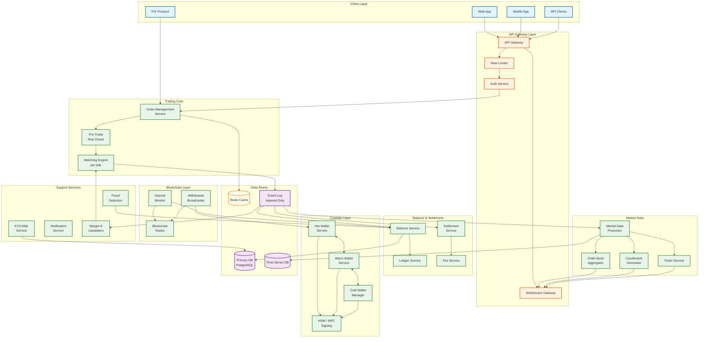
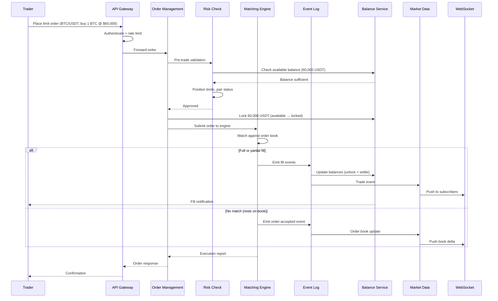
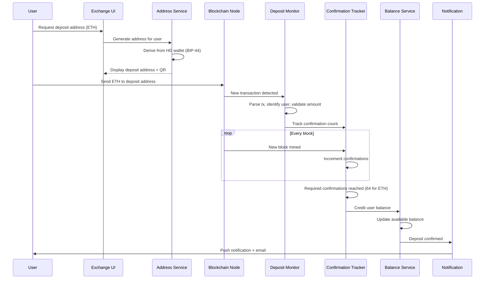
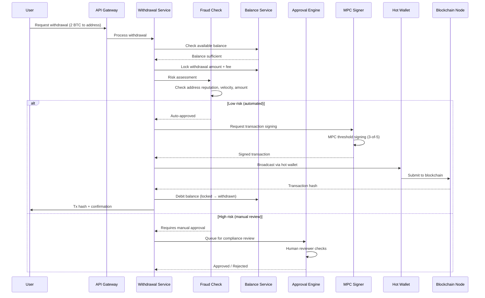

# High-Level Design

## Architecture Overview

The cryptocurrency exchange follows a **CQRS + event-sourcing** architecture. The matching engine is the single source of truth---a deterministic state machine that processes orders and emits events. All downstream systems (balance service, market data, risk engine, settlement) consume these events independently. The custody layer (hot/warm/cold wallets) operates as a separate security domain with its own authorization boundaries.

---

## Key Design Decisions

| Decision | Choice | Rationale |
|----------|--------|-----------|
| **Matching engine model** | Single-threaded per pair, event-sourced | Determinism eliminates race conditions; replay enables audit and recovery |
| **State management** | CQRS (command/query separation) | Write path (matching) optimized for throughput; read path (market data) optimized for fan-out |
| **Custody architecture** | Hot/warm/cold with MPC signing | Defense-in-depth; hot wallet exposure minimized; MPC eliminates single private key risk |
| **Order book data structure** | Red-black tree per side (bid/ask) | O(log n) insert/delete/match; maintains sorted order for price-time priority |
| **Market data distribution** | Publish-subscribe via message broker | Decouples matching engine from millions of consumers; enables independent scaling |
| **Balance updates** | Event-driven from matching engine | Single source of truth; no dual-write; balances always consistent with trade events |
| **Blockchain integration** | One microservice per chain family | UTXO chains (Bitcoin) and account chains (Ethereum) have fundamentally different deposit/withdrawal logic |
| **Database strategy** | Relational for balances/orders; time-series for market data | ACID for financial correctness; columnar time-series for efficient candlestick queries |

---

## Data Flow: Order Lifecycle

---

## Data Flow: Deposit Pipeline

---

## Data Flow: Withdrawal Pipeline

---

## Component Responsibilities

### Trading Core

| Component | Responsibility |
|-----------|---------------|
| **Order Management Service** | Order validation, lifecycle tracking, cancel/amend handling, idempotency |
| **Matching Engine** | Price-time priority matching, order book maintenance, fill generation, deterministic execution |
| **Pre-Trade Risk Check** | Balance verification, position limits, pair trading status, self-trade prevention |

### Balance and Settlement

| Component | Responsibility |
|-----------|---------------|
| **Balance Service** | Available/locked/frozen balance management, atomic transitions, double-spend prevention |
| **Settlement Service** | Post-trade settlement, balance transfers between buyer and seller |
| **Ledger Service** | Immutable double-entry ledger of all balance changes, reconciliation source of truth |
| **Fee Service** | Maker/taker fee calculation, VIP tier lookup, fee discounts, fee collection to platform account |

### Custody

| Component | Responsibility |
|-----------|---------------|
| **Hot Wallet Service** | Automated withdrawals, balance monitoring, rebalance triggers |
| **Warm Wallet Service** | Buffer between hot and cold, multi-sig transfers, scheduled sweeps |
| **Cold Wallet Manager** | Air-gapped storage, manual multi-party ceremony for withdrawals |
| **HSM/MPC Signing** | Threshold signature generation, key share management, ceremony orchestration |

### Market Data

| Component | Responsibility |
|-----------|---------------|
| **Market Data Processor** | Consume matching engine events, normalize trade/book data |
| **Order Book Aggregator** | Maintain L2 (price-level) and L3 (order-level) book snapshots |
| **Candlestick Generator** | Aggregate trades into OHLCV candles at multiple intervals |
| **Ticker Service** | Compute 24h rolling statistics (price, volume, change) per pair |

---

## Cross-Cutting Concerns

### Idempotency

Every order submission carries a client-generated `client_order_id`. The Order Management Service deduplicates using a Redis-backed idempotency cache (30s TTL) with a database unique constraint as safety net. Duplicate submissions return the original response without re-processing.

### Event Sourcing and Replay

The matching engine writes every input and output to an append-only event log. On recovery, the engine replays the log from the last snapshot to reconstruct state. This guarantees:
- Zero order loss after acknowledgment
- Deterministic audit trail for regulatory review
- Ability to replay any point in time for debugging

### Rate Limiting

Three tiers of rate limiting:
1. **IP-level**: 1,200 requests/min (anti-DDoS)
2. **Account-level**: Varies by VIP tier (120-6,000 orders/min)
3. **Pair-level**: Prevents single user from overwhelming one market

### Circuit Breaking

If the matching engine falls behind (input queue depth > threshold), the gateway rejects new orders with a "system busy" response rather than queuing unboundedly. This prevents cascading latency during flash crashes.
