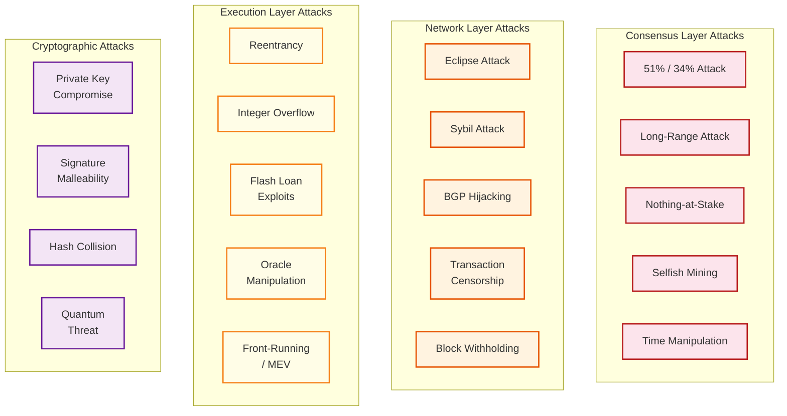

# Security & Compliance

## Threat Model

### Attack Surface Overview



---

## Consensus Layer Security

### 51% Attack (PoW) / 34% Attack (PoS)

```
Proof-of-Work:
  - Attacker with >50% hashrate can produce longest chain
  - Can double-spend by reverting confirmed transactions
  - Cost: Billions in hardware + electricity for major chains
  - Defense: Confirmations (wait 6 blocks for Bitcoin)

Proof-of-Stake (Casper FFG):
  - Attacker with >33% stake can prevent finalization
  - Attacker with >66% stake can finalize conflicting chains
  - Cost: Requires $15B+ in stake for Ethereum
  - Defense: Slashing destroys attacker's stake
    - Even a successful attack burns the attacker's capital
    - "Cost of attack > potential profit" is the security model
    - Social consensus can coordinate a recovery fork that
      further penalizes the attacker

Economic security margin:
  Total staked: ~32M ETH (~$80B)
  Cost to attack finality: ~$27B (1/3 of stake)
  Maximum extractable: Far less than cost → economically irrational
```

### Long-Range Attack

```
Attack: In PoS, old validators who have withdrawn their stake
could create an alternative chain from a point in the past
(they had valid signing keys at that time).

Why possible: Unlike PoW, creating historical blocks costs nothing
in PoS (no electricity needed).

Defenses:
  1. Weak subjectivity checkpoints:
     - Nodes refuse to reorg beyond the weak subjectivity period
     - Period: ~2 weeks (based on validator set rotation speed)
     - New nodes must obtain a recent checkpoint from a trusted source

  2. Checkpoint finality:
     - Finalized checkpoints are treated as irreversible
     - Nodes never revert beyond the last finalized checkpoint

  3. Validator withdrawal delay:
     - Stake is locked for ~27 hours after exit
     - Prevents immediate unbonding + attack
```

### Nothing-at-Stake Problem

```
Problem: In PoS, validators can vote for multiple competing forks
at zero cost (unlike PoW where mining on two chains halves hashrate).

If unchecked: Validators would rationally vote on all forks to
maximize expected rewards, undermining consensus.

Solution: Slashing conditions
  - Double voting for the same slot: validator stake is slashed
  - Surround voting (contradictory attestation ranges): slashed
  - Slashing penalty scales with number of concurrent slashings:
    If 1 validator slashes: ~0.5 ETH penalty
    If 1/3 validators slash simultaneously: entire stake (~32 ETH)
  - This "correlation penalty" ensures coordinated attacks are
    maximally expensive
```

---

## Network Layer Security

### Eclipse Attack Prevention

```
Attack vector: Isolate a node by controlling all its peer connections.

Prevention strategies:

1. Peer diversity enforcement:
   - Maximum 2 peers per /24 subnet
   - Maximum 10 peers per /16 subnet
   - Prefer peers from different ASNs (autonomous systems)
   - Geographic diversity via IP geolocation

2. Connection management:
   - Maintain 25-50 peers (configurable)
   - Reserve slots for long-lived connections
   - Rate-limit new connection attempts
   - Rotate a small subset of peers periodically

3. Bootstrap redundancy:
   - Multiple hardcoded bootstrap nodes
   - DNS-based discovery (multiple DNS seeds)
   - Kademlia DHT for ongoing peer discovery
   - Manual peer addition as fallback

4. GossipSub peer scoring:
   - Track message delivery quality per peer
   - Penalize peers that deliver invalid/late messages
   - Remove consistently low-scoring peers from mesh
```

### Transaction Censorship Resistance

```
Censorship scenarios:
  1. Single proposer censors transactions in their block
     → Next honest proposer includes them (delay: 1 slot = 12s)

  2. Minority of proposers censor consistently
     → Transactions still included within a few blocks
     → Censoring proposers miss out on priority fees

  3. Majority of proposers censor (requires >50% collusion)
     → Transaction may never be included on L1
     → User can submit to an L2 rollup with force-inclusion mechanism

Protocol-level defenses:
  - Proposer-builder separation: builders include all profitable txns
  - Inclusion lists (proposed): proposers must attest that specific
    pending transactions were included
  - FOCIL (Fork-choice Enforced Inclusion Lists): committee forces
    inclusion of long-pending transactions
  - Encrypted mempools: proposers cannot see transaction contents
    until committed to including them
```

---

## Smart Contract Security

### Common Vulnerability Classes

```
1. Reentrancy:
   Attacker contract calls back into victim during execution.

   Vulnerable pattern:
     FUNCTION withdraw(amount):
       IF balances[msg.sender] >= amount:
         send(msg.sender, amount)    // External call (attacker re-enters)
         balances[msg.sender] -= amount  // State update AFTER call

   Fix: Checks-Effects-Interactions pattern
     FUNCTION withdraw(amount):
       IF balances[msg.sender] >= amount:
         balances[msg.sender] -= amount  // State update BEFORE call
         send(msg.sender, amount)        // External call last

   Additional defense: Reentrancy guard (mutex lock)

2. Integer overflow/underflow:
   Arithmetic wraps around in fixed-width integers.
   uint256 max = 2^256 - 1; max + 1 = 0

   Fix: Use checked arithmetic (default in modern compilers)

3. Access control failures:
   Missing authorization checks on sensitive functions.

   Vulnerable: FUNCTION mint(to, amount): tokens[to] += amount
   Fixed: FUNCTION mint(to, amount): REQUIRE msg.sender == owner

4. Oracle manipulation:
   Attacker manipulates price feeds to exploit DeFi protocols.

   Attack: Use flash loan to manipulate on-chain price oracle,
           then exploit a protocol that reads the manipulated price.

   Defense: Use time-weighted average prices (TWAP),
            multiple oracle sources, and circuit breakers.

5. Front-running / MEV extraction:
   Attacker observes pending transactions and places orders before them.

   Defense: Commit-reveal schemes, encrypted mempools,
            batch auctions, or private transaction submission.
```

### Smart Contract Audit Process

```
Pre-deployment checklist:
  1. Static analysis: Run automated vulnerability scanners
  2. Formal verification: Prove critical invariants mathematically
  3. Manual audit: Expert review of logic, access control, edge cases
  4. Fuzz testing: Random input generation for property testing
  5. Economic modeling: Simulate attack scenarios with realistic parameters
  6. Testnet deployment: Extended testing on public testnets
  7. Bug bounty: Post-deployment reward program for vulnerability disclosure
  8. Upgrade path: Define proxy pattern or immutability commitment
```

---

## Cryptographic Security

### Key Management

```
Private key security hierarchy:

1. Hardware Security Module (HSM):
   - Private key never leaves the secure enclave
   - Used for: Validator signing keys, institutional custody
   - Cost: $2,000-$20,000 per HSM

2. Hardware wallet:
   - Dedicated device for key storage and signing
   - Used for: Individual high-value accounts
   - Cost: $50-$200

3. Software wallet with encryption:
   - Key encrypted at rest with passphrase-derived key (scrypt/argon2)
   - Used for: Developer accounts, testing
   - Risk: Vulnerable to malware, keyloggers

4. Multi-signature (multisig):
   - M-of-N signatures required to authorize transaction
   - Used for: Treasury management, protocol governance
   - Example: 3-of-5 signers must approve

5. Social recovery:
   - Guardians can help recover access to a smart contract wallet
   - Used for: Consumer wallets
   - No single point of failure
```

### Post-Quantum Considerations

```
Threat timeline:
  - ECDSA (secp256k1): Vulnerable to Shor's algorithm on quantum computers
  - Estimated threat: 10-20 years for cryptographically relevant quantum computers
  - BLS12-381 signatures: Also vulnerable to quantum attacks

Mitigation strategy:
  1. Monitor NIST post-quantum standardization (CRYSTALS-Dilithium, FALCON)
  2. Design upgrade paths in consensus protocol for signature scheme migration
  3. Hash-based signatures (XMSS, SPHINCS+) as interim solution
     - Larger signatures (~2-40 KB vs 64 bytes for ECDSA)
     - Requires consensus on block size implications
  4. Commit to migration plan before quantum threat materializes
  5. Address space (Keccak-256 hashes) is quantum-resistant
     (Grover's algorithm only halves the security level: 256 → 128 bits)
```

---

## Regulatory and Compliance Landscape

### Jurisdictional Considerations

```
Regulatory frameworks vary significantly by jurisdiction:

1. Protocol level (base layer):
   - Generally treated as decentralized infrastructure
   - No single entity to regulate
   - Validator operation may require licensing in some jurisdictions
   - Transaction monitoring may be required for sanctioned addresses

2. Application level (DApps, exchanges):
   - Subject to local financial regulations
   - KYC/AML requirements for fiat on/off-ramps
   - Securities laws for token offerings
   - Tax reporting obligations

3. Compliance tools at protocol level:
   - OFAC sanctions screening for transaction relay (controversial)
   - On-chain analytics for law enforcement
   - Transparent transaction history (pseudonymous, not anonymous)
   - Protocol-level cannot enforce compliance without censorship
```

### Privacy and Data Protection

```
Privacy challenges in public blockchains:
  - All transactions are publicly visible
  - Address clustering can deanonymize users
  - Balance and transaction history are transparent

Privacy-preserving approaches:
  1. Zero-knowledge proofs for confidential transactions
     - Hide amounts while proving validity
     - Selective disclosure for compliance

  2. Stealth addresses:
     - One-time addresses for each transaction
     - Receiver privacy without protocol changes

  3. Mixing services / privacy pools:
     - Break transaction graph linkability
     - Regulatory tension: used for both privacy and laundering

  4. Layer 2 privacy:
     - Private rollups with ZK-based state transitions
     - Compliance-compatible selective disclosure
```

---

## Security Incident Response

### Incident Classification

| Severity | Example | Response Time | Action |
|----------|---------|---------------|--------|
| P0 - Critical | Consensus bug causing invalid finalization | Immediate | Emergency client release; coordinate validator upgrade |
| P1 - High | Smart contract exploit draining funds | < 1 hour | Pause affected contracts (if pausable); deploy fix |
| P2 - Medium | Eclipse attack on minority of nodes | < 4 hours | Peer blacklisting; release peer scoring update |
| P3 - Low | Minor gossip protocol inefficiency | < 1 week | Include fix in next scheduled release |

### Emergency Response Playbook

```
For consensus-critical bugs:

1. Discovery:
   - Bug bounty report, internal testing, or observed anomaly
   - Verify reproducibility on testnet
   - Assess severity and blast radius

2. Coordination (private):
   - Notify client team security contacts via encrypted channel
   - Develop and test patch across all client implementations
   - Coordinate release timing (avoid tipping off attackers)

3. Deployment:
   - Release patched clients simultaneously
   - Announce upgrade requirement with clear instructions
   - Monitor network for exploitation attempts

4. Post-incident:
   - Publish post-mortem after threat is mitigated
   - Update test suites to prevent regression
   - Review and improve security processes
   - Compensate bug bounty reporter
```

---

## Security Summary

| Layer | Primary Threats | Key Defenses |
|-------|----------------|--------------|
| Consensus | 34% attack, long-range, nothing-at-stake | Slashing, weak subjectivity, correlation penalty |
| Network | Eclipse, Sybil, BGP hijack, censorship | Peer scoring, diversity, inclusion lists |
| Execution | Reentrancy, overflow, oracle manipulation | Audits, formal verification, patterns |
| Cryptographic | Key compromise, quantum threat | HSM, multisig, post-quantum migration plan |
| Economic | MEV centralization, validator collusion | PBS, encrypted mempools, MEV smoothing |
