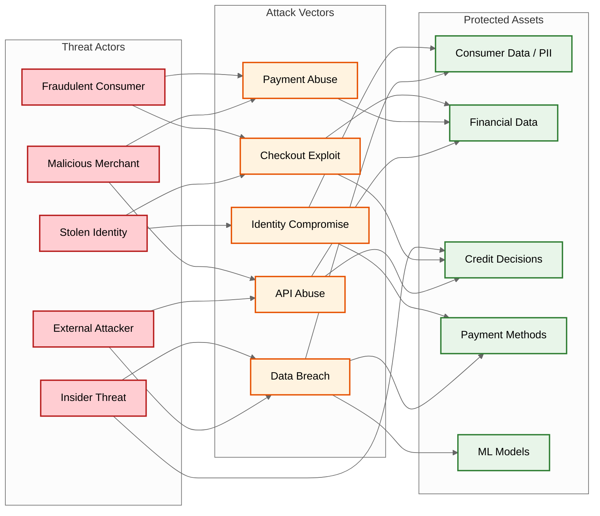

# Security & Compliance

## Threat Model

### Attack Surface



### Top Threats

| # | Threat | Likelihood | Impact | Mitigation |
|---|--------|-----------|--------|------------|
| T1 | **Synthetic identity fraud** | High | High | Multi-signal verification: bureau data + device fingerprint + behavioral analytics + phone/email verification |
| T2 | **Account takeover** | High | High | MFA at login + step-up auth for plan changes + device binding + anomaly detection |
| T3 | **First-party fraud (bust-out)** | Medium | Very High | Velocity limits, spending power caps, cross-merchant exposure tracking, behavioral modeling |
| T4 | **Merchant collusion** | Medium | High | Merchant risk scoring, chargeback ratio monitoring, settlement holdbacks for suspicious patterns |
| T5 | **Payment method fraud** | High | Medium | Card verification (CVV + AVS), bank account verification (micro-deposits), 3DS for high-risk transactions |
| T6 | **Data breach** | Low | Very High | Encryption at rest + in transit, field-level encryption for PII, tokenization for payment data |
| T7 | **ML model poisoning/extraction** | Low | High | Model versioning, input validation, rate limiting on scoring API, monitoring for adversarial patterns |
| T8 | **Regulatory non-compliance** | Medium | Very High | Automated disclosure generation, jurisdiction-aware rules engine, audit logging, periodic compliance audits |

---

## Authentication & Authorization

### Consumer Authentication

```
Authentication Flow:
  1. Registration: email + phone verification (OTP)
  2. Login: email/phone + password + device fingerprint
  3. Checkout: session token + step-up auth for high-risk orders
  4. Payment changes: MFA required (SMS OTP or authenticator app)

Session Management:
  - JWT access tokens: 15-minute expiry
  - Refresh tokens: 30-day expiry, single-use, rotated on refresh
  - Device binding: token is tied to device fingerprint; new device triggers re-authentication
  - Concurrent sessions: max 3 active sessions per consumer
```

### Merchant Authentication

```
Merchant API Authentication:
  - API key: long-lived, rotatable, rate-limited
  - Request signing: HMAC-SHA256 of request body + timestamp (prevents replay)
  - IP allowlisting: optional, for server-to-server integrations
  - Webhook verification: HMAC signature on outbound webhooks for merchant verification

OAuth 2.0 for dashboard:
  - Authorization code flow with PKCE
  - Scoped access: read_transactions, manage_refunds, view_settlements
  - Role-based access within merchant organization
```

### Authorization Model

```
Role-Based Access Control (RBAC) + Attribute-Based Access Control (ABAC):

Consumer permissions:
  - Can view/pay only their own plans
  - Cannot modify plan terms (only platform or hardship workflow can)
  - Can request refund (routed to dispute workflow)

Merchant permissions:
  - Can view transactions for their merchant_id only
  - Can initiate refunds for their orders
  - Cannot view consumer PII beyond order context
  - Settlement data scoped to their merchant

Internal roles:
  - Underwriter: read credit decisions, modify risk thresholds (4-eye approval for threshold changes)
  - Collections agent: view delinquent plans, modify terms within policy bounds
  - Compliance officer: read audit logs, run fair lending reports, cannot modify decisions
  - Platform admin: system configuration, requires MFA + VPN + audit trail
```

---

## Data Protection

### Encryption

| Data | At Rest | In Transit | Additional |
|------|---------|-----------|------------|
| Consumer PII (name, DOB, address) | AES-256, field-level encryption | TLS 1.3 | Encrypted in database; decrypted only in application layer |
| Payment method tokens | Stored at payment processor (PCI scope) | TLS 1.3 | Platform stores only tokenized references |
| Credit bureau data | AES-256, encrypted partition | TLS 1.3 with mutual TLS to bureau | Cached 24h; purged on expiry |
| Credit decision records | AES-256 | TLS 1.3 | Immutable; 7-year retention |
| ML feature vectors | Not encrypted (non-PII, derived) | TLS 1.3 | Features are anonymized aggregates |
| API keys | Hashed (bcrypt) | TLS 1.3 | Only hash stored; raw key shown once at creation |

### Data Minimization

```
Principle: Collect and retain only what is necessary for the lending decision.

At checkout:
  - Collect: name, email, phone, shipping address, order details
  - Do NOT collect: full SSN (soft pull uses name + DOB + address)
  - Do NOT store: raw credit bureau report (store only risk score and features)

Post-decision:
  - Retain: decision outcome, adverse action reasons, features used, model version
  - Purge: raw device fingerprint data after 90 days
  - Retain indefinitely: plan records, payment records (financial regulatory requirement)

Consumer data deletion:
  - Right to deletion: delete PII, anonymize transaction records
  - Exception: financial records required for regulatory retention (7 years)
  - Anonymization: replace PII with hashed identifiers; retain plan/payment structure
```

### PCI-DSS Compliance

```
Scope minimization strategy:
  - Payment method data (card numbers, bank accounts) are tokenized at the payment processor
  - The BNPL platform NEVER stores raw card numbers or bank account numbers
  - Only tokenized references and last-four digits are stored
  - PCI scope is limited to the checkout widget (client-side) and the API gateway
  - Backend services operate entirely with tokens

SAQ-A eligibility:
  - Checkout widget loads from BNPL-hosted iframe (isolates card input from merchant page)
  - Card data flows directly from widget to payment processor; never touches BNPL backend
  - BNPL receives only the token back from the processor
```

---

## Fraud Prevention

### Multi-Layered Fraud Detection

```
Layer 1: Pre-Screen Rules (< 5ms)
  - Velocity: max N checkout attempts per consumer per hour
  - Blocklist: known fraudulent emails, phone numbers, device IDs
  - Geo-mismatch: shipping address vs. IP geolocation vs. billing address
  - Amount anomaly: order significantly above consumer's historical average

Layer 2: ML Fraud Model (< 50ms)
  - Device fingerprint analysis (browser, OS, screen, timezone, plugins)
  - Behavioral biometrics (typing speed, mouse patterns during checkout)
  - Network analysis (consumer-merchant-device graph anomalies)
  - Historical fraud patterns (feature store: prior disputes, chargebacks)

Layer 3: Post-Decision Monitoring (async)
  - Cross-merchant velocity (same consumer, multiple merchants, short window)
  - Synthetic identity detection (new identity + high activity pattern)
  - Merchant anomaly detection (sudden spike in BNPL usage, high refund rate)
```

### First-Party Fraud (Bust-Out) Prevention

First-party fraud---where a real consumer intentionally defaults---is the largest fraud vector for BNPL. Unlike stolen-card fraud that can be detected by identity mismatch, bust-out fraud is perpetrated by the account holder.

```
Signals:
  - Rapid credit utilization: consumer quickly maxes out spending power across merchants
  - Category shift: consumer switches from low-risk (apparel) to high-risk (electronics, gift cards)
  - Payment method churn: frequently adding and removing payment methods
  - Address changes near payment dates
  - Burst of high-value orders after long dormancy

Mitigations:
  - Gradual spending power increase based on repayment history (start low, earn trust)
  - Cross-merchant exposure cap: total outstanding across all merchants limited
  - High-risk category restrictions for new/unproven consumers
  - Real-time velocity scoring integrated into credit decision
```

---

## Regulatory Compliance

### Truth in Lending Act (TILA) / Regulation Z

```
Requirements for BNPL:
  1. APR Disclosure: Must disclose annual percentage rate BEFORE consumer commits
  2. Finance Charge: Total interest/fees expressed as a dollar amount
  3. Total of Payments: Total amount consumer will pay over plan lifetime
  4. Payment Schedule: Number, amounts, and due dates of all installments
  5. Late Payment Terms: Late fee amounts and when they apply

Implementation:
  - TILA disclosure computed as part of credit decision (synchronous)
  - Disclosure presented in standardized format in checkout widget
  - Consumer must affirmatively consent (checkbox + e-signature) before plan creation
  - All disclosures logged in CreditDecision audit record
  - Disclosure templates reviewed by legal team; changes require versioned deployment
```

### Adverse Action Notice

```
When a consumer is declined:
  1. Provide specific reasons for denial (TILA / ECOA requirement)
  2. Identify credit bureau used and provide consumer's right to free report
  3. Provide instructions for disputing the decision
  4. Deliver notice immediately at checkout AND via email within 7 days

Implementation:
  - decline_reasons field in CreditDecision maps model features to human-readable reasons
  - Reason mapping is maintained by compliance team; model features are tagged with corresponding adverse action reason codes
  - Standard adverse action notice template includes bureau contact info and dispute instructions
```

### State-Level Lending Compliance

```
Jurisdiction-Aware Rules Engine:
  - Each US state has different: licensing requirements, maximum APR, fee caps, disclosure formats
  - Rules engine loads jurisdiction config based on consumer's state of residence
  - Config includes: max_apr, max_late_fee, grace_period_days, disclosure_template, license_number

Example state variations:
  State A: max APR 36%, late fee capped at $8, 15-day grace period
  State B: no APR cap, late fee capped at $25 or 5% of payment, 10-day grace period
  State C: BNPL < 4 payments exempt from lending license, > 4 payments requires license

Implementation:
  - Jurisdiction determined at credit decision time (consumer address)
  - Plan terms constrained by jurisdiction rules (APR capped, fees capped)
  - Disclosure template selected by jurisdiction
  - Compliance dashboard monitors: % decisions by state, APR distribution, late fee compliance
```

### EU Consumer Credit Directive (CCD)

```
Additional EU requirements:
  1. Creditworthiness assessment mandatory (even for interest-free BNPL)
  2. Right of withdrawal: consumer can cancel within 14 days
  3. Pre-contractual information in standardized European format (SECCI)
  4. Advertising must include representative APR example
  5. Maximum harmonized annual rate caps per member state

Implementation:
  - EU checkout flow includes SECCI document generation
  - 14-day withdrawal window tracked per plan; refund + cancellation automated
  - Separate compliance module for EU vs. US flows, selected at routing layer
```

### Fair Lending & Anti-Discrimination

```
Requirements:
  - Equal Credit Opportunity Act (ECOA): cannot discriminate on race, religion, sex, age, etc.
  - Fair lending analysis: regular statistical testing of approval rates across demographic groups
  - Model explainability: credit decision factors must be explainable (no opaque ML black boxes)

Implementation:
  - ML model features are reviewed for proxy discrimination (zip code → race proxy)
  - Regular disparate impact testing: compare approval rates across protected classes
  - Model explainability layer: SHAP values computed for each decision (top 5 contributing features)
  - Fair lending reports generated quarterly; reviewed by compliance officer
  - Features explicitly prohibited from model: race, religion, national origin, marital status
```

---

## Audit & Compliance Infrastructure

### Audit Trail

```
Every financial action produces an immutable audit record:

  AuditEvent {
      event_id        UUID
      event_type      ENUM (credit_decision, plan_created, payment_collected,
                            refund_processed, late_fee_assessed, hardship_offered, ...)
      entity_type     ENUM (consumer, plan, payment, merchant, settlement)
      entity_id       UUID
      actor           STRING (system, consumer_id, agent_id, admin_id)
      action          STRING
      before_state    JSON
      after_state     JSON
      metadata        JSON (IP, device, session, model_version)
      timestamp       TIMESTAMP
  }

  Storage: append-only log, partitioned by month
  Retention: 7 years (regulatory minimum)
  Access: read-only for compliance; no delete/update operations
  Tamper detection: cryptographic hash chain (each record includes hash of previous)
```

### Compliance Monitoring Dashboard

```
Real-time compliance metrics:
  - TILA disclosure delivery rate (target: 100%)
  - Adverse action notice delivery rate (target: 100%)
  - Late fee compliance (within state caps): % violations (target: 0%)
  - Fair lending approval rate variance across demographics (target: < 2% deviation)
  - Dispute resolution time vs. regulatory deadline (target: 100% within deadline)
  - Right of withdrawal processing time (EU, target: < 24h)
  - Credit decision explainability coverage (target: 100% have top-5 SHAP reasons)
```
