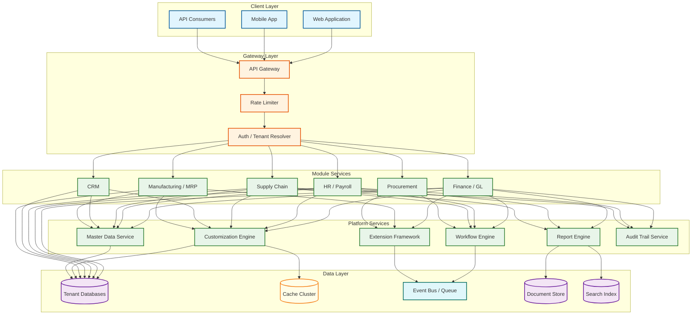
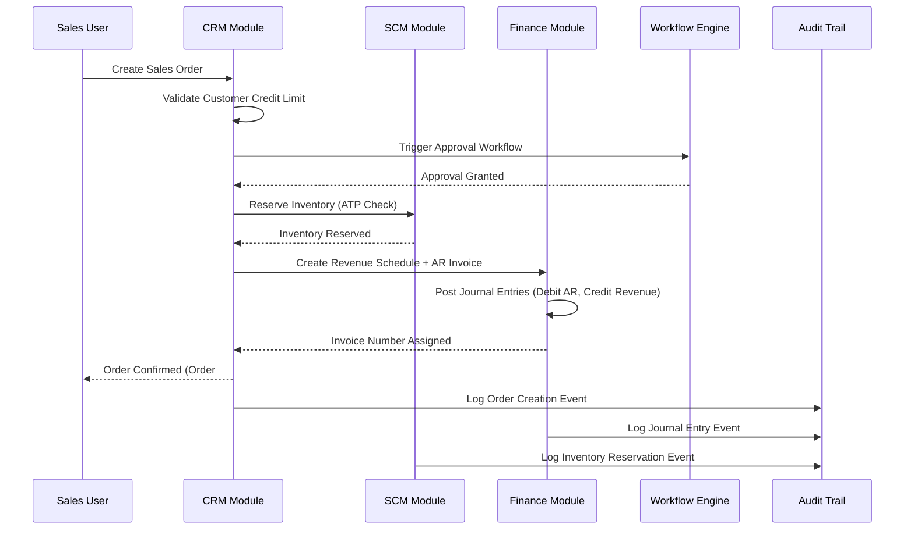

# ERP System Design

## System Overview

An Enterprise Resource Planning (ERP) system---exemplified by platforms such as SAP, Oracle ERP Cloud, and Odoo---is a unified software platform that integrates all core business functions of an organization into a single transactional backbone. Unlike point solutions that address a single domain (accounting software, standalone HRMS, or a separate procurement tool), an ERP system enforces referential integrity and real-time data flow across Finance/General Ledger, Human Resources and Payroll, Supply Chain Management, Manufacturing/MRP, Customer Relationship Management, Procurement, and Project Management. Every business event---a purchase order approval, a warehouse receipt, a payroll run---ripples through the shared data model, updating downstream modules without manual reconciliation. The core engineering challenges are deep and multifaceted:

1. **Module Architecture with Bounded Contexts** --- Each functional module (Finance, HR, SCM, CRM, Manufacturing) must operate as a semi-autonomous bounded context with its own domain model, yet share master data (chart of accounts, organizational hierarchy, business partner records) through well-defined contracts. The tension between module independence and cross-module consistency is the central architectural problem.

2. **Multi-Tenancy at Enterprise Scale** --- Serving thousands of tenants---each with distinct organizational structures, chart of accounts, approval hierarchies, and regulatory requirements---demands tenant isolation at the data, compute, and configuration layers. The system must guarantee zero cross-tenant data leakage while efficiently sharing infrastructure to remain cost-viable.

3. **Metadata-Driven Customization Engine** --- Enterprises demand extensive customization: custom fields on every entity, custom validation rules, tenant-specific workflows, modified screen layouts, and bespoke report formats---all without modifying the core platform code. A metadata-driven engine interprets tenant-specific configuration at runtime, effectively making each tenant's ERP a unique application built on a shared kernel.

4. **Extension and Plugin Framework** --- Beyond configuration-level customization, enterprises require custom business logic: specialized tax calculations, industry-specific compliance checks, proprietary pricing algorithms. An extension framework must allow tenant-deployed code to execute within the platform while being sandboxed to prevent one tenant's extension from degrading another's performance or compromising security.

5. **Regulatory Compliance Across Jurisdictions** --- A global ERP must simultaneously support GAAP and IFRS accounting standards, SOX audit trail requirements, GDPR data subject rights, country-specific tax regimes (GST, VAT, sales tax), labor law variations, and sector-specific regulations---all configurable per tenant and per legal entity within a tenant.

6. **Data Migration, ETL, and Integration Patterns** --- Enterprises rarely start on a blank slate. Migrating decades of historical data from legacy systems, maintaining real-time integrations via EDI, webhooks, and iPaaS connectors, and supporting bulk import/export operations are table-stakes capabilities.

7. **Batch Processing for Enterprise Workloads** --- Month-end financial close, payroll processing for 50,000 employees, inventory revaluation across 200 warehouses, and depreciation runs on millions of fixed assets are inherently batch operations that must complete within strict time windows while not degrading interactive user experience.

---

## Key Characteristics

| Characteristic | Description |
|---------------|-------------|
| **Read/Write Pattern** | Mixed---write-heavy for transactional processing (journal entries, purchase orders, inventory movements); read-heavy for reporting, dashboards, and approval queue retrieval |
| **Latency Sensitivity** | Moderate---interactive transactions (invoice posting, order creation) require < 500ms; report generation tolerates 2-10s; batch jobs (month-end close, payroll) run for minutes to hours |
| **Consistency Model** | Strong consistency for financial transactions and inventory movements (double-entry integrity, stock balance accuracy); eventual consistency acceptable for analytics, search indexes, and cross-module denormalized views |
| **Data Volume** | Very High---large tenants generate millions of journal entries per month; aggregate across 10K tenants reaches petabyte scale with 10-year retention |
| **Architecture Model** | Modular monolith or domain-partitioned microservices with shared master data services; CQRS for reporting paths; event-driven integration between modules |
| **Regulatory Burden** | Very High---GAAP/IFRS accounting standards, SOX audit trails, GDPR data subject rights, country-specific tax and labor regulations, industry-specific compliance |
| **Complexity Rating** | **Very High** |

---

## Quick Navigation

| Document | Description |
|----------|-------------|
| [01 - Requirements & Estimations](./01-requirements-and-estimations.md) | Functional/non-functional requirements, capacity planning, SLOs |
| [02 - High-Level Design](./02-high-level-design.md) | Architecture diagrams, data flow, key decisions |
| [03 - Low-Level Design](./03-low-level-design.md) | Data models, API design, algorithms (pseudocode) |
| [04 - Deep Dive & Bottlenecks](./04-deep-dive-and-bottlenecks.md) | Customization engine internals, tenant isolation, batch optimization |
| [05 - Scalability & Reliability](./05-scalability-and-reliability.md) | Scaling strategies, fault tolerance, disaster recovery |
| [06 - Security & Compliance](./06-security-and-compliance.md) | Threat model, tenant isolation, audit trails, data privacy |
| [07 - Observability](./07-observability.md) | Metrics, logging, tracing, alerting, SLI/SLO dashboards |
| [08 - Interview Guide](./08-interview-guide.md) | 45-min pacing, trade-offs, trap questions, scoring rubric |
| [09 - Insights](./09-insights.md) | Key architectural insights, patterns, lessons |

---

## What Differentiates This from Related Systems

| Aspect | ERP (This) | Standalone CRM | Standalone Accounting | HRMS | SCM Software | Custom In-House |
|--------|-----------|----------------|----------------------|------|-------------|----------------|
| **Scope** | All business functions in a unified data model; single source of truth across finance, HR, supply chain, manufacturing, CRM | Customer lifecycle only; sales pipeline, marketing automation, support ticketing | General ledger, AP/AR, fixed assets, financial reporting only | Employee lifecycle, payroll, benefits, attendance, recruitment only | Procurement, inventory, warehousing, logistics, demand planning only | Purpose-built for one company's specific workflows; tightly coupled to internal processes |
| **Data Integration** | Native cross-module referential integrity; a purchase order auto-generates accounting entries, inventory receipts, and payment schedules | Requires API integration to sync customer data with billing, support, and inventory systems | Manual reconciliation or batch imports for non-financial data (HR, inventory) | Integrations needed for payroll tax remittance, benefits billing, and organizational cost allocation | Relies on external systems for financial posting, demand signals from CRM, and HR for workforce planning | Custom point-to-point integrations; brittle and expensive to maintain |
| **Multi-Tenancy** | First-class multi-tenancy with tenant isolation, per-tenant customization, and shared infrastructure economics | SaaS-native multi-tenancy but limited to CRM domain; no cross-functional tenant config | Often single-tenant or basic multi-tenant; limited customization per tenant | Multi-tenant for core HR; payroll often requires country-specific single-tenant instances | Mixed; warehouse management often requires edge-deployed single-tenant instances | Single-tenant by definition; one deployment per company |
| **Customization Depth** | Metadata-driven: custom fields, workflows, validations, screen layouts, reports, and sandboxed extensions per tenant | Configurable pipelines and fields within CRM domain; limited cross-domain customization | Chart of accounts configuration; limited workflow customization beyond approval routing | Configurable leave policies, pay structures, and approval chains; limited beyond HR domain | Configurable warehouse layouts, routing rules, and demand planning parameters | Unlimited customization but every change requires developer effort and deployment |
| **Regulatory Coverage** | Multi-jurisdiction: GAAP, IFRS, SOX, GDPR, country-specific tax, labor laws, industry regulations---all configurable per legal entity | Limited to data privacy (GDPR, CCPA) and marketing consent regulations | Financial regulations (GAAP/IFRS, SOX); tax compliance per jurisdiction | Labor law compliance, statutory payroll, benefits regulations per country | Trade compliance, customs regulations, hazardous materials tracking | Must be built from scratch for each regulation; high compliance risk |
| **Upgrade Path** | Platform upgrades preserve tenant customizations; extension compatibility guaranteed across versions | SaaS vendor manages upgrades; limited customization means fewer upgrade conflicts | Upgrades may break custom reports or integrations; often requires re-validation | Statutory updates (tax tables, labor law changes) drive mandatory upgrade cycles | Firmware and protocol updates for warehouse hardware add upgrade complexity | Every upgrade is a custom development project; no vendor support |

---

## What Makes This System Unique

1. **The Customization Paradox---Infinite Flexibility on a Shared Kernel**: An ERP must let each tenant behave as if they have a bespoke application---custom fields on every entity, custom validation rules, custom workflows, custom reports---while actually running on shared infrastructure with a single deployable codebase. The metadata-driven customization engine is not a feature bolt-on; it is the architectural foundation. Every data access path, every form render, every validation check must consult the tenant's metadata overlay before executing, making the customization engine the hottest code path in the system.

2. **Cross-Module Transaction Integrity Without Distributed Transactions**: When a sales order is confirmed, the system must simultaneously reserve inventory (SCM), create a revenue recognition schedule (Finance), generate a picking list (Warehouse), and update the customer credit limit (CRM). Traditional two-phase commit across module databases does not scale. The system must achieve cross-module consistency through choreographed sagas or domain events with compensation logic---while presenting an atomic user experience where the order either succeeds completely or fails cleanly.

3. **Tenant-Aware Batch Processing with SLA Isolation**: A large manufacturing tenant running month-end close with 5 million journal entries must not starve a small retail tenant's real-time invoice posting. Batch workloads require dedicated compute pools with tenant-level resource quotas, priority scheduling, and progress checkpointing---effectively building a tenant-aware job scheduler that enforces fairness while maximizing throughput.

4. **Schema Evolution Across 10,000 Tenant Configurations**: Platform upgrades must add new columns, new entities, and new behaviors without breaking any tenant's custom fields, custom validations, or custom extensions. This requires a schema versioning strategy where the core schema and each tenant's metadata overlay evolve independently, with automated compatibility checking before any upgrade is applied to a tenant.

5. **Master Data Governance as a Platform Service**: Organizational hierarchies, chart of accounts, business partner records, product catalogs, and unit-of-measure definitions are shared across modules. Changes to master data must propagate consistently (renaming a cost center must update every historical report that references it), creating a master data management challenge that is unique to integrated platforms.

6. **Extension Sandboxing with Financial-Grade Isolation**: Tenant-deployed extensions execute custom business logic (tax calculations, pricing rules, compliance checks) within the platform runtime. A poorly written extension must not cause memory leaks, CPU starvation, or data corruption that affects other tenants. The extension runtime must enforce CPU time limits, memory caps, and database query budgets per execution---effectively building a serverless runtime embedded within the ERP platform.

---

## Quick Reference: Scale Numbers

| Metric | Value | Notes |
|--------|-------|-------|
| Total tenants | ~10,000 | Mix of SMB (< 50 users) to enterprise (> 10,000 users) |
| Average users per tenant | ~500 | Weighted by tenant size; median is ~100, mean skewed by large enterprises |
| Total registered users | ~5,000,000 | Across all tenants |
| Peak concurrent users | ~500,000 | ~10% of total users active simultaneously during business hours overlap |
| Transactions per day | ~100,000,000 | Journal entries, purchase orders, inventory movements, payroll records |
| Custom fields per tenant (avg) | ~200 | Ranges from 20 for SMB to 2,000+ for large enterprises |
| Custom workflows per tenant (avg) | ~50 | Approval chains, automated actions, notification rules |
| API calls per day | ~1,000,000,000 | Internal module-to-module + external integrations + UI-driven |
| Batch jobs per day | ~50,000 | Month-end close, payroll runs, inventory valuations, depreciation, reporting |
| Integrations per tenant (avg) | ~15 | EDI partners, bank feeds, tax services, shipping carriers, HR benefits providers |
| Data volume per tenant (avg) | ~5 TB | 10-year historical data; ranges from 100 GB (SMB) to 50 TB (enterprise) |
| Aggregate data volume | ~50 PB | Across all tenants with replication and indexing overhead |
| Report generation per day | ~2,000,000 | Ad-hoc queries, scheduled reports, dashboard refreshes |
| Extension executions per day | ~10,000,000 | Custom tax calculations, validation hooks, event handlers |
| Concurrent batch jobs | ~500 | With tenant-level isolation and priority scheduling |

---

## Architecture Overview (Conceptual)

---

## Key Trade-Offs in ERP System Design

| Trade-Off | Option A | Option B | This System's Choice |
|-----------|----------|----------|---------------------|
| **Multi-Tenancy Model** | Database-per-tenant (strongest isolation, highest cost, simplest compliance) | Shared database with row-level tenant isolation (cost-efficient, complex isolation enforcement) | Hybrid: shared database for SMB tenants with row-level isolation; dedicated database for enterprise tenants with regulatory requirements or extreme volume |
| **Customization Approach** | Code-level customization (maximum flexibility, upgrade-breaking, high maintenance) | Metadata-driven customization (constrained flexibility, upgrade-safe, runtime interpretation overhead) | Metadata-driven for fields, layouts, validations, and workflows; sandboxed extension framework for custom business logic that exceeds metadata capabilities |
| **Module Coupling** | Tightly coupled monolith (simpler transactions, harder to scale independently, single deployment unit) | Loosely coupled microservices (independent scaling, distributed transaction complexity, operational overhead) | Modular monolith with domain-partitioned modules sharing a deployment unit but enforcing bounded context boundaries; event-driven async communication for non-critical cross-module flows |
| **Extension Isolation** | In-process execution (low latency, shared memory risk, difficult resource enforcement) | Out-of-process sandbox (strong isolation, higher latency, resource overhead) | Out-of-process sandbox with pre-warmed execution pools; latency budget of 50ms per extension invocation; automatic circuit-breaking for slow extensions |
| **Batch vs Real-Time Processing** | All operations real-time (consistent UX, infrastructure cost for peak batch loads) | Dedicated batch windows (optimized throughput, UX disruption during batch runs) | Hybrid: real-time for interactive transactions; dedicated batch compute pools for period-end processing with tenant-level priority queues; batch jobs checkpoint for resumability |
| **Schema Evolution Strategy** | Online schema migration (zero downtime, complex tooling, risk of long-running locks) | Blue-green schema deployment (safe rollback, double storage cost, synchronization complexity) | Online migration with shadow-write strategy for large schema changes; backward-compatible column additions applied in-place; metadata overlay changes are instant (no DDL required) |
| **Report Generation** | Real-time queries against transactional database (fresh data, query load on OLTP) | Pre-computed OLAP cubes with periodic refresh (fast queries, stale data) | CQRS: real-time for operational reports against read replicas; pre-computed analytical cubes refreshed every 15 minutes for dashboards and trend analysis |
| **Master Data Propagation** | Synchronous propagation (immediate consistency, cascading failure risk) | Asynchronous event-driven propagation (resilient, eventual consistency) | Synchronous for referential integrity within a module; asynchronous events for cross-module denormalized views with compensation on conflict |

---

## Cross-Module Data Flow (Order-to-Cash Example)

---

## Related Designs

| Design | Relevance |
|--------|-----------|
| [1.17 - Distributed Transaction Coordinator](../1.17-distributed-transaction-coordinator/) | Saga orchestration patterns for cross-module transactions |
| [1.18 - Event Sourcing System](../1.18-event-sourcing-system/) | Audit trail and event-driven module integration patterns |
| [1.19 - CQRS Implementation](../1.19-cqrs-implementation/) | Read/write separation for reporting vs transactional workloads |
| [2.1 - Cloud Provider Architecture](../2.1-cloud-provider-architecture/) | Multi-tenant infrastructure isolation and resource scheduling |
| [2.18 - AI-Native Cloud ERP SaaS](../2.18-ai-native-cloud-erp-saas/) | AI augmentation layer on ERP; complementary to this foundational design |

---

## Sources

- SAP --- ABAP Platform Architecture and Extension Framework Documentation
- Oracle --- ERP Cloud Multi-Tenancy and Fusion Middleware Architecture
- Odoo --- Module Architecture, ORM Layer, and Inheritance Mechanism Documentation
- Microsoft --- Dynamics 365 Dataverse Multi-Tenant Data Isolation Patterns
- Workday --- Metadata-Driven Architecture and Object Management Framework
- OASIS --- Universal Business Language (UBL) and Business Process Standards
- AICPA --- SOX Compliance Requirements for ERP Audit Trails
- IFRS Foundation --- International Financial Reporting Standards Implementation Guidance
- Martin Fowler --- Patterns of Enterprise Application Architecture (Domain Model, Unit of Work, Identity Map)
- Vaughn Vernon --- Implementing Domain-Driven Design (Bounded Contexts, Aggregates, Domain Events)
- Pat Helland --- Life Beyond Distributed Transactions: An Apostate's Opinion
- Gartner --- Magic Quadrant for Cloud ERP for Product-Centric Enterprises
