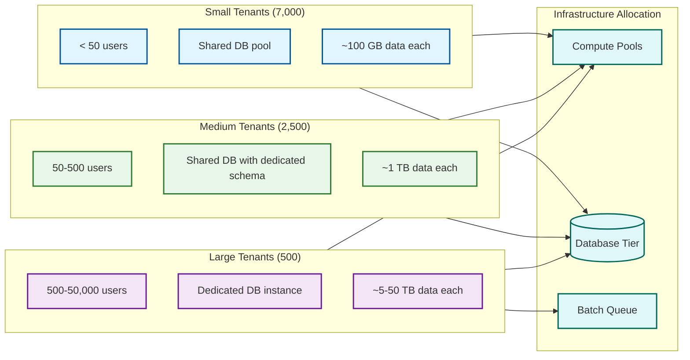

# Requirements & Estimations

## Functional Requirements

### Core Features

| # | Feature | Description |
|---|---------|-------------|
| F1 | **General Ledger and Financial Accounting** | Double-entry bookkeeping engine supporting multi-currency, multi-entity, and multi-GAAP (GAAP/IFRS) posting; chart of accounts hierarchy with configurable account segments; period-based ledger close with automated accruals, deferrals, and intercompany eliminations; real-time trial balance and financial statement generation |
| F2 | **Accounts Payable / Accounts Receivable** | Invoice lifecycle management from receipt through three-way matching (PO, receipt, invoice) to payment execution; configurable payment terms, early payment discounts, and dunning schedules; automated payment runs with multi-bank integration; customer credit limit management and aging analysis |
| F3 | **Inventory and Warehouse Management** | Real-time inventory tracking across multiple warehouses, locations, and bin levels; support for lot tracking, serial number management, and expiry date handling; inventory valuation methods (FIFO, LIFO, weighted average, standard cost); cycle counting and physical inventory reconciliation |
| F4 | **Human Resources and Payroll** | Employee lifecycle from recruitment through onboarding, position management, performance reviews, and separation; multi-country payroll engine with statutory deduction calculations, tax withholding rules, and benefits administration; leave management, attendance tracking, and shift scheduling |
| F5 | **Customer Relationship Management** | Lead-to-opportunity pipeline management; account and contact management with interaction history; quote-to-order conversion with configurable pricing rules, discount matrices, and approval workflows; service ticket tracking with SLA enforcement |
| F6 | **Procurement and Vendor Management** | Purchase requisition to purchase order workflow with multi-level approvals; vendor evaluation and scoring; RFQ management; contract lifecycle management with price agreements and blanket orders; goods receipt and quality inspection workflows |
| F7 | **Manufacturing and MRP** | Bill of materials (BOM) management with multi-level BOM explosion; material requirements planning (MRP) with demand forecasting, lead time calculation, and planned order generation; production order management with routing, work center scheduling, and shop floor execution tracking |
| F8 | **Multi-Tenancy and Tenant Management** | Tenant provisioning with configurable isolation levels (shared database, dedicated database); tenant-specific configuration for organizational structure, localization, and regulatory settings; tenant lifecycle management including onboarding, scaling, suspension, and decommissioning |
| F9 | **Customization Engine** | Metadata-driven custom field creation on any entity without schema changes; custom form layout designer per module and per role; custom validation rule builder with conditional logic; custom calculated fields and derived attributes; tenant-specific field visibility and mandatory rules |
| F10 | **Workflow and Approval Engine** | Visual workflow designer for multi-step approval chains; conditional routing based on document attributes (amount thresholds, department, region); parallel and sequential approval paths; escalation rules with time-based triggers; email and in-app notification integration |

### Supporting Features

| # | Feature | Description |
|---|---------|-------------|
| S1 | **Extension / Plugin Framework** | Sandboxed runtime for tenant-deployed custom business logic (tax calculations, pricing rules, compliance validations); marketplace for pre-built extensions; extension versioning with rollback; resource quotas per extension execution (CPU time, memory, query count) |
| S2 | **Report and Analytics Engine** | Built-in report designer with drag-and-drop field selection, grouping, filtering, and aggregation; parameterized report templates; scheduled report generation with email delivery; ad-hoc query builder with row-level security enforcement; dashboard builder with chart widgets |
| S3 | **Data Import / Export and Integration** | Bulk data import via CSV, XML, and fixed-width files with field mapping, validation, and error reporting; RESTful and GraphQL APIs for real-time integration; webhook subscriptions for event-driven integration; pre-built connectors for EDI (X12, EDIFACT), banking formats (BAI2, MT940), and common iPaaS platforms |
| S4 | **Audit Trail and Compliance** | Immutable audit log for every data mutation with before/after snapshots, user identity, timestamp, and source IP; configurable retention policies per regulation (SOX: 7 years, GDPR: right to erasure with audit preservation); field-level audit for sensitive data changes; compliance report templates for SOX, GDPR, and tax audits |
| S5 | **Multi-Currency and Localization** | Real-time and historical exchange rate management; automatic currency translation for consolidation reporting; multi-language UI with tenant-configurable language packs; locale-specific number, date, and address formatting; country-specific tax engine with configurable tax codes, rates, and rules |
| S6 | **Master Data Management** | Centralized management for organizational hierarchy (company > business unit > department > cost center); chart of accounts with segment-based account structure; business partner master (customers, vendors, employees as a unified entity); product master with configurable attribute sets; unit of measure conversions |
| S7 | **Role-Based Access Control (RBAC)** | Hierarchical role definitions with permission inheritance; row-level security based on organizational hierarchy (users see only their business unit's data); field-level security for sensitive data (salary, pricing); segregation of duties enforcement (the user who creates a PO cannot approve it); audit of permission changes |

### User Roles

| Role | Capabilities |
|------|-------------|
| **Business User** | Create and process transactions within assigned modules; run operational reports; view dashboards; participate in approval workflows |
| **Module Administrator** | Configure module-specific settings (chart of accounts, pay structures, warehouse layouts); manage master data; create custom reports and workflows |
| **Tenant Administrator** | Manage organizational structure, user provisioning, role assignments; configure custom fields, forms, and extensions; monitor tenant usage and billing |
| **Extension Developer** | Build, test, and deploy custom extensions; access sandbox environments; manage extension lifecycle and versioning |
| **Integration Specialist** | Configure API connections, webhook subscriptions, and EDI mappings; monitor integration health and error queues; manage data import/export jobs |
| **Compliance Officer** | Access audit trail; generate compliance reports; configure data retention policies; manage segregation of duties rules; review access control exceptions |
| **Platform Operator** | Manage multi-tenant infrastructure; provision and decommission tenants; monitor system health; execute platform upgrades; manage batch job scheduling |

---

## Out of Scope

| Exclusion | Rationale |
|-----------|-----------|
| **Industry-specific vertical modules** | Specialized modules for healthcare (EMR), banking (core banking), or government (grants management) are vertical extensions built on the platform, not part of the core design |
| **Business intelligence / data warehouse** | Full-scale BI with OLAP cubes, data mining, and predictive analytics is a separate analytical platform that consumes ERP data via export/replication |
| **E-commerce storefront** | Customer-facing web storefronts integrate with ERP via APIs for inventory and order management but are separate systems with different scaling profiles |
| **Document management system** | Full document lifecycle (versioning, OCR, content search) is handled by dedicated document management platforms; ERP stores document references and metadata |
| **Physical IoT / shop floor devices** | Manufacturing execution system (MES) hardware integration and IoT sensor data collection are edge systems that feed data into the ERP manufacturing module |
| **Tax filing / regulatory submission** | Actual electronic filing to tax authorities and regulatory bodies is handled by specialized compliance platforms that consume ERP-generated data |

---

## Non-Functional Requirements

| Requirement | Target | Rationale |
|-------------|--------|-----------|
| **CAP Trade-off** | CP for financial transactions (double-entry integrity, inventory accuracy, payroll correctness); AP for search indexes, dashboard caches, and cross-module denormalized views | Financial data corruption is catastrophic; reporting can tolerate short staleness |
| **Availability** | 99.95% for interactive transactions; 99.9% for batch processing subsystems | Enterprise users operate during business hours across time zones; batch has maintenance windows |
| **OLTP Latency** | p50 < 100ms, p99 < 200ms for single-entity reads; p50 < 200ms, p99 < 500ms for transactional writes | Interactive user experience demands sub-second response for form loads and saves |
| **Report Latency** | p50 < 2s, p99 < 5s for operational reports; p50 < 10s, p99 < 30s for analytical dashboards | Users tolerate longer waits for complex reports but expect operational lookups to feel responsive |
| **Batch Throughput** | Month-end close < 4 hours for largest tenants (5M entries); payroll < 2 hours for 50K employees | Period-end processing must complete within business-acceptable windows |
| **Tenant Data Isolation** | Zero cross-tenant data leakage; cryptographically enforced at query layer | A single cross-tenant data incident is an existential event for a multi-tenant ERP vendor |
| **Customization Stability** | Platform upgrades must not break tenant customizations; 100% backward compatibility for metadata-defined customizations | Tenants cannot afford to re-test and re-deploy customizations with every platform release |
| **Extension Isolation** | Extension execution limited to 50ms CPU, 128 MB memory, 10 database queries per invocation | Runaway extensions must not degrade other tenants or core platform performance |
| **Data Durability** | Zero data loss for committed transactions; synchronous replication with RPO = 0 | Financial records cannot be lost; regulatory and fiduciary obligations |
| **Recovery Time Objective** | < 15 minutes for full platform recovery; < 5 minutes for single-tenant failover | Enterprises lose revenue and productivity with every minute of ERP downtime |
| **Recovery Point Objective** | 0 for financial transactions (synchronous replication); < 1 minute for non-critical data | Financial integrity requires zero data loss; configuration and metadata can tolerate brief lag |
| **Upgrade Downtime** | < 30 minutes per platform release; zero downtime for tenant configuration changes | Coordinating maintenance windows across 10,000 tenants in different time zones is impractical |
| **Regulatory Compliance** | GAAP, IFRS, SOX, GDPR, country-specific tax and labor regulations | Non-negotiable; non-compliance results in legal liability for both vendor and tenants |
| **Audit Trail Retention** | 7 years minimum (SOX); configurable up to 15 years per tenant | Regulatory requirements vary by jurisdiction; tenants in regulated industries require longer retention |

---

## Capacity Estimations

### Traffic

```
Tenants:                       10,000
  Small (< 50 users):         7,000 (70%)
  Medium (50-500 users):      2,500 (25%)
  Large (> 500 users):        500 (5%)

Total registered users:        5,000,000
  Active in any given month:   3,500,000 (70%)
  Peak concurrent users:       500,000 (~10% simultaneous during overlapping business hours)

Daily transactions (all modules, all tenants):
  Journal entries:             40,000,000
  Purchase orders:             5,000,000
  Sales orders:                8,000,000
  Inventory movements:         15,000,000
  HR/Payroll events:           2,000,000
  CRM interactions:            10,000,000
  Workflow actions:            8,000,000
  Custom extension invocations: 10,000,000
  Audit log entries:           100,000,000 (every mutation logged)
  Total:                       ~200,000,000 state-changing operations/day

Read operations per day:
  Form loads / entity reads:   500,000,000
  List / search queries:       200,000,000
  Report executions:           2,000,000
  Dashboard refreshes:         50,000,000
  API reads (integrations):    250,000,000
  Total:                       ~1,000,000,000 reads/day

Average TPS (writes):          200M / 86,400 ≈ 2,315 TPS
Peak TPS (writes):             ~10,000 TPS (month-end close across multiple time zones)
Average TPS (reads):           1B / 86,400 ≈ 11,574 TPS
Peak TPS (reads):              ~50,000 TPS (9 AM Monday across global tenants)

API calls (external integrations):
  Inbound API calls/day:       500,000,000
  Outbound webhooks/day:       100,000,000
  EDI messages processed/day:  5,000,000
```

### Storage

```
--- Transactional Data ---
Average transaction record:    ~2 KB (journal entry with line items, metadata, audit fields)
Daily transactional growth:    200M x 2 KB = 400 GB/day
Annual transactional growth:   ~146 TB/year
Retention:                     10 years minimum

--- Audit Trail ---
Audit record size:             ~500 bytes (entity, field, old value, new value, user, timestamp)
Daily audit growth:            100M x 500 B = 50 GB/day
Annual audit growth:           ~18 TB/year
Retention:                     7-15 years (configurable per tenant)

--- Master Data ---
Per-tenant master data:        ~500 MB (chart of accounts, org hierarchy, product catalog, partners)
Total master data:             10,000 x 500 MB = 5 TB
Change rate:                   ~1% per month

--- Customization Metadata ---
Per-tenant metadata:           ~50 MB (custom fields, form layouts, workflows, validation rules)
Total metadata:                10,000 x 50 MB = 500 GB
Cached in memory:              Hot tenants (~2,000) x 50 MB = 100 GB cache requirement

--- Document Attachments ---
Per-tenant documents:          ~200 GB (invoices, receipts, contracts, PO attachments)
Total document storage:        10,000 x 200 GB = 2 PB
Annual growth:                 ~500 TB/year

--- Report Output Cache ---
Cached report outputs:         ~20 TB (frequently accessed reports with TTL-based expiry)

--- Search Index ---
Full-text search index:        ~10 TB (entity names, descriptions, document content)
Refresh frequency:             Near-real-time (< 30 seconds behind source of truth)

--- Aggregate Storage ---
Total active data:             ~200 TB (transactional + master data + metadata)
Total with history:            ~2 PB (10-year transactional history)
Total with documents:          ~4 PB
With replication (3x):         ~12 PB
With backup and DR:            ~15 PB total storage footprint
```

### Bandwidth

```
Interactive request size:      ~5 KB average (form payload with metadata)
Interactive response size:     ~10 KB average (entity data + custom field values + layout metadata)
Peak interactive bandwidth:    50,000 RPS x 15 KB = ~750 MB/s

API integration requests:      ~3 KB average
API responses:                 ~5 KB average
Peak API bandwidth:            20,000 RPS x 8 KB = ~160 MB/s

Batch data transfer:           Month-end close processes ~5M entries x 2 KB = ~10 GB per run
                               Payroll run for 50K employees: ~500 MB per run
                               Data import jobs: up to 10 GB per batch file

Report generation:             Large reports can reach 50 MB; average ~2 MB
Peak report bandwidth:         ~500 concurrent reports x 2 MB / 5s = ~200 MB/s

Internal replication:          400 GB/day transactional + 50 GB/day audit = 450 GB/day
                               3x replication = 1.35 TB/day internal replication bandwidth
                               Cross-region DR replication: ~450 GB/day

Event bus throughput:          300M events/day x 1 KB average = ~300 GB/day
                               Peak: ~5,000 events/second x 1 KB = ~5 MB/s

Total peak bandwidth:          ~2 Gbps (interactive + API + batch + replication + events)
```

---

## Capacity Summary

| Metric | Estimation | Calculation |
|--------|-----------|-------------|
| **Tenants** | 10,000 | Mix of SMB (70%), mid-market (25%), enterprise (5%) |
| **Total Users** | 5,000,000 | 10,000 tenants x 500 avg users |
| **Peak Concurrent Users** | 500,000 | ~10% of total during global business hour overlap |
| **Write TPS (average)** | ~2,300 | 200M daily write operations / 86,400 seconds |
| **Write TPS (peak)** | ~10,000 | Month-end close spike across multiple time zones |
| **Read TPS (peak)** | ~50,000 | Monday morning global login surge + dashboard loads |
| **Storage (active)** | ~200 TB | Current-year transactional + master data + metadata |
| **Storage (total with history)** | ~15 PB | 10-year retention + documents + replication + backup |
| **Daily data growth** | ~450 GB | Transactional records + audit trail + document uploads |
| **Batch jobs/day** | ~50,000 | Period-end close, payroll, MRP, depreciation, reporting |
| **Cache requirement** | ~150 GB | Tenant metadata + session state + hot query results |
| **Peak bandwidth** | ~2 Gbps | Interactive + API + batch + replication combined |

---

## SLO / SLA Table

| Service | Metric | SLO | SLA | Measurement |
|---------|--------|-----|-----|-------------|
| OLTP (form load) | Latency p50 | < 100ms | < 200ms | API gateway to response, including tenant metadata resolution and custom field hydration |
| OLTP (transaction save) | Latency p99 | < 500ms | < 1s | Full write path: validation, custom rules, journal posting, audit logging |
| Operational Reports | Latency p95 | < 5s | < 10s | Report generation for standard operational reports with < 100K rows |
| Analytical Dashboards | Latency p95 | < 10s | < 30s | Dashboard with 5-10 widgets sourcing from OLAP read replicas |
| Month-End Close (batch) | Duration | < 4h for 5M entries | < 6h | Complete close cycle: accruals, eliminations, currency translation, consolidation |
| Payroll Run (batch) | Duration | < 2h for 50K employees | < 3h | Full payroll: gross-to-net calculation, statutory deductions, bank file generation |
| Tenant Provisioning | Duration | < 30 minutes | < 1h | From provisioning request to fully operational tenant with sample data |
| Customization Deployment | Latency | < 5s for metadata changes | < 15s | Custom field addition, workflow update, or form layout change reflected in UI |
| Extension Execution | Latency p99 | < 50ms | < 100ms | Single extension invocation within a transaction context |
| API (external) | Latency p99 | < 300ms | < 500ms | External integration API calls including auth, rate limiting, and tenant resolution |
| Search | Latency p95 | < 500ms | < 1s | Full-text search across tenant's data with faceted results |
| Data Import | Throughput | 10,000 records/second | 5,000 records/second | Bulk CSV import with validation, deduplication, and error reporting |
| Tenant Isolation | Data leakage | 0 incidents | 0 incidents | Zero cross-tenant data exposure; measured by continuous penetration testing and query-layer assertions |
| Platform Availability | Uptime | 99.95% | 99.9% | Measured across all interactive endpoints; excludes planned maintenance windows |
| Batch Availability | Uptime | 99.9% | 99.5% | Batch subsystem availability; planned maintenance during low-activity windows |
| Audit Trail | Completeness | 100% | 100% | Every data mutation captured with before/after values; verified by reconciliation checks |
| Disaster Recovery | RTO | < 15 min | < 30 min | Full platform recovery from region failure to operational state |
| Disaster Recovery | RPO | 0 (financial) | < 1 min (non-critical) | Synchronous replication for financial data; async for analytics and cache |

---

## Tenant Size Distribution and Resource Allocation



---

## Key Estimation Insights

1. **The customization engine is the performance multiplier---not the transaction volume**: Raw transaction TPS (~2,300 average) is modest compared to consumer-scale systems. The real performance challenge is that every transaction triggers metadata lookups (custom fields, validation rules, workflow conditions) that can 10x the effective database queries per user action. A single invoice save might execute 50 metadata lookups if the tenant has heavily customized the invoice entity. Caching tenant metadata aggressively (and invalidating correctly) is the single most impactful performance optimization.

2. **Audit trail volume exceeds transactional volume by 5-10x in query load**: While the audit log grows at 50 GB/day (modest), the query patterns against it are expensive. Compliance officers run queries like "show all changes to vendor bank account fields in the last 90 days across all users"---which scans billions of audit records. Partitioning audit data by tenant and time, with dedicated read replicas for audit queries, is essential to prevent compliance reporting from degrading transactional performance.

3. **Month-end close is the true stress test, not peak concurrent users**: The hardest infrastructure challenge is not 500K concurrent users (standard horizontal scaling) but a large tenant's month-end close processing 5 million journal entries in a 4-hour window while hundreds of other tenants continue interactive operations. This requires tenant-aware resource isolation where batch compute pools are physically separated from interactive pools, with database connection pooling that prevents batch queries from monopolizing connections.

4. **Tenant size distribution follows a power law that breaks naive resource planning**: The top 500 tenants (5%) generate ~60% of total transaction volume and ~80% of batch processing load. Uniform per-tenant resource allocation wastes capacity for small tenants and starves large ones. The infrastructure must support tenant-specific resource profiles: small tenants share aggressively, large tenants get dedicated database instances and batch compute quotas.

5. **Extension execution latency compounds across transaction chains**: A single extension invocation at 50ms is acceptable. But a purchase order approval might trigger 5 extensions (tax calculation, budget validation, compliance check, custom pricing, vendor scoring) totaling 250ms of extension overhead. Parallel execution of independent extensions and aggressive caching of extension results for identical inputs are necessary to keep compound latency within bounds.

6. **Data migration is not a one-time event---it is a continuous operation**: Initial tenant onboarding involves migrating historical data from legacy systems (often millions of records with inconsistent formats). But ongoing operations include daily bank feed imports, weekly EDI exchanges, and periodic bulk updates from external systems. The import pipeline must handle 10,000 records/second sustained throughput with validation, deduplication, and error quarantine---operating continuously, not just during onboarding.

7. **Cross-timezone batch scheduling creates a "rolling thunder" pattern**: With 10,000 tenants across global time zones, there is no single "off-peak" window. When European tenants are running period-end close at midnight CET, Asian tenants are in peak interactive hours, and American tenants are running their own batch jobs. Batch scheduling must be timezone-aware with tenant-level priority and preemption to ensure interactive SLAs are maintained globally.

---

## Failure Budget Analysis

| Service | Availability Target | Allowed Downtime/Year | Allowed Failed Ops/Day | Impact of Breach |
|---------|---------------------|-----------------------|------------------------|-----------------|
| Financial Transactions | 99.95% | 4.38 hours | 100,000 | Incorrect financial records; regulatory audit risk; tenant liability |
| Payroll Processing | 99.9% | 8.76 hours | 2,000 | Employees not paid on time; labor law violations; tenant trust erosion |
| Inventory Management | 99.9% | 8.76 hours | 15,000 | Stock discrepancies; fulfillment delays; revenue impact for manufacturing |
| Customization Engine | 99.95% | 4.38 hours | N/A | All tenants see uncustomized forms; data entry errors from missing validations |
| Workflow Engine | 99.9% | 8.76 hours | 8,000 | Approval chains stalled; business process delays; manual workarounds |
| Reporting Engine | 99.5% | 43.8 hours | 10,000 | Delayed management reports; compliance reports unavailable during audits |
| Extension Runtime | 99.5% | 43.8 hours | 50,000 | Custom business logic disabled; fallback to base platform behavior |
| Integration APIs | 99.9% | 8.76 hours | 500,000 | EDI failures, bank feed gaps, webhook delivery delays; reconciliation gaps |

### Failure Budget Allocation Strategy

- **50% reserved for planned maintenance**: Platform upgrades, database migrations, and infrastructure changes. Scheduled per-tenant based on timezone preferences with 72-hour advance notification.
- **30% reserved for unplanned incidents**: Hardware failures, dependency outages, and network partitions. Multi-region active-passive failover should absorb most incidents within the 15-minute RTO budget.
- **15% reserved for tenant-specific incidents**: Individual tenant database issues, runaway extension failures, and configuration errors that require tenant-level intervention.
- **5% buffer for cascading failures**: Scenarios where a batch processing overload in one tenant triggers connection pool exhaustion that affects shared infrastructure.

---

## Seasonal and Event-Driven Scaling Considerations

| Event | Expected Load Multiple | Duration | Key Bottleneck |
|-------|-----------------------|----------|---------------|
| Month-end / quarter-end close | 3-5x batch load | 24-48 hours | Database IOPS; batch compute; journal entry posting throughput |
| Year-end close | 5-8x batch load | 72 hours | All month-end bottlenecks plus intercompany elimination, tax provisioning, and audit report generation |
| Payroll cycle (1st / 15th of month) | 2-3x for HR module | 4-8 hours | Payroll calculation engine; bank file generation; statutory reporting |
| Tax filing season (Q1 each year) | 2x for finance module | 2-3 weeks | Report generation; tax calculation engine; regulatory submission API throughput |
| Black Friday / holiday season | 2-3x for SCM/sales modules | 2 weeks | Order processing; inventory ATP checks; warehouse management throughput |
| New tenant onboarding wave | 1.5x provisioning load | Varies | Tenant provisioning pipeline; data migration throughput; metadata compilation |
| Annual platform upgrade | Maintenance window per tenant | Rolling over 2 weeks | Zero-downtime migration; schema compatibility validation; extension compatibility checks |

These patterns require proactive scaling: pre-provisioning batch compute pools before month-end, scaling database IOPS for period-close windows, and maintaining warm standby capacity for the year-end close surge. Unlike consumer applications where traffic spikes are unpredictable, ERP batch patterns are calendar-driven and highly predictable, enabling precise capacity planning.
