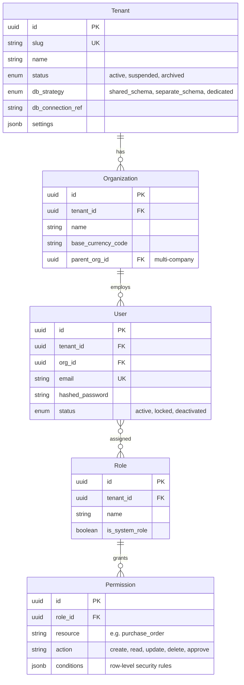
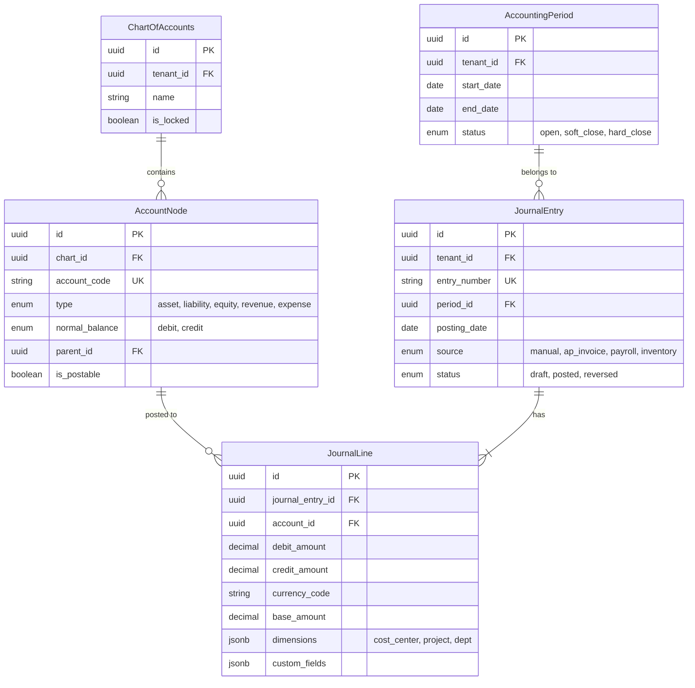
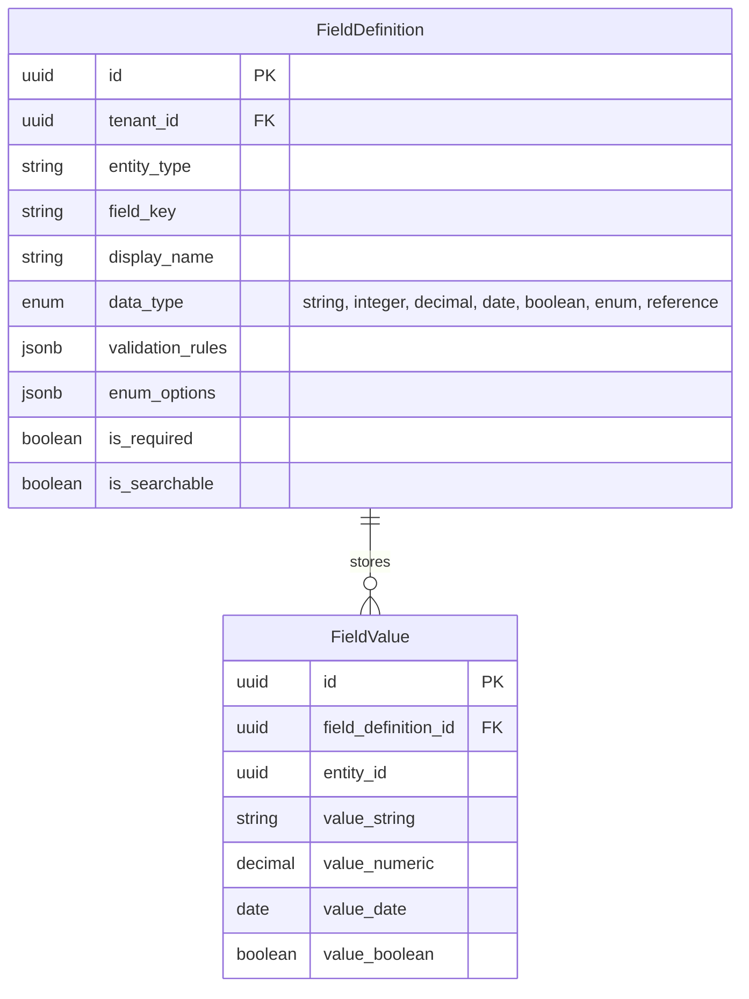

# Low-Level Design

## Data Models

### Core Platform Entities



### Finance Module



### HR, SCM, CRM Modules (Key Entities)

| Module | Entity | Key Fields | Notes |
|--------|--------|-----------|-------|
| HR | Employee | employee_number, hire_date, department_id, manager_id, employment_type, custom_fields | Self-referencing hierarchy |
| HR | PayrollRun | period_start, period_end, status, total_gross, total_net, posted_journal_entry_id | Links to Finance |
| HR | LeaveBalance | employee_id, leave_type_id, year, accrued, used, closing_balance | Entitlement tracking |
| SCM | Product | sku, uom, product_type, reorder_point, reorder_qty, custom_fields | Inventory-managed |
| SCM | PurchaseOrder | po_number, vendor_id, workflow_state, total_amount, currency_code | Workflow-driven |
| SCM | InventoryTransaction | product_id, warehouse_id, type (receipt/issue/transfer), quantity, unit_cost | Immutable log |
| CRM | Lead | source, status (new/qualified/disqualified), assigned_to, score | Pre-qualification |
| CRM | Opportunity | lead_id, stage, probability_pct, expected_amount, expected_close_date | Pipeline tracking |

### Custom Field Metadata (EAV)



---

## API Design

### Tenant-Scoped RESTful Endpoints

All paths are implicitly scoped to the authenticated tenant (resolved from subdomain or JWT — no `tenant_id` in URL).

```pseudocode
ENDPOINT GET /api/v1/finance/journal-entries
    Params: period_id, status, date_from, date_to, page, page_size
    Response: { data: [JournalEntry], pagination: { page, total, has_next } }

ENDPOINT POST /api/v1/finance/journal-entries
    Body: { posting_date, description, lines: [{ account_id, debit, credit, dimensions }] }
    Validation: debits == credits, accounts in tenant's chart, period is open
    Response: { data: JournalEntry, status: 201 }

ENDPOINT POST /api/v1/scm/purchase-orders/{id}/transitions
    Body: { action: "submit_for_approval", comment: "Urgent" }
    Triggers workflow engine; returns updated entity with new workflow_state
```

### Bulk Operations API

```pseudocode
FUNCTION process_bulk_operations(operations, options):
    results = []
    IF options.atomic: BEGIN_TRANSACTION

    FOR EACH op, index IN operations:
        TRY:
            IF options.validate_only:
                validate(op)
                results.append({ index, status: "valid" })
            ELSE:
                result = execute_operation(op)
                results.append({ index, status: "created", id: result.id })
        CATCH ValidationError AS e:
            results.append({ index, status: "error", error: e.message })
            IF options.atomic:
                ROLLBACK_TRANSACTION
                RETURN { status: "rolled_back", results }

    IF options.atomic: COMMIT_TRANSACTION
    RETURN { status: "completed", results }
```

---

## Customization Engine Internals

### Field Validation

```pseudocode
FUNCTION validate_custom_field(field_def, value):
    IF value IS NULL:
        IF field_def.is_required: RAISE ValidationError("Field is required")
        RETURN

    typed_value = coerce_type(value, field_def.data_type)
    IF typed_value IS COERCION_ERROR:
        RAISE ValidationError("Expected " + field_def.data_type)

    FOR EACH rule IN field_def.validation_rules:
        SWITCH rule.rule_type:
            CASE "min_length":
                IF length(typed_value) < rule.params["min"]: RAISE ValidationError(rule.message)
            CASE "max_value":
                IF typed_value > rule.params["max"]: RAISE ValidationError(rule.message)
            CASE "regex":
                IF NOT regex_match(rule.params["pattern"], typed_value): RAISE ValidationError(rule.message)
            CASE "in_list":
                IF typed_value NOT IN rule.params["values"]: RAISE ValidationError(rule.message)
            CASE "unique":
                IF exists_in_db(field_def, typed_value): RAISE ValidationError("Must be unique")
    RETURN typed_value
```

### Expression Evaluator for Computed Fields

Computed fields use a safe expression DSL (not arbitrary code). The evaluator parses expressions into an AST and recursively evaluates literal, field_ref, binary_op, and function_call nodes. Only whitelisted functions (`CONCAT`, `ROUND`, `ABS`, `MAX`, `MIN`, `COALESCE`, `TODAY`, `DATE_DIFF`, `IF`, `CASE`) are permitted — unknown functions raise `ExpressionError`. Examples: `quantity * unit_price * (1 - discount_pct / 100)`, `due_date < TODAY() AND status != 'paid'`.

---

## Multi-Tenancy Query Layer

### Tenant Context Injection

```pseudocode
FUNCTION tenant_aware_query_middleware(query, params):
    tenant = RequestContext.get_tenant()
    SWITCH tenant.db_strategy:
        CASE "shared_schema":
            query = rewrite_query_add_tenant_filter(query, tenant.id)
            connection = shared_pool.acquire()
        CASE "separate_schema":
            connection = shared_pool.acquire()
            connection.execute("SET search_path TO " + tenant.schema_name)
        CASE "dedicated":
            connection = dedicated_pools[tenant.id].acquire()
    TRY:
        RETURN connection.execute(query, params)
    FINALLY:
        connection.release()

FUNCTION rewrite_query_add_tenant_filter(query, tenant_id):
    ast = parse_sql(query)
    FOR EACH table_ref IN ast.referenced_tables:
        IF table_ref.table IN tenant_scoped_tables:
            ast.add_where_condition(table_ref.alias + ".tenant_id = " + tenant_id)
    IF NOT ast.has_tenant_filter:
        RAISE SecurityError("Missing tenant filter — aborting")
    RETURN ast.to_sql()
```

---

## Batch Processing Framework

Jobs are triggered by cron schedules, domain events, or manual user action. They enter a priority queue, are picked up by a worker pool, and tracked through states (queued, running, completed, failed, retry_scheduled).

### Month-End Close Pipeline

```pseudocode
FUNCTION execute_month_end_close(tenant_id, org_id, period_id):
    period = load_period(period_id)
    close_run = create_close_run(tenant_id, org_id, period_id)

    steps = [
        "validate_open_transactions",
        "run_accruals",
        "run_depreciation",
        "revalue_foreign_currency",
        "generate_intercompany_eliminations",
        "compute_trial_balance",
        "assert_debits_equal_credits",
        "close_subledgers",
        "close_period"
    ]

    FOR EACH step IN steps:
        close_run.update_step(step, status="running")
        TRY:
            execute_step(step, tenant_id, org_id, period)
            close_run.update_step(step, status="completed")
        CATCH error:
            close_run.update_step(step, status="failed", error=error)
            notify_finance_team(tenant_id, "Close failed at: " + step)
            RETURN close_run

    close_run.set_status("completed")
    emit_event("PeriodClosed", { tenant_id, org_id, period_id })
    RETURN close_run

FUNCTION calculate_depreciation(asset, period):
    SWITCH asset.depreciation_method:
        CASE "straight_line":
            RETURN (asset.cost - asset.salvage_value) / asset.useful_life_months
        CASE "declining_balance":
            remaining = asset.cost - asset.accumulated_depreciation
            RETURN remaining * (2.0 / (asset.useful_life_months / 12)) / 12
        CASE "units_of_production":
            rate = (asset.cost - asset.salvage_value) / asset.total_estimated_units
            RETURN rate * asset.units_this_period
```

### Payroll Calculation Engine

```pseudocode
FUNCTION calculate_payroll(tenant_id, org_id, payroll_run_id):
    run = load_payroll_run(payroll_run_id)
    employees = get_active_employees(tenant_id, org_id, run.period_end)
    tax_tables = load_tax_tables(tenant_id, run.period_end.year)

    FOR EACH emp IN employees:
        structure = load_salary_structure(emp.salary_structure_id)
        gross = 0
        deductions = 0

        // Earnings: fixed, percentage-of-basic, hourly, expression-based
        FOR EACH component IN structure.earning_components:
            amount = calculate_component(component, emp, run)
            gross += amount

        // Statutory deductions
        income_tax = calculate_income_tax(gross * 12, tax_tables) / 12
        social_security = ROUND(gross * tax_tables.social_security_rate, 2)
        deductions = income_tax + social_security

        // Voluntary deductions (insurance, retirement contributions)
        FOR EACH vol IN emp.voluntary_deductions:
            deductions += calculate_voluntary_deduction(vol, gross)

        net_pay = gross - deductions
        run.add_line(emp.id, gross, deductions, net_pay, emp.cost_center)

    run.status = "calculated"
    persist(run)
    RETURN run
```

### Inventory Valuation Algorithms

```pseudocode
FUNCTION calculate_fifo_cost(product_id, warehouse_id, issue_qty):
    // FIFO: consume oldest cost layers first
    layers = query_cost_layers(product_id, warehouse_id, order="received_date ASC")
    total_cost = 0
    remaining = issue_qty

    FOR EACH layer IN layers:
        IF remaining <= 0: BREAK
        consume = MIN(layer.remaining_qty, remaining)
        total_cost += consume * layer.unit_cost
        remaining -= consume
        layer.remaining_qty -= consume
        persist(layer)

    IF remaining > 0: RAISE InsufficientStockError(product_id)
    RETURN { total_cost, unit_cost: total_cost / issue_qty }

FUNCTION calculate_weighted_average_cost(product_id, warehouse_id, receipt_qty, receipt_cost):
    // Recompute average on each receipt
    current = get_inventory_balance(product_id, warehouse_id)
    new_qty = current.total_qty + receipt_qty
    new_value = current.total_value + (receipt_qty * receipt_cost)
    avg_cost = IF new_qty > 0 THEN new_value / new_qty ELSE 0
    update_inventory_balance(product_id, warehouse_id, new_qty, new_value, avg_cost)
    RETURN { avg_unit_cost: avg_cost }

// LIFO: identical to FIFO but layers ordered by received_date DESC
// Note: LIFO prohibited under IFRS, allowed under US GAAP
```

### Job Orchestration

Each job definition carries a `concurrency_key` to prevent duplicate parallel runs. On failure, jobs retry with exponential backoff up to `max_retries`, then move to a dead-letter queue. The worker sets tenant context before execution and clears it in a finally block, ensuring tenant isolation even in background processing.
