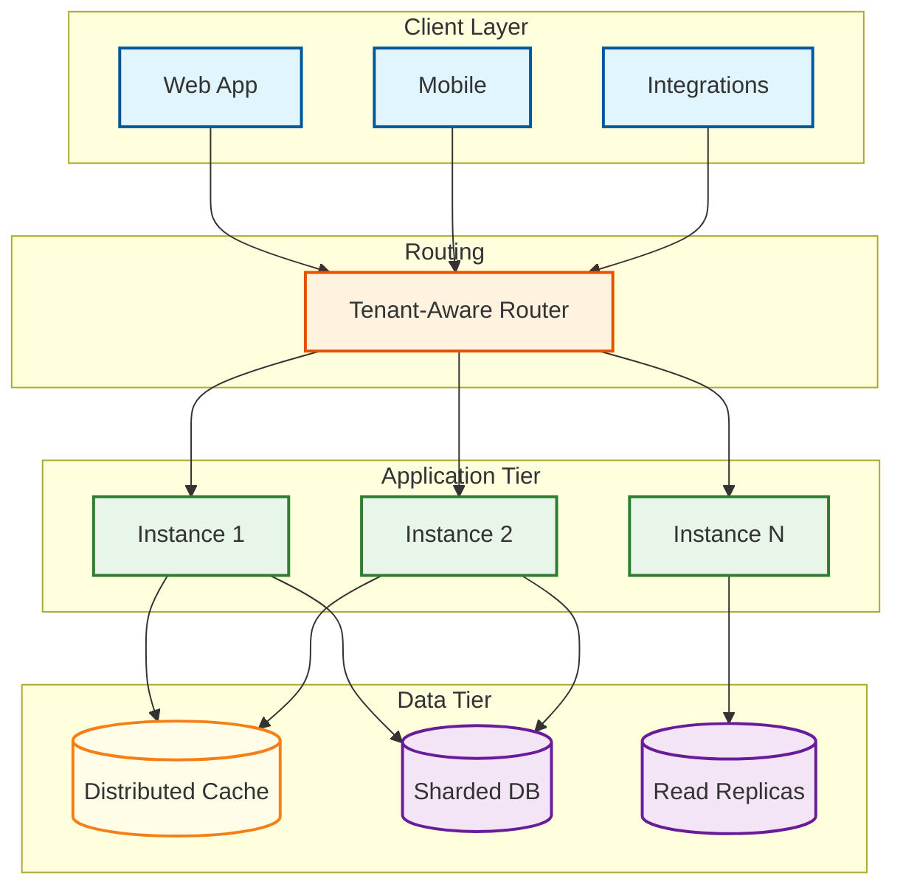
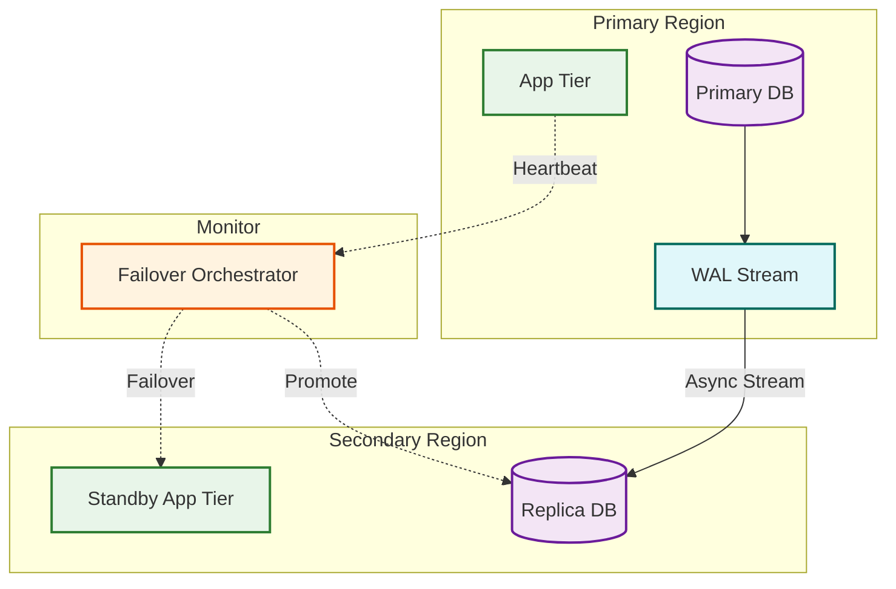
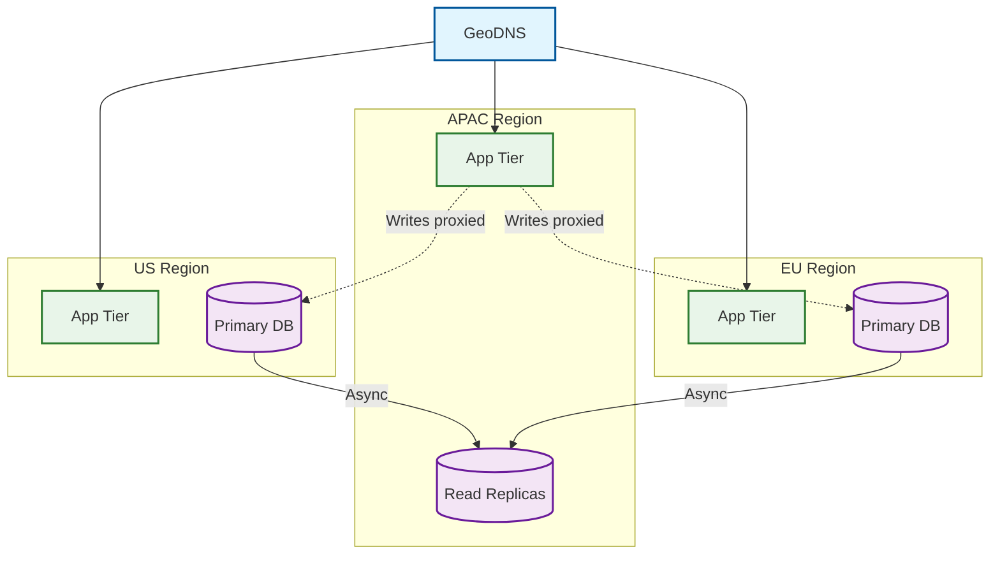

# Scalability & Reliability

## Scaling Strategy Overview

ERP systems have a distinctive load profile: steady transactional workloads during business hours, 10--50x spikes during payroll and month-end close, and heavy reporting loads at quarter-end. Unlike consumer systems where reads dominate, ERP databases are write-heavy---every business event generates journal entries, audit logs, and cross-module updates.

| Component | Scaling Dimension | Strategy | Primary Bottleneck |
|-----------|------------------|----------|-------------------|
| Transaction Services | Requests/sec | Stateless horizontal | DB write throughput |
| Reporting Services | Query complexity | Read-replica fan-out | I/O + memory |
| Batch Processing | Jobs/hour | Worker pool auto-scaling | CPU + DB lock contention |
| Customization Engine | Executions/sec | Sandboxed workers per tier | CPU isolation |
| Workflow Engine | Active workflows | Event-driven partitioned state | State persistence throughput |

---

## 1. Horizontal Scaling Strategy

### Stateless Tier with Tenant-Aware Routing

All ERP service instances are stateless---session, workflow state, and tenant context live in distributed cache or the database. The load balancer uses consistent hashing on `tenant_id` to route requests, improving cache hit rates by keeping a tenant's metadata warm on the same instances.



```pseudocode
FUNCTION route_request(request):
    tenant_id = extract_tenant_id(request)
    IF get_tenant_tier(tenant_id) == DEDICATED:
        target_pool = dedicated_pools[tenant_id]
    ELSE:
        ring = consistent_hash_ring(shared_pool.instances)
        target_pool = ring.get_nodes(tenant_id, replica_count = 3)
    RETURN select_least_loaded(filter_healthy(target_pool))
```

### CQRS: Reporting on Read Replicas

Reporting queries (trial balance, aging, inventory valuations) route to read replicas, avoiding contention with transactional writes. The reporting layer tolerates up to 5 seconds replication lag---acceptable since financial reports are inherently point-in-time snapshots. If lag exceeds threshold, queries fall back to the primary.

---

## 2. Database Scaling

### Sharding Strategy

**Tenant-based sharding** is the primary approach. All data for a tenant co-locates on one shard, eliminating cross-shard joins for standard operations.

| Strategy | Use Case | Pros | Cons |
|----------|----------|------|------|
| Tenant-based | Core transactional data | No cross-shard joins, natural isolation | Uneven shard sizes |
| Time-range | Journal entries, audit logs | Efficient period queries, natural archival | Cross-period scatter-gather |
| Hybrid (tenant + time) | Large tenants with years of history | Best of both | Routing complexity |

```pseudocode
FUNCTION resolve_shard(tenant_id, query_context):
    meta = cache.GET("tenant_meta:" + tenant_id)
    IF meta.shard_strategy == DEDICATED:
        shard = meta.dedicated_shard
        IF query_context.has_period_filter:
            RETURN resolve_time_partition(shard, query_context.period)
        RETURN shard
    ELSE:
        RETURN shard_catalog[consistent_hash(tenant_id, total_shards)]

FUNCTION rebalance_shards():
    FOR EACH shard IN shard_catalog:
        IF shard.p99_latency > THRESHOLD:
            hot_tenant = find_largest_tenant(shard)
            schedule_live_migration(hot_tenant, new_dedicated_shard)
```

### Table Partitioning and Connection Pooling

Within each shard: **journal entries** partitioned by `accounting_period`, **audit logs** by `created_date` (weekly), **EAV values** by `entity_type`. Partition pruning eliminates 90%+ of data scanning.

Connection pool hierarchy: application-level pools (100 per instance), proxy-level shared pool (500 per shard) with per-tenant limits---enterprise tenants get 100 connections, standard gets 20, free gets 5. Critical operations (payment posting) can preempt lowest-priority idle connections.

### Archive Strategy

```pseudocode
FUNCTION archive_fiscal_year(tenant_id, fiscal_year):
    ASSERT fiscal_year.status == CLOSED AND fiscal_year.audit_status == COMPLETED
    FOR EACH partition IN get_partitions_for_year(tenant_id, fiscal_year):
        export_to_columnar_format(partition, object_storage_path)
        register_in_archive_catalog(tenant_id, fiscal_year, partition)
    schedule_partition_detach(partitions, grace_period = 30_DAYS)
    -- Archived data remains queryable via federated query engine
    update_query_router(tenant_id, fiscal_year, source = ARCHIVE)
```

---

## 3. Caching Architecture

### Multi-Layer Design

| Layer | Contents | TTL | Invalidation |
|-------|----------|-----|--------------|
| L1 (in-process) | Tenant config, chart of accounts, exchange rates | 60s | Timer + event-driven bust |
| L2 (distributed) | Session state, workflow state, custom field defs, permissions | 5--30 min | Event-driven on metadata change |
| L3 (CDN) | Static assets, report templates, localization bundles | 24h | Deploy-triggered purge |

### Event-Driven Invalidation

When a tenant admin modifies custom fields, workflows, or chart of accounts, the metadata service publishes an invalidation event. All instances subscribed to that tenant's channel evict stale entries:

```pseudocode
FUNCTION on_metadata_change(event):
    -- Bust L2 distributed cache
    distributed_cache.DELETE_BY_PATTERN("tenant:" + event.tenant_id + ":" + event.entity_type + ":*")
    -- Notify all instances to evict L1
    publish("cache_invalidation:" + event.tenant_id, {entity_type: event.entity_type})

FUNCTION on_invalidation_message(msg):
    local_cache.EVICT_BY_PREFIX(msg.entity_type)  -- lazy reload on next access
```

---

## 4. Batch Processing at Scale

### Priority Lanes and Tenant-Fair Scheduling

```pseudocode
PRIORITY LANES:
  Lane 0 (CRITICAL): Month-end close, payroll       → 40% workers, start < 30s
  Lane 1 (HIGH):     Payment runs, reconciliation   → 30% workers, start < 2 min
  Lane 2 (NORMAL):   Reports, exports, bulk updates  → 20% workers, start < 15 min
  Lane 3 (LOW):      ETL, analytics, archive         → 10% workers, best-effort

FUNCTION dequeue_next_job(lane):
    -- Round-robin across tenants to prevent starvation
    tenants = get_tenants_with_pending_jobs(lane)
    IF tenants IS EMPTY: RETURN NULL
    next_tenant = tenants[lane.rr_index % LEN(tenants)]
    lane.rr_index += 1
    RETURN dequeue_oldest_job(lane, next_tenant)
```

### Checkpoint and Resume

Long-running jobs (month-end close: 4+ hours) write progress checkpoints every N items. On worker failure, a replacement worker resumes from the last checkpoint rather than restarting from scratch:

```pseudocode
FUNCTION run_batch_with_checkpoints(job):
    checkpoint = load_checkpoint(job.id)
    items = get_remaining_items(job, after = checkpoint.last_id)
    buffer = []
    FOR EACH item IN items:
        buffer.APPEND(process_item(item))
        IF LEN(buffer) >= 500:
            flush_results(buffer)
            save_checkpoint(job.id, item.id)
            buffer = []
    flush_results(buffer)
    mark_job_complete(job.id)
```

---

## 5. Reliability Patterns

### Circuit Breakers Between Modules

Each module boundary has a circuit breaker. Configuration: 5 failures in 60s opens the circuit, half-open probe after 30s, 3 consecutive successes close it. When open, the caller receives a fallback response (e.g., queued for retry) instead of a timeout cascade.

### Bulkhead Isolation per Tenant Tier

| Tier | Thread Pool | DB Connections | Queue Depth | Isolation |
|------|-----------|---------------|-------------|-----------|
| Enterprise | Dedicated (200 threads) | 100 | 5,000 | Full; own shard |
| Professional | Shared, 30% reserved | 20 | 500 | Soft; shared shard |
| Standard | Shared, best-effort | 5 | 100 | None; shared shard |

### Graceful Degradation Hierarchy

```pseudocode
DEGRADATION LEVELS:
  Level 0: Disable dashboard widgets, analytics, recommendations
  Level 1: Disable report generation, queue for later
  Level 2: Disable approval workflows, allow manual override
  Level 3: Read-only mode for affected module
  Level 4: Full system read-only mode
```

### Disaster Recovery



| Metric | Target | Implementation |
|--------|--------|----------------|
| RPO | < 1 minute | Continuous WAL streaming |
| RTO | < 15 minutes | Pre-provisioned standby, automated failover |
| Backup | Continuous + daily snapshots | WAL archive every 10s, full snapshot every 24h |
| Retention | 90 days daily, 7 years monthly | Object storage lifecycle policy |

```pseudocode
FUNCTION execute_failover(reason):
    -- Verify primary is truly unreachable (avoid split-brain)
    IF multi_probe_primary(probes = 3, timeout = 10s).any_succeeded:
        RETURN ABORTED
    revoke_primary_write_credentials()    -- fence the primary
    secondary_db.promote_to_primary()
    WAIT_UNTIL secondary_db.is_accepting_writes(timeout = 60s)
    standby_app_tier.activate()
    update_dns_to_secondary_region()
    alert_ops_team(reason, compute_wal_gap())
```

---

## 6. Multi-Region Deployment



### Data Residency and Read-Local Routing

Tenant data stays in its home region (GDPR, data localization). Replication policies only target allowed regions. Read-local routing sends reporting queries to the nearest replica, reducing cross-region latency from 200--300ms to under 20ms per round-trip.

| Operation | Routing | Acceptable Lag |
|-----------|---------|----------------|
| Transactional writes | Home region primary | N/A |
| Interactive reads | Home region or nearest replica | < 1s |
| Reporting reads | Nearest replica (any region) | < 5s |

On regional failure, only tenants whose home region matches the failed region are affected. The orchestrator promotes replicas in the failover region for those tenants while all other tenants continue uninterrupted.

---

## Scaling Decision Matrix

| Scenario | Action | Trigger |
|----------|--------|---------|
| Month-end spike | Max batch workers, prioritize Lane 0 | Calendar (T-2 days) |
| Enterprise onboarding | Dedicated shard + instance pool | Tier = Enterprise |
| Cross-region latency | Deploy read-local replicas | p95 read > 500ms |
| Shard hot-spot | Live-migrate largest tenant | p99 write > 200ms |
| Storage > 80% | Archive closed fiscal years | Utilization alert |
| Regional outage | Automated failover | Health monitor trigger |
