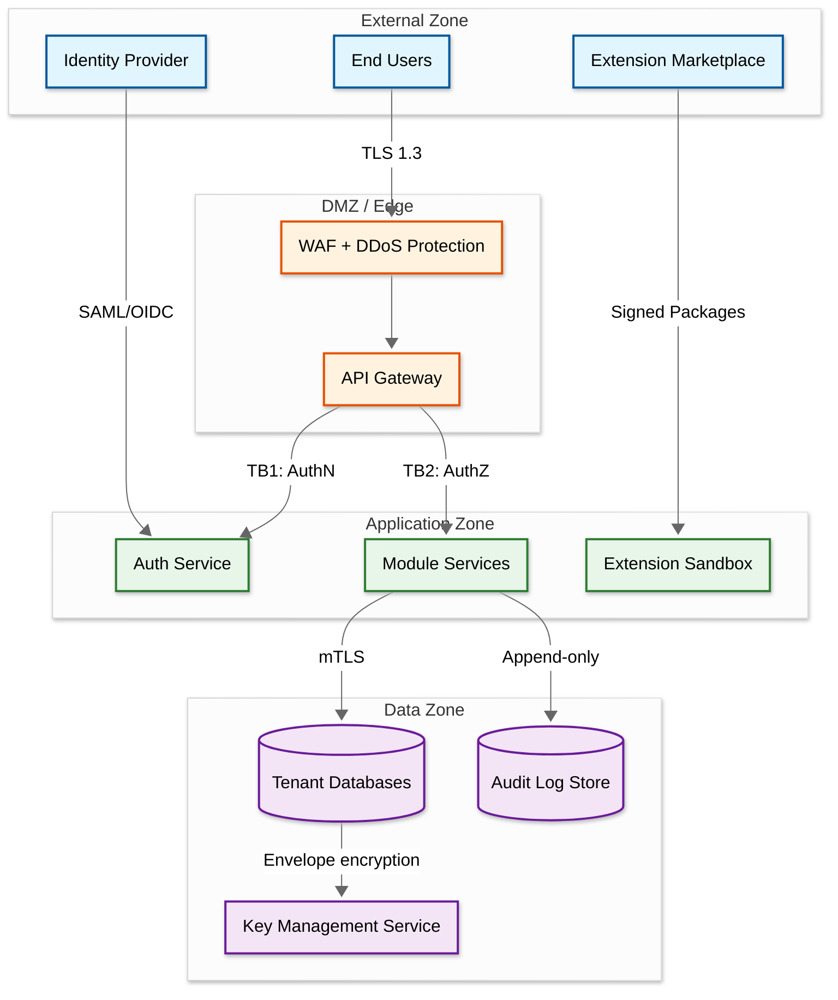
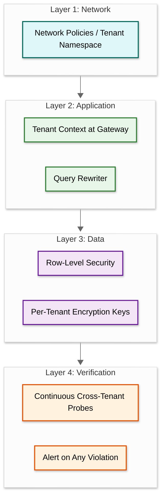

# Security & Compliance

ERP systems centralize financial records, employee data, supply chain details, and intellectual property. A single breach exposes every business function simultaneously, making defense-in-depth across authentication, authorization, data protection, audit, tenant isolation, and extension security essential.

---

## 1. Threat Model

### 1.1 STRIDE Analysis

| Threat | ERP-Specific Risk | Mitigation |
|---|---|---|
| **Spoofing** | Attacker impersonates procurement manager to approve fraudulent POs | MFA, SSO with strong IdP, session binding |
| **Tampering** | Modification of posted journal entries | Immutable append-only ledger, cryptographic checksums |
| **Repudiation** | User denies approving a purchase order | Tamper-evident audit log with digital signatures |
| **Info Disclosure** | Cross-tenant data leakage exposing salary data | Tenant isolation at query engine, row-level security |
| **DoS** | Noisy tenant month-end close starves others | Per-tenant resource quotas, tenant-aware throttling |
| **Privilege Escalation** | Custom field injection grants admin access | Input sanitization, ABAC enforcement, sandboxed extensions |

**Top attack vectors:** (1) privilege escalation through role misconfiguration, (2) cross-tenant data leakage via missing tenant_id predicates, (3) SQL injection through EAV custom fields, (4) malicious marketplace extensions, (5) insider threats from overly broad admin access.

### 1.2 Trust Boundary Diagram



---

## 2. Authentication & Authorization

### 2.1 SSO and MFA

| Flow | Protocol | Token / Session |
|---|---|---|
| Web login | OIDC Authorization Code + PKCE | Access: 15 min, Refresh: 8 hr |
| Service-to-service | OAuth 2.0 Client Credentials | 5 min JWT, no refresh |
| API integrations | OIDC with API key binding | Scoped JWT, max 1 hr |

**Step-up MFA triggers:** approve financial transaction above threshold, change vendor bank details, access payroll data, modify security roles.

### 2.2 Organizational Hierarchy and RBAC

Permissions follow `Module.Entity.Operation.Scope` (e.g., `finance.journal_entry.post.department`). The org hierarchy — Company > Business Unit > Department > Team > User — defines scope boundaries. Every record carries an `org_path`; access rules cascade downward unless explicitly restricted.

### 2.3 ABAC for Field-Level Security

| Attribute | Rule |
|---|---|
| `data_classification` | Fields marked `confidential` require `clearance_level >= 3` |
| `country_of_employment` | Salary visible only to HR in same country |
| `transaction_amount` | Above threshold requires additional approval role |
| `time_context` | Payroll data read-only after period close |

### 2.4 Separation of Duties

| Conflict Pair | Rationale |
|---|---|
| Create Vendor + Approve Payment | Prevents fictitious vendor fraud |
| Create PO + Approve PO | Four-eyes principle |
| Modify Chart of Accounts + Post Journal Entry | Prevents account manipulation |
| Manage User Roles + Approve Financial Transactions | Prevents self-escalation |

### 2.5 Permission Evaluation Engine

```pseudocode
FUNCTION evaluate_access(user, resource, operation):
    // Step 1: Tenant isolation — hard boundary
    IF user.tenant_id != resource.tenant_id:
        LOG_SECURITY_EVENT("cross_tenant_attempt", user, resource)
        RETURN DENY

    // Step 2: Separation of duties
    conflicts = SoD_RULES.find_conflicts(user.roles, resource.entity, operation)
    IF conflicts IS NOT EMPTY AND resource has active_transaction created_by user:
        RETURN DENY

    // Step 3: RBAC permission match
    required = BUILD_PERMISSION(resource.module, resource.entity, operation)
    IF NOT MATCH_PERMISSION(required, RESOLVE_PERMISSIONS(user.roles)):
        RETURN DENY

    // Step 4: Org hierarchy scope check
    max_scope = GET_MAX_SCOPE(user.roles, required)
    IF NOT ORG_HIERARCHY.is_within_scope(user.org_path, resource.org_path, max_scope):
        RETURN DENY

    // Step 5: ABAC field-level restrictions
    field_mask = ABAC_ENGINE.evaluate(user.attributes, resource.fields, operation)

    RETURN ACCESS_DECISION(allowed: TRUE, field_mask: field_mask,
                           requires_mfa_stepup: NEEDS_STEPUP(resource, operation))
```

---

## 3. Data Security

### 3.1 Envelope Encryption

Each tenant gets a unique Data Encryption Key (DEK) wrapped by a Master Key in a hardware security module. Key rotation every 90 days; old DEK remains for decryption while new writes use the re-wrapped DEK. Background re-encryption runs asynchronously.

### 3.2 Encryption in Transit

| Path | Protocol | Cert Management |
|---|---|---|
| Client to edge | TLS 1.3 | Automated renewal via ACME |
| Service to service | mTLS, 24-hr certs | Internal CA with SPIFFE identity |
| Service to database | TLS 1.3 + client cert | Rotated per deployment |

### 3.3 Field-Level Encryption for PII

| Category | Examples | Searchable? |
|---|---|---|
| Financial identifiers | Bank accounts, routing numbers | Blind index for exact match |
| Personal identifiers | SSN, national ID | Blind index for exact match |
| Compensation | Salary, bonus, equity | Order-preserving token for ranges |
| Health information | Medical records | Not searchable; access logged |

### 3.4 Data Masking for Non-Production

```pseudocode
FUNCTION mask_dataset(dataset, target_env):
    rules = LOAD_MASKING_RULES(target_env)
    FOR EACH record IN dataset:
        FOR EACH field IN record:
            SWITCH rules.get(field.classification).type:
                CASE "redact":    field.value = "***REDACTED***"
                CASE "tokenize":  field.value = DETERMINISTIC_TOKEN(field.value, salt)
                CASE "generalize": field.value = GENERALIZE(field.value, precision)
                CASE "synthetic": field.value = GENERATE_SYNTHETIC(field.schema)
                CASE "preserve":  // No change
    RETURN dataset
```

---

## 4. Audit & Compliance

### 4.1 Immutable Audit Log

Every state change produces a tamper-evident record with: `event_id`, `tenant_id`, `timestamp`, `actor_id`, `action`, `resource_type`, `resource_id`, `before_state` (encrypted), `after_state` (encrypted), and `hash_chain` (SHA-256 of previous hash + current event). The hash chain makes any gap or modification detectable. Retention: 7 years minimum in WORM-compliant storage.

### 4.2 Regulatory Compliance Matrix

| Framework | Key Controls |
|---|---|
| **SOX** | SoD engine, approval workflows for config changes, quarterly access certification, period close locks |
| **GDPR** | Pseudonymization for erasure requests, data portability export API, consent records with timestamp/purpose, 72-hr breach notification |
| **GAAP/IFRS** | Journal entry immutability (posted entries can only be reversed, never edited), period close enforcement, debit-credit balance validation |

```pseudocode
FUNCTION post_journal_entry(entry, user):
    period = GET_ACCOUNTING_PERIOD(entry.date)
    IF period.status == "CLOSED": REJECT("Cannot post to closed period")
    IF SUM(entry.debit_lines) != SUM(entry.credit_lines): REJECT("Unbalanced entry")
    FOR EACH line IN entry.lines:
        IF LOOKUP_ACCOUNT(line.account_code).status != "ACTIVE": REJECT("Inactive account")
    IF entry.amount > AUTO_POST_THRESHOLD:
        REQUIRE_APPROVAL(entry, approver_role="finance_controller")
    entry.status = "POSTED"
    entry.posted_at = TRUSTED_TIMESTAMP()
    PERSIST(entry)
    EMIT_AUDIT_EVENT("journal_entry.post", entry, user)
    LOCK_RECORD(entry)  // Posted entries can NEVER be modified
```

---

## 5. Multi-Tenant Security

### 5.1 Isolation Layers



### 5.2 Cross-Tenant Query Prevention

```pseudocode
FUNCTION rewrite_query(query, context):
    ast = PARSE_SQL(query)
    FOR EACH table_ref IN ast.table_references:
        IF table_ref.table IN TENANT_SCOPED_TABLES:
            ast.where_clause = AND(
                BUILD_PREDICATE(table_ref.alias, "tenant_id", "=", context.tenant_id),
                ast.where_clause
            )
    // Reject any literal tenant_id value that differs from context
    FOR EACH val IN EXTRACT_LITERALS(ast, "tenant_id"):
        IF val != context.tenant_id:
            LOG_SECURITY_EVENT("cross_tenant_query_attempt", context)
            ABORT_QUERY()
    RETURN ast.to_sql()
```

### 5.3 Tier Security Features

| Feature | Standard | Premium | Dedicated |
|---|---|---|---|
| Data isolation | Shared DB, RLS | Separate schema | Dedicated instance |
| Network | Shared namespace | Dedicated namespace | Dedicated cluster |
| Encryption | Shared master key, per-tenant DEK | Per-tenant master key | Tenant-managed HSM |
| Compliance | SOC 2, ISO 27001 | + SOX, GDPR | + HIPAA, PCI-DSS |

---

## 6. Extension Security

### 6.1 Lifecycle Controls

| Stage | Control |
|---|---|
| Submission | Static analysis, dependency vulnerability scan |
| Signing | Platform CA code signing; unsigned extensions rejected |
| Installation | Tenant admin reviews permission manifest |
| Runtime | Sandboxed: 5s CPU, 256 MB memory, declared network destinations only, no direct DB |
| Monitoring | Execution metrics, anomaly detection, API call auditing |

### 6.2 Permission Manifest and Approval

```pseudocode
FUNCTION approve_extension_install(manifest, tenant_admin):
    IF NOT VERIFY_SIGNATURE(manifest, PLATFORM_CA): REJECT("Invalid signature")

    high_risk = FILTER(manifest.permissions_required, IS_HIGH_RISK)
    IF high_risk IS NOT EMPTY:
        REQUIRE_SECONDARY_APPROVAL(high_risk, role="security_admin")

    violations = CHECK_TENANT_POLICY(manifest.permissions_required, tenant_admin.tenant_id)
    IF violations IS NOT EMPTY: REJECT("Policy violation: " + violations)

    RETURN INSTALL_SUCCESS(MINT_SCOPED_TOKEN(
        tenant_id: tenant_admin.tenant_id,
        permissions: manifest.permissions_required,
        ttl: EXTENSION_SESSION_TTL))
```

### 6.3 Vulnerability Management

Critical CVEs (CVSS >= 9.0) trigger immediate extension disable and tenant notification. High CVEs (>= 7.0) flag the extension with a 14-day remediation deadline. Daily dependency scans run against the vulnerability database for all published extensions.

---

## 7. Security Operations

| Activity | Frequency |
|---|---|
| Automated tenant isolation probes | Continuous (every 15 min) |
| Static application security testing | Every build |
| Dynamic security testing with fuzzing | Weekly |
| Penetration testing (incl. sandbox escapes) | Quarterly |
| Red team exercises | Annually |
| Dependency vulnerability scan | Daily |

**Incident response:** Detection (cross-tenant alerts, audit integrity failures) > Containment (isolate tenant, revoke tokens) > Eradication (patch, rotate keys) > Recovery (verify via hash chain) > Post-incident (RCA, update SoD rules).

---

## Summary

ERP security layers six dimensions: threat modeling drives architecture; authentication and authorization enforce identity at every boundary; data security protects information at rest, in transit, and at the field level; audit infrastructure guarantees regulatory accountability; multi-tenant isolation provides defense-in-depth at network, application, and data layers; and extension security prevents third-party code from becoming an attack surface. Each layer assumes the others may fail.
