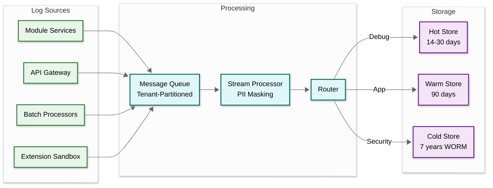
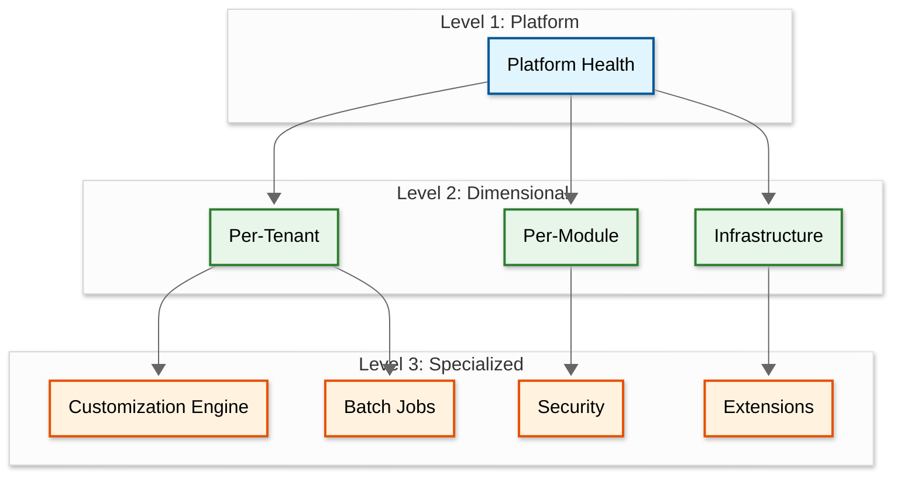
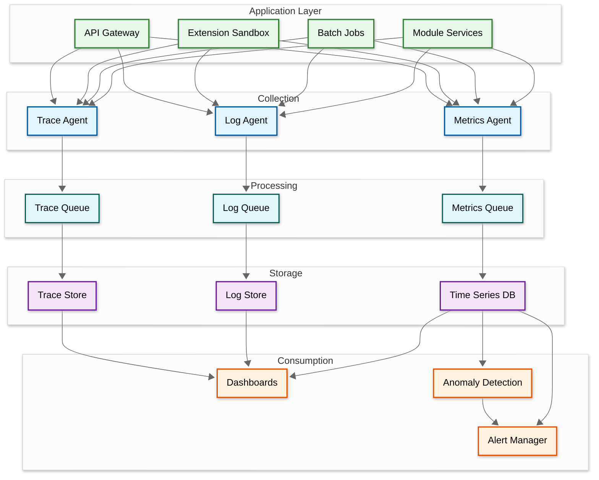

# Observability

An ERP platform spans dozens of modules — finance, HR, supply chain, manufacturing, procurement — each with distinct performance profiles and tenant-specific customizations. Observability must capture business-level semantics because a healthy CPU metric is meaningless if month-end close is stuck at 60% for three hours.

---

## 1. Metrics Framework

### 1.1 Business Metrics

| Metric | Description | Granularity |
|---|---|---|
| Transactions per module | Posted invoices, journal entries, POs per period | Per tenant, per module, per hour |
| Active users per tenant | Distinct users with at least one action (HyperLogLog) | Per tenant, per 15 min |
| Month-end close duration | Wall-clock time from initiation to completion | Per tenant, per period |
| Batch job throughput | Records/sec for payroll, MRP, depreciation | Per tenant, per job type |
| Approval cycle time | Submission to final approval (histogram) | Per tenant, per entity type |

### 1.2 Infrastructure Metrics

| Metric | Alert Threshold | Collection |
|---|---|---|
| CPU utilization per tenant | > 80% sustained 5 min | Container metrics agent |
| Memory utilization | > 85% | Container metrics agent |
| DB connections per tenant | > 80% of pool | Connection pool instrumentation |
| Cache hit rate | < 70% | Cache client instrumentation |
| Queue depth per module | > 1000 or growing > 10 min | Message broker metrics |
| Disk I/O latency | p99 > 10 ms | Storage subsystem metrics |

### 1.3 Custom Field Performance

| Metric | Warning Threshold |
|---|---|
| EAV query latency p95 | > 100 ms |
| Custom fields per entity per tenant | > 50 fields |
| Custom workflow execution time | > 2 seconds |
| Custom report generation time | > 30 seconds |
| Index utilization for custom fields | Scan ratio < 0.5 |

### 1.4 Noisy Neighbor Detection

```pseudocode
FUNCTION detect_noisy_neighbor(time_window):
    tenant_metrics = COLLECT_RESOURCE_USAGE(time_window)

    FOR EACH resource_type IN ["cpu", "memory", "db_connections", "iops", "network"]:
        values = tenant_metrics.get_all(resource_type)
        mean = AVERAGE(values)
        stddev = STANDARD_DEVIATION(values)

        FOR EACH tenant IN tenant_metrics:
            z_score = (tenant.get(resource_type) - mean) / stddev
            IF z_score > 3.0:
                EMIT_ALERT(type: "noisy_neighbor", tenant_id: tenant.id,
                           resource: resource_type, z_score: z_score)
                IF tenant.get(resource_type) > tenant.quota[resource_type] * 1.5:
                    APPLY_THROTTLE(tenant.id, resource_type, tenant.quota[resource_type])
```

### 1.5 SLI/SLO Framework

| SLI | Target SLO | Measurement |
|---|---|---|
| API availability | 99.95% / month | Success / total (excl. client errors) |
| Read latency p99 | < 500 ms | API gateway histogram |
| Write latency p99 | < 2 s | API gateway histogram |
| Batch job completion | 99.9% within window | Job scheduler tracking |
| Month-end close | < 4 hr for < 1M txns | Close orchestrator timer |
| Cross-tenant leakage | Zero events | Continuous isolation probe |
| Audit log integrity | 100% hash verification | Hourly integrity checker |

---

## 2. Logging Architecture

### 2.1 Structured Log Format

Every log entry carries: `timestamp` (ISO-8601 UTC), `level`, `tenant_id` (mandatory), `trace_id`, `span_id`, `module`, `service`, `operation`, `message`, and conditionally `user_id`, `entity_id`, `error_code`, `duration_ms`.

### 2.2 Compliance-Aware Logging

```pseudocode
FUNCTION write_log(log_entry):
    IF log_entry.tenant_id IS NULL:
        log_entry.tenant_id = GET_TENANT_FROM_CONTEXT()
        IF log_entry.tenant_id IS NULL:
            ESCALATE("Missing tenant context — context propagation bug")

    // PII masking before persistence
    FOR EACH field IN log_entry.all_fields():
        IF PII_CLASSIFIER.is_sensitive(field.name, field.value):
            log_entry.set(field.name, MASK(field.value))

    partition_key = log_entry.tenant_id + "/" + log_entry.date
    LOG_STORE.append(partition_key, log_entry)
```

### 2.3 Retention Policies

| Category | Retention | Storage Tier |
|---|---|---|
| Security / audit events | 7 years | WORM-compliant cold |
| Financial transaction logs | 7 years | Cold with indexed access |
| Application error logs | 90 days | Warm with full-text search |
| Performance / debug logs | 30 days | Hot |
| Extension execution logs | 90 days | Warm |
| Infrastructure logs | 14 days | Hot with metric rollup |

### 2.4 Log Aggregation Pipeline



---

## 3. Distributed Tracing

### 3.1 Cross-Module Trace Propagation

| Propagation Point | Mechanism |
|---|---|
| HTTP/gRPC calls | W3C Trace Context headers |
| Message queue events | Trace context in message headers |
| Batch job handoffs | Parent trace ID in job metadata |
| Extension API calls | Context injected into sandbox |
| Database operations | Span per query with tenant_id tag |

### 3.2 Tenant-Aware Sampling

```pseudocode
FUNCTION decide_sampling(request_context):
    // Always sample security events and critical business operations
    IF request_context.is_security_event: RETURN SAMPLE_ALWAYS
    IF request_context.operation IN ["month_end_close", "payroll_run", "mrp_execution"]:
        RETURN SAMPLE_ALWAYS

    base_rate = SWITCH GET_TENANT_CONFIG(request_context.tenant_id).tier:
        CASE "dedicated": 0.10
        CASE "premium":   0.05
        CASE "standard":  0.01

    // Adaptive: 10x increase during elevated error rates
    IF GET_ERROR_RATE(request_context.tenant_id, last_5_min) > 0.05:
        base_rate = MIN(base_rate * 10, 1.0)

    RETURN RANDOM() < base_rate ? SAMPLE : DROP
```

### 3.3 Cross-Module Saga Tracing

| Business Flow | Stages | Key Metrics |
|---|---|---|
| Procure-to-Pay | Requisition > PO > Goods Receipt > Invoice Match > Payment | Time per stage, approval wait |
| Order-to-Cash | Sales Order > Pick/Pack > Ship > Invoice > Collection | Fulfillment time |
| Record-to-Report | Journal Entry > Trial Balance > Consolidation > Statements | Posting latency |
| Plan-to-Produce | Demand Plan > MRP > Work Order > Production > QC | MRP run time |

Each saga carries a `saga_id` correlating all traces, enabling queries like "show all traces for PO-12345 from creation through payment."

### 3.4 Extension Execution Tracing

Extension invocations create child spans tracking: API calls count, bytes read/written, execution duration, and error status. The traced proxy intercepts all extension-to-platform API calls for complete visibility.

---

## 4. Alerting Strategy

### 4.1 Tenant-Aware Routing

```pseudocode
FUNCTION process_alert(alert):
    IF alert.affected_tenants.count == 1:
        route = TENANT_ALERT_CHANNEL(alert.tenant_id)
    ELSE IF alert.affected_tenants.count > TOTAL_TENANTS * 0.10:
        route = PLATFORM_INCIDENT_CHANNEL  // Suppress per-tenant alerts
    ELSE:
        route = PLATFORM_OPS_CHANNEL  // Investigate common root cause

    dedup_key = alert.type + ":" + alert.classification
    IF ALERT_DEDUP_CACHE.exists(dedup_key, window=15_MINUTES):
        INCREMENT_COUNT(dedup_key)
        RETURN
    SEND_ALERT(route, alert)
```

### 4.2 Alert Definitions

| Alert | Severity | Condition |
|---|---|---|
| Cross-tenant data access attempt | P0 | Any cross-boundary query attempt |
| Audit log integrity failure | P0 | Hash chain verification fails |
| Extension sandbox escape attempt | P0 | API access outside manifest |
| Month-end close stalled | P1 | No progress for > 30 min |
| DB connection pool exhaustion | P1 | Tenant using > 90% of allocated |
| Batch job failure (payroll/MRP) | P1 | Fails after retry exhaustion |
| Noisy neighbor detected | P2 | Usage > 3 std deviations |
| EAV query latency degradation | P2 | p95 > 200 ms for > 10 min |

### 4.3 Month-End Close Monitoring

```pseudocode
FUNCTION monitor_close_progress(close_id, tenant_id):
    close = GET_CLOSE_PROCESS(close_id)
    FOR EACH stage IN close.stages:
        expected = GET_HISTORICAL_AVERAGE(tenant_id, stage.name) * 1.5
        IF stage.status == "IN_PROGRESS" AND stage.elapsed > expected * 2:
            ESCALATE_ALERT(severity: "P1", stage: stage.name,
                           blocking: IDENTIFY_BLOCKING_ITEMS(stage))
        ELSE IF stage.elapsed > expected:
            EMIT_ALERT(severity: "P2", stage: stage.name)

    IF close.elapsed > close.slo_target * 0.75 AND close.progress_pct < 75:
        EMIT_ALERT(type: "close_slo_at_risk", severity: "P1",
                   estimate: EXTRAPOLATE_COMPLETION(close))
```

---

## 5. Operational Dashboards

### 5.1 Dashboard Hierarchy



**Platform health:** active tenants, transactions/min, error rate, p50/p95/p99 latency, SLO compliance. **Per-tenant:** CPU/memory, DB latency heatmap, cache hit rate, custom fields count, storage, API rate vs. quota. **Per-module:** Finance (posting latency, close progress), HR (payroll, leave batch), SCM (PO processing, inventory valuation), Manufacturing (MRP, work orders). **Customization engine:** EAV latency by tenant, workflow histogram, failure rate, report queue depth.

---

## 6. Capacity Planning

### 6.1 Per-Tenant Resource Forecasting

```pseudocode
FUNCTION forecast_tenant_resources(tenant_id, resource_type, horizon_days):
    historical = QUERY_METRICS(tenant_id, resource_type, LAST_90_DAYS, DAILY_AVG)
    decomposition = DECOMPOSE(historical, period=30)  // Monthly cycle

    forecast = []
    FOR day IN RANGE(1, horizon_days):
        forecast.APPEND(EXTRAPOLATE_LINEAR(decomposition.trend, day)
                       + decomposition.seasonal[day MOD 30])

    quota = GET_TENANT_QUOTA(tenant_id, resource_type)
    IF MAX(forecast) > quota * 0.85:
        EMIT_RECOMMENDATION(tenant_id: tenant_id, resource: resource_type,
            projected_peak: MAX(forecast),
            days_until_breach: FIND_FIRST(forecast, v => v > quota * 0.85))
    RETURN forecast
```

### 6.2 Database Growth and Tier Triggers

Growth prediction uses component-wise models: transaction volume (linear + seasonal), EAV expansion (multiplicative: fields x entities x records), audit logs (linear), attachments (step function), offset by archival decay.

| Condition | Action |
|---|---|
| CPU > 80% for 5 of 7 days | Upgrade Standard to Premium |
| DB size > 500 GB | Upgrade Standard to Premium |
| Monthly transactions > 1M / > 10M | Premium / Dedicated |
| Compliance (HIPAA, PCI) | Dedicated (isolated infra) |
| p99 latency SLO < 200 ms | Dedicated with reserved capacity |

---

## 7. Observability Architecture



**Tenant self-service:** all admins can view module metrics, search PII-masked logs, trace transactions, and view resource vs. quota. Premium/Dedicated tenants can export metrics and configure custom alerts. Observability data isolation follows the same tenant boundary enforcement as application data — every query is filtered by tenant_id.

---

## Summary

ERP observability operates at three levels: business metrics mapping to financial outcomes, application signals exposing module and customization engine health, and infrastructure metrics driving capacity planning. The tenant dimension is woven through every layer — from mandatory `tenant_id` in every log to tenant-aware alerting that prevents one customer's issues from masking platform-wide incidents.

