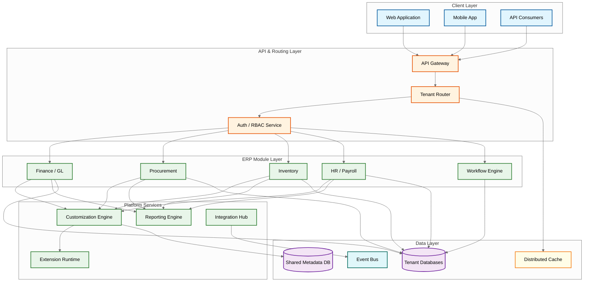

# Interview Guide

## 45-Minute Interview Pacing

| Phase | Duration | Focus | Key Deliverables |
|-------|----------|-------|-----------------|
| **1. Clarify Scope** | 3 min | Which modules? Which tenancy model? What scale? | Functional scope, deployment model, key constraints |
| **2. Requirements & Estimation** | 7 min | Users, tenants, transactions, storage, compliance | Scale numbers, SLOs, regulatory requirements |
| **3. High-Level Design** | 15 min | Module architecture, multi-tenancy, customization engine | System diagram, data flow, tenant isolation model |
| **4. Deep Dive** | 10 min | Pick one: month-end close, tenant isolation, custom fields, cross-module transactions | Detailed design with trade-offs, failure modes |
| **5. Scale & Reliability** | 7 min | Horizontal scaling, disaster recovery, security | Scaling roadmap, compliance enforcement |
| **6. Wrap-Up** | 3 min | Trade-offs summary, open questions | Prioritized improvement list |

---

## Phase 1: Clarify Scope (3 min)

### Questions to Ask the Interviewer

1. **"Which ERP modules are in scope --- Finance/GL, Procurement, Inventory, HR/Payroll, or the full suite?"**
   *Why*: A full-suite ERP has 15+ modules with deep cross-module dependencies. A Finance-only ERP is fundamentally different from one that includes supply chain and manufacturing. Scope determines the complexity of cross-module transaction management.

2. **"Is this a multi-tenant SaaS ERP or a single-tenant on-premise deployment?"**
   *Why*: Multi-tenant SaaS requires tenant isolation at every layer, shared-nothing or shared-everything data models, and noisy-neighbor protection. Single-tenant on-premise is a fundamentally different architecture.

3. **"What tenancy model --- shared database, schema-per-tenant, or database-per-tenant?"**
   *Why*: This decision affects query performance, tenant migration, data isolation guarantees, and operational complexity. Each model has 10x different cost and complexity profiles.

4. **"How customizable does this need to be --- configuration only, or do tenants need custom fields, workflows, and scripting?"**
   *Why*: Configuration-only ERPs are straightforward. A customization engine that supports tenant-specific fields, business rules, and scripted extensions is an order of magnitude more complex.

5. **"What compliance regimes --- GAAP, IFRS, SOX, GDPR, or jurisdiction-specific tax rules?"**
   *Why*: Regulatory requirements fragment the architecture. Supporting both GAAP and IFRS in the same system means dual accounting rule engines, dual reporting pipelines, and potentially dual chart-of-accounts structures.

6. **"What scale --- 50 enterprise tenants or 50,000 SMB tenants?"**
   *Why*: 50 large tenants can use database-per-tenant with dedicated compute. 50,000 SMB tenants require shared infrastructure with aggressive resource pooling.

### Establishing Constraints

```
After discussion, state your assumptions clearly:

"Based on our discussion, I'll design a multi-tenant SaaS ERP platform that:
 - Supports Finance (GL, AP, AR), Procurement, Inventory, and HR/Payroll modules
 - Serves 5,000 tenants with 500K total concurrent users
 - Uses a hybrid tenancy model (shared DB for SMB, dedicated DB for enterprise)
 - Provides a customization engine with custom fields, workflows, and scripted extensions
 - Supports GAAP and IFRS accounting standards with multi-currency
 - Handles 50K transactions/second across all tenants at peak
 - Targets 99.95% availability with RPO < 1 minute"
```

---

## Phase 2: High-Level Design (15 min)

### What Makes This System Unique/Challenging

1. **Cross-Module Transactional Consistency**: A purchase order in Procurement must simultaneously create a liability in Finance, reserve inventory in Warehouse, and potentially trigger a workflow in Approvals. These cross-module operations must be atomic or safely compensatable.

2. **The Customization-Upgrade Paradox**: Every tenant expects to customize the ERP to their business processes. But every customization creates a potential upgrade conflict. The architecture must support deep customization without making the platform un-upgradeable.

3. **Multi-Tenancy at the Data Model Level**: Tenant isolation in an ERP is not just about adding a `tenant_id` column. Custom fields, custom workflows, custom reports, and custom integrations all need tenant-level isolation without cross-contamination.

4. **Batch Processing at Scale**: Month-end close, payroll runs, inventory valuation, and financial consolidation are massive batch operations that must complete within strict time windows while not degrading online transaction processing.

### Quick Reference Architecture



---

## Phase 3: Deep Dive Options (10 min)

### Deep Dive Option A: Month-End Close for 1000 Concurrent Tenants

**Key points to cover:**
- **Phased close process**: Subledger close (AP, AR, Inventory) must complete before GL close. Each subledger verifies all transactions are posted, accruals are calculated, and reconciliation reports are generated.
- **Tenant scheduling**: Stagger close jobs across tenants using a priority queue. Large tenants get dedicated compute; small tenants share a processing pool. Never run all 1000 tenants simultaneously.
- **Period locking**: Once a subledger closes, its period is locked against new postings. Implement a state machine: OPEN -> SOFT_CLOSE -> HARD_CLOSE -> ARCHIVED. Soft close allows adjusting entries; hard close is immutable.
- **Currency revaluation**: Multi-currency tenants must revalue all open foreign-currency balances at period-end rates. This generates potentially millions of revaluation journal entries per tenant.
- **Failure recovery**: If a close job fails mid-way, it must be restartable from the last checkpoint, not from scratch. Implement checkpoint-based batch processing with idempotent steps.

### Deep Dive Option B: Custom Field System with Query Performance

**Key points to cover:**
- **Layered storage model**: Use a hybrid approach. First N custom fields (e.g., 20) are stored as typed columns in extension tables joined 1:1 with the base table. Beyond that threshold, overflow to a JSON column or EAV table.
- **Indexing custom fields**: Tenants can mark custom fields as "searchable," which triggers async index creation on the extension table columns. Limit indexable custom fields per entity to prevent index bloat.
- **Type enforcement**: Custom fields have declared types (text, number, date, picklist, lookup). Type validation happens at the API layer before storage. Lookup-type custom fields create foreign-key relationships to other entities.
- **Query rewriting**: The query engine transparently rewrites queries involving custom fields to join with extension tables. For EAV-stored fields, the query rewriter generates pivot queries with caching of the pivot results.

### Deep Dive Option C: Cross-Module Transaction Management

**Key points to cover:**
- **Saga pattern for multi-module operations**: A Purchase Order creation triggers a saga: (1) Create PO in Procurement, (2) Create AP entry in Finance, (3) Reserve stock in Inventory. Each step has a compensating action for rollback.
- **Saga orchestrator vs. choreography**: Use orchestration (central coordinator) for critical business processes like PO-to-Payment. Use choreography (event-driven) for loosely coupled cross-module notifications.
- **Eventual consistency boundaries**: Financial modules (GL, AP, AR) maintain strong consistency internally. Cross-module consistency is eventual with bounded staleness (sub-second under normal conditions, minutes during degradation).

---

## Trade-Off Discussions

| # | Trade-Off | Option A | Option B | Recommendation |
|---|-----------|----------|----------|----------------|
| 1 | **Module coupling** | Modular monolith (shared process, module boundaries via interfaces) | Microservices (independent deployment, network calls) | Modular monolith for core ERP modules; microservices only for peripheral services (notifications, reporting). ERP modules are too tightly coupled for network boundaries. |
| 2 | **Tenant data isolation** | Shared schema (tenant_id column) | Schema-per-tenant | DB-per-tenant | Hybrid: shared schema for SMB (cost-efficient), dedicated DB for enterprise (compliance, performance isolation). Migration path from shared to dedicated. |
| 3 | **Custom field storage** | EAV (Entity-Attribute-Value) | JSON columns | Wide extension tables | Layered: typed extension columns for first N fields, JSON overflow for rarely-queried fields. EAV only for truly dynamic schemas. |
| 4 | **Cross-module transactions** | Saga (compensating transactions) | 2PC (distributed lock) | Saga for cross-module operations (modules may be on different databases). 2PC only within a single module's database for intra-module consistency. |
| 5 | **Extension execution** | In-process (shared runtime) | Sandboxed (isolated process/container) | Sandboxed execution for tenant-authored scripts. In-process only for platform-authored, security-audited extensions. |
| 6 | **Currency revaluation** | Real-time (per-transaction) | Batch (period-end) | Batch for official period-end revaluation. Real-time estimates for dashboard display only, clearly marked as unrealized. |
| 7 | **Data residency** | Single-region (simpler ops) | Multi-region (compliance) | Multi-region with tenant-level region assignment. Tenant data never leaves assigned region. Cross-region tenants require data federation, not replication. |
| 8 | **Database scaling** | Vertical (bigger machine) | Horizontal (sharding) | Vertical for per-tenant databases (simpler operations). Horizontal sharding of shared-tenant databases by tenant_id. Never shard within a tenant's data. |
| 9 | **API design** | Generic CRUD API (one endpoint per entity) | Module-specific API (domain-driven) | Module-specific APIs with domain semantics (postJournalEntry, not createRecord). Generic CRUD only for custom entities created via the customization engine. |
| 10 | **Integration middleware** | Build (custom integration hub) | Buy (managed integration platform) | Build the core integration framework (event bus, webhook delivery, retry logic). Use managed connectors for specific third-party systems (banking, tax authorities, shipping carriers). |

---

## Trap Questions and How to Handle Them

### 1. "Just use microservices for every ERP module."

**Wrong answer**: "Yes, each module --- GL, AP, AR, Inventory, HR --- should be an independent microservice with its own database."

**Correct answer**: "ERP modules have extremely tight data coupling. A single invoice touches AP, GL, Inventory, and Tax simultaneously. Making each a microservice means every business transaction requires distributed transactions across 4+ services. The network overhead and consistency complexity would be prohibitive. A modular monolith with well-defined module interfaces gives you deployment simplicity and transactional consistency where it matters, while allowing peripheral services (reporting, notifications, integrations) to be independently deployed."

**Why**: ERP modules share more data than they isolate. The overhead of distributed transactions across tightly-coupled modules negates the benefits of independent deployment.

### 2. "Use eventual consistency for all financial transactions."

**Wrong answer**: "Eventually consistent systems scale better, so use event sourcing everywhere."

**Correct answer**: "The General Ledger must be strongly consistent --- debits must always equal credits, and trial balance must always balance. Eventual consistency for GL means a window where the books do not balance, which violates fundamental accounting invariants. However, cross-module consistency (e.g., between Procurement and Finance) can be eventually consistent via sagas, as long as each module maintains internal strong consistency."

**Why**: Accounting has mathematical invariants (the accounting equation) that cannot tolerate even momentary inconsistency. This is not a business preference; it is a fundamental constraint.

### 3. "Store custom fields as JSON in the main entity table."

**Wrong answer**: "JSON columns solve the custom field problem completely."

**Correct answer**: "JSON in the main table works for low-cardinality, rarely-queried fields. But it fails for indexed queries (most databases cannot efficiently index arbitrary JSON paths at scale), cross-field validation (enforcing that custom_field_A < custom_field_B requires application-level checks), and reporting (aggregating across millions of rows on JSON fields is orders of magnitude slower than on typed columns). The right approach is layered: typed extension columns for frequently queried fields, JSON for metadata and configuration, EAV only when the schema is truly unknown at design time."

**Why**: The question tests whether the candidate understands the performance implications of schema-on-read versus schema-on-write at enterprise data volumes.

### 4. "Just add tenant_id to every table and you have multi-tenancy."

**Wrong answer**: "Yes, a tenant_id column with row-level security policies handles isolation."

**Correct answer**: "The tenant_id column is the bare minimum, but isolation must be enforced at every layer. The cache must be tenant-partitioned --- a cache entry for Tenant A must never be served to Tenant B. The queue must be tenant-isolated --- Tenant A's batch payroll run must not starve Tenant B's interactive queries. Background job scheduling needs tenant-fair queuing. Connection pools need per-tenant limits to prevent one tenant from monopolizing database connections. Logging and error reporting must scrub cross-tenant data. Even full-text search indexes need tenant-level partitioning."

**Why**: The hardest multi-tenancy bugs are not in the database --- they are in caches, queues, and shared infrastructure where tenant boundaries are implicit rather than explicit.

### 5. "ERP doesn't need real-time processing."

**Wrong answer**: "ERPs are batch-oriented systems. Everything can run overnight."

**Correct answer**: "Modern ERPs must support real-time inventory visibility (available-to-promise calculations must reflect current stock, not last night's batch), real-time financial dashboards (executives expect current revenue and expense figures), real-time approval workflows (a purchase order waiting 12 hours for batch processing is unacceptable), and real-time integration (when a sales order is placed, the warehouse system must know immediately, not after the overnight batch). The architecture must support both event-driven real-time processing and batch operations for heavy computations like month-end close."

**Why**: Tests whether the candidate understands the evolution from traditional batch-oriented ERPs to modern event-driven architectures.

### 6. "Use a single global schema for all tenants and handle differences in application code."

**Wrong answer**: "One schema with feature flags per tenant handles all customization."

**Correct answer**: "Feature flags handle configuration differences, but not structural differences. Tenant A may need 30 custom fields on Invoice. Tenant B may need a completely different approval workflow with custom stages. Tenant C may need a custom entity type that does not exist in the base schema. Application-level conditionals for every tenant-specific behavior create unmaintainable spaghetti code. The solution is a metadata-driven customization engine where tenant-specific schema extensions, workflow definitions, and business rules are stored as data (metadata), not code."

**Why**: Tests understanding of the distinction between configuration (flags), customization (metadata), and extension (code).

### 7. "Two-phase commit solves cross-module consistency."

**Wrong answer**: "Use 2PC across all modules to ensure ACID transactions."

**Correct answer**: "2PC requires all participants to be available and responsive simultaneously. In an ERP with 10+ modules, the probability of at least one module being slow or unavailable during any given transaction is significant. 2PC holds locks on all participants until the slowest one responds, creating cascading latency. Furthermore, if a module is on a separate database (as in the enterprise tenancy tier), 2PC requires distributed transaction coordinators which add operational complexity. Sagas with compensating transactions are more resilient: each step commits locally, and failures trigger compensating actions. The trade-off is that sagas allow temporary inconsistency windows, but these can be bounded and are acceptable for most cross-module operations."

**Why**: 2PC's blocking nature makes it unsuitable for systems with many participants and high availability requirements.

### 8. "Let tenants write arbitrary database queries for reporting."

**Wrong answer**: "Give power users SQL access to a read replica."

**Correct answer**: "Arbitrary SQL on the production schema exposes internal table structures (creating coupling to implementation), risks tenant data leakage (a malicious query joining across tenant boundaries), enables resource abuse (a poorly written query can saturate CPU or I/O for hours), and creates upgrade obstacles (tenants writing queries against internal schema prevents table restructuring). The correct approach is a semantic reporting layer: tenants query against a logical data model (business objects with business-meaningful names), and the reporting engine translates these to optimized SQL against the physical schema. This provides a stable query contract while allowing internal schema evolution."

**Why**: Tests understanding of abstraction layers and the cost of exposing implementation details.

### 9. "Design the ERP as a single database with all modules sharing tables."

**Wrong answer**: "Shared tables reduce duplication and simplify joins."

**Correct answer**: "Shared tables create toxic coupling. If the Inventory module needs to add a column to the item table that HR also uses, the migration affects both modules. If Finance needs to restructure the transaction table for performance, Procurement's queries break. Module-specific tables with explicit foreign keys at well-defined boundaries give each module schema autonomy while maintaining referential integrity where needed. Shared reference data (currency codes, country codes, unit of measure) belongs in a common schema, but transactional data should be module-owned."

**Why**: Tests understanding of bounded contexts and the cost of shared mutable state at the schema level.

### 10. "Caching solves all performance problems in multi-tenant ERP."

**Wrong answer**: "Put a cache layer in front of everything."

**Correct answer**: "Caching in multi-tenant ERP is treacherous. Cache keys must include tenant_id, or you serve Tenant A's salary data to Tenant B --- a catastrophic data leak. Cache invalidation for custom fields is complex because the same entity has different field sets per tenant. Cache sizing must account for tenant working set diversity --- 5000 tenants with different active data sets can blow out cache memory. Frequently-mutated transactional data (inventory quantities, account balances) has such short cache lifetimes that caching adds overhead without benefit. Cache selectively: reference data (chart of accounts, currency rates, product catalog) benefits enormously; transactional data rarely does."

**Why**: Tests whether the candidate thinks critically about caching tradeoffs rather than applying it as a blanket solution.

### 11. "The extension marketplace can just run tenant code in the same process."

**Wrong answer**: "Running extensions in-process is faster and simpler."

**Correct answer**: "In-process extensions can access the host process memory, meaning a malicious extension could read other tenants' data from shared memory, exhaust the process's thread pool or memory causing a denial-of-service for all tenants, and exploit internal APIs not intended for external use. Extensions must run in sandboxed environments with CPU and memory limits, network restrictions (no access to internal service endpoints), and a controlled API surface. The sandbox imposes latency (inter-process or network calls instead of function calls), but the security boundary is non-negotiable for a multi-tenant platform."

**Why**: Tests understanding of trust boundaries in multi-tenant platforms.

### 12. "Use the same approval workflow engine for all tenants."

**Wrong answer**: "A single configurable workflow handles all approval patterns."

**Correct answer**: "Tenants have radically different approval topologies. A startup may need a single-level approval. An enterprise may need matrix approvals (both department head AND budget owner must approve), delegation chains (if approver is unavailable for 3 days, auto-escalate), conditional routing (purchases over a threshold require VP approval), and parallel approvals with quorum (3 of 5 committee members must approve). The workflow engine must be a general-purpose state machine interpreter that reads tenant-specific workflow definitions from metadata, not a hardcoded approval chain with configuration toggles."

**Why**: Tests understanding of the difference between configurable and programmable systems.

### 13. "Month-end close is just a batch job --- run it overnight."

**Wrong answer**: "Schedule all close jobs at midnight and they'll finish by morning."

**Correct answer**: "With 1000 tenants, you cannot run all close jobs simultaneously --- the compute and I/O requirements would overwhelm the infrastructure. Close jobs must be staggered, prioritized (enterprise tenants with SLA guarantees first), and resource-isolated (one tenant's close cannot starve another). Furthermore, close is not a single job --- it is a multi-phase process: subledger close, intercompany elimination, currency revaluation, consolidation, and reporting. Each phase has dependencies on the previous one. This is effectively a distributed consensus problem where all modules must agree that their period is ready to close."

**Why**: Tests understanding of batch processing at multi-tenant scale.

### 14. "RBAC with a few roles is sufficient for ERP access control."

**Wrong answer**: "Define Admin, Manager, and User roles with static permissions."

**Correct answer**: "ERP requires attribute-based access control (ABAC) layered on RBAC. A user may have the AP Clerk role but should only see invoices for their business unit, for vendors in their approved list, and only for amounts below their approval threshold. This requires row-level security policies that combine role (RBAC), organizational hierarchy (business unit, cost center), data attributes (amount, vendor, document type), and temporal constraints (only during business hours, only during open periods). RBAC provides coarse-grained access; ABAC provides the fine-grained filtering that enterprise customers demand."

**Why**: Tests depth of understanding of enterprise access control requirements.

### 15. "Handle multi-currency by storing everything in a base currency."

**Wrong answer**: "Convert all transactions to the base currency at entry time."

**Correct answer**: "You must store both the transaction currency amount and the base currency equivalent. Reasons: audit trails require the original transaction currency, unrealized gains/losses from exchange rate fluctuations must be calculated by revaluing open items at current rates against historical rates, and multi-currency reporting requires re-aggregation at potentially different exchange rates. The data model needs: transaction_amount, transaction_currency, exchange_rate_at_booking, base_currency_amount, and the ability to recalculate base_currency_amount during period-end revaluation without losing the original values."

**Why**: Tests understanding of financial data modeling constraints that go beyond simple unit conversion.

---

## Scoring Rubric

### Junior Level (Meets Bar)
- Can describe basic ERP module structure (Finance, Procurement, Inventory, HR)
- Understands CRUD operations on business entities (invoices, purchase orders, journal entries)
- Basic awareness that multi-tenancy exists as a concept
- Can draw a simple request flow from client to database
- Understands that different users need different permissions

### Mid Level (Hire)
- Articulates multi-tenancy trade-offs (shared DB vs. dedicated DB) with pros/cons
- Understands basic customization needs (custom fields, configurable workflows)
- Can design a cross-module operation using saga pattern
- Discusses tenant isolation beyond just database-level separation
- Understands month-end close as a multi-step process

### Senior Level (Strong Hire)
- Deep dive into any single module with detailed data model and transaction flow
- Designs the custom field system with storage trade-offs (EAV vs. typed columns vs. JSON)
- Discusses cross-module transactions with compensating actions and consistency boundaries
- Understands batch processing challenges at multi-tenant scale (job scheduling, resource isolation)
- Addresses compliance requirements (GAAP/IFRS, SOX audit trails, data residency)
- Proposes tenant migration strategy (shared to dedicated database)

### Staff Level (Exceptional)
- Designs the metadata-driven customization engine with the layered customization hierarchy
- Explains extension sandboxing with trust boundary analysis
- Discusses regulatory architecture fragmentation (multi-jurisdiction accounting rules)
- Designs tenant-fair resource allocation across compute, I/O, cache, and queue layers
- Articulates the customization-upgrade paradox and proposes the architectural solution
- Optimizes month-end close as a distributed coordination problem across modules and tenants
- Proposes the evolution path from modular monolith to selective service extraction

---

## Quick Reference Card

### Architecture Summary
- **Module layer**: Modular monolith with Finance, Procurement, Inventory, HR as bounded contexts
- **Tenancy model**: Hybrid --- shared database for SMB, dedicated database for enterprise
- **Customization**: Layered hierarchy --- configuration > metadata > scripting > extensions > custom code
- **Cross-module consistency**: Saga-based with per-module strong consistency
- **Extension execution**: Sandboxed runtime with CPU/memory limits and controlled API surface
- **Batch processing**: Tenant-staggered, checkpoint-based, priority-queued

### Key Numbers
- Tenants: 5,000 (mix of SMB and enterprise)
- Concurrent users: 500K across all tenants
- Transactions per second: 50K peak (journal entries, POs, inventory movements combined)
- Custom fields per entity per tenant: up to 200
- Month-end close window: 4 hours for largest tenants
- Data retention: 7+ years for financial records (regulatory)

### Critical Trade-Offs (One-Liners)
- Monolith vs. microservices: monolith for coupled modules, microservices for peripheral services
- Shared vs. dedicated DB: cost vs. isolation, with migration path between them
- EAV vs. typed columns: flexibility vs. query performance
- Saga vs. 2PC: availability vs. strict atomicity
- In-process vs. sandboxed extensions: performance vs. security

### Red Flags in Candidate Answers
- Proposes microservices for every ERP module without discussing coupling implications
- Ignores tenant isolation beyond the database layer
- Uses eventual consistency for General Ledger operations
- Stores only base currency amounts without preserving transaction currency
- Suggests running all tenant month-end close jobs simultaneously
- Proposes in-process execution for untrusted tenant extensions
- Ignores the customization-upgrade tension entirely
- Treats RBAC as sufficient without discussing attribute-based access control

---

## Common Follow-Up Deep Dives

### "How would you handle month-end close for 1000 concurrent tenants?"
Discuss tenant-staggered scheduling, phased close (subledger before GL), checkpoint-based processing for restartability, dedicated compute pools for large tenants, and period locking state machines.

### "Design the custom field system that supports indexing and querying."
Cover the layered storage model (typed extension columns + JSON overflow), tenant-specific index creation with limits, query rewriting for transparent custom field access, and the type system for validation.

### "How do you ensure zero cross-tenant data leakage?"
Address database-level (row-level security policies), cache-level (tenant-prefixed keys with namespace isolation), queue-level (tenant-partitioned topics), logging-level (tenant context propagation and scrubbing), and API-level (tenant validation middleware on every request).

### "How would you migrate a tenant from shared to dedicated database?"
Describe the process: provision new database, set tenant to read-only mode, export tenant data (filtered by tenant_id), import into dedicated database, update tenant routing configuration, verify data integrity, switch traffic, clean up shared database.

### "Design the extension marketplace security model."
Cover sandboxed execution (isolated runtime with resource limits), API surface control (whitelist of allowed operations), data access scoping (extension can only access its installing tenant's data), review process (static analysis + manual review before marketplace listing), and runtime monitoring (anomaly detection for resource consumption and data access patterns).
