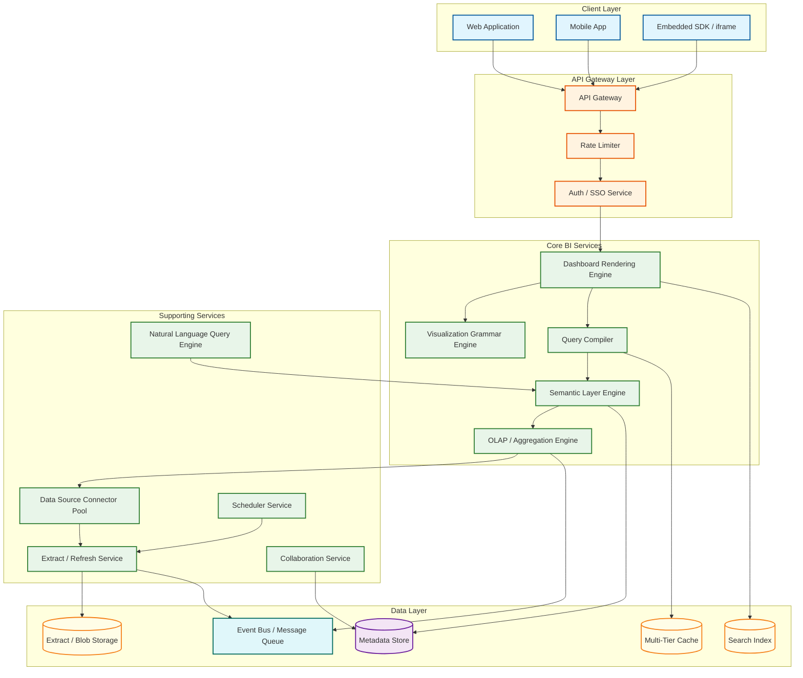
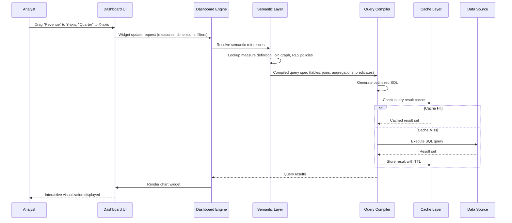

# Business Intelligence Platform Design (Tableau/Looker)

## System Overview

A Business Intelligence (BI) Platform enables organizations to explore, visualize, and derive insights from data through interactive dashboards, ad-hoc queries, and scheduled reports. Systems like Tableau, Looker, Power BI, and Metabase provide semantic modeling layers (LookML-style definitions), OLAP query engines (pre-aggregated cubes or live analytical queries), dashboard rendering engines (widget trees with lazy loading), data source connectors (JDBC/ODBC to dozens of databases), and collaborative analytics (annotations, sharing, embedding). The core engineering challenge is building a system that translates a declarative visualization grammar into optimized analytical queries across heterogeneous data sources, caches results intelligently at multiple tiers, and renders interactive dashboards for thousands of concurrent users---all while enforcing row-level security and data governance policies. Unlike transactional systems optimized for write throughput, BI platforms are optimized for read flexibility: any user should be able to ask any question of the data and receive a visual answer within seconds, regardless of data volume or query complexity.

---

## Key Characteristics

| Characteristic | Description |
|---------------|-------------|
| **Read/Write Pattern** | Overwhelmingly read-heavy---99%+ of operations are queries and dashboard renders; writes are limited to model definitions, dashboard configurations, and schedule metadata |
| **Latency Sensitivity** | High---interactive dashboards must render within 2--5 seconds; drill-down and filter operations within 500ms--2s; scheduled reports and large exports tolerate minutes |
| **Consistency Model** | Eventual consistency for data freshness (extract schedules, cache refresh); strong consistency for metadata (dashboard definitions, permissions, semantic models) |
| **Data Volume** | Very High---queries span terabytes to petabytes across data warehouses; result sets are typically small (thousands of rows); cached extracts can reach hundreds of gigabytes per tenant |
| **Architecture Model** | Semantic layer compiling model definitions to SQL; query federation across multiple data sources; multi-tier caching (query result, tile, widget); widget-tree dashboard rendering engine |
| **Regulatory Burden** | Medium-to-High---row-level security, column masking, data lineage for compliance reporting, SOC 2 for SaaS deployments, GDPR for user analytics data |
| **Complexity Rating** | **High** |

---

## Quick Navigation

| Document | Description |
|----------|-------------|
| [01 - Requirements & Estimations](./01-requirements-and-estimations.md) | Functional/non-functional requirements, capacity planning, SLOs |
| [02 - High-Level Design](./02-high-level-design.md) | Architecture diagrams, data flow, key decisions |
| [03 - Low-Level Design](./03-low-level-design.md) | Data models, API design, algorithms (pseudocode) |
| [04 - Deep Dive & Bottlenecks](./04-deep-dive-and-bottlenecks.md) | Semantic layer compilation, OLAP query optimization, dashboard rendering pipeline, cache invalidation |
| [05 - Scalability & Reliability](./05-scalability-and-reliability.md) | Query federation, result caching tiers, concurrent user scaling, large dataset handling |
| [06 - Security & Compliance](./06-security-and-compliance.md) | Row-level security, column masking, data governance, access control policies |
| [07 - Observability](./07-observability.md) | Query performance metrics, dashboard load times, cache hit rates, user engagement analytics |
| [08 - Interview Guide](./08-interview-guide.md) | 45-min pacing, trap questions, trade-offs, scoring rubric |
| [09 - Insights](./09-insights.md) | Key architectural insights, patterns, lessons |

---

## What Differentiates This from Related Systems

| Aspect | BI Platform (This) | Data Warehouse | ETL / Data Pipeline | Reporting System | Search / Analytics Engine |
|--------|-------------------|----------------|---------------------|-----------------|--------------------------|
| **Core Function** | Interactive data exploration, visualization, and insight delivery via semantic models and dashboards | Structured data storage optimized for analytical queries | Data movement, transformation, and loading between systems | Static report generation from predefined templates | Full-text and log search with aggregation |
| **Query Model** | Ad-hoc analytical queries generated from visual interactions; semantic layer translates intent to SQL | Direct SQL queries against star/snowflake schemas | Batch or streaming transformations; not user-facing queries | Predefined parameterized queries; limited ad-hoc capability | Inverted index queries with faceted aggregation |
| **User Interaction** | Drag-and-drop visual exploration; filter, drill-down, cross-highlight across widgets | SQL console or programmatic access; requires query expertise | Pipeline DAG builders; developer-facing configuration | View pre-built reports; parameterize with filters | Search bar with faceted navigation; alerting rules |
| **Semantic Layer** | Central: defines measures, dimensions, relationships, and business logic as reusable models (LookML, Cube.js) | None---schema is the model; business logic lives in views or BI tool | Transformations may create derived tables but no semantic model | Minimal---field labels and formatting only | Schema-on-read; field mappings configured at ingest |
| **Data Freshness** | Configurable---live connection (real-time) or scheduled extracts (minutes to hours) | Near real-time to batch depending on ingestion pipeline | Defines the freshness SLA for downstream systems | Batch---reports run on schedule or on-demand against snapshots | Near real-time via streaming ingest |
| **Visualization** | Rich---charts, maps, pivot tables, calculated fields, interactive filters, embedded analytics | None---raw tabular results only | None---focuses on data movement, not presentation | Basic---tabular reports, simple charts, PDF/Excel export | Dashboards with time-series charts and alerting |
| **Multi-Tenancy** | Deep---per-tenant data policies, row-level security, branded embedded analytics | Database-level or schema-level isolation | Pipeline-level tenant isolation | Report-level access control | Index-level tenant isolation |

---

## What Makes This System Unique

1. **Semantic Layer as the Core Abstraction**: Unlike systems where SQL is the interface, a BI platform interposes a semantic layer between users and data. This layer defines measures (aggregations like `SUM(revenue)`), dimensions (grouping attributes like `region`), relationships (join graphs between tables), and business logic (fiscal calendar definitions, currency conversions). Every visual interaction compiles through this layer, ensuring consistent metric definitions regardless of who builds the dashboard. The semantic layer is effectively a domain-specific language (DSL) compiler that targets SQL.

2. **Visual Query Compilation Pipeline**: When a user drags "Revenue" onto the Y-axis and "Quarter" onto the X-axis, the system must: resolve "Revenue" through the semantic model to find the correct table, column, and aggregation; determine the join path from the revenue fact table to the time dimension; apply any active filters and row-level security predicates; generate optimized SQL with appropriate GROUP BY, WHERE, and HAVING clauses; check the query cache; execute against the data source; and render the result as the requested chart type---all within seconds. This compilation pipeline is the heart of BI platform engineering.

3. **OLAP Engine Strategy (MOLAP vs. ROLAP vs. HOLAP)**: The platform must decide between pre-aggregating data into multidimensional cubes (MOLAP---fast queries, stale data, storage overhead), issuing live SQL against the data warehouse (ROLAP---fresh data, slower queries, warehouse load), or a hybrid (HOLAP---cached aggregates for common queries, live SQL for drill-downs). This choice cascades through the entire architecture: caching strategy, data freshness SLAs, infrastructure costs, and query performance characteristics.

4. **Dashboard Rendering as a Distributed Widget Tree**: A dashboard is not a single query---it is a tree of independent widgets, each with its own query, filters, and rendering logic. The rendering engine must: parse the dashboard definition; determine widget dependencies (cross-filters, linked parameters); build a query execution DAG; execute queries in parallel where possible; stream results to widgets as they complete (progressive rendering); and handle user interactions (filter changes) by invalidating and re-executing only affected widgets. This is analogous to a browser rendering engine, but for analytical content.

5. **Multi-Tier Query Result Caching**: BI platforms implement caching at multiple levels: semantic cache (same logical query regardless of SQL text differences), query result cache (identical SQL + parameters), tile/widget cache (rendered visual fragments), dashboard cache (full page snapshots for common views), and extract cache (local copies of remote data). Invalidation is complex because a single data refresh can cascade through dependent extracts, cached queries, widgets, and dashboards.

6. **Embedded Analytics and White-Labeling**: Modern BI platforms must support embedding dashboards into third-party applications via iframes, JavaScript SDKs, or API-driven rendering. This introduces challenges around cross-origin security, token-based authentication for anonymous/external users, responsive rendering across viewport sizes, theming/white-labeling to match the host application, and maintaining row-level security context across the embedding boundary.

---

## Quick Reference: Scale Numbers

| Metric | Value | Notes |
|--------|-------|-------|
| Organizations (tenants) | ~10,000 | Multi-tenant SaaS serving enterprises, mid-market, and SMBs |
| Total users | ~5M | Data analysts, business users, executives, embedded viewers |
| Dashboards defined | ~20M | Across all tenants; includes personal, shared, and embedded |
| Dashboard views per day | ~50M | Including scheduled renders and interactive sessions |
| Queries executed per day | ~500M | Each dashboard view generates 5--20 queries (one per widget) |
| Semantic model definitions | ~200K | LookML projects, Cube schemas, dbt metric definitions |
| Data source connections | ~500K | JDBC/ODBC connections across all tenants |
| Cached query results | ~2B entries | Distributed across multi-tier cache infrastructure |
| Extract refresh jobs per day | ~5M | Scheduled data extractions from source databases |
| Concurrent dashboard sessions | ~200K | Peak during business hours across time zones |
| Embedded dashboard instances | ~10M | iframes and SDK renders in third-party applications |
| Average query latency (cached) | <200ms | Served from query result cache |
| Average query latency (live) | 2--8s | Depends on data source performance and query complexity |
| Data scanned per day | ~50 PB | Aggregated across all tenant queries to warehouses |

---

## Architecture Overview (Conceptual)

---

## Key Trade-Offs in BI Platform Design

| Trade-Off | Option A | Option B | This System's Choice |
|-----------|----------|----------|---------------------|
| **OLAP Strategy** | MOLAP: pre-aggregate into cubes (fast queries, stale data) | ROLAP: live SQL against warehouse (fresh data, slower queries) | HOLAP hybrid---pre-aggregate high-cardinality dimensions for common queries; live SQL for ad-hoc exploration and drill-downs |
| **Data Freshness** | Live connection (always current, warehouse load) | Scheduled extract (predictable performance, data lag) | Configurable per data source---live for operational dashboards, extract for strategic reports with 15-min to daily refresh |
| **Semantic Layer** | Thin: pass-through SQL with metadata annotations | Thick: full DSL compiler with join graph resolution and measure logic | Thick semantic layer---single source of truth for metrics; compiles to optimized SQL; prevents metric definition drift |
| **Dashboard Rendering** | Server-side rendering (consistent output, higher server cost) | Client-side rendering (offloads compute, inconsistent across devices) | Hybrid---server-side for PDF export and thumbnails; client-side for interactive exploration with progressive widget loading |
| **Query Caching** | Aggressive caching (fast, risk of stale results) | Minimal caching (always fresh, higher query load) | Multi-tier with TTL-based invalidation and source-event-driven cache busting; user-visible "data last refreshed" timestamps |
| **Embedded Analytics** | iframe isolation (simple, limited customization) | Native SDK rendering (deep integration, complex security) | Both---iframe for quick embedding; SDK for white-labeled, deeply integrated experiences with SSO token passthrough |
| **Multi-Tenancy** | Shared infrastructure with logical isolation | Dedicated compute per tenant | Shared with per-tenant query quotas and priority queues; dedicated compute available as premium tier for large enterprise tenants |

---

## Query Compilation Flow

---

## Related Designs

| Design | Relevance |
|--------|-----------|
| [9.7 - Data Warehouse / Data Lake](../9.7-data-warehouse-data-lake/) | Primary data source for BI queries; schema design affects query performance |
| [9.8 - ETL / Data Pipeline](../9.8-etl-data-pipeline/) | Feeds data into warehouse and BI extracts; defines data freshness SLAs |
| [9.9 - Real-Time Analytics](../9.9-real-time-analytics/) | Streaming analytics complement BI dashboards for operational monitoring |
| [9.11 - Data Governance Platform](../9.11-data-governance-platform/) | Provides data lineage, cataloging, and policy enforcement consumed by BI semantic layer |

---

## Sources

- Tableau Engineering --- Hyper Data Engine Architecture and VizQL Query Language
- Looker / Google Cloud --- LookML Semantic Modeling Language and Query Compilation Pipeline
- Cube.js --- Open-Source Semantic Layer and Pre-Aggregation Engine Architecture
- Apache Superset --- Open-Source BI Platform Architecture and SQLAlchemy Connector Framework
- AtScale --- Universal Semantic Layer and Virtual OLAP Cube Design
- Metabase --- Open-Source BI Embedding Architecture and Query Processor Design
- dbt Labs --- Metrics Layer and Semantic Layer Integration Patterns
- Vega / Vega-Lite --- Declarative Visualization Grammar Specification
- Microsoft Power BI --- VertiPaq In-Memory Engine and DAX Query Language
- ThoughtSpot --- Search-Driven Analytics and Natural Language Query Architecture
- Gartner --- Magic Quadrant for Analytics and Business Intelligence Platforms (2025)
- BARC --- BI Survey on Embedded Analytics and Self-Service BI Trends
