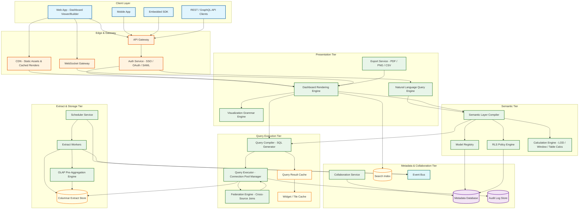
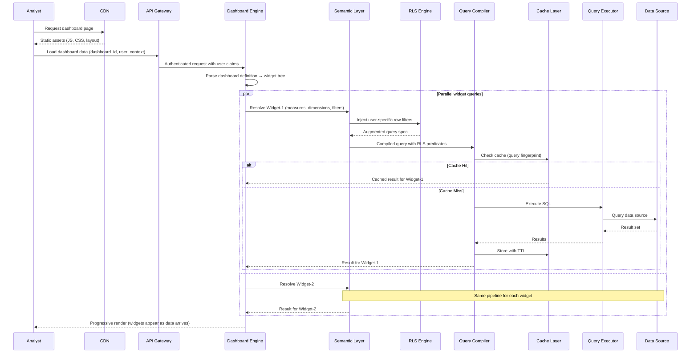
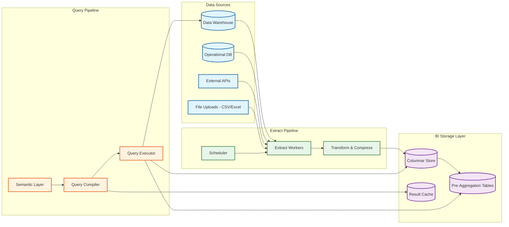
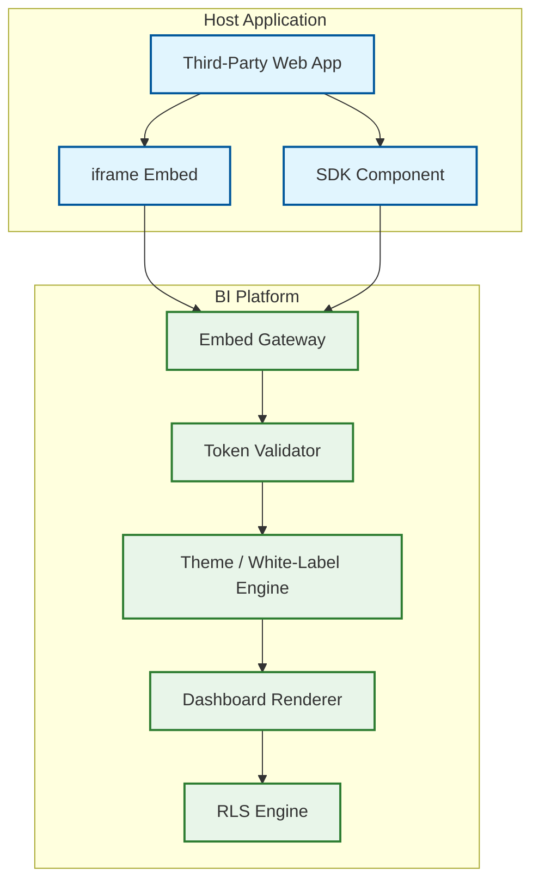

# Business Intelligence Platform --- High-Level Design

## Architecture Philosophy

The BI platform follows a **semantic-layer-centric** architecture where all data access flows through a declarative modeling layer that serves as the single source of truth for metric definitions. The system separates concerns into five tiers: (1) a presentation tier for dashboard rendering and visualization, (2) a semantic tier for model compilation and query generation, (3) a query execution tier for cache management and data source interaction, (4) an extract tier for scheduled data ingestion and local storage, and (5) a metadata tier for configuration, permissions, and collaboration state. This separation allows each tier to scale independently---dashboard rendering can scale with concurrent users while query execution scales with query complexity and data volume.

---

## System Architecture



---

## Data Flow: Dashboard View Request



---

## Core Components

### 1. Semantic Layer Compiler

The semantic layer is the defining component of the BI platform. It serves as an abstraction between business concepts and physical database schemas.

**Responsibilities:**
- Parse and validate model definitions (measures, dimensions, joins, derived tables)
- Resolve field references through the join graph to determine required tables
- Apply business logic transformations (fiscal calendars, currency conversion, conditional measures)
- Generate a logical query plan from visual interactions
- Maintain a model dependency graph for incremental recompilation

**Model Structure:**

```
Model Project
├── Data Sources (connection configs)
├── Views (logical table representations)
│   ├── Dimensions (categorical attributes)
│   ├── Measures (aggregation expressions)
│   ├── Derived Tables (subqueries / CTEs)
│   └── Parameters (user-input variables)
├── Explores (join configurations)
│   ├── Join Relationships (one-to-many, many-to-many)
│   ├── Access Filters (RLS definitions)
│   └── Always-Applied Filters
└── Dashboard Definitions (widget layouts referencing explores)
```

### 2. Query Compiler & Executor

Transforms semantic layer output into optimized SQL and manages execution.

**Optimization Strategies:**
- **Predicate pushdown**: Push filters as close to the data source as possible
- **Join elimination**: Remove joins for tables not referenced in SELECT or WHERE
- **Aggregate awareness**: Route queries to pre-aggregated tables when dimensions match
- **Query merging**: Combine multiple widget queries that share the same base table and filters
- **Materialized view routing**: Redirect queries to materialized views when available

### 3. Dashboard Rendering Engine

Manages the lifecycle of dashboard visualization from definition to interactive display.

**Rendering Pipeline:**
1. Parse dashboard JSON definition into widget tree
2. Determine widget dependency graph (cross-filters, linked parameters)
3. Identify independent query groups for parallel execution
4. Execute queries via the semantic layer pipeline
5. Stream results to widgets using progressive rendering
6. Handle user interactions (filter changes, drill-down) via incremental re-query

### 4. OLAP / Pre-Aggregation Engine

Manages pre-computed aggregations for performance optimization.

**Strategy Selection:**

| Strategy | When to Use | Trade-offs |
|----------|-------------|------------|
| **MOLAP (Pre-aggregated cubes)** | High-frequency dashboards with stable dimension sets | Fast reads; storage overhead; stale until refresh |
| **ROLAP (Live SQL)** | Ad-hoc exploration; low-frequency queries; rapidly changing data | Always fresh; warehouse load; higher latency |
| **HOLAP (Hybrid)** | Dashboards with top-level summaries and drill-down to detail | Best of both; complexity in cache coherence |
| **Auto-aggregation** | System decides based on query patterns and usage analytics | Optimal resource use; requires usage tracking infrastructure |

### 5. Extract / Refresh Service

Manages scheduled data extraction from source databases into local optimized storage.

**Extract Types:**
- **Full extract**: Complete data copy; used for initial load or when incremental is unreliable
- **Incremental extract**: Append/update only changed rows based on timestamp or change tracking
- **Live connection**: No extract; queries go directly to source (ROLAP mode)

### 6. Natural Language Query Engine

Translates natural language questions to semantic layer queries.

**Pipeline:**
1. Parse natural language input to identify intent, entities, and time references
2. Map entities to semantic model fields (measures, dimensions, filters)
3. Disambiguate using model metadata (field descriptions, synonyms, popularity)
4. Construct semantic query (not raw SQL---leverages the semantic layer for consistency)
5. Execute query and select appropriate visualization type
6. Present result with explanation of interpretation

---

## Key Architectural Decisions

### Decision 1: Thick Semantic Layer vs. Thin Metadata Layer

**Choice: Thick Semantic Layer**

| Factor | Thick (chosen) | Thin |
|--------|----------------|------|
| Metric consistency | Single source of truth; all consumers see same definitions | Metrics defined per dashboard; drift risk |
| Query generation | Compiler handles join resolution, aggregation, and optimization | Dashboard authors must understand SQL and schema |
| Governance | Centralized; changes reviewed via version control | Distributed; harder to audit |
| Flexibility | Constrained by model definitions; requires model updates for new analyses | Full SQL flexibility; faster ad-hoc capability |
| Complexity | Higher implementation complexity; compiler engineering | Simpler implementation; more user burden |

**Rationale**: The semantic layer prevents "metric chaos" where the same KPI has different definitions across dashboards. The upfront complexity pays off in organizational scale---when 1,000 analysts all need "revenue" to mean the same thing.

### Decision 2: Extract vs. Live Connection Default

**Choice: Configurable per Data Source with Extract as Default**

Extracts provide predictable query performance, reduce load on production databases, and enable the platform's own query optimizations (columnar storage, pre-aggregation). Live connections are available for use cases requiring real-time data freshness (operational dashboards, monitoring).

### Decision 3: Widget-Level vs. Dashboard-Level Caching

**Choice: Both, with Widget-Level as Primary**

Widget-level caching allows cache reuse when the same widget appears on multiple dashboards or when a user changes one filter that only affects a subset of widgets. Dashboard-level caching provides fast full-page loads for high-traffic dashboards (executive summaries, embedded reports).

### Decision 4: Server-Side vs. Client-Side Rendering

**Choice: Hybrid Rendering**

- **Server-side**: Used for PDF/image export, email report snapshots, dashboard thumbnails, and initial server-rendered HTML for fast first paint
- **Client-side**: Used for interactive exploration---hover tooltips, cross-filtering, drill-down animations, responsive layout adjustments

---

## Extract & Query Architecture



---

## Embedded Analytics Architecture



**Embedding Modes:**
- **iframe**: Simple integration; dashboard rendered in isolated frame; limited host-app interaction
- **SDK (JavaScript/React)**: Native DOM rendering; full CSS control; event callbacks for host-app integration; responsive to parent container
- **API-rendered**: Server generates PNG/PDF snapshots; used for email reports and static embedding
- **Headless BI**: API-only access to semantic layer queries; host app builds its own visualization

---

## Technology Strategy (Cloud-Agnostic)

| Component | Technology Strategy |
|-----------|-------------------|
| Semantic Layer | Custom DSL compiler with model registry; versioned model definitions in Git |
| Query Engine | SQL generation with dialect adapters per data source type |
| Columnar Store | Open columnar format (Parquet/ORC-based) on object storage with local SSD cache |
| Result Cache | Distributed in-memory cache cluster with TTL-based eviction |
| Metadata Store | Relational database (PostgreSQL-compatible) with read replicas |
| Event Bus | Message queue for extract completion events, cache invalidation, and async notifications |
| Search | Full-text search engine for dashboard/field discovery |
| Rendering | Client-side visualization library (declarative grammar); server-side headless renderer for exports |
| WebSocket | Managed WebSocket gateway for real-time dashboard updates and collaboration |
| Object Storage | Blob storage for extracts, exported reports, and dashboard thumbnails |
