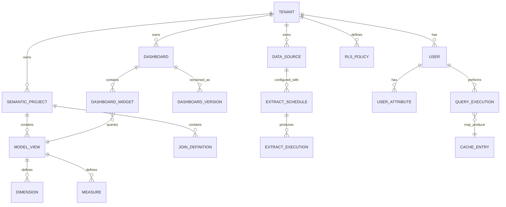

# Business Intelligence Platform --- Low-Level Design

## Data Models

### Semantic Model Definition

```
SemanticProject {
    project_id          UUID            PRIMARY KEY
    tenant_id           UUID            NOT NULL
    name                VARCHAR(255)    NOT NULL
    git_repository_url  VARCHAR(1024)
    default_branch      VARCHAR(100)    DEFAULT 'main'
    compiled_model_hash VARCHAR(64)     -- SHA-256 of compiled output
    last_compiled_at    TIMESTAMP
    created_at          TIMESTAMP       DEFAULT NOW()
    updated_at          TIMESTAMP       DEFAULT NOW()

    UNIQUE(tenant_id, name)
}

ModelView {
    view_id             UUID            PRIMARY KEY
    project_id          UUID            REFERENCES SemanticProject
    name                VARCHAR(255)    NOT NULL
    source_table        VARCHAR(500)    -- physical table reference
    derived_table_sql   TEXT            -- if virtual / derived
    description         TEXT
    tags                VARCHAR[]
    created_at          TIMESTAMP       DEFAULT NOW()

    UNIQUE(project_id, name)
}

Dimension {
    dimension_id        UUID            PRIMARY KEY
    view_id             UUID            REFERENCES ModelView
    name                VARCHAR(255)    NOT NULL
    field_type          ENUM('string', 'number', 'date', 'datetime', 'boolean', 'geo')
    sql_expression      TEXT            NOT NULL   -- e.g., "${TABLE}.region"
    description         TEXT
    hidden              BOOLEAN         DEFAULT FALSE
    suggestable         BOOLEAN         DEFAULT TRUE  -- show in autocomplete
    allowed_values      JSONB           -- for filter suggestions
    created_at          TIMESTAMP       DEFAULT NOW()

    UNIQUE(view_id, name)
}

Measure {
    measure_id          UUID            PRIMARY KEY
    view_id             UUID            REFERENCES ModelView
    name                VARCHAR(255)    NOT NULL
    measure_type        ENUM('sum', 'count', 'count_distinct', 'avg', 'min', 'max', 'custom')
    sql_expression      TEXT            NOT NULL   -- e.g., "SUM(${TABLE}.amount)"
    description         TEXT
    format_string       VARCHAR(100)    -- e.g., "$#,##0.00"
    drill_fields        UUID[]          -- dimensions to show on drill-through
    filters             JSONB           -- always-applied filters for this measure
    hidden              BOOLEAN         DEFAULT FALSE
    created_at          TIMESTAMP       DEFAULT NOW()

    UNIQUE(view_id, name)
}

JoinDefinition {
    join_id             UUID            PRIMARY KEY
    project_id          UUID            REFERENCES SemanticProject
    explore_name        VARCHAR(255)    NOT NULL
    from_view_id        UUID            REFERENCES ModelView
    to_view_id          UUID            REFERENCES ModelView
    join_type           ENUM('left_outer', 'inner', 'full_outer', 'cross')
    relationship        ENUM('one_to_one', 'one_to_many', 'many_to_one', 'many_to_many')
    sql_on_clause       TEXT            NOT NULL   -- e.g., "${orders.user_id} = ${users.id}"
    required_joins      UUID[]          -- joins that must be included before this join

    UNIQUE(project_id, explore_name, from_view_id, to_view_id)
}
```

### Dashboard & Widget Model

```
Dashboard {
    dashboard_id        UUID            PRIMARY KEY
    tenant_id           UUID            NOT NULL
    title               VARCHAR(500)    NOT NULL
    description         TEXT
    folder_id           UUID            REFERENCES Folder
    layout_type         ENUM('grid', 'freeform', 'tiled')
    grid_columns        INT             DEFAULT 24
    filters             JSONB           -- dashboard-level filter definitions
    auto_refresh_sec    INT             -- null = no auto-refresh
    theme_overrides     JSONB           -- custom colors, fonts
    version             INT             DEFAULT 1
    is_published        BOOLEAN         DEFAULT FALSE
    created_by          UUID            REFERENCES User
    created_at          TIMESTAMP       DEFAULT NOW()
    updated_at          TIMESTAMP       DEFAULT NOW()

    INDEX(tenant_id, folder_id)
    INDEX(tenant_id, created_by)
}

DashboardWidget {
    widget_id           UUID            PRIMARY KEY
    dashboard_id        UUID            REFERENCES Dashboard
    widget_type         ENUM('chart', 'pivot', 'kpi_card', 'text', 'filter', 'image', 'map')
    position_x          INT             NOT NULL   -- grid column start
    position_y          INT             NOT NULL   -- grid row start
    width               INT             NOT NULL   -- grid columns span
    height              INT             NOT NULL   -- grid rows span
    title               VARCHAR(500)
    explore_name        VARCHAR(255)    -- semantic model explore
    query_spec          JSONB           -- { measures, dimensions, filters, sorts, limit }
    viz_config          JSONB           -- chart type, encodings, colors, legend, axis config
    linked_filters      UUID[]          -- widget IDs that this widget listens to
    drill_config        JSONB           -- drill-down dimension hierarchy
    cache_policy        ENUM('inherit', 'aggressive', 'none') DEFAULT 'inherit'
    created_at          TIMESTAMP       DEFAULT NOW()

    INDEX(dashboard_id)
}

DashboardVersion {
    version_id          UUID            PRIMARY KEY
    dashboard_id        UUID            REFERENCES Dashboard
    version_number      INT             NOT NULL
    snapshot            JSONB           NOT NULL   -- full dashboard definition at this version
    change_description  TEXT
    created_by          UUID            REFERENCES User
    created_at          TIMESTAMP       DEFAULT NOW()

    UNIQUE(dashboard_id, version_number)
}
```

### Query Execution & Cache Model

```
QueryExecution {
    execution_id        UUID            PRIMARY KEY
    tenant_id           UUID            NOT NULL
    user_id             UUID            NOT NULL
    query_fingerprint   VARCHAR(64)     NOT NULL   -- hash of normalized SQL + params
    source_type         ENUM('dashboard', 'explore', 'api', 'scheduled', 'nlq')
    semantic_query      JSONB           -- original semantic query spec
    generated_sql       TEXT            NOT NULL
    data_source_id      UUID            REFERENCES DataSource
    status              ENUM('queued', 'executing', 'completed', 'failed', 'cancelled', 'timed_out')
    rows_returned       INT
    bytes_scanned       BIGINT
    cache_hit           BOOLEAN         DEFAULT FALSE
    execution_time_ms   INT
    queue_time_ms       INT
    error_message       TEXT
    created_at          TIMESTAMP       DEFAULT NOW()

    INDEX(tenant_id, created_at)
    INDEX(query_fingerprint)
    INDEX(user_id, created_at)
}

CacheEntry {
    cache_key           VARCHAR(128)    PRIMARY KEY  -- hash(query_fingerprint + rls_context)
    tenant_id           UUID            NOT NULL
    data_source_id      UUID            NOT NULL
    query_fingerprint   VARCHAR(64)     NOT NULL
    rls_context_hash    VARCHAR(64)     NOT NULL     -- different users may get different RLS
    result_location     VARCHAR(1024)   NOT NULL     -- pointer to cached result blob
    result_row_count    INT
    result_size_bytes   BIGINT
    created_at          TIMESTAMP       DEFAULT NOW()
    expires_at          TIMESTAMP       NOT NULL
    last_accessed_at    TIMESTAMP

    INDEX(tenant_id, data_source_id)
    INDEX(expires_at)
}

DataSource {
    source_id           UUID            PRIMARY KEY
    tenant_id           UUID            NOT NULL
    name                VARCHAR(255)    NOT NULL
    source_type         ENUM('postgres', 'mysql', 'bigquery', 'snowflake', 'redshift',
                             'clickhouse', 'databricks', 'sqlserver', 'oracle',
                             'csv_upload', 'api_connector')
    connection_config   JSONB           NOT NULL   -- encrypted; host, port, database, schema
    credential_vault_id VARCHAR(255)    NOT NULL   -- reference to secret manager
    connection_mode     ENUM('live', 'extract', 'hybrid')  DEFAULT 'extract'
    max_connections     INT             DEFAULT 10
    query_timeout_sec   INT             DEFAULT 300
    ssl_required        BOOLEAN         DEFAULT TRUE
    created_at          TIMESTAMP       DEFAULT NOW()

    UNIQUE(tenant_id, name)
}
```

### Row-Level Security Model

```
RLSPolicy {
    policy_id           UUID            PRIMARY KEY
    tenant_id           UUID            NOT NULL
    explore_name        VARCHAR(255)    NOT NULL
    policy_name         VARCHAR(255)    NOT NULL
    dimension_name      VARCHAR(255)    NOT NULL   -- field to filter on
    operator            ENUM('equals', 'in', 'not_in', 'expression')
    value_source        ENUM('user_attribute', 'static', 'query')
    value_expression    TEXT            NOT NULL   -- e.g., "user.department" or "['US','UK']"
    applies_to_roles    UUID[]          -- null = all roles
    is_strict           BOOLEAN         DEFAULT TRUE  -- false = advisory only
    created_at          TIMESTAMP       DEFAULT NOW()

    UNIQUE(tenant_id, explore_name, policy_name)
}

UserAttribute {
    attribute_id        UUID            PRIMARY KEY
    tenant_id           UUID            NOT NULL
    user_id             UUID            REFERENCES User
    attribute_name      VARCHAR(255)    NOT NULL   -- e.g., "department", "region", "cost_center"
    attribute_value     TEXT            NOT NULL
    created_at          TIMESTAMP       DEFAULT NOW()

    UNIQUE(tenant_id, user_id, attribute_name)
    INDEX(tenant_id, attribute_name)
}
```

### Extract & Schedule Model

```
ExtractSchedule {
    schedule_id         UUID            PRIMARY KEY
    tenant_id           UUID            NOT NULL
    data_source_id      UUID            REFERENCES DataSource
    extract_type        ENUM('full', 'incremental')
    cron_expression     VARCHAR(100)    NOT NULL   -- e.g., "0 */4 * * *" (every 4 hours)
    incremental_key     VARCHAR(255)    -- column used for incremental detection
    target_tables       VARCHAR[]       -- tables to extract; null = all
    priority            ENUM('low', 'normal', 'high', 'critical') DEFAULT 'normal'
    max_runtime_min     INT             DEFAULT 120
    retry_count         INT             DEFAULT 3
    enabled             BOOLEAN         DEFAULT TRUE
    last_success_at     TIMESTAMP
    last_failure_at     TIMESTAMP
    created_at          TIMESTAMP       DEFAULT NOW()

    INDEX(tenant_id)
    INDEX(enabled, cron_expression)
}

ExtractExecution {
    execution_id        UUID            PRIMARY KEY
    schedule_id         UUID            REFERENCES ExtractSchedule
    status              ENUM('pending', 'running', 'completed', 'failed', 'cancelled')
    rows_extracted      BIGINT
    bytes_written       BIGINT
    duration_sec        INT
    error_message       TEXT
    started_at          TIMESTAMP
    completed_at        TIMESTAMP

    INDEX(schedule_id, started_at)
}
```

---

## API Design

### Dashboard APIs

```
# Dashboard CRUD
GET    /api/v1/dashboards                       # List dashboards (paginated, filtered by folder/tag)
POST   /api/v1/dashboards                       # Create dashboard
GET    /api/v1/dashboards/{dashboard_id}         # Get dashboard definition with widget specs
PUT    /api/v1/dashboards/{dashboard_id}         # Update dashboard (creates new version)
DELETE /api/v1/dashboards/{dashboard_id}         # Soft-delete dashboard

# Dashboard Data
POST   /api/v1/dashboards/{dashboard_id}/run     # Execute all widget queries; returns streamed results
POST   /api/v1/dashboards/{dashboard_id}/export   # Export as PDF/PNG/CSV
GET    /api/v1/dashboards/{dashboard_id}/filters  # Get available filter values

# Widget Operations
POST   /api/v1/widgets/{widget_id}/query         # Execute single widget query
POST   /api/v1/widgets/{widget_id}/drill         # Drill-down into a data point
```

**Example: Dashboard Run Request**

```
POST /api/v1/dashboards/{dashboard_id}/run
{
    "filters": {
        "date_range": { "start": "2025-01-01", "end": "2025-12-31" },
        "region": ["North America", "Europe"]
    },
    "cache_mode": "prefer_cache",     // "prefer_cache" | "force_fresh" | "cache_only"
    "result_format": "columnar"       // "columnar" | "row" | "pivot"
}
```

**Response (streamed per widget):**

```
{
    "dashboard_id": "dash-abc-123",
    "data_freshness": "2025-12-15T08:30:00Z",
    "widgets": [
        {
            "widget_id": "w-001",
            "status": "completed",
            "cache_hit": true,
            "execution_time_ms": 45,
            "data": {
                "columns": ["quarter", "revenue", "region"],
                "rows": [
                    ["Q1", 1250000, "North America"],
                    ["Q1", 890000, "Europe"]
                ],
                "metadata": {
                    "row_count": 8,
                    "truncated": false
                }
            }
        }
    ]
}
```

### Semantic Layer APIs

```
# Model Management
GET    /api/v1/models                            # List semantic models
GET    /api/v1/models/{model_id}/explores        # List explores in a model
GET    /api/v1/models/{model_id}/explores/{name}/fields  # List available fields

# Ad-Hoc Query
POST   /api/v1/query/run                         # Execute a semantic query
POST   /api/v1/query/sql                         # Generate SQL without executing
POST   /api/v1/query/explain                     # Return query plan and estimated cost

# NLQ
POST   /api/v1/nlq/ask                           # Natural language → query → result
POST   /api/v1/nlq/suggest                       # Autocomplete / disambiguation
```

**Example: Semantic Query Request**

```
POST /api/v1/query/run
{
    "explore": "orders",
    "measures": ["orders.total_revenue", "orders.order_count"],
    "dimensions": ["orders.created_quarter", "users.region"],
    "filters": [
        { "field": "orders.status", "operator": "equals", "value": "completed" },
        { "field": "orders.created_date", "operator": "after", "value": "2025-01-01" }
    ],
    "sorts": [
        { "field": "orders.total_revenue", "direction": "desc" }
    ],
    "limit": 500
}
```

### Embed APIs

```
# Embed Token Generation
POST   /api/v1/embed/token                       # Generate signed embed token
{
    "dashboard_id": "dash-abc-123",
    "user_attributes": { "department": "Sales", "region": "US" },
    "permissions": { "can_drill": true, "can_export": false },
    "expires_in_sec": 3600,
    "theme": "custom_brand_v2"
}

# Embed Configuration
GET    /api/v1/embed/themes                       # List available embed themes
POST   /api/v1/embed/themes                       # Create custom theme
```

### Data Source & Extract APIs

```
# Data Source Management
POST   /api/v1/datasources                       # Register data source
POST   /api/v1/datasources/{id}/test              # Test connection
GET    /api/v1/datasources/{id}/schema            # Introspect database schema

# Extract Management
POST   /api/v1/extracts/schedules                 # Create extract schedule
POST   /api/v1/extracts/{schedule_id}/run          # Trigger immediate extract
GET    /api/v1/extracts/{schedule_id}/status        # Get latest extract status
```

---

## Core Algorithms

### Semantic Layer Compilation (Model → SQL)

```
FUNCTION compile_semantic_query(query_spec, user_context):
    // Step 1: Resolve field references to physical columns
    resolved_fields = []
    required_views = SET()

    FOR field IN query_spec.measures + query_spec.dimensions:
        view_name, field_name = SPLIT(field, '.')
        view = model_registry.get_view(query_spec.explore, view_name)
        field_def = view.get_field(field_name)
        resolved_fields.APPEND({
            logical_name: field,
            sql: field_def.sql_expression,
            view: view,
            is_measure: field_def IS Measure
        })
        required_views.ADD(view)

    // Step 2: Determine join path through the join graph
    explore = model_registry.get_explore(query_spec.explore)
    base_view = explore.base_view
    join_clauses = []

    FOR view IN required_views:
        IF view != base_view:
            path = explore.join_graph.shortest_path(base_view, view)
            FOR edge IN path:
                join_clauses.APPEND({
                    type: edge.join_type,
                    table: edge.to_view.source_table,
                    alias: edge.to_view.name,
                    on: edge.sql_on_clause
                })

    // Step 3: Inject row-level security predicates
    rls_predicates = []
    FOR policy IN rls_engine.get_policies(query_spec.explore, user_context.roles):
        user_value = user_context.attributes.get(policy.value_expression)
        rls_predicates.APPEND(
            FORMAT("{}.{} {} '{}'",
                   policy.view, policy.dimension_name,
                   policy.operator, user_value)
        )

    // Step 4: Build SQL
    select_clause = []
    group_by_clause = []

    FOR field IN resolved_fields:
        IF field.is_measure:
            select_clause.APPEND(FORMAT("{} AS {}", field.sql, field.logical_name))
        ELSE:
            select_clause.APPEND(FORMAT("{} AS {}", field.sql, field.logical_name))
            group_by_clause.APPEND(field.sql)

    where_clause = compile_filters(query_spec.filters) + rls_predicates

    sql = FORMAT("""
        SELECT {select}
        FROM {base_table} AS {base_alias}
        {joins}
        WHERE {where}
        GROUP BY {group_by}
        ORDER BY {order_by}
        LIMIT {limit}
    """,
        select = JOIN(select_clause, ', '),
        base_table = base_view.source_table,
        base_alias = base_view.name,
        joins = JOIN(join_clauses),
        where = JOIN(where_clause, ' AND '),
        group_by = JOIN(group_by_clause, ', '),
        order_by = compile_sorts(query_spec.sorts),
        limit = query_spec.limit
    )

    // Step 5: Optimize
    sql = optimizer.apply_predicate_pushdown(sql)
    sql = optimizer.eliminate_unused_joins(sql)
    sql = optimizer.route_to_materialized_view(sql)

    RETURN sql
```

### Query Result Cache Lookup

```
FUNCTION cache_lookup(query_spec, user_context, data_source):
    // Build cache key incorporating RLS context (different users see different data)
    rls_hash = HASH(user_context.attributes + user_context.roles)
    query_hash = HASH(normalize_query(query_spec))
    cache_key = FORMAT("{}:{}:{}", data_source.id, query_hash, rls_hash)

    // Check L1 (in-memory hot cache)
    result = l1_cache.get(cache_key)
    IF result != NULL AND result.expires_at > NOW():
        metrics.increment("cache.l1.hit")
        RETURN result

    // Check L2 (distributed cache)
    result = l2_cache.get(cache_key)
    IF result != NULL AND result.expires_at > NOW():
        metrics.increment("cache.l2.hit")
        l1_cache.put(cache_key, result)  // promote to L1
        RETURN result

    // Check L3 (persisted result store)
    result = result_store.get(cache_key)
    IF result != NULL AND result.expires_at > NOW():
        metrics.increment("cache.l3.hit")
        l2_cache.put(cache_key, result)  // promote to L2
        RETURN result

    metrics.increment("cache.miss")
    RETURN NULL
```

### Dashboard Widget Tree Execution

```
FUNCTION execute_dashboard(dashboard_def, user_context, filters):
    widgets = dashboard_def.widgets
    dependency_graph = build_dependency_graph(widgets)

    // Identify independent widget groups
    execution_groups = topological_sort(dependency_graph)
    results = MAP()

    FOR group IN execution_groups:
        // Execute all widgets in this group in parallel
        futures = []
        FOR widget IN group:
            // Merge dashboard filters with widget-specific filters
            merged_filters = merge_filters(filters, widget.query_spec.filters)

            // Check if this widget depends on another widget's selection
            IF widget.linked_filters:
                FOR linked_id IN widget.linked_filters:
                    IF results.HAS(linked_id):
                        linked_value = results[linked_id].selected_value
                        merged_filters.APPEND(linked_value)

            future = ASYNC execute_widget_query(widget, merged_filters, user_context)
            futures.APPEND((widget.widget_id, future))

        // Wait for all widgets in group to complete
        FOR (widget_id, future) IN futures:
            result = AWAIT future
            results[widget_id] = result
            // Stream result to client as soon as available
            stream_to_client(widget_id, result)

    RETURN results

FUNCTION execute_widget_query(widget, filters, user_context):
    query_spec = {
        explore: widget.explore_name,
        measures: widget.query_spec.measures,
        dimensions: widget.query_spec.dimensions,
        filters: filters,
        sorts: widget.query_spec.sorts,
        limit: widget.query_spec.limit
    }

    // Try cache first
    cached = cache_lookup(query_spec, user_context, widget.data_source)
    IF cached != NULL:
        RETURN { data: cached.data, cache_hit: TRUE, execution_time_ms: 0 }

    // Compile and execute
    sql = compile_semantic_query(query_spec, user_context)
    start = NOW()
    result = query_executor.execute(sql, widget.data_source)
    execution_time = NOW() - start

    // Cache the result
    cache_store(query_spec, user_context, widget.data_source, result)

    RETURN { data: result, cache_hit: FALSE, execution_time_ms: execution_time }
```

### Pre-Aggregation Selection

```
FUNCTION select_aggregation_strategy(query_spec, data_source, usage_stats):
    // Check if a pre-aggregated table covers this query
    candidate_aggs = aggregation_registry.find_matching(
        data_source_id = data_source.id,
        required_dimensions = query_spec.dimensions,
        required_measures = query_spec.measures
    )

    FOR agg IN candidate_aggs:
        // Verify aggregation covers all dimensions at correct granularity
        IF agg.dimensions SUPERSET_OF query_spec.dimensions
           AND agg.measures SUPERSET_OF query_spec.measures
           AND agg.last_refreshed_at > acceptable_staleness(data_source):
            RETURN {
                strategy: "MOLAP",
                target_table: agg.table_name,
                staleness: NOW() - agg.last_refreshed_at
            }

    // Check if query is frequent enough to warrant auto-aggregation
    query_frequency = usage_stats.get_frequency(query_spec.fingerprint)
    IF query_frequency > AUTO_AGG_THRESHOLD:
        schedule_auto_aggregation(query_spec, data_source)

    // Fall back to live query (ROLAP)
    RETURN {
        strategy: "ROLAP",
        target_table: NULL,
        staleness: 0  // always fresh
    }
```

### Natural Language Query Translation

```
FUNCTION translate_nlq(question, explore_name, user_context):
    // Step 1: Extract entities and intent from natural language
    parsed = nlp_parser.parse(question)
    // parsed = { intent: "aggregate", entities: ["revenue", "region", "Q3"],
    //            time_refs: ["Q3"], comparisons: [] }

    // Step 2: Map entities to semantic model fields
    explore = model_registry.get_explore(explore_name)
    field_candidates = []

    FOR entity IN parsed.entities:
        matches = semantic_search(entity, explore.all_fields)
        // Rank by: exact match > synonym > description match > popularity
        field_candidates.APPEND(rank_matches(matches, entity))

    // Step 3: Disambiguate if multiple matches
    IF has_ambiguity(field_candidates):
        RETURN {
            status: "needs_clarification",
            suggestions: format_disambiguation_options(field_candidates)
        }

    // Step 4: Construct semantic query
    measures = [f FOR f IN field_candidates IF f.is_measure]
    dimensions = [f FOR f IN field_candidates IF f.is_dimension]
    filters = build_filters_from_time_refs(parsed.time_refs)

    query_spec = {
        explore: explore_name,
        measures: measures,
        dimensions: dimensions,
        filters: filters,
        sorts: [{ field: measures[0], direction: "desc" }],
        limit: 100
    }

    // Step 5: Select visualization type based on query shape
    viz_type = infer_viz_type(measures, dimensions)
    // 1 measure, 1 time dimension → line chart
    // 1 measure, 1 categorical dimension → bar chart
    // 2 measures, 0 dimensions → KPI card
    // 1 measure, 2 dimensions → grouped bar or heatmap

    RETURN {
        status: "success",
        query_spec: query_spec,
        viz_type: viz_type,
        interpretation: format_interpretation(query_spec, question)
    }
```

---

## Entity Relationship Overview


