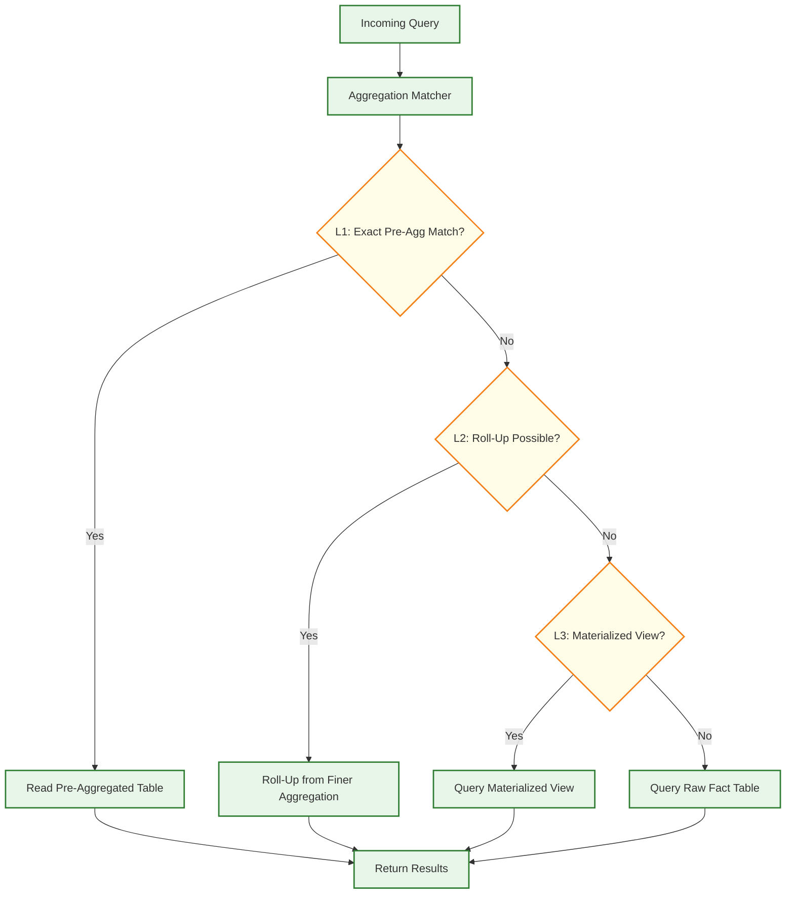
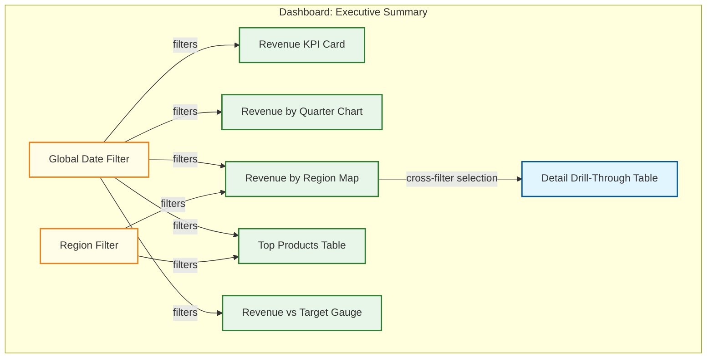
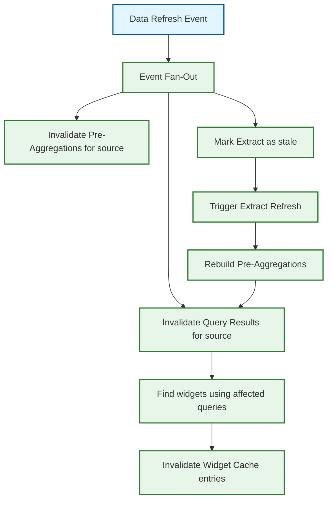

# Business Intelligence Platform --- Deep Dive & Bottlenecks

## Deep Dive 1: Semantic Layer Compilation Pipeline

### The Problem

The semantic layer must translate high-level business concepts (measures, dimensions, filters) into optimized SQL queries against potentially complex database schemas. This translation is the most architecturally significant operation in the BI platform---it determines query correctness, performance, and security.

### Compilation Phases

```mermaid
flowchart LR
    subgraph Parse["1. Parse"]
        INPUT[Query Spec] --> RESOLVE[Field Resolution]
    end

    subgraph Plan["2. Plan"]
        RESOLVE --> JOIN_GRAPH[Join Graph Traversal]
        JOIN_GRAPH --> RLS_INJ[RLS Injection]
    end

    subgraph Optimize["3. Optimize"]
        RLS_INJ --> PRED_PUSH[Predicate Pushdown]
        PRED_PUSH --> JOIN_ELIM[Join Elimination]
        JOIN_ELIM --> AGG_ROUTE[Aggregate Routing]
    end

    subgraph Generate["4. Generate"]
        AGG_ROUTE --> DIALECT[SQL Dialect Adapter]
        DIALECT --> SQL_OUT[Optimized SQL]
    end

    classDef phase fill:#e8f5e9,stroke:#2e7d32,stroke-width:2px
    class INPUT,RESOLVE,JOIN_GRAPH,RLS_INJ,PRED_PUSH,JOIN_ELIM,AGG_ROUTE,DIALECT,SQL_OUT phase
```



**Phase 1 --- Field Resolution**: Each field reference (e.g., `orders.total_revenue`) must be resolved through the model registry to find the physical SQL expression, the source view, and any dependent calculations. Measures may reference other measures (derived measures), and dimensions may involve CASE expressions or type conversions. The compiler builds a dependency DAG of field references and resolves them bottom-up.

**Phase 2 --- Join Graph Traversal**: Given the set of required views (determined by field resolution), the compiler must find the minimal set of joins needed. The explore's join graph is a directed acyclic graph where nodes are views and edges are join relationships. The compiler uses a shortest-path algorithm to find the optimal join path from the base view to each required view. If multiple paths exist, it selects based on join cardinality (preferring many-to-one over many-to-many to avoid fan-out).

**Phase 3 --- Optimization**:
- **Predicate pushdown**: Move WHERE clauses as close to the base tables as possible, especially into derived table subqueries
- **Join elimination**: Remove joins for views that contribute no selected fields and no filter predicates
- **Aggregate routing**: Check if a pre-aggregated table can serve this query; if so, rewrite the FROM clause to target the aggregate table instead of the base fact table
- **Symmetric aggregate handling**: When the join graph produces fan-out (one-to-many joins), the compiler must apply DISTINCT before aggregating, or use correlated subqueries to avoid double-counting

**Phase 4 --- SQL Dialect Adaptation**: Different databases have different SQL dialects. The compiler maintains dialect adapters that handle differences in: date functions, string functions, NULL handling, window function syntax, LIMIT/OFFSET syntax, nested query support, and data type casting.

### Bottleneck: Fan-Out and Symmetric Aggregates

The most dangerous correctness issue in semantic layer compilation is **fan-out**: when a join multiplies rows, causing SUM and COUNT to produce inflated results.

**Example**: Joining `orders` (one-to-many) with `order_items` and also (one-to-many) with `order_shipments`. If a query selects `SUM(order_items.quantity)` and `COUNT(order_shipments.id)`, the join produces a cross product between items and shipments for each order, inflating both aggregates.

**Solution**: The compiler detects fan-out by analyzing join cardinalities. When detected, it rewrites the query to use subquery aggregation:

```
-- Instead of:
SELECT SUM(items.quantity), COUNT(shipments.id) FROM orders
  JOIN items ON ... JOIN shipments ON ...

-- Compiler generates:
SELECT item_totals.total_qty, shipment_totals.shipment_count
FROM orders
  LEFT JOIN (SELECT order_id, SUM(quantity) as total_qty
             FROM items GROUP BY order_id) item_totals ON ...
  LEFT JOIN (SELECT order_id, COUNT(id) as shipment_count
             FROM shipments GROUP BY order_id) shipment_totals ON ...
```

---

## Deep Dive 2: OLAP Query Optimization and Pre-Aggregation

### The Problem

Analytical queries over billions of rows must return within seconds for interactive dashboards. Without optimization, every dashboard view would require full table scans across massive fact tables.

### Multi-Level Aggregation Strategy



### Pre-Aggregation Table Selection

The system maintains a catalog of pre-aggregated tables, each defined by:
- **Dimensions** included (the GROUP BY columns)
- **Measures** pre-computed (SUM, COUNT, etc.)
- **Granularity** (daily vs. hourly vs. raw)
- **Refresh schedule** and staleness tolerance

When a query arrives, the aggregation matcher checks:
1. **Exact match**: All query dimensions and measures exist in a pre-aggregated table
2. **Roll-up match**: Query dimensions are a subset of an aggregated table's dimensions (can re-aggregate from finer to coarser grain)
3. **Partial match**: Some measures served from aggregation, others from raw table (requires careful join logic)

### Auto-Aggregation Engine

```
FUNCTION auto_aggregation_advisor(usage_stats, storage_budget):
    // Analyze query patterns to identify high-value aggregation candidates
    frequent_queries = usage_stats.get_queries_above_threshold(
        min_frequency = 10 per day,
        min_avg_latency = 2 seconds
    )

    // Group queries by dimension set
    dimension_groups = GROUP_BY(frequent_queries, q => q.dimensions)

    // Score each potential aggregation
    candidates = []
    FOR group IN dimension_groups:
        score = compute_agg_score(
            query_frequency = group.total_frequency,
            avg_latency_savings = group.avg_latency - ESTIMATED_AGG_LATENCY,
            storage_cost = estimate_agg_storage(group.dimensions, group.measures),
            staleness_tolerance = MIN(group.queries.staleness_tolerance)
        )
        candidates.APPEND({ dimensions: group.dimensions, measures: group.measures, score: score })

    // Greedy selection within storage budget
    candidates.SORT_BY(score, DESC)
    selected = []
    remaining_budget = storage_budget

    FOR candidate IN candidates:
        IF candidate.storage_cost <= remaining_budget:
            selected.APPEND(candidate)
            remaining_budget -= candidate.storage_cost

    RETURN selected
```

### Bottleneck: Aggregation Staleness vs. Query Freshness

Pre-aggregated data is stale by definition---it reflects the state at the last refresh. Interactive dashboards may show stale aggregates alongside fresh filters, creating confusing user experiences (e.g., a filter for "today" returns data only through yesterday's aggregation).

**Mitigation strategies:**
- Display "data as of" timestamps prominently on each widget
- Support "hybrid freshness": serve the aggregated result immediately, then asynchronously re-query the live source and update the widget if results differ
- For critical dashboards, maintain near-real-time incremental aggregation via streaming updates to aggregate tables
- Allow users to force-refresh individual widgets, bypassing the cache and aggregation layers

---

## Deep Dive 3: Dashboard Rendering Pipeline

### The Problem

A dashboard with 15 widgets, each backed by a different query against potentially different data sources, must render within 2--5 seconds. Naive sequential execution would take 15 × 3s = 45s. The rendering engine must orchestrate parallel query execution, progressive rendering, and intelligent caching.

### Widget Dependency Graph and Execution DAG



### Progressive Rendering Strategy

1. **Parse dashboard definition** and identify the widget dependency graph
2. **Execution Group 1 (independent)**: W1, W2, W5 depend only on F1---execute in parallel
3. **Execution Group 2 (partially dependent)**: W3, W4 depend on F1 and F2---execute in parallel after filters resolve
4. **Execution Group 3 (fully dependent)**: W6 depends on W3 cross-filter selection---execute only when user interacts with W3
5. **Stream results**: As each widget's query completes, send the result to the client immediately. The client renders each widget as data arrives, showing loading spinners for pending widgets.

### Query Merging Optimization

When multiple widgets query the same explore with the same filters but different measures/dimensions, the query merger can combine them:

```
// Widget W1: SELECT SUM(revenue) FROM orders WHERE date >= '2025-01-01'
// Widget W5: SELECT SUM(revenue), SUM(target) FROM orders WHERE date >= '2025-01-01'

// Merged query:
// SELECT SUM(revenue), SUM(target) FROM orders WHERE date >= '2025-01-01'
// Both widgets served from a single database round-trip
```

**Conditions for merging:**
- Same explore (base table and join path)
- Same filter set (WHERE clause)
- Compatible measures (additive measures only---cannot merge DISTINCT counts)
- Dimension sets are either identical or one is a subset of the other

### Bottleneck: Widget Interaction Cascade

When a user changes a dashboard-level filter, all dependent widgets must re-query. On a complex dashboard with 20 widgets, this triggers 20 simultaneous queries. If the cache hit rate is low, this creates a query storm against the data source.

**Mitigations:**
- **Debounce filter changes**: Wait 300ms after the last filter change before executing queries (handles rapid multi-filter adjustments)
- **Incremental re-query**: Only re-query widgets whose filter dependencies actually changed
- **Query coalescing**: If multiple users view the same dashboard with the same filters, deduplicate queries at the execution layer
- **Priority queuing**: Give filter-change queries higher priority than initial dashboard load queries
- **Stale-while-revalidate**: Show previous cached results with a "refreshing" indicator while new queries execute

---

## Deep Dive 4: Cache Invalidation Strategies

### The Problem

The BI platform caches results at multiple tiers, but cache invalidation is notoriously difficult. Under-invalidation shows stale data; over-invalidation destroys cache hit rates and overloads data sources.

### Cache Tiers and Invalidation Triggers

| Cache Tier | What It Caches | Invalidation Trigger | TTL Strategy |
|-----------|---------------|---------------------|-------------|
| **L1: Widget Cache** | Rendered widget HTML/data per (widget_id, filter_hash, rls_hash) | Dashboard edit, filter change, underlying data refresh | Short: 5--15 min |
| **L2: Query Result Cache** | SQL result sets per (query_fingerprint, rls_hash) | Data source refresh, schema change, RLS policy update | Medium: 15 min -- 4 hours |
| **L3: Extract Cache** | Local columnar data copies per data source | Scheduled or triggered extract refresh | Long: hours to days |
| **L4: Pre-Aggregation Cache** | Pre-computed aggregate tables | Rebuild triggered by extract refresh or schedule | Long: hours to days |
| **L5: Semantic Model Cache** | Compiled model definitions per (project_id, version) | Model edit, deploy, or branch merge | Until model version changes |

### Event-Driven Cache Invalidation



### Invalidation Storm Prevention

When a large data source refreshes, it can cascade into millions of cache invalidations. Without throttling, this creates:
- Thundering herd: all invalidated caches re-query simultaneously
- Data source overload: query spike exceeds connection pool capacity
- User-visible latency spike: dashboards suddenly slow for all users

**Mitigation strategies:**
- **Staggered invalidation**: Spread invalidation across a time window (e.g., invalidate 10% of affected caches per minute)
- **Lazy invalidation**: Mark caches as "stale but servable"; re-query in background and update asynchronously
- **Priority-based refresh**: Re-populate caches for high-traffic dashboards first; let low-traffic caches expire naturally
- **Connection pool backpressure**: Queue excess queries with exponential backoff rather than failing immediately
- **Warm-up jobs**: After a data refresh, proactively re-execute queries for the top 100 most-viewed dashboards before users request them

---

## Deep Dive 5: Multi-Source Query Federation

### The Problem

Enterprises store data across multiple databases (warehouse, operational DB, spreadsheet uploads). A single dashboard may need to join data across these sources. The BI platform must federate queries across heterogeneous data sources.

### Federation Strategies

| Strategy | Description | When to Use |
|----------|-------------|-------------|
| **Push-down** | Execute full query on a single source; avoid federation | Query only references one data source |
| **Extract-and-join** | Extract smaller dataset locally, join with larger dataset | One source is small (< 100K rows), other is large |
| **Parallel extract** | Pull from both sources in parallel, join locally | Both sources are moderate size; neither supports the other's dialect |
| **Materialized federation** | Pre-materialize the joined result as a derived table during extract | Cross-source join is frequently used; can tolerate data staleness |

### Federation Execution Engine

```
FUNCTION execute_federated_query(query_plan, sources):
    // Determine which parts of the query can execute at each source
    source_subqueries = partition_query_by_source(query_plan)

    IF source_subqueries.length == 1:
        // No federation needed --- push entire query to single source
        RETURN execute_at_source(source_subqueries[0])

    // Estimate result sizes to determine join strategy
    estimates = []
    FOR subquery IN source_subqueries:
        row_estimate = estimate_result_size(subquery)
        estimates.APPEND({ subquery, row_estimate })

    // Sort by estimated size (smallest first for hash join build side)
    estimates.SORT_BY(row_estimate, ASC)

    // Execute subqueries in parallel
    results = PARALLEL_MAP(estimates, sq => execute_at_source(sq.subquery))

    // Perform local join
    joined = local_hash_join(results, query_plan.join_conditions)

    // Apply remaining predicates and aggregations locally
    final = apply_post_join_operations(joined, query_plan)

    RETURN final
```

### Bottleneck: Data Transfer Costs

Federating across sources requires pulling data over the network. A naive approach might transfer millions of rows from a warehouse to join with a small lookup table in an operational database.

**Mitigations:**
- **Push predicates to both sides**: Filter data at the source before transfer
- **Bloom filter pushdown**: Build a Bloom filter from the smaller side's join keys; send it to the larger side to pre-filter rows before transfer
- **Materialized cross-source tables**: For frequently joined cross-source combinations, materialize the join result during extract and refresh on schedule
- **Limit federation scope**: By default, only allow cross-source joins on dimensions (low cardinality); block cross-source joins on fact tables (high cardinality)

---

## Summary: Key Bottlenecks and Mitigations

| Bottleneck | Impact | Mitigation |
|-----------|--------|------------|
| Semantic layer fan-out (symmetric aggregates) | Incorrect query results (inflated metrics) | Subquery aggregation rewriting; join cardinality analysis |
| Pre-aggregation staleness | Users see outdated data without realizing it | Prominant freshness indicators; hybrid freshness (stale + live delta) |
| Dashboard filter cascade (query storm) | 20+ simultaneous queries on filter change | Debounce, query merging, stale-while-revalidate, priority queuing |
| Cache invalidation storms | Thundering herd on data refresh | Staggered invalidation, lazy refresh, warm-up jobs |
| Cross-source query federation | Network transfer costs; join performance | Predicate pushdown, Bloom filter optimization, materialized cross-source tables |
| Connection pool exhaustion | Queries queue or fail under peak load | Pool sizing, backpressure queuing, per-tenant quotas |
| Semantic model compilation latency | Slow first query after model change | Pre-compile on model save; cache compiled models; incremental compilation |
| Large result set rendering | Browser memory/CPU exhaustion on 100K+ row results | Server-side pagination; virtual scrolling; aggregation nudges for large results |
