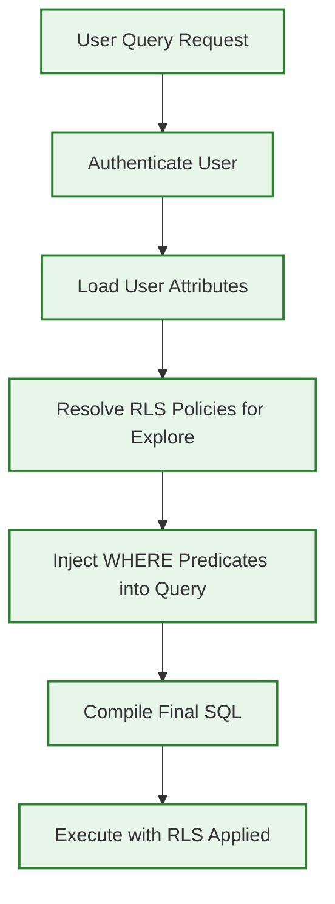
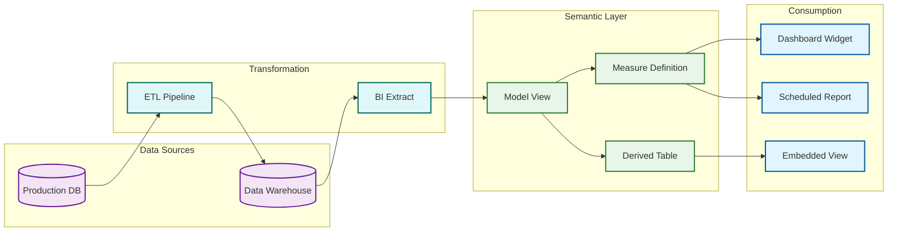

# Business Intelligence Platform --- Security & Compliance

## Threat Model

### Attack Surface

```mermaid
flowchart TB
    subgraph External["External Threats"]
        AT1[Unauthorized Data Access]
        AT2[SQL Injection via Semantic Layer]
        AT3[Credential Theft - DB Passwords]
        AT4[Cross-Tenant Data Leakage]
        AT5[Embedded Analytics Token Abuse]
    end

    subgraph Internal["Internal Threats"]
        IT1[RLS Policy Bypass]
        IT2[Over-Privileged User Access]
        IT3[Data Exfiltration via Exports]
        IT4[Semantic Model Tampering]
        IT5[Admin Abuse - Viewing All Tenant Data]
    end

    subgraph Platform["BI Platform"]
        SEM[Semantic Layer]
        CACHE[Cache Layer]
        CONN[Data Source Connections]
        EMBED[Embed Gateway]
        EXPORT[Export Service]
    end

    AT1 --> SEM
    AT2 --> SEM
    AT3 --> CONN
    AT4 --> CACHE
    AT5 --> EMBED
    IT1 --> SEM
    IT2 --> SEM
    IT3 --> EXPORT
    IT4 --> SEM
    IT5 --> CONN

    classDef threat fill:#ffebee,stroke:#c62828,stroke-width:2px
    classDef internal fill:#fff3e0,stroke:#e65100,stroke-width:2px
    classDef platform fill:#e8f5e9,stroke:#2e7d32,stroke-width:2px

    class AT1,AT2,AT3,AT4,AT5 threat
    class IT1,IT2,IT3,IT4,IT5 internal
    class SEM,CACHE,CONN,EMBED,EXPORT platform
```



---

## Row-Level Security (RLS)

### Architecture

RLS is the most critical security mechanism in a BI platform. It ensures that users only see data they are authorized to access, regardless of which dashboard or query they use.

### RLS Policy Enforcement Pipeline



### Policy Types

| Policy Type | Description | Example |
|-------------|-------------|---------|
| **User attribute match** | Filter rows where a column equals a user attribute | `region = user.region` --- sales rep sees only their region |
| **Group membership** | Filter based on user's group/team membership | `department IN user.departments` --- manager sees their department's data |
| **Hierarchical** | Filter based on organizational hierarchy | User sees data for their subtree in the org chart |
| **Time-based** | Restrict access to data within a time window | External auditors see only current fiscal year |
| **Data classification** | Restrict access based on data sensitivity labels | Only "confidential" clearance users see salary data |

### RLS Implementation

```
FUNCTION apply_rls_policies(query_spec, user_context):
    explore = model_registry.get_explore(query_spec.explore)
    policies = rls_registry.get_policies(
        tenant_id = user_context.tenant_id,
        explore_name = explore.name
    )

    rls_predicates = []

    FOR policy IN policies:
        // Check if policy applies to this user's roles
        IF policy.applies_to_roles != NULL
           AND NOT INTERSECTS(user_context.roles, policy.applies_to_roles):
            CONTINUE  // policy doesn't apply to this user

        // Resolve the value based on policy source
        SWITCH policy.value_source:
            CASE "user_attribute":
                value = user_context.attributes.get(policy.value_expression)
                IF value == NULL:
                    // Missing attribute means NO access (fail-secure)
                    rls_predicates.APPEND("1 = 0")
                    CONTINUE
            CASE "static":
                value = policy.value_expression
            CASE "query":
                // Dynamic RLS: run a subquery to determine allowed values
                value = execute_rls_subquery(policy.value_expression, user_context)

        // Build the predicate
        predicate = FORMAT("{}.{} {} {}",
            explore.name, policy.dimension_name,
            policy.operator, format_value(value))
        rls_predicates.APPEND(predicate)

    // RLS predicates are ANDed (all policies must be satisfied)
    RETURN rls_predicates
```

### RLS Cache Isolation

RLS creates a challenge for caching: two users viewing the same dashboard may see different data. The cache key must incorporate the RLS context:

```
cache_key = HASH(
    query_fingerprint +          // the logical query
    data_source_id +             // the data source
    SORTED(rls_predicates)       // the RLS-applied predicates
)
```

This means a dashboard viewed by 100 users with 10 different RLS contexts produces 10 distinct cache entries, not 100. Users sharing the same attributes and roles share cache entries.

---

## Column-Level Security and Data Masking

### Masking Policies

| Masking Type | Description | Use Case |
|-------------|-------------|----------|
| **Full redaction** | Replace value with NULL or placeholder | SSN, credit card numbers for unauthorized users |
| **Partial masking** | Show partial value (e.g., last 4 digits) | Phone numbers, account numbers for support staff |
| **Bucketing** | Replace exact values with ranges | Salary shown as "$100K-$150K" instead of exact amount |
| **Hashing** | Replace with deterministic hash | Anonymized analysis where uniqueness matters but values don't |
| **Conditional** | Show real value based on context | Show customer name only when user has direct relationship |

### Implementation in Semantic Layer

```
FUNCTION apply_column_masking(field_sql, field_def, user_context):
    masking_policy = field_def.masking_policy
    IF masking_policy == NULL:
        RETURN field_sql  // no masking

    // Check if user is exempt from masking
    IF user_context.has_permission("unmask:" + field_def.name):
        RETURN field_sql

    SWITCH masking_policy.type:
        CASE "full_redaction":
            RETURN "'[REDACTED]'"
        CASE "partial_mask":
            // Show last N characters
            n = masking_policy.visible_chars
            RETURN FORMAT("CONCAT('****', RIGHT({}, {}))", field_sql, n)
        CASE "bucketing":
            ranges = masking_policy.bucket_ranges
            RETURN build_case_expression(field_sql, ranges)
        CASE "hashing":
            RETURN FORMAT("SHA256(CAST({} AS VARCHAR))", field_sql)
```

---

## Authentication & Authorization

### Authentication Flows

| Flow | Use Case | Mechanism |
|------|----------|-----------|
| **SSO / SAML** | Enterprise users accessing via corporate identity provider | SAML assertion → session token; group claims mapped to roles |
| **OAuth 2.0** | API access and third-party integrations | Authorization code flow with PKCE; scoped access tokens |
| **Embed token** | Anonymous/external users viewing embedded dashboards | Signed JWT with embedded user attributes and permissions; short TTL |
| **API key** | Programmatic access for automation and CI/CD | Long-lived key with IP allowlist; scoped to specific operations |
| **Service account** | Extract workers and scheduled report jobs | Machine identity with certificate-based auth; no interactive login |

### Authorization Model

```
Permission Hierarchy:
┌─────────────────────────────────────────────────────┐
│ Platform Admin                                       │
│ └── Tenant Admin                                     │
│     ├── Content Creator                              │
│     │   ├── Create/edit dashboards                   │
│     │   ├── Create/edit semantic models               │
│     │   ├── Manage data sources                      │
│     │   └── Schedule reports                         │
│     ├── Explorer                                     │
│     │   ├── View dashboards (shared with them)       │
│     │   ├── Ad-hoc query (within explore permissions) │
│     │   ├── Export data (if allowed)                  │
│     │   └── Save personal dashboards                 │
│     └── Viewer                                       │
│         ├── View dashboards (shared with them)       │
│         └── Apply filters (within dashboard scope)   │
└─────────────────────────────────────────────────────┘
```

### Object-Level Permissions

| Object | Permission Types | Inheritance |
|--------|-----------------|-------------|
| **Folder** | View, Edit, Manage | Dashboards inherit folder permissions |
| **Dashboard** | View, Edit, Share, Delete | Widgets inherit dashboard permissions |
| **Explore** | Query, View Fields, Export | Fields can have additional restrictions |
| **Data Source** | Connect, Manage, View Schema | Per-tenant; admin-controlled |
| **Semantic Model** | View, Edit, Deploy | Git-based with branch permissions |
| **Scheduled Report** | View, Edit, Manage Recipients | Owner plus delegated managers |

---

## Data Governance

### Data Lineage Tracking



### Lineage Capabilities

| Capability | Description |
|-----------|-------------|
| **Forward lineage** | Given a source column, find all dashboards and reports that use it |
| **Backward lineage** | Given a dashboard metric, trace back to the source table and column |
| **Impact analysis** | Before changing a source schema, identify all affected dashboards and reports |
| **Data freshness chain** | Track the freshness of data from source → extract → aggregation → cache → dashboard |
| **Usage attribution** | Track which teams/users consume which data sources (for cost allocation) |

### Data Classification and Labeling

```
DataClassification:
┌──────────────────────────────────────────────────────┐
│ PUBLIC        - No restrictions; can be shared freely │
│ INTERNAL      - Available to all tenant users         │
│ CONFIDENTIAL  - Restricted to specific roles/groups   │
│ RESTRICTED    - Requires explicit approval; masked    │
│               by default; audit on every access       │
│ PROHIBITED    - Cannot be queried through BI; blocked │
│               at semantic layer                       │
└──────────────────────────────────────────────────────┘
```

Fields in the semantic model carry classification labels. The semantic layer enforces:
- **PROHIBITED** fields are excluded from explore field lists entirely
- **RESTRICTED** fields require explicit role assignment; all accesses logged
- **CONFIDENTIAL** fields are visible but masked by default; unmask requires permission
- **INTERNAL** and **PUBLIC** fields are available per normal explore permissions

---

## Embedded Analytics Security

### Token-Based Authentication for Embeds

```
FUNCTION generate_embed_token(request):
    // Validate the host application's API key
    app = validate_api_key(request.api_key)
    IF app == NULL:
        RETURN ERROR("Invalid API key")

    // Build embed user context
    embed_user = {
        external_user_id: request.user_id,
        tenant_id: app.tenant_id,
        attributes: request.user_attributes,  // for RLS
        permissions: {
            dashboards: request.allowed_dashboards,
            can_drill: request.permissions.can_drill,
            can_export: request.permissions.can_export,
            can_explore: FALSE  // embedded users cannot ad-hoc explore
        },
        theme: request.theme
    }

    // Sign with short-lived JWT
    token = JWT.sign({
        sub: embed_user.external_user_id,
        iss: "bi-platform",
        aud: app.app_id,
        iat: NOW(),
        exp: NOW() + request.expires_in_sec,
        ctx: encrypt(embed_user)  // encrypted context to prevent tampering
    }, signing_key)

    RETURN { token: token, expires_at: NOW() + request.expires_in_sec }
```

### Embed Security Controls

| Control | Implementation |
|---------|---------------|
| **Origin validation** | Embed gateway checks Referer/Origin header against allowlisted domains |
| **Token expiry** | Short-lived tokens (1--4 hours); host app refreshes proactively |
| **Context encryption** | User attributes encrypted within JWT to prevent client-side tampering |
| **Rate limiting** | Per-embed-app rate limits to prevent token abuse |
| **Audit trail** | All embedded dashboard views logged with host app context |
| **Content Security Policy** | CSP headers restrict embedded content to prevent XSS in iframe context |

---

## SQL Injection Prevention

### Semantic Layer as Security Boundary

The semantic layer inherently prevents SQL injection because users never write SQL directly. All queries are constructed from pre-defined model elements:

```
User interaction: "I want to see Revenue by Region"
    → Semantic query: { measures: ["orders.revenue"], dimensions: ["users.region"] }
    → Resolved SQL expressions from model: SUM(orders.amount), users.region
    → Generated SQL: SELECT users.region, SUM(orders.amount) FROM orders JOIN users ON ...
```

**However**, injection risks exist in:
- **Custom calculated fields**: If the platform allows users to write SQL expressions
- **Filter values**: User-provided filter values must be parameterized
- **Derived table definitions**: Model authors could introduce SQL injection in model definitions

### Mitigations

| Risk | Mitigation |
|------|-----------|
| Custom calc expressions | Parse into AST; whitelist allowed functions; reject raw SQL constructs |
| Filter values | Always use parameterized queries; never string-interpolate filter values |
| Derived tables | Model validation: scan for DDL/DML keywords; restrict to SELECT statements |
| NLQ-generated queries | NLQ output passes through semantic layer (never generates raw SQL) |
| Admin SQL console | Sandboxed read-only connection; query timeout; result size limit |

---

## Credential Management

### Data Source Credential Storage

```
Credential Storage Architecture:
┌────────────────────────┐
│ BI Platform             │
│                         │
│   credential_vault_id ──┼──→  Secret Manager
│   (reference only)      │      ├── DB passwords (AES-256 encrypted)
│                         │      ├── API keys (AES-256 encrypted)
│                         │      ├── OAuth tokens (AES-256 encrypted)
│                         │      └── Certificates (HSM-backed)
│                         │
│   Connection Pool ──────┼──→  Runtime: credentials fetched
│   (credentials never    │      just-in-time; cached in memory
│    persisted in app DB) │      for connection pool lifetime
└────────────────────────┘
```

**Principles:**
- Credentials never stored in the application database; only vault references
- Credentials rotated on schedule (90-day maximum) without service disruption
- Connection pools refresh credentials transparently when vault entries update
- Credential access logged for audit: who accessed which credential, when, and from where

---

## Compliance Framework

### Audit Logging

| Event Category | Events Logged | Retention |
|---------------|---------------|-----------|
| **Authentication** | Login, logout, SSO assertion, embed token generation, failed login | 2 years |
| **Data Access** | Every query executed (SQL, user, source, rows returned, duration) | 1 year |
| **Content Management** | Dashboard create/edit/delete, model changes, schedule changes | 2 years |
| **Permission Changes** | Role assignments, RLS policy changes, sharing actions | 5 years |
| **Export** | PDF/CSV downloads, scheduled report deliveries, API data retrieval | 2 years |
| **Admin Actions** | Tenant config changes, user provisioning, data source management | 5 years |

### Regulatory Compliance Matrix

| Regulation | Requirement | BI Platform Implementation |
|-----------|-------------|---------------------------|
| **GDPR** | Right to access, right to erasure, data minimization | User data export API; cascading deletion of user activity; pseudonymization of analytics |
| **SOC 2** | Access controls, audit logging, change management | Role-based access; comprehensive audit trail; Git-based model versioning |
| **HIPAA** | PHI access controls, audit trail, encryption | RLS for patient data; field-level masking; encrypted extracts; BAA with data sources |
| **SOX** | Financial data integrity, access controls | Immutable audit logs; approval workflows for model changes; segregation of duties |
| **CCPA** | Data inventory, opt-out, access requests | Data lineage tracking; per-user query history purge; usage analytics anonymization |

### Data Retention Policies

```
FUNCTION enforce_data_retention(tenant):
    retention_policy = tenant.data_retention_config

    // Purge expired query results from cache
    purge_cache_entries(
        tenant_id = tenant.id,
        older_than = retention_policy.cache_retention_days
    )

    // Archive old audit logs
    archive_audit_logs(
        tenant_id = tenant.id,
        older_than = retention_policy.audit_retention_days,
        archive_to = cold_storage
    )

    // Purge old extract snapshots
    purge_extract_snapshots(
        tenant_id = tenant.id,
        keep_latest = retention_policy.extract_versions_to_keep
    )

    // Anonymize user activity older than retention period
    anonymize_query_history(
        tenant_id = tenant.id,
        older_than = retention_policy.activity_retention_days
    )
```
