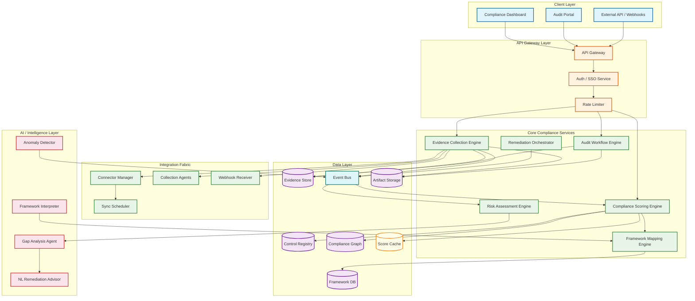

# AI-Native Compliance Management Platform Design (Vanta/Drata/Secureframe)

## System Overview

An AI-Native Compliance Management Platform automates the continuous lifecycle of regulatory compliance---from evidence collection and control monitoring through risk assessment and audit preparation---using autonomous agents, policy-as-code engines, and machine-learning-driven gap analysis to replace what has traditionally been a manual, spreadsheet-driven, point-in-time audit exercise. Systems like Vanta, Drata, Secureframe, and Sprinto integrate deeply with an organization's infrastructure (cloud providers, identity providers, HR systems, version control, endpoint management) to continuously observe the state of technical and administrative controls, map observations to regulatory framework requirements (SOC 2, HIPAA, ISO 27001, PCI DSS, GDPR, SOX), score organizational compliance posture in real time, and orchestrate remediation workflows when controls drift out of compliance. The core engineering challenge is building a system that can ingest heterogeneous signals from hundreds of integration types at varying cadences, evaluate those signals against a multi-framework control matrix that changes with evolving regulations, maintain cryptographically verifiable evidence chains for auditors, and present a unified compliance posture to stakeholders---all while the platform itself must be among the most secure and compliant systems in the customer's ecosystem, creating a unique meta-compliance requirement where the compliance tool must practice what it preaches.

---

## Key Characteristics

| Characteristic | Description |
|---------------|-------------|
| **Read/Write Pattern** | Read-heavy for dashboards and audit views (~85%); bursty writes during evidence collection cycles and integration syncs; write-heavy during audit preparation exports |
| **Latency Sensitivity** | Medium---dashboards render within 2--5 seconds; evidence collection tolerates minutes-to-hours depending on integration; real-time alerting for control failures within 60 seconds |
| **Consistency Model** | Strong consistency for evidence records and audit trails (immutable, append-only); eventual consistency acceptable for compliance scores, posture dashboards, and cached framework mappings |
| **Data Volume** | High---each organization generates 10K--500K evidence artifacts per year; multi-tenant platform with 10K+ organizations stores billions of evidence records; evidence includes screenshots, config snapshots, logs, and policy documents |
| **Architecture Model** | Event-driven integration fabric collecting signals from 200+ source types; policy-as-code engine evaluating controls against framework requirements; evidence graph linking artifacts to controls to frameworks; AI layer for gap analysis, risk scoring, and remediation guidance |
| **Regulatory Burden** | **Extreme**---the platform must itself maintain SOC 2 Type II, ISO 27001, HIPAA BAA, and often FedRAMP authorization; customer data includes sensitive security configurations and organizational risk profiles |
| **Complexity Rating** | **Very High** |

---

## Quick Navigation

| Document | Description |
|----------|-------------|
| [01 - Requirements & Estimations](./01-requirements-and-estimations.md) | Functional/non-functional requirements, capacity planning, SLOs |
| [02 - High-Level Design](./02-high-level-design.md) | Architecture diagrams, data flow, key decisions |
| [03 - Low-Level Design](./03-low-level-design.md) | Data models, API design, algorithms (pseudocode) |
| [04 - Deep Dive & Bottlenecks](./04-deep-dive-and-bottlenecks.md) | Evidence Collection Engine, Compliance Scoring Engine, Framework Mapping Engine |
| [05 - Scalability & Reliability](./05-scalability-and-reliability.md) | Integration scaling, evidence storage, multi-tenant isolation, disaster recovery |
| [06 - Security & Compliance](./06-security-and-compliance.md) | Meta-compliance, zero-trust architecture, data sovereignty, threat model |
| [07 - Observability](./07-observability.md) | Compliance posture metrics, integration health, audit trail integrity monitoring |
| [08 - Interview Guide](./08-interview-guide.md) | 45-min pacing, trap questions, trade-offs, scoring rubric |
| [09 - Insights](./09-insights.md) | Key architectural insights, patterns, lessons |

---

## What Differentiates This from Related Systems

| Aspect | AI-Native Compliance (This) | Traditional GRC Platform | SIEM / Security Monitoring | Identity & Access Management | Audit Management Software | Policy Management Tool |
|--------|---------------------------|-------------------------|---------------------------|------------------------------|---------------------------|----------------------|
| **Core Function** | Continuous automated compliance posture management across multiple regulatory frameworks with AI-driven evidence collection and gap analysis | Manual governance, risk assessment, and compliance tracking through questionnaires, spreadsheets, and periodic reviews | Real-time security event detection, correlation, and incident response from log data | User identity lifecycle, authentication, authorization, and access governance | Audit planning, fieldwork tracking, and finding management for internal audit teams | Policy creation, distribution, acknowledgment tracking, and version control |
| **Automation Model** | Autonomous agents continuously collect evidence, evaluate controls, and generate remediation guidance without human intervention | Workflow automation for approval chains and notification routing; evidence collection remains largely manual | Automated log ingestion and correlation rules; alerting on security events; no compliance mapping | Automated provisioning/deprovisioning; access certification campaigns are periodic | Automated scheduling and workpaper management; fieldwork still manual | Automated policy distribution and acknowledgment reminders; content creation is manual |
| **Framework Coverage** | Multi-framework control matrix mapping single controls to SOC 2, HIPAA, ISO 27001, PCI DSS, GDPR simultaneously; cross-framework evidence reuse | Framework templates with manual mapping; limited cross-framework intelligence | Not framework-aware; security-event-focused rather than compliance-requirement-focused | Supports access-related controls only; no coverage of physical security, HR, or data handling requirements | Framework-aware for audit scoping but doesn't automate evidence collection or control evaluation | Manages policy documents that satisfy framework requirements but doesn't evaluate technical controls |
| **Evidence Management** | Cryptographically timestamped, immutable evidence artifacts automatically linked to specific control requirements with chain-of-custody metadata | Document uploads with manual tagging; no automatic linking to controls; evidence freshness not tracked | Retains raw logs as forensic evidence; not organized by compliance requirement | Access logs and certification records; narrow evidence scope | Workpapers and supporting documents; manual organization | Policy documents as evidence; single evidence type |
| **Intelligence Layer** | AI-powered: predictive risk scoring, natural language remediation guidance, anomaly detection in control effectiveness, automated framework interpretation | Basic reporting and dashboards; risk scoring based on manual assessments | ML-based anomaly detection focused on security threats, not compliance posture | Risk-based authentication decisions; not compliance-aware | Statistical sampling guidance; no predictive analytics | None; static document management |
| **Integration Depth** | Deep bidirectional integration with 200+ systems (cloud infra, identity, HR, endpoints, dev tools, ticketing); reads config state and writes remediation actions | Shallow integrations; primarily imports data via CSV or manual entry | Deep log ingestion from security tools; typically read-only | Deep integration with directories and applications for provisioning; narrow scope | Limited integrations; primarily document-centric | Limited; primarily email and intranet distribution |

---

## What Makes This System Unique

1. **The Meta-Compliance Paradox**: Unlike virtually any other SaaS platform, a compliance management system must itself be a model of compliance. It stores customers' most sensitive security configurations, vulnerability data, and organizational risk profiles. If the compliance platform suffers a breach, every customer's security posture is exposed. This creates an extreme trust requirement: the platform must maintain its own SOC 2 Type II, ISO 27001, and often HIPAA and FedRAMP certifications---ideally using its own product to manage its own compliance. This self-referential requirement ("dogfooding at the compliance level") influences every architectural decision, from data isolation to key management to audit trail immutability.

2. **The Multi-Framework Control Matrix Is a Graph Problem**: A single technical control (e.g., "enforce MFA for all users") can satisfy requirements across SOC 2 (CC6.1), ISO 27001 (A.9.4.2), HIPAA (§164.312(d)), PCI DSS (Req 8.3), and GDPR (Art. 32). The framework mapping engine must maintain a bipartite graph between concrete controls and abstract regulatory requirements, handle many-to-many relationships with varying strength of satisfaction (a control may fully satisfy one requirement but only partially satisfy another), and update these mappings as frameworks are revised. This is not a simple lookup table---it is a knowledge graph with weighted edges, version history, and interpretive nuance that requires expert curation augmented by NLP-based framework analysis.

3. **Evidence Is Not Data---It Is a Temporal Proof with Chain of Custody**: Evidence in a compliance platform is fundamentally different from data in a typical application. An evidence artifact must prove that a specific control was in a specific state at a specific point in time, collected by a specific mechanism, and has not been tampered with since collection. This requires cryptographic timestamping (RFC 3161 or blockchain-anchored), immutable storage with write-once semantics, collector identity attestation, and reproducibility metadata (can the same evidence be re-collected and compared?). The evidence storage layer is closer to a legal records management system than to a typical document store.

4. **Continuous Monitoring Inverts the Audit Model**: Traditional compliance operates on a point-in-time audit model: collect evidence, present to auditor, receive certification, repeat annually. AI-native compliance inverts this by continuously monitoring controls, maintaining a real-time compliance score, and generating always-ready audit packages. This inversion creates a fundamental architectural shift from batch processing (prepare for audit) to stream processing (continuously evaluate controls), from periodic evidence collection (annual screenshots) to continuous evidence accumulation (every config change is an evidence event), and from reactive remediation (fix findings after audit) to proactive drift detection (alert when a control fails before the auditor notices). The system must handle the tension between continuous monitoring (which generates enormous data volumes) and audit readiness (which requires curated, organized evidence packages).

---

## Quick Reference: Scale Numbers

| Metric | Value | Notes |
|--------|-------|-------|
| Organizations (tenants) | ~15,000 | SMBs, mid-market, and enterprise; each managing 1--10 compliance frameworks |
| Total users | ~500K | Compliance managers, engineers, executives, auditors (external) |
| Integrations per org | ~25--50 | Cloud infra, identity, HR, endpoints, dev tools, ticketing |
| Integration sync events per day | ~200M | Across all tenants; each sync produces 1--100 evidence artifacts |
| Evidence artifacts stored | ~5B total | Growing ~2B/year; includes configs, screenshots, logs, attestations |
| Active controls monitored | ~50M | ~3,000--5,000 per org across all frameworks |
| Framework requirements mapped | ~2,500 unique | Across SOC 2, HIPAA, ISO 27001, PCI DSS, GDPR, SOX, FedRAMP |
| Compliance score recalculations/day | ~15M | Triggered by evidence events; batch for overnight deep recalculation |
| Audit packages generated per year | ~25K | Each package: 500--5,000 evidence artifacts organized by control |
| Concurrent dashboard sessions | ~30K | Peak during audit season (Q4, Q1) |
| Evidence storage volume | ~2 PB | Immutable blob storage with cryptographic timestamps |
| Average evidence collection latency | <5 min | API-based integrations; agent-based may take up to 1 hour |
| Control evaluation latency (P99) | <30 sec | From evidence event to updated compliance score |

---

## Architecture Overview (Conceptual)

---

## Key Trade-Offs in AI-Native Compliance Design

| Trade-Off | Option A | Option B | This System's Choice |
|-----------|----------|----------|---------------------|
| **Evidence Collection** | Pull-based: scheduled scans of integrated systems | Push-based: webhooks/events from integrated systems | Hybrid---pull for initial baseline and periodic deep scans; push for real-time change detection via webhooks and event streams |
| **Compliance Scoring** | Point-in-time: recalculate on demand or on schedule | Continuous: event-driven recalculation on every evidence change | Event-driven with debouncing---score updates within 30 seconds of evidence events; full recalculation nightly for consistency verification |
| **Framework Mapping** | Static: expert-curated mapping tables updated quarterly | Dynamic: AI-assisted mapping with human review | AI-proposed with expert approval---NLP analyzes framework text to suggest control mappings; compliance experts review and approve; mappings versioned and auditable |
| **Evidence Storage** | Mutable: update evidence records as new data arrives | Immutable: append-only evidence with version history | Immutable append-only---every evidence collection creates a new versioned record; previous versions retained for audit trail; cryptographic timestamps for tamper detection |
| **Multi-Tenancy** | Shared schema with tenant isolation via row-level policies | Schema-per-tenant or database-per-tenant | Shared infrastructure with logical isolation for standard tiers; dedicated evidence storage partitions for enterprise tenants; separate encryption keys per tenant |
| **AI Autonomy** | Fully autonomous: AI collects, evaluates, and remediates | Human-in-the-loop: AI suggests, humans approve | Human-in-the-loop for remediation actions and framework interpretation; autonomous for evidence collection and control evaluation; configurable per control criticality |
| **Audit Package Generation** | On-demand: generate when auditor requests | Pre-built: continuously maintain audit-ready packages | Continuously maintained with on-demand customization---living audit packages updated with each evidence event; auditors can filter and customize views without regeneration delay |

---

## Related Designs

| Design | Relevance |
|--------|-----------|
| Identity & Access Management | Provides authentication signals, access review evidence, and SSO integration for the compliance platform itself |
| SIEM / Security Monitoring | Feeds security event data as evidence; compliance platform maps SIEM alerts to control requirements |
| Ticketing / Workflow System | Remediation actions create tickets; ticket resolution feeds back as remediation evidence |
| Document Management | Policy documents stored and versioned; policy acknowledgments tracked as evidence |
| Cloud Infrastructure Platform | Primary source of configuration evidence; API integration for control evaluation |

---

## Sources

- Vanta Engineering --- AI Agent 2.0 Architecture, Risk Graph, and Continuous Monitoring Platform (2025--2026)
- Drata --- Scalable GRC Foundation: Security by Design, Trust by Architecture White Paper
- Secureframe --- Multi-Framework Control Mapping and Automated Evidence Collection Architecture
- Continuous Compliance Framework (CCF) --- Open-Source OSCAL-Based Agent Architecture and Policy Engine
- Open Policy Agent (OPA) --- CNCF Policy Engine and Rego Language for Policy-as-Code Enforcement
- NIST --- OSCAL (Open Security Controls Assessment Language) Specification
- AICPA --- SOC 2 Trust Services Criteria and Common Criteria Framework
- ISO/IEC --- 27001:2022 Information Security Management System Requirements
- Platform Engineering Organization --- Policy-as-Code Architecture Patterns and Enforcement Strategies
- Gartner --- Magic Quadrant for IT Risk Management and Compliance Automation Platforms (2025)
