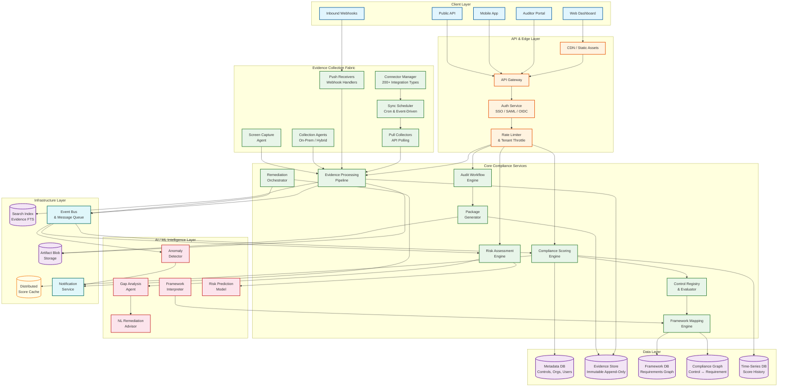
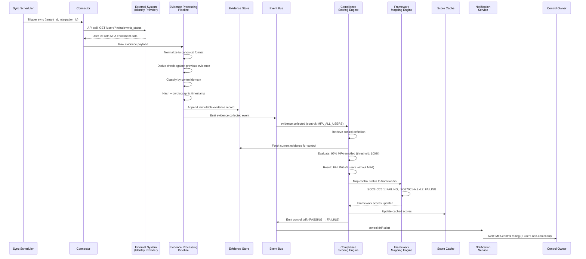
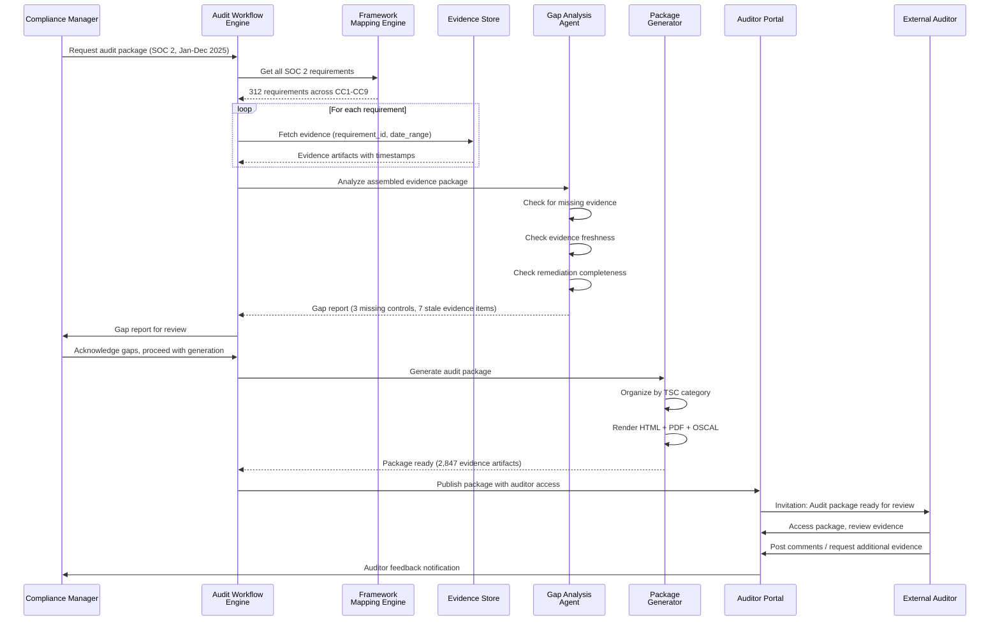

# AI-Native Compliance Management --- High-Level Design

## System Architecture



---

## Data Flow Descriptions

### Flow 1: Evidence Collection Path

The evidence collection path is the backbone of the system, transforming raw integration data into auditable compliance evidence.

1. **Integration Trigger**: The Sync Scheduler triggers a collection cycle based on configured frequency (every 15 min for critical integrations, hourly for standard, daily for low-priority). Alternatively, an inbound webhook from an integrated system triggers an event-driven collection.

2. **Connector Execution**: The Connector Manager selects the appropriate connector (OAuth API client, agent-based collector, or webhook parser), authenticates with the target system using stored credentials from a secrets vault, and executes the collection query.

3. **Evidence Processing Pipeline**:
   - **Normalization**: Raw API responses are transformed into a canonical evidence format with standardized fields (timestamp, source, collector_id, control_id, raw_payload, normalized_summary)
   - **Deduplication**: Incoming evidence is compared against the most recent evidence for the same control; if identical, a "no-change" record is appended (proving continuous monitoring) rather than duplicating the full artifact
   - **Classification**: ML classifier tags evidence by control domain (access control, encryption, network, HR, physical) and framework requirement
   - **Integrity Sealing**: The evidence artifact is hashed (SHA-256), cryptographically timestamped (RFC 3161 TSA or Merkle-tree anchor), and stored immutably
   - **Indexing**: Evidence metadata is indexed in the search engine for full-text and faceted search

4. **Event Emission**: An `evidence.collected` event is published to the event bus, carrying the evidence ID, tenant ID, affected control IDs, and a change delta. Downstream consumers (scoring engine, anomaly detector, risk engine) react to this event.

### Flow 2: Compliance Scoring Path

1. **Event Consumption**: The Compliance Scoring Engine subscribes to `evidence.collected` events from the event bus. Events are debounced per tenant (aggregate events within a 5-second window to avoid score thrashing during batch syncs).

2. **Control Evaluation**: For each affected control, the engine:
   - Retrieves the control definition from the Control Registry (evaluation criteria, required evidence types, pass/fail thresholds)
   - Gathers all current evidence linked to that control
   - Evaluates the control against its criteria (e.g., "MFA enabled for all users" checks the identity provider evidence for MFA enrollment percentage)
   - Produces a control status: PASSING, FAILING, PARTIAL, or UNKNOWN (insufficient evidence)

3. **Framework Score Aggregation**: The Framework Mapping Engine maps the control status to all linked framework requirements. For each framework:
   - Requirements are weighted by criticality (critical controls have 3x weight vs. advisory controls)
   - The framework compliance score is calculated as: `score = Σ(control_status × weight) / Σ(weight)` where PASSING=1.0, PARTIAL=0.5, FAILING=0.0, UNKNOWN=0.0
   - The score is stored in the time-series database for trend tracking and in the distributed cache for fast dashboard access

4. **Drift Detection**: If a control transitions from PASSING to FAILING, a `control.drift` event is emitted, triggering:
   - Real-time notification to the control owner
   - Remediation workflow creation
   - Risk score recalculation

### Flow 3: Audit Report Generation

1. **Package Request**: A compliance manager or auditor initiates audit package generation for a specific framework and time period.

2. **Evidence Assembly**: The Audit Workflow Engine:
   - Queries the Framework Mapping Engine for all requirements in the target framework
   - For each requirement, retrieves all linked controls and their evidence within the audit period
   - Organizes evidence by framework section (e.g., SOC 2 Trust Services Criteria CC1 through CC9)
   - Includes evidence freshness metadata and collection provenance

3. **Gap Identification**: The Gap Analysis Agent scans the assembled package for:
   - Requirements with no linked evidence
   - Evidence that is stale (older than the framework's freshness threshold)
   - Controls that were FAILING during the audit period with no documented remediation
   - Missing administrative evidence (policies, training records, access reviews)

4. **Package Rendering**: The Package Generator produces:
   - Interactive HTML report with expandable evidence sections
   - PDF export with embedded evidence screenshots and configuration snapshots
   - OSCAL-format machine-readable output for regulatory submissions
   - Excel workbook with evidence matrix for auditor working papers

5. **Auditor Access**: The auditor portal provides scoped, read-only access to the generated package, with commenting capabilities for follow-up questions and finding documentation.

---

## Sequence Diagrams

### Evidence Collection and Scoring Sequence



### Audit Package Generation Sequence



---

## Key Architectural Decisions

### Decision 1: Event-Driven Evidence Processing over Request-Response

**Context**: Evidence collection involves hundreds of integrations with varying latencies (100ms API calls to 10-minute agent scans). Downstream consumers (scoring, risk, anomaly detection) need to react to new evidence.

**Decision**: Event-driven architecture with an event bus as the backbone. Evidence collection publishes events; scoring, risk, and notification services consume them asynchronously.

**Rationale**:
- Decouples evidence collection cadence from scoring frequency
- Enables independent scaling of collection workers and scoring workers
- Supports replay: if the scoring algorithm changes, replay evidence events to recalculate historical scores
- Natural backpressure: if scoring is slow, events queue rather than causing collection timeouts

**Trade-off**: Eventual consistency for compliance scores (5--30 second lag from evidence collection to score update); mitigated by showing "last updated" timestamps on dashboards.

### Decision 2: Immutable Append-Only Evidence Store

**Context**: Evidence artifacts must be tamper-proof for audit integrity. Auditors need to trust that evidence presented today was actually collected at the claimed timestamp.

**Decision**: Evidence stored in an append-only store with cryptographic timestamps. No updates or deletes---only new versions.

**Rationale**:
- Audit integrity: cryptographic proof that evidence was collected at the claimed time
- Forensic capability: complete history of every control's state over time
- Regulatory compliance: meets SOC 2 and ISO 27001 requirements for evidence integrity
- Simplified conflict resolution: no update conflicts in a write-once system

**Trade-off**: Storage growth is unbounded; mitigated by tiered storage (hot/warm/cold) and compression of older evidence.

### Decision 3: Bipartite Graph for Framework-Control Mapping

**Context**: Controls map to framework requirements in a many-to-many relationship. A single control can satisfy requirements across multiple frameworks, and a single requirement may need multiple controls.

**Decision**: Model the framework-control relationship as a weighted bipartite graph stored in a graph-capable database, with controls on one side and framework requirements on the other.

**Rationale**:
- Enables efficient "which requirements does this control cover?" and "which controls satisfy this requirement?" queries
- Weighted edges capture partial satisfaction (a control may satisfy 70% of a requirement)
- Graph traversal enables impact analysis: "if this control fails, which frameworks are affected?"
- Supports framework overlap analysis: find requirements shared across frameworks by common control linkages

**Trade-off**: Graph databases add operational complexity; for smaller deployments, a junction table in a relational database suffices. The graph model becomes essential at scale (10K+ controls × 2,500+ requirements).

### Decision 4: Hybrid Pull/Push Evidence Collection

**Context**: Integrations vary in capability---some expose webhooks (push), others only support API polling (pull), and some require on-premise agents.

**Decision**: Support all three collection modes with a unified evidence processing pipeline downstream.

**Rationale**:
- Push (webhooks): lowest latency, least resource-intensive; preferred for integrations that support it (e.g., cloud infrastructure event streams)
- Pull (API polling): universal fallback; works with any API-exposed system; configurable frequency
- Agent (on-premise): required for air-gapped environments, legacy systems, and network-internal evidence (firewall configs, endpoint states)
- Unified pipeline ensures consistent evidence processing regardless of collection mode

**Trade-off**: Supporting three collection modes increases connector maintenance burden; mitigated by a standardized connector SDK and rigorous connector testing framework.

### Decision 5: Per-Tenant Encryption Keys

**Context**: The platform stores highly sensitive data (security configurations, vulnerability information, organizational risk profiles). Multi-tenant platforms face the risk that a breach exposes all tenants' data.

**Decision**: Each tenant's evidence is encrypted with a tenant-specific encryption key. Enterprise tenants can bring their own keys (BYOK) stored in their own key management service.

**Rationale**:
- Limits blast radius of a key compromise to a single tenant
- Enables cryptographic tenant isolation beyond logical database separation
- Meets enterprise requirements for key custody and rotation
- Supports data residency requirements (keys stored in region-specific KMS)

**Trade-off**: Key management complexity increases linearly with tenant count; mitigated by automated key lifecycle management (rotation, archival, destruction).

---

## Architecture Pattern Checklist

| Pattern | Applied? | Implementation |
|---------|----------|---------------|
| API Gateway | ✅ | Centralized gateway with auth, rate limiting, tenant routing |
| Event-Driven Architecture | ✅ | Event bus for evidence events, control drift, remediation actions |
| CQRS | ✅ | Write path (evidence collection) separated from read path (dashboard queries, score lookups) |
| Saga / Choreography | ✅ | Evidence collection → scoring → risk assessment → remediation as choreographed event chain |
| Circuit Breaker | ✅ | Per-integration circuit breakers to isolate failing external system connections |
| Bulkhead | ✅ | Tenant-level resource isolation; separate worker pools for evidence collection vs. scoring |
| Sidecar / Agent | ✅ | On-premise collection agents deployed as sidecars in customer infrastructure |
| Strangler Fig | ⬜ | Not applicable (greenfield design) |
| Fan-Out/Fan-In | ✅ | Single evidence event fans out to scoring, risk, anomaly detection; fan-in for composite posture score |
| Materialized View | ✅ | Compliance scores and dashboard data maintained as materialized views over the event stream |
| Write-Ahead Log | ✅ | Evidence events written to append-only log before processing for durability |
| Idempotent Operations | ✅ | Evidence collection and scoring operations designed for safe retry with idempotency keys |

---

## Cross-Cutting Concerns

### Multi-Tenancy Strategy

```
Tier 1 (Starter/Business):
  - Shared compute, shared database with row-level tenant isolation
  - Shared evidence blob storage with tenant-prefixed paths
  - Per-tenant encryption keys in shared KMS

Tier 2 (Enterprise):
  - Shared compute with dedicated worker pools
  - Dedicated database schemas or logical databases
  - Dedicated evidence storage partitions
  - Customer-managed encryption keys (BYOK)

Tier 3 (Regulated/FedRAMP):
  - Dedicated compute in isolated network segments
  - Dedicated database instances
  - Dedicated evidence storage with region pinning
  - Hardware security modules (HSM) for key management
  - FedRAMP-boundary-compliant deployment
```

### Data Lifecycle Management

| Data Type | Hot (Fast Access) | Warm (Reduced Access) | Cold (Archive) | Retention |
|-----------|------------------|----------------------|----------------|-----------|
| Evidence artifacts | Last 90 days | 91 days -- 1 year | 1+ years | Per contract (1--10 years) |
| Compliance scores | Last 30 days | 31 days -- 1 year | 1+ years | Duration of subscription + 1 year |
| Audit trails | Last 1 year | 1--3 years | 3+ years | 7 years minimum (regulatory) |
| Integration configs | Always hot | N/A | N/A | Duration of integration |
| Framework definitions | Always hot | Previous versions warm | Deprecated versions cold | Indefinite |

### Integration Health Monitoring

Every integration connector reports health metrics:
- **Collection success rate**: percentage of scheduled collections that complete successfully
- **Latency**: time to complete a collection cycle
- **Freshness**: time since last successful collection
- **Error classification**: authentication failures, rate limiting, schema changes, network errors

Health status is surfaced on the dashboard and contributes to the overall platform reliability score. Integrations with degraded health trigger alerts and automatic retry with exponential backoff.
