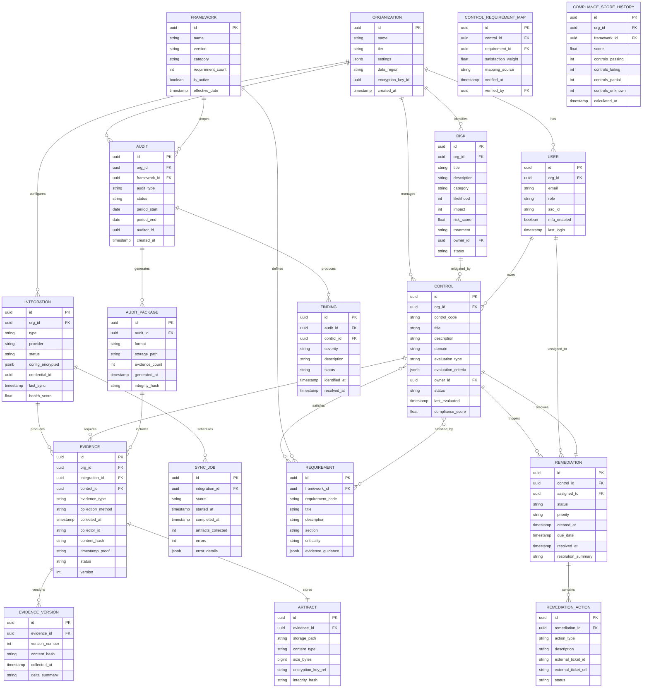

# AI-Native Compliance Management --- Low-Level Design

## Data Model

### Entity-Relationship Diagram



---

## Indexing Strategy

### Primary Database Indexes

| Table | Index | Type | Purpose |
|-------|-------|------|---------|
| evidence | `(org_id, control_id, collected_at DESC)` | Composite B-tree | Fetch latest evidence per control per org |
| evidence | `(org_id, collected_at DESC)` | Composite B-tree | Time-range queries for audit packages |
| evidence | `(content_hash)` | Hash | Deduplication check |
| control | `(org_id, status)` | Composite B-tree | Filter controls by status for dashboard |
| control | `(org_id, domain)` | Composite B-tree | Domain-based control grouping |
| control_requirement_map | `(control_id, requirement_id)` | Unique composite | Ensure unique mappings |
| control_requirement_map | `(requirement_id)` | B-tree | Reverse lookup: which controls satisfy a requirement |
| compliance_score_history | `(org_id, framework_id, calculated_at DESC)` | Composite B-tree | Score trend queries |
| sync_job | `(integration_id, started_at DESC)` | Composite B-tree | Integration health monitoring |
| remediation | `(assigned_to, status, due_date)` | Composite B-tree | User task queue |
| finding | `(audit_id, severity)` | Composite B-tree | Audit finding summary |

### Search Index (Full-Text)

| Document Type | Indexed Fields | Facets |
|--------------|----------------|--------|
| Evidence | normalized_summary, raw_payload (extracted text), control_title | org_id, control_domain, evidence_type, collection_method, status |
| Control | title, description, control_code, domain | org_id, status, domain, framework_ids |
| Requirement | title, description, section, requirement_code | framework_id, criticality, section |
| Risk | title, description, category | org_id, category, treatment, status |

---

## Partitioning & Sharding Strategy

### Evidence Store Partitioning

Evidence is the highest-volume table and requires careful partitioning:

```
Partitioning strategy: Composite (org_id hash + time range)

Level 1: Hash partition by org_id (256 buckets)
  - Ensures single-org queries hit a single partition
  - Distributes load across storage nodes

Level 2: Range partition by collected_at (monthly)
  - Enables efficient time-range queries for audit packages
  - Supports data lifecycle management (drop old partitions to cold storage)

Partition naming: evidence_p{hash_bucket}_{YYYY_MM}
Example: evidence_p042_2025_11
```

### Hot/Warm/Cold Tiering

```
Hot tier (SSD, full indexes):
  - Evidence from last 90 days
  - All active controls and scores
  - Current framework definitions

Warm tier (HDD, partial indexes):
  - Evidence from 91 days to 1 year
  - Historical score snapshots
  - Completed audit packages

Cold tier (Object storage, no indexes):
  - Evidence older than 1 year
  - Archived audit packages
  - Superseded framework versions
  - Accessible via async retrieval (minutes)
```

### Compliance Score Sharding

```
Sharding: By org_id (consistent hashing)
  - Each shard holds all scores for a subset of organizations
  - Score recalculation is org-local (no cross-shard joins)
  - Read replicas per shard for dashboard queries
```

---

## API Design

### REST API Endpoints

#### Evidence Collection APIs

```
POST /api/v1/integrations/{integration_id}/sync
  Description: Trigger an on-demand sync for an integration
  Request:
    {
      "scope": "full" | "incremental",
      "controls": ["CTRL-001", "CTRL-002"]  // optional: limit to specific controls
    }
  Response: 202 Accepted
    {
      "sync_job_id": "uuid",
      "status": "QUEUED",
      "estimated_duration_seconds": 120
    }

GET /api/v1/evidence?control_id={id}&from={iso_date}&to={iso_date}&page={n}
  Description: List evidence artifacts for a control within a time range
  Response: 200 OK
    {
      "evidence": [
        {
          "id": "uuid",
          "control_id": "uuid",
          "collected_at": "2025-11-15T10:30:00Z",
          "evidence_type": "CONFIG_SNAPSHOT",
          "collection_method": "API_PULL",
          "status": "VERIFIED",
          "content_hash": "sha256:abc123...",
          "artifact_url": "/api/v1/artifacts/{id}",
          "version": 47
        }
      ],
      "pagination": { "page": 1, "per_page": 50, "total": 234 }
    }

POST /api/v1/evidence/manual
  Description: Upload manual evidence (for controls that cannot be automated)
  Request: multipart/form-data
    - control_id: "uuid"
    - evidence_type: "POLICY_DOCUMENT" | "SCREENSHOT" | "ATTESTATION"
    - file: <binary>
    - description: "Annual security training completion report"
  Response: 201 Created
    {
      "evidence_id": "uuid",
      "content_hash": "sha256:def456...",
      "timestamp_proof": "rfc3161:..."
    }
```

#### Compliance Scoring APIs

```
GET /api/v1/compliance/score?framework={framework_id}
  Description: Get current compliance score for a framework
  Response: 200 OK
    {
      "framework": "SOC 2 Type II",
      "overall_score": 0.87,
      "last_calculated": "2025-11-15T10:35:00Z",
      "breakdown": {
        "controls_passing": 287,
        "controls_failing": 23,
        "controls_partial": 15,
        "controls_unknown": 5
      },
      "by_section": [
        { "section": "CC1 - Control Environment", "score": 0.95, "controls": 32 },
        { "section": "CC6 - Logical & Physical Access", "score": 0.72, "controls": 48 }
      ]
    }

GET /api/v1/compliance/score/history?framework={id}&from={date}&to={date}&granularity={hour|day|week}
  Description: Get historical compliance score trend
  Response: 200 OK
    {
      "data_points": [
        { "timestamp": "2025-11-01T00:00:00Z", "score": 0.82 },
        { "timestamp": "2025-11-08T00:00:00Z", "score": 0.85 }
      ]
    }

GET /api/v1/compliance/gaps?framework={framework_id}
  Description: Get gap analysis for a framework
  Response: 200 OK
    {
      "gaps": [
        {
          "requirement_id": "uuid",
          "requirement_code": "CC6.3",
          "title": "Logical access security software and infrastructure",
          "gap_type": "NO_CONTROL_MAPPED",
          "severity": "HIGH",
          "recommended_controls": ["Implement network segmentation monitoring"]
        }
      ],
      "coverage_percentage": 0.94
    }
```

#### Control Management APIs

```
GET /api/v1/controls?status={status}&domain={domain}&page={n}
  Description: List controls with filtering
  Response: 200 OK
    {
      "controls": [
        {
          "id": "uuid",
          "control_code": "AC-001",
          "title": "MFA Enforcement for All Users",
          "domain": "ACCESS_CONTROL",
          "status": "FAILING",
          "compliance_score": 0.95,
          "owner": { "id": "uuid", "name": "Jane Doe" },
          "frameworks": ["SOC 2 CC6.1", "ISO 27001 A.9.4.2", "HIPAA §164.312(d)"],
          "last_evaluated": "2025-11-15T10:30:00Z",
          "evidence_freshness": "2 hours ago"
        }
      ]
    }

POST /api/v1/controls/{control_id}/evaluate
  Description: Trigger immediate re-evaluation of a control
  Response: 202 Accepted
    {
      "evaluation_id": "uuid",
      "status": "EVALUATING"
    }
```

#### Audit Workflow APIs

```
POST /api/v1/audits
  Description: Create a new audit engagement
  Request:
    {
      "framework_id": "uuid",
      "audit_type": "SOC2_TYPE_II",
      "period_start": "2025-01-01",
      "period_end": "2025-12-31",
      "auditor_email": "auditor@firm.com"
    }
  Response: 201 Created
    { "audit_id": "uuid", "status": "PREPARATION" }

POST /api/v1/audits/{audit_id}/package
  Description: Generate audit evidence package
  Request:
    {
      "format": "HTML" | "PDF" | "OSCAL" | "EXCEL",
      "include_sections": ["CC1", "CC2", "CC6"],  // optional
      "evidence_freshness_threshold_days": 30
    }
  Response: 202 Accepted
    {
      "package_id": "uuid",
      "status": "GENERATING",
      "estimated_completion_seconds": 180
    }

GET /api/v1/audits/{audit_id}/package/{package_id}
  Description: Download generated audit package
  Response: 200 OK (binary download or redirect to signed URL)
```

#### Remediation APIs

```
GET /api/v1/remediations?status={status}&assigned_to={user_id}
  Description: List remediation tasks
  Response: 200 OK
    {
      "remediations": [
        {
          "id": "uuid",
          "control": { "id": "uuid", "code": "AC-001", "title": "MFA Enforcement" },
          "status": "IN_PROGRESS",
          "priority": "HIGH",
          "assigned_to": { "id": "uuid", "name": "John Smith" },
          "due_date": "2025-11-20T00:00:00Z",
          "ai_guidance": "Enable MFA for 5 remaining users in the identity provider admin console...",
          "external_ticket": { "id": "JIRA-1234", "url": "https://..." }
        }
      ]
    }

POST /api/v1/remediations/{id}/resolve
  Description: Mark remediation as resolved, triggering control re-evaluation
  Request:
    {
      "resolution_summary": "Enabled MFA for all 5 remaining users",
      "evidence_ids": ["uuid1", "uuid2"]
    }
  Response: 200 OK
    {
      "status": "RESOLVED",
      "re_evaluation_triggered": true,
      "evaluation_id": "uuid"
    }
```

---

## Core Algorithms (Pseudocode)

### Algorithm 1: Compliance Score Calculation

```
FUNCTION calculate_compliance_score(org_id, framework_id):
    // Retrieve all requirements for the framework
    requirements = QUERY framework_requirements WHERE framework_id = framework_id

    total_weighted_score = 0
    total_weight = 0

    FOR EACH requirement IN requirements:
        // Get all controls mapped to this requirement
        mappings = QUERY control_requirement_map
                   WHERE requirement_id = requirement.id
                   AND control.org_id = org_id

        IF mappings IS EMPTY:
            // No control mapped: this is a gap
            requirement_score = 0.0
            requirement_status = "UNMAPPED"
        ELSE:
            // Aggregate control statuses weighted by satisfaction_weight
            weighted_control_sum = 0
            weight_sum = 0

            FOR EACH mapping IN mappings:
                control = GET control BY mapping.control_id
                control_score = CASE control.status:
                    "PASSING"  -> 1.0
                    "PARTIAL"  -> 0.5
                    "FAILING"  -> 0.0
                    "UNKNOWN"  -> 0.0

                weighted_control_sum += control_score * mapping.satisfaction_weight
                weight_sum += mapping.satisfaction_weight

            requirement_score = weighted_control_sum / weight_sum
            requirement_status = CASE:
                requirement_score >= 0.9 -> "SATISFIED"
                requirement_score >= 0.5 -> "PARTIAL"
                requirement_score < 0.5  -> "UNSATISFIED"

        // Weight by requirement criticality
        criticality_weight = CASE requirement.criticality:
            "CRITICAL"  -> 3.0
            "HIGH"      -> 2.0
            "MEDIUM"    -> 1.0
            "LOW"       -> 0.5

        total_weighted_score += requirement_score * criticality_weight
        total_weight += criticality_weight

    overall_score = total_weighted_score / total_weight

    // Store score snapshot
    INSERT INTO compliance_score_history
        (org_id, framework_id, score, calculated_at)
        VALUES (org_id, framework_id, overall_score, NOW())

    // Update cache
    CACHE.SET key="score:{org_id}:{framework_id}"
              value=overall_score
              ttl=300 seconds

    RETURN {
        score: overall_score,
        controls_passing: COUNT(controls WHERE status="PASSING"),
        controls_failing: COUNT(controls WHERE status="FAILING"),
        controls_partial: COUNT(controls WHERE status="PARTIAL"),
        requirements_unmapped: COUNT(requirements WHERE status="UNMAPPED")
    }
```

**Time Complexity**: O(R × C) where R = number of requirements, C = average controls per requirement. Typically R ≈ 300, C ≈ 3, so ~900 lookups per score calculation.

**Space Complexity**: O(R) for the requirement scores array.

### Algorithm 2: Evidence Deduplication and Versioning

```
FUNCTION process_evidence(raw_evidence, org_id, control_id, integration_id):
    // Normalize the raw evidence to canonical format
    normalized = normalize_evidence(raw_evidence)

    // Compute content hash for deduplication
    content_hash = SHA256(canonical_serialize(normalized))

    // Check if identical evidence already exists for this control
    latest_evidence = QUERY evidence
                      WHERE org_id = org_id
                      AND control_id = control_id
                      AND integration_id = integration_id
                      ORDER BY collected_at DESC
                      LIMIT 1

    IF latest_evidence IS NOT NULL AND latest_evidence.content_hash == content_hash:
        // Content unchanged: record a "no-change" heartbeat
        INSERT INTO evidence_heartbeat
            (evidence_id, heartbeat_at)
            VALUES (latest_evidence.id, NOW())

        EMIT event("evidence.heartbeat", {
            evidence_id: latest_evidence.id,
            control_id: control_id,
            org_id: org_id
        })
        RETURN latest_evidence
    ELSE:
        // Content changed or first collection: create new evidence version
        evidence_id = IF latest_evidence THEN latest_evidence.id ELSE NEW_UUID()
        version = IF latest_evidence THEN latest_evidence.version + 1 ELSE 1

        // Generate cryptographic timestamp
        timestamp_proof = request_timestamp_authority(content_hash)

        // Store artifact in immutable blob storage
        artifact_path = "{org_id}/{control_id}/{evidence_id}/v{version}"
        BLOB_STORE.PUT(artifact_path, normalized.payload, immutable=true)

        // Insert evidence record
        new_evidence = INSERT INTO evidence
            (id, org_id, integration_id, control_id,
             evidence_type, collection_method, collected_at,
             collector_id, content_hash, timestamp_proof,
             status, version)
            VALUES
            (evidence_id, org_id, integration_id, control_id,
             normalized.type, normalized.method, NOW(),
             CURRENT_COLLECTOR_ID, content_hash, timestamp_proof,
             "VERIFIED", version)

        // Insert version record
        INSERT INTO evidence_version
            (evidence_id, version_number, content_hash,
             collected_at, delta_summary)
            VALUES
            (evidence_id, version, content_hash,
             NOW(), compute_delta(latest_evidence, new_evidence))

        // Index for full-text search
        SEARCH_INDEX.UPSERT(evidence_id, {
            text: normalized.summary,
            control_id: control_id,
            org_id: org_id,
            type: normalized.type
        })

        // Emit event for downstream consumers
        EMIT event("evidence.collected", {
            evidence_id: evidence_id,
            control_id: control_id,
            org_id: org_id,
            version: version,
            changed: latest_evidence IS NOT NULL,
            delta: compute_delta(latest_evidence, new_evidence)
        })

        RETURN new_evidence
```

**Time Complexity**: O(1) for hash comparison; O(S) for serialization where S = evidence size; O(log N) for database insert with indexes.

**Space Complexity**: O(S) for the serialized evidence artifact.

### Algorithm 3: Multi-Framework Gap Analysis

```
FUNCTION analyze_gaps(org_id, framework_ids):
    gaps = []
    coverage_stats = {}

    FOR EACH framework_id IN framework_ids:
        requirements = QUERY requirements WHERE framework_id = framework_id
        total = LEN(requirements)
        satisfied = 0
        partial = 0
        unsatisfied = 0
        unmapped = 0

        FOR EACH requirement IN requirements:
            // Get mapped controls for this org
            mapped_controls = QUERY control_requirement_map
                              JOIN controls ON control_id
                              WHERE requirement_id = requirement.id
                              AND controls.org_id = org_id

            IF mapped_controls IS EMPTY:
                unmapped += 1
                gaps.APPEND({
                    requirement: requirement,
                    framework: framework_id,
                    gap_type: "NO_CONTROL_MAPPED",
                    severity: requirement.criticality,
                    recommendation: generate_control_recommendation(requirement)
                })
            ELSE:
                // Check if mapped controls are passing
                all_passing = ALL(c.status == "PASSING" FOR c IN mapped_controls)
                any_passing = ANY(c.status == "PASSING" FOR c IN mapped_controls)

                // Check evidence freshness
                stale_evidence = ANY(
                    evidence_age(c) > freshness_threshold(requirement)
                    FOR c IN mapped_controls
                )

                IF all_passing AND NOT stale_evidence:
                    satisfied += 1
                ELIF any_passing OR stale_evidence:
                    partial += 1
                    gaps.APPEND({
                        requirement: requirement,
                        framework: framework_id,
                        gap_type: IF stale_evidence THEN "STALE_EVIDENCE"
                                  ELSE "PARTIAL_CONTROL_FAILURE",
                        severity: requirement.criticality,
                        failing_controls: FILTER(c WHERE c.status != "PASSING"),
                        recommendation: generate_remediation_guidance(
                            requirement, mapped_controls
                        )
                    })
                ELSE:
                    unsatisfied += 1
                    gaps.APPEND({
                        requirement: requirement,
                        framework: framework_id,
                        gap_type: "ALL_CONTROLS_FAILING",
                        severity: "CRITICAL",
                        failing_controls: mapped_controls,
                        recommendation: generate_remediation_guidance(
                            requirement, mapped_controls
                        )
                    })

        coverage_stats[framework_id] = {
            total: total,
            satisfied: satisfied,
            partial: partial,
            unsatisfied: unsatisfied,
            unmapped: unmapped,
            coverage_percentage: (satisfied + 0.5 * partial) / total
        }

    // Sort gaps by severity and framework priority
    gaps = SORT(gaps, key=lambda g: (
        severity_rank(g.severity),
        framework_priority(g.framework)
    ))

    RETURN { gaps: gaps, coverage: coverage_stats }
```

**Time Complexity**: O(F × R × C) where F = frameworks, R = requirements per framework, C = controls per requirement.

**Space Complexity**: O(G) where G = total gaps found.

### Algorithm 4: Risk Score Calculation

```
FUNCTION calculate_risk_score(org_id):
    controls = QUERY controls WHERE org_id = org_id
    risks = QUERY risks WHERE org_id = org_id

    // Base risk from control failures
    control_risk_score = 0
    FOR EACH control IN controls:
        IF control.status == "FAILING":
            // Risk contribution based on domain criticality and exposure duration
            domain_weight = domain_criticality_weight(control.domain)
            exposure_days = DAYS_SINCE(control.last_passing_at)
            time_factor = MIN(exposure_days / 30, 3.0)  // caps at 3x after 90 days

            control_risk_score += domain_weight * time_factor

            // Check if control maps to critical frameworks
            framework_count = COUNT(DISTINCT frameworks
                                    WHERE control maps to framework
                                    AND framework is active)
            control_risk_score += framework_count * 0.5  // cross-framework multiplier

    // Registered risk contributions
    registered_risk_score = 0
    FOR EACH risk IN risks:
        IF risk.status == "OPEN" OR risk.status == "MITIGATING":
            inherent_score = risk.likelihood * risk.impact  // 1-5 scale each
            // Apply treatment effectiveness
            treatment_factor = CASE risk.treatment:
                "ACCEPT"    -> 1.0  // no reduction
                "MITIGATE"  -> 0.4  // 60% reduction if mitigating
                "TRANSFER"  -> 0.3  // 70% reduction (insurance/vendor)
                "AVOID"     -> 0.1  // 90% reduction
            residual_score = inherent_score * treatment_factor
            registered_risk_score += residual_score

    // Normalize to 0-100 scale
    max_possible_control_risk = LEN(controls) * 5.0
    max_possible_registered_risk = LEN(risks) * 25.0

    normalized_control_risk = (control_risk_score / max_possible_control_risk) * 100
    normalized_registered_risk = (registered_risk_score / max_possible_registered_risk) * 100

    // Composite score (weighted average)
    composite_risk = 0.6 * normalized_control_risk + 0.4 * normalized_registered_risk

    RETURN {
        composite_risk_score: composite_risk,
        control_risk_score: normalized_control_risk,
        registered_risk_score: normalized_registered_risk,
        risk_level: CASE:
            composite_risk > 70 -> "CRITICAL"
            composite_risk > 50 -> "HIGH"
            composite_risk > 30 -> "MEDIUM"
            composite_risk <= 30 -> "LOW"
    }
```

**Time Complexity**: O(C + R) where C = controls, R = registered risks.

**Space Complexity**: O(1) beyond input data.

### Algorithm 5: Cross-Framework Overlap Detection

```
FUNCTION compute_framework_overlap(framework_a_id, framework_b_id):
    reqs_a = QUERY requirements WHERE framework_id = framework_a_id
    reqs_b = QUERY requirements WHERE framework_id = framework_b_id

    // Build control sets for each requirement
    control_sets_a = {}
    FOR EACH req IN reqs_a:
        control_sets_a[req.id] = SET(
            QUERY control_ids FROM control_requirement_map
            WHERE requirement_id = req.id
        )

    control_sets_b = {}
    FOR EACH req IN reqs_b:
        control_sets_b[req.id] = SET(
            QUERY control_ids FROM control_requirement_map
            WHERE requirement_id = req.id
        )

    // Find overlapping requirements (those satisfied by common controls)
    overlaps = []
    FOR EACH req_a IN reqs_a:
        FOR EACH req_b IN reqs_b:
            shared_controls = control_sets_a[req_a.id] INTERSECT control_sets_b[req_b.id]
            IF LEN(shared_controls) > 0:
                overlap_ratio = LEN(shared_controls) / MIN(
                    LEN(control_sets_a[req_a.id]),
                    LEN(control_sets_b[req_b.id])
                )
                IF overlap_ratio > 0.5:  // significant overlap
                    overlaps.APPEND({
                        requirement_a: req_a,
                        requirement_b: req_b,
                        shared_controls: shared_controls,
                        overlap_ratio: overlap_ratio
                    })

    // Calculate aggregate overlap
    reqs_a_with_overlap = SET(o.requirement_a.id FOR o IN overlaps)
    reqs_b_with_overlap = SET(o.requirement_b.id FOR o IN overlaps)

    RETURN {
        framework_a_coverage: LEN(reqs_a_with_overlap) / LEN(reqs_a),
        framework_b_coverage: LEN(reqs_b_with_overlap) / LEN(reqs_b),
        overlap_pairs: overlaps,
        additional_effort_for_b: LEN(reqs_b) - LEN(reqs_b_with_overlap)
    }
```

**Time Complexity**: O(Ra × Rb × C) in worst case; optimized with inverted index to O((Ra + Rb) × C).

**Space Complexity**: O(Ra + Rb) for control sets.
