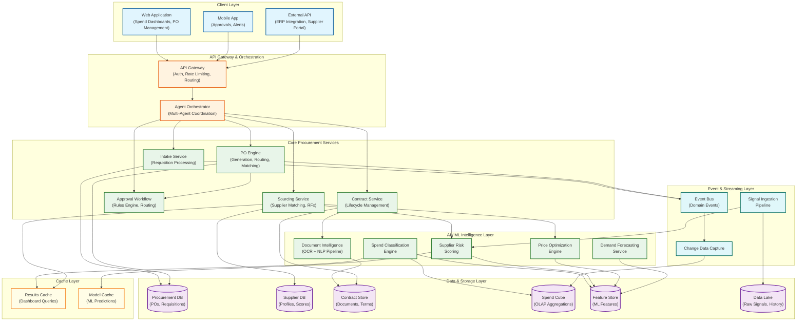
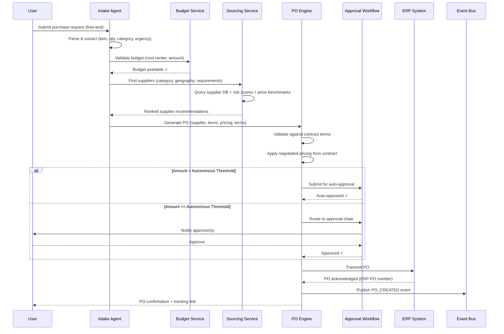
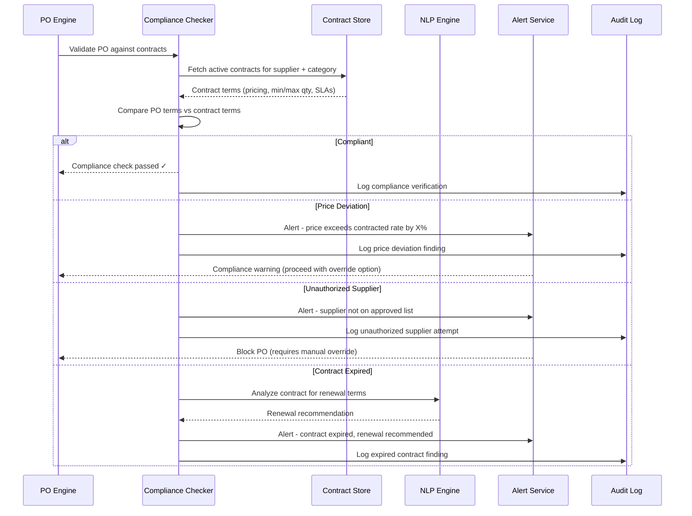

# AI-Native Procurement & Spend Intelligence --- High-Level Design

## 1. System Architecture



---

## 2. Data Flow Descriptions

### 2.1 Procurement Request Flow (Requisition → PO)

```
1. User submits purchase request (structured form or free-text via chat)
2. Intake Agent parses request → extracts item, quantity, urgency, category
3. Budget Service validates available budget for cost center
4. Sourcing Service queries Supplier DB for matching suppliers
   - Supplier Risk Scoring provides risk-adjusted rankings
   - Price Optimization suggests target pricing based on benchmarks
5. For routine purchases (below autonomous threshold):
   - PO Engine generates PO automatically
   - Approval Workflow routes for rubber-stamp confirmation
6. For strategic purchases (above threshold):
   - Approval Workflow routes through configurable approval chain
   - Parallel notifications to all required approvers
7. Approved PO sent to ERP via integration adapter
8. PO events published to Event Bus → Spend Classification picks up
9. Audit trail written to immutable log
```

### 2.2 Spend Analysis Pipeline

```
1. Transaction data ingested from multiple sources:
   - PO line items (real-time via CDC)
   - Invoices (batch via document intelligence pipeline)
   - P-Card transactions (daily feed)
   - Expense reports (daily feed)
2. Document Intelligence Pipeline processes unstructured data:
   - OCR extracts text from scanned invoices
   - NLP identifies line items, amounts, vendor, dates
   - Entity resolution maps vendor names to canonical supplier IDs
3. Spend Classification Engine:
   - Feature extraction: text embeddings, vendor features, amount patterns
   - Multi-level classification: L1 (direct/indirect) → L2 (category) → L3 (subcategory) → L4 (item type)
   - Confidence scoring: high-confidence auto-classified; low-confidence queued for human review
4. Classified transactions loaded into Spend Cube (OLAP)
5. Anomaly Detection runs over classified spend:
   - Duplicate payment detection (fuzzy matching on amount, vendor, date)
   - Price spike detection (statistical deviation from moving average)
   - Maverick spend detection (off-contract purchases)
6. Analytics dashboards refresh from Spend Cube
7. Insights pushed to recommendation engine for sourcing optimization
```

### 2.3 Supplier Risk Assessment Pipeline

```
1. Signal Ingestion Pipeline collects multi-source data:
   - Financial feeds: quarterly filings, credit score changes
   - News feeds: NLP sentiment analysis over 100K+ news sources
   - Geopolitical indices: country risk scores, sanctions lists
   - ESG data: environmental, social, governance ratings
   - Operational data: delivery performance, quality incidents
   - Regulatory: compliance certifications, audit results
2. Feature Store maintains point-in-time correct features per supplier
3. Risk Scoring Models:
   - Financial risk: gradient-boosted model on financial ratios
   - Operational risk: time-series model on delivery/quality trends
   - Reputational risk: NLP sentiment aggregation
   - Geopolitical risk: rule-based + ML on country/region features
   - Concentration risk: graph analysis on supply network topology
4. Ensemble model combines dimension scores into composite risk score
5. Risk scores cached in Model Cache for low-latency serving
6. Alerting system:
   - Threshold-based: score crosses critical threshold → immediate alert
   - Trend-based: score declining for 3+ consecutive periods → early warning
   - Event-based: specific trigger events (sanctions, bankruptcy filing) → urgent alert
7. Risk scores fed back into Sourcing Service for risk-adjusted recommendations
```

---

## 3. Sequence Diagrams

### 3.1 Autonomous PO Generation



### 3.2 Contract Compliance Check



---

## 4. Key Architectural Decisions

### Decision 1: Event-Driven vs. Request-Response for Inter-Service Communication

| Option | Pros | Cons |
|--------|------|------|
| **Synchronous (request-response)** | Simple mental model; immediate consistency; easier debugging | Tight coupling; cascading failures; harder to scale independently |
| **Asynchronous (event-driven)** ✅ | Loose coupling; independent scaling; natural audit trail; replay capability | Eventual consistency; complex debugging; message ordering challenges |
| **Hybrid** ✅ (chosen) | Best of both: sync for user-facing latency-sensitive paths; async for analytics, risk scoring, and ML pipelines | Two communication patterns to maintain; team must understand when to use which |

**Decision**: Hybrid approach. PO creation and approval workflows use synchronous request-response for immediate user feedback. Spend classification, risk scoring, and analytics use event-driven async processing. The Event Bus serves as the system of record for all domain events, enabling replay and audit.

### Decision 2: Shared vs. Separate ML Platform

| Option | Pros | Cons |
|--------|------|------|
| **Embedded ML per service** | Simple deployment; each team owns their model lifecycle | Duplicated infrastructure; inconsistent model management; no shared feature store |
| **Centralized ML Platform** ✅ | Shared feature store; consistent model lifecycle; efficient GPU utilization; unified monitoring | Single team bottleneck; more complex deployment; cross-team coordination |

**Decision**: Centralized ML Platform with a shared Feature Store. All ML models (spend classification, risk scoring, price optimization, demand forecasting) share the same feature computation infrastructure. Individual service teams own their model logic but deploy through the shared platform, ensuring consistent versioning, A/B testing, and monitoring.

### Decision 3: Tenant Data Isolation Strategy

| Option | Pros | Cons |
|--------|------|------|
| **Separate databases per tenant** | Strongest isolation; simple compliance; independent scaling | Operational overhead; expensive at scale; complex cross-tenant analytics |
| **Shared database, schema per tenant** | Good isolation; moderate overhead; per-schema migrations | Schema explosion at 1000+ tenants; complex connection pooling |
| **Shared database, row-level isolation** ✅ | Efficient infrastructure; easy cross-tenant operations (with consent); simple ops | Requires rigorous tenant filtering; risk of data leakage; complex access control |

**Decision**: Row-level tenant isolation with mandatory tenant context propagation. Every query includes a tenant filter enforced at the data access layer (not application logic). The ML platform uses a federated learning approach: a global model is trained on anonymized, aggregated data; tenant-specific models are fine-tuned on each tenant's data and never leave the tenant boundary.

### Decision 4: Document Intelligence Pipeline Architecture

| Option | Pros | Cons |
|--------|------|------|
| **Synchronous processing** | Immediate results; simple flow | Blocks user; GPU resources tied up during upload |
| **Asynchronous queue-based** ✅ | Non-blocking; GPU pool management; retry on failure; priority queuing | User must poll or subscribe for results; more complex UX |

**Decision**: Asynchronous queue-based pipeline. Document uploads go to object storage, a message is published to the processing queue, GPU workers pull documents for OCR + NLP, extracted data is written to the Contract Store / Spend Classification pipeline, and the user is notified via webhook/push notification. Priority queuing ensures urgent contracts (upcoming renewals) are processed before routine invoices.

---

## 5. Architecture Pattern Checklist

| Pattern | Applied? | How |
|---------|----------|-----|
| **Microservices** | ✅ | Domain-driven decomposition: Intake, Sourcing, Contracting, PO, Spend Analytics, Risk Intelligence as independent services |
| **Event Sourcing** | ✅ | PO lifecycle events (created, approved, dispatched, received, invoiced) stored as immutable event stream; enables audit and replay |
| **CQRS** | ✅ | Write path (PO creation, approvals) separated from read path (spend dashboards, analytics queries); different data models optimized for each |
| **Saga Pattern** | ✅ | Procurement workflow (budget reservation → PO creation → ERP sync → budget commitment) as a saga with compensating transactions |
| **API Gateway** | ✅ | Centralized authentication, rate limiting, request routing; tenant context injection |
| **Circuit Breaker** | ✅ | ERP integration calls protected by circuit breakers; PO creation degrades gracefully when ERP is unavailable (queued for retry) |
| **Sidecar / Service Mesh** | ✅ | mTLS between services; distributed tracing propagation; per-service rate limiting |
| **Strangler Fig** | ✅ | Migration path for customers transitioning from legacy procurement systems; gradual feature cutover |
| **Feature Store** | ✅ | Centralized ML feature computation and serving; point-in-time correctness for training; low-latency serving for inference |
| **Lambda Architecture** | Partial | Batch layer for ML model training and spend cube refresh; speed layer for real-time risk alerts; serving layer for dashboards |
| **Bulkhead** | ✅ | ML inference, document processing, and transactional workloads isolated into separate resource pools to prevent noisy-neighbor effects |
| **Outbox Pattern** | ✅ | Transactional outbox ensures domain events are published exactly once, even if the message broker is temporarily unavailable |
| **Retry with Backoff** | ✅ | External integrations (ERP sync, supplier data feeds, payment systems) use exponential backoff with jitter |
| **Data Mesh** | Partial | Each domain service owns its data products (spend data, supplier data, contract data); cross-domain queries via published data contracts |

---

## 6. Component Interaction Map

### Service Dependencies

```
Intake Service
  ├── reads → Supplier DB (supplier lookup)
  ├── calls → Budget Service (validation)
  ├── calls → Sourcing Service (supplier matching)
  ├── publishes → Event Bus (REQUISITION_CREATED)
  └── writes → Procurement DB (requisition records)

Sourcing Service
  ├── reads → Supplier DB (profiles, scores)
  ├── reads → Feature Store (risk features, price features)
  ├── calls → Supplier Risk Scoring (risk scores)
  ├── calls → Price Optimization (benchmark pricing)
  └── publishes → Event Bus (SOURCING_COMPLETED)

PO Engine
  ├── reads → Contract Store (pricing terms)
  ├── calls → Approval Workflow (routing)
  ├── calls → Budget Service (commitment)
  ├── calls → Compliance Checker (validation)
  ├── writes → Procurement DB (PO records)
  ├── calls → ERP System (PO transmission)
  └── publishes → Event Bus (PO_CREATED, PO_APPROVED, PO_DISPATCHED)

Spend Classification Engine
  ├── subscribes → Event Bus (PO_CREATED, INVOICE_PROCESSED)
  ├── reads → Feature Store (text embeddings, vendor features)
  ├── writes → Spend Cube (classified transactions)
  └── publishes → Event Bus (SPEND_CLASSIFIED, ANOMALY_DETECTED)

Supplier Risk Scoring
  ├── subscribes → Signal Ingestion Pipeline (risk signals)
  ├── reads/writes → Feature Store (risk features)
  ├── writes → Supplier DB (updated scores)
  └── publishes → Event Bus (RISK_SCORE_UPDATED, RISK_ALERT)

Document Intelligence Pipeline
  ├── reads → Object Storage (uploaded documents)
  ├── runs → OCR + NLP models (GPU workers)
  ├── writes → Contract Store (extracted terms)
  └── publishes → Event Bus (DOCUMENT_PROCESSED)
```

### Cross-Cutting Concerns

| Concern | Implementation |
|---------|---------------|
| **Authentication** | OAuth 2.0 + OIDC at API Gateway; JWT propagation to services |
| **Authorization** | RBAC + ABAC hybrid; tenant-scoped roles; fine-grained permissions per procurement action |
| **Audit Logging** | Every state change published as immutable event; centralized audit store with 10-year retention |
| **Rate Limiting** | Per-tenant, per-endpoint rate limits at API Gateway; ML inference rate limits to protect GPU resources |
| **Encryption** | TLS in transit; field-level encryption at rest for PII (supplier banking details, contact information) |
| **Observability** | Distributed tracing (all requests get trace IDs); structured logging; ML-specific metrics (model latency, prediction confidence distribution) |
