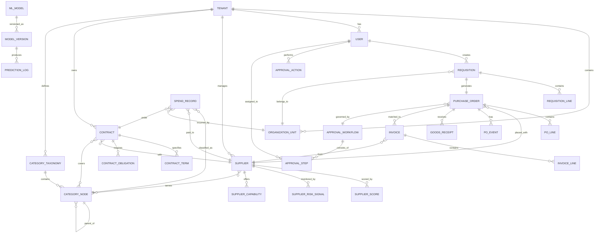

# AI-Native Procurement & Spend Intelligence --- Low-Level Design

## 1. Data Model

### 1.1 Entity-Relationship Diagram



### 1.2 Core Entity Schemas

#### Supplier

```
SUPPLIER:
  id                  : UUID (PK)
  tenant_id           : UUID (FK → TENANT, partition key)
  canonical_name      : VARCHAR(500)        -- normalized name
  legal_name          : VARCHAR(500)
  tax_id              : VARCHAR(50)         -- encrypted at rest
  country_code        : CHAR(2)
  region              : VARCHAR(100)
  status              : ENUM(active, suspended, blocked, pending_onboarding)
  diversity_certs     : JSONB               -- [{type, certifying_body, expiry}]
  banking_details     : ENCRYPTED_BLOB      -- field-level encryption
  onboarded_at        : TIMESTAMP
  last_risk_score     : DECIMAL(5,2)        -- cached composite score
  last_risk_updated   : TIMESTAMP
  embedding_vector    : VECTOR(768)         -- capability embedding for similarity search
  metadata            : JSONB
  created_at          : TIMESTAMP
  updated_at          : TIMESTAMP
  version             : BIGINT              -- optimistic locking
```

#### Purchase Order

```
PURCHASE_ORDER:
  id                  : UUID (PK)
  tenant_id           : UUID (FK, partition key)
  po_number           : VARCHAR(50)         -- tenant-scoped sequential
  requisition_id      : UUID (FK)
  supplier_id         : UUID (FK)
  contract_id         : UUID (FK, nullable)
  status              : ENUM(draft, pending_approval, approved, dispatched,
                             partially_received, received, invoiced, closed, cancelled)
  currency            : CHAR(3)
  total_amount        : DECIMAL(15,2)
  tax_amount          : DECIMAL(15,2)
  org_unit_id         : UUID (FK)
  cost_center         : VARCHAR(50)
  budget_id           : UUID (FK)
  approval_workflow_id: UUID (FK)
  is_autonomous       : BOOLEAN             -- true if AI-generated without human
  autonomous_reason   : TEXT                 -- explanation for autonomous decision
  erp_po_number       : VARCHAR(50)         -- ERP-assigned PO number
  erp_sync_status     : ENUM(pending, synced, failed, retry)
  created_by          : UUID (FK → USER)
  approved_by         : UUID (FK → USER, nullable)
  created_at          : TIMESTAMP
  updated_at          : TIMESTAMP
  version             : BIGINT
```

#### Spend Record

```
SPEND_RECORD:
  id                  : UUID (PK)
  tenant_id           : UUID (partition key)
  source_type         : ENUM(po, invoice, pcard, expense)
  source_id           : UUID               -- FK to source entity
  supplier_id         : UUID (FK)
  amount              : DECIMAL(15,2)
  currency            : CHAR(3)
  amount_usd          : DECIMAL(15,2)      -- normalized to USD
  transaction_date    : DATE
  category_l1         : VARCHAR(100)
  category_l2         : VARCHAR(100)
  category_l3         : VARCHAR(100)
  category_l4         : VARCHAR(100)
  category_code       : VARCHAR(20)        -- UNSPSC or custom code
  classification_confidence : DECIMAL(3,2) -- 0.00 to 1.00
  classification_source : ENUM(ml_auto, ml_human_corrected, manual, rule_based)
  org_unit_id         : UUID (FK)
  cost_center         : VARCHAR(50)
  contract_id         : UUID (FK, nullable)
  is_maverick         : BOOLEAN            -- off-contract flag
  anomaly_flags       : JSONB              -- [{type, severity, details}]
  created_at          : TIMESTAMP
  fiscal_year         : SMALLINT
  fiscal_quarter      : SMALLINT
```

#### Supplier Risk Signal

```
SUPPLIER_RISK_SIGNAL:
  id                  : UUID (PK)
  tenant_id           : UUID (partition key)
  supplier_id         : UUID (FK)
  signal_type         : ENUM(financial, news_sentiment, geopolitical,
                             esg, delivery, quality, regulatory, sanctions)
  signal_source       : VARCHAR(200)       -- data provider identifier
  raw_value           : JSONB              -- source-specific payload
  normalized_score    : DECIMAL(5,2)       -- 0-100 normalized
  severity            : ENUM(info, low, medium, high, critical)
  detected_at         : TIMESTAMP
  valid_from          : TIMESTAMP          -- point-in-time validity
  valid_to            : TIMESTAMP
  processed           : BOOLEAN
  feature_vector      : VECTOR(256)        -- for ML feature store
```

#### Contract Term

```
CONTRACT_TERM:
  id                  : UUID (PK)
  contract_id         : UUID (FK)
  tenant_id           : UUID (partition key)
  term_type           : ENUM(pricing, volume_commitment, sla, payment_terms,
                             liability, termination, renewal, exclusivity)
  clause_text         : TEXT               -- extracted clause text
  structured_value    : JSONB              -- parsed structured representation
  confidence          : DECIMAL(3,2)       -- NLP extraction confidence
  section_reference   : VARCHAR(50)        -- e.g., "Section 4.2.1"
  start_date          : DATE
  end_date            : DATE
  is_active           : BOOLEAN
  extracted_by        : VARCHAR(50)        -- model version that extracted this
```

---

## 2. Indexing Strategy

### Primary Indexes

| Table | Index | Type | Purpose |
|-------|-------|------|---------|
| `PURCHASE_ORDER` | `(tenant_id, po_number)` | Unique B-tree | PO lookup by number |
| `PURCHASE_ORDER` | `(tenant_id, status, created_at)` | Composite B-tree | Dashboard queries: open POs by date |
| `PURCHASE_ORDER` | `(tenant_id, supplier_id, created_at)` | Composite B-tree | Supplier spend history |
| `SPEND_RECORD` | `(tenant_id, fiscal_year, fiscal_quarter)` | Composite B-tree | Quarterly spend analysis |
| `SPEND_RECORD` | `(tenant_id, category_l1, category_l2)` | Composite B-tree | Category drill-down |
| `SPEND_RECORD` | `(tenant_id, supplier_id, transaction_date)` | Composite B-tree | Supplier spend trending |
| `SUPPLIER` | `(tenant_id, status)` | Filtered B-tree | Active supplier queries |
| `SUPPLIER` | `(embedding_vector)` | HNSW / IVFFlat | Vector similarity search for supplier matching |
| `SUPPLIER_RISK_SIGNAL` | `(supplier_id, signal_type, detected_at)` | Composite B-tree | Risk signal timeline |
| `CONTRACT_TERM` | `(contract_id, term_type, is_active)` | Composite B-tree | Active term lookup |

### Materialized Views / Pre-Aggregations

| View | Grain | Refresh Frequency |
|------|-------|-------------------|
| `spend_by_category_monthly` | tenant × category_l2 × month | Every 15 min |
| `spend_by_supplier_quarterly` | tenant × supplier × quarter | Every 15 min |
| `supplier_risk_current` | tenant × supplier | On risk score update |
| `budget_utilization` | tenant × cost_center × fiscal_period | Real-time (trigger-based) |
| `approval_cycle_metrics` | tenant × workflow × week | Hourly |

---

## 3. Partitioning & Sharding

### Partitioning Strategy

| Table | Partition Key | Partition Type | Rationale |
|-------|--------------|----------------|-----------|
| `PURCHASE_ORDER` | `tenant_id` + range on `created_at` | Hash (tenant) + Range (time) | Tenant isolation + time-based archival |
| `SPEND_RECORD` | `tenant_id` + range on `fiscal_year` | Hash (tenant) + Range (time) | Most queries are tenant-scoped and time-bounded |
| `SUPPLIER_RISK_SIGNAL` | `supplier_id` + range on `detected_at` | Hash (supplier) + Range (time) | Risk queries are supplier-centric and time-ordered |
| `PO_EVENT` | `tenant_id` + range on `event_time` | Hash (tenant) + Range (time) | Event sourcing with time-based retention |
| `PREDICTION_LOG` | `model_id` + range on `predicted_at` | Hash (model) + Range (time) | Model-specific analysis with time-based pruning |

### Sharding Strategy

```
Shard Key Selection:
  - Primary: tenant_id (ensures all tenant data co-located)
  - Hot tenant mitigation: large tenants get dedicated shards
  - Cross-tenant queries (ML training): run on read replicas with tenant consent

Shard Topology:
  - Spend Cube: 16 shards, hash(tenant_id) mod 16
  - Supplier DB: 8 shards, hash(tenant_id) mod 8
  - Procurement DB: 8 shards, hash(tenant_id) mod 8
  - Feature Store: range-sharded by feature_group + entity_id

Rebalancing:
  - Monitor shard size and query distribution
  - Split hot shards when they exceed 500 GB or 10K QPS
  - Use consistent hashing for minimal data movement during rebalancing
```

---

## 4. API Design

### 4.1 Purchase Order APIs

```
POST   /api/v1/purchase-orders
  Body: { requisition_id, supplier_id, lines: [{item, qty, unit_price}], notes }
  Response: { po_id, po_number, status, approval_workflow_id }
  Side effects: Budget reservation, approval workflow initiation

GET    /api/v1/purchase-orders/{po_id}
  Response: Full PO with lines, approval status, matching status, audit trail

GET    /api/v1/purchase-orders
  Query: ?status=pending_approval&supplier_id=...&date_from=...&date_to=...&page=1&size=50
  Response: Paginated list with summary fields

PATCH  /api/v1/purchase-orders/{po_id}
  Body: { action: "approve" | "reject" | "cancel", comment }
  Side effects: State transition, ERP sync trigger, budget release (on cancel)

GET    /api/v1/purchase-orders/{po_id}/events
  Response: Event sourcing timeline [{event_type, timestamp, actor, data}]
```

### 4.2 Supplier APIs

```
GET    /api/v1/suppliers/search
  Query: ?q=office+supplies&category=...&country=...&min_score=70&risk_max=30&page=1&size=20
  Response: Ranked suppliers with scores, risk indicators, and match relevance

GET    /api/v1/suppliers/{supplier_id}
  Response: Full profile with scores, risk signals, contracts, spend history

GET    /api/v1/suppliers/{supplier_id}/risk
  Response: { composite_score, dimensions: {financial, operational, reputational, geopolitical, esg}, signals: [...], trend }

POST   /api/v1/suppliers/{supplier_id}/risk/simulate
  Body: { scenario: "supplier_bankruptcy" | "region_disruption" | "price_shock", parameters }
  Response: { impact_assessment, affected_pos, alternative_suppliers, mitigation_steps }

POST   /api/v1/suppliers/discover
  Body: { need_description, category, geography, diversity_requirements }
  Response: AI-recommended suppliers with match explanation
```

### 4.3 Spend Analytics APIs

```
POST   /api/v1/spend/query
  Body: {
    dimensions: ["category_l2", "supplier", "quarter"],
    measures: ["total_amount", "transaction_count", "avg_unit_price"],
    filters: { fiscal_year: 2026, org_unit: "engineering" },
    sort: { total_amount: "desc" },
    limit: 100
  }
  Response: { data: [...], metadata: { total_spend, record_count, query_time_ms } }

GET    /api/v1/spend/anomalies
  Query: ?severity=high&type=duplicate_payment&date_from=...&status=open
  Response: Paginated anomalies with evidence and recommended actions

GET    /api/v1/spend/savings
  Query: ?fiscal_year=2026&category=...
  Response: { projected_savings, realized_savings, savings_by_initiative: [...] }

POST   /api/v1/spend/classify
  Body: { transactions: [{ description, amount, vendor_name, date }] }
  Response: { classifications: [{ category_code, category_path, confidence }] }
```

### 4.4 Contract APIs

```
POST   /api/v1/contracts/ingest
  Body: multipart/form-data with PDF/document file
  Response: { contract_id, processing_status: "queued", estimated_completion }
  Async: Document intelligence pipeline processes and extracts terms

GET    /api/v1/contracts/{contract_id}/terms
  Response: { terms: [{ type, clause_text, structured_value, confidence }] }

GET    /api/v1/contracts/{contract_id}/compliance
  Response: { obligations: [{ description, status, due_date, evidence }], violations: [...] }

GET    /api/v1/contracts/expiring
  Query: ?within_days=90&category=...
  Response: Contracts approaching expiration with renewal recommendations
```

### 4.5 Approval Workflow APIs

```
GET    /api/v1/approvals/pending
  Query: ?assignee=me&type=po&urgency=high
  Response: Pending approvals with full context for decision-making

POST   /api/v1/approvals/{approval_id}/decide
  Body: { decision: "approve" | "reject" | "delegate", comment, delegate_to }
  Response: Updated approval status, next step in workflow

GET    /api/v1/approvals/analytics
  Query: ?period=last_30_days
  Response: { avg_cycle_time, bottleneck_steps, rejection_rate, sla_compliance }
```

### 4.6 gRPC Internal APIs

```
service SpendClassification {
  rpc ClassifyBatch(ClassifyRequest) returns (ClassifyResponse);
  rpc GetModelMetrics(ModelMetricsRequest) returns (ModelMetricsResponse);
  rpc SubmitCorrection(CorrectionRequest) returns (CorrectionResponse);
}

service SupplierRiskScoring {
  rpc GetRiskScore(RiskScoreRequest) returns (RiskScoreResponse);
  rpc IngestSignal(SignalRequest) returns (SignalResponse);
  rpc SimulateScenario(ScenarioRequest) returns (ScenarioResponse);
}

service PriceOptimization {
  rpc GetBenchmarkPrice(BenchmarkRequest) returns (BenchmarkResponse);
  rpc GetNegotiationRange(NegotiationRequest) returns (NegotiationResponse);
  rpc RunShouldCostModel(ShouldCostRequest) returns (ShouldCostResponse);
}
```

---

## 5. Core Algorithms

### 5.1 Spend Classification (Multi-Level Taxonomy)

```
FUNCTION ClassifySpendTransaction(transaction):
    // Stage 1: Feature Extraction
    text_features = ExtractTextFeatures(transaction.description)
    vendor_features = LookupVendorFeatures(transaction.vendor_name)
    amount_features = ComputeAmountFeatures(transaction.amount, transaction.currency)
    temporal_features = ComputeTemporalFeatures(transaction.date)

    // Stage 2: Text Embedding
    text_embedding = TextEmbeddingModel.Encode(text_features)  // 768-dim vector

    // Stage 3: Vendor Resolution
    canonical_vendor = VendorResolver.Resolve(transaction.vendor_name)
    IF canonical_vendor.found:
        vendor_embedding = canonical_vendor.capability_embedding
        vendor_history = GetVendorCategoryHistory(canonical_vendor.id)
    ELSE:
        vendor_embedding = ZeroVector(768)
        vendor_history = empty

    // Stage 4: Hierarchical Classification
    combined_features = Concatenate(text_embedding, vendor_embedding,
                                     amount_features, temporal_features)

    // L1 Classification (Direct vs Indirect vs Services)
    l1_probs = L1Classifier.Predict(combined_features)
    l1_category = ArgMax(l1_probs)
    l1_confidence = Max(l1_probs)

    // L2 Classification (conditioned on L1)
    l2_input = Concatenate(combined_features, OneHotEncode(l1_category))
    l2_probs = L2Classifiers[l1_category].Predict(l2_input)
    l2_category = ArgMax(l2_probs)
    l2_confidence = Max(l2_probs)

    // L3 & L4 Classification (conditioned on L1+L2)
    l3_input = Concatenate(combined_features, OneHotEncode(l1_category),
                           OneHotEncode(l2_category))
    l3_probs = L3Classifiers[l2_category].Predict(l3_input)
    l3_category = ArgMax(l3_probs)
    l3_confidence = Max(l3_probs)

    l4_probs = L4Classifiers[l3_category].Predict(l3_input)
    l4_category = ArgMax(l4_probs)
    l4_confidence = Max(l4_probs)

    // Stage 5: Confidence Calibration
    overall_confidence = GeometricMean(l1_confidence, l2_confidence,
                                        l3_confidence, l4_confidence)

    // Stage 6: Vendor History Prior (Bayesian adjustment)
    IF vendor_history is not empty:
        historical_distribution = ComputeCategoryDistribution(vendor_history)
        adjusted_confidence = BayesianUpdate(overall_confidence,
                                              historical_distribution,
                                              l3_category)
    ELSE:
        adjusted_confidence = overall_confidence

    // Stage 7: Route based on confidence
    IF adjusted_confidence >= HIGH_CONFIDENCE_THRESHOLD (0.90):
        RETURN Classification(l1, l2, l3, l4, adjusted_confidence, "auto")
    ELSE IF adjusted_confidence >= LOW_CONFIDENCE_THRESHOLD (0.60):
        QueueForHumanReview(transaction, l1, l2, l3, l4, adjusted_confidence)
        RETURN Classification(l1, l2, l3, l4, adjusted_confidence, "pending_review")
    ELSE:
        QueueForManualClassification(transaction)
        RETURN Classification(null, null, null, null, adjusted_confidence, "manual_required")

// Time Complexity: O(d) where d = embedding dimension (dominated by model inference)
// Space Complexity: O(d + h) where h = vendor history size
```

### 5.2 Supplier Risk Scoring (Ensemble Model)

```
FUNCTION ComputeSupplierRiskScore(supplier_id):
    // Gather features from Feature Store (point-in-time correct)
    features = FeatureStore.GetLatest(supplier_id)

    // Dimension 1: Financial Risk
    financial_features = features.Select([
        "current_ratio", "debt_to_equity", "revenue_growth_yoy",
        "profit_margin", "cash_flow_trend", "credit_rating_numeric",
        "days_payable_outstanding", "altman_z_score"
    ])
    financial_risk = FinancialRiskModel.Predict(financial_features)  // 0-100

    // Dimension 2: Operational Risk
    operational_features = features.Select([
        "on_time_delivery_rate_90d", "quality_rejection_rate_90d",
        "avg_lead_time_deviation", "order_fill_rate",
        "responsiveness_score", "capacity_utilization"
    ])
    operational_risk = OperationalRiskModel.Predict(operational_features)  // 0-100

    // Dimension 3: Reputational Risk (NLP-based)
    recent_news = NewsFeatureStore.GetRecent(supplier_id, days=30)
    IF recent_news is not empty:
        sentiment_scores = [NLPSentimentModel.Score(article) FOR article IN recent_news]
        negative_ratio = Count(s < -0.3 FOR s IN sentiment_scores) / Len(sentiment_scores)
        avg_sentiment = Mean(sentiment_scores)
        reputational_risk = MapToRiskScore(negative_ratio, avg_sentiment)
    ELSE:
        reputational_risk = 50  // neutral default

    // Dimension 4: Geopolitical Risk
    country_risk = GeopoliticalIndex.GetScore(supplier.country_code)
    region_risk = GeopoliticalIndex.GetScore(supplier.region)
    sanctions_check = SanctionsList.Check(supplier.legal_name, supplier.tax_id)
    IF sanctions_check.matched:
        geopolitical_risk = 100  // immediate maximum risk
    ELSE:
        geopolitical_risk = WeightedAverage(country_risk * 0.6, region_risk * 0.4)

    // Dimension 5: ESG Risk
    esg_features = features.Select([
        "environmental_score", "social_score", "governance_score",
        "carbon_intensity", "labor_violation_count"
    ])
    esg_risk = ESGRiskModel.Predict(esg_features)  // 0-100

    // Dimension 6: Concentration Risk (Graph-based)
    dependency_graph = SupplierGraph.GetSubTierDependencies(supplier_id, depth=3)
    single_source_count = CountSingleSourceNodes(dependency_graph)
    geographic_concentration = ComputeGeographicHHI(dependency_graph)
    concentration_risk = ConcentrationModel.Score(single_source_count,
                                                   geographic_concentration,
                                                   dependency_graph.depth)

    // Ensemble: Weighted combination with learned weights
    dimension_scores = [financial_risk, operational_risk, reputational_risk,
                        geopolitical_risk, esg_risk, concentration_risk]
    dimension_weights = EnsembleWeightModel.GetWeights(supplier.category)
    // Weights are category-specific: manufacturing suppliers weight operational higher;
    // services suppliers weight reputational higher

    composite_score = WeightedSum(dimension_scores, dimension_weights)

    // Apply temporal smoothing to prevent score oscillation
    previous_score = FeatureStore.GetPrevious(supplier_id, "composite_risk_score")
    IF previous_score is not null:
        smoothed_score = EWMA(previous_score, composite_score, alpha=0.3)
    ELSE:
        smoothed_score = composite_score

    // Store and alert
    FeatureStore.Update(supplier_id, "composite_risk_score", smoothed_score)

    IF smoothed_score > CRITICAL_THRESHOLD (80):
        AlertService.SendUrgent(supplier_id, smoothed_score, dimension_scores)
    ELSE IF smoothed_score > WARNING_THRESHOLD (60):
        AlertService.SendWarning(supplier_id, smoothed_score, dimension_scores)

    IF TrendIsDecreasing(supplier_id, periods=3):
        AlertService.SendTrendAlert(supplier_id, "deteriorating", dimension_scores)

    RETURN RiskScore(composite=smoothed_score, dimensions=dimension_scores,
                     weights=dimension_weights, updated_at=Now())

// Time Complexity: O(n_features + n_news + G) where G = graph traversal cost
// Space Complexity: O(n_features + G_nodes)
```

### 5.3 Price Optimization (Should-Cost Model)

```
FUNCTION ComputeShouldCostPrice(item_category, specifications, geography, volume):
    // Step 1: Retrieve market indices
    raw_material_indices = MarketDataService.GetIndices(
        item_category.raw_materials, geography, date=Today()
    )
    labor_cost_index = LaborCostService.GetIndex(geography, item_category.skill_level)
    energy_cost_index = EnergyCostService.GetIndex(geography)

    // Step 2: Build cost structure from historical PO data
    historical_pos = SpendCube.Query(
        category=item_category,
        geography=geography,
        date_range=Last24Months(),
        min_volume=volume * 0.5,
        max_volume=volume * 2.0
    )

    IF Len(historical_pos) < MIN_DATA_POINTS (30):
        // Insufficient data: fall back to industry benchmark
        benchmark = IndustryBenchmarkService.GetPrice(item_category, geography)
        RETURN PriceEstimate(
            target_price=benchmark.median,
            floor_price=benchmark.p25,
            ceiling_price=benchmark.p75,
            confidence="low",
            method="benchmark_fallback"
        )

    // Step 3: Decompose historical prices into cost components
    cost_decomposition = CostDecompositionModel.Predict(
        historical_prices=historical_pos.prices,
        material_indices=raw_material_indices,
        labor_index=labor_cost_index,
        energy_index=energy_cost_index,
        volumes=historical_pos.volumes
    )
    // Output: { material_pct, labor_pct, energy_pct, overhead_pct, margin_pct }

    // Step 4: Project current fair price
    base_cost = (
        cost_decomposition.material_pct * raw_material_indices.current +
        cost_decomposition.labor_pct * labor_cost_index.current +
        cost_decomposition.energy_pct * energy_cost_index.current +
        cost_decomposition.overhead_pct * historical_pos.avg_price
    )

    // Step 5: Volume discount curve
    volume_discount = VolumeDiscountModel.Predict(item_category, volume)
    // Fitted log curve: discount = a * ln(volume) + b

    adjusted_cost = base_cost * (1 - volume_discount)

    // Step 6: Supplier margin estimation
    category_margins = MarginBenchmarkService.GetMargins(item_category)
    fair_margin = category_margins.median

    target_price = adjusted_cost * (1 + fair_margin)
    floor_price = adjusted_cost * (1 + category_margins.p10)   // aggressive negotiation
    ceiling_price = adjusted_cost * (1 + category_margins.p90) // supplier-favorable

    // Step 7: Confidence scoring
    data_recency = DaysSince(Max(historical_pos.dates))
    data_volume_score = Min(Len(historical_pos) / 100, 1.0)
    market_volatility = ComputeVolatility(raw_material_indices, window=90)
    confidence = WeightedAverage(
        data_volume_score * 0.4,
        (1 - Normalize(data_recency, 0, 365)) * 0.3,
        (1 - Normalize(market_volatility, 0, 0.5)) * 0.3
    )

    RETURN PriceEstimate(
        target_price=Round(target_price, 2),
        floor_price=Round(floor_price, 2),
        ceiling_price=Round(ceiling_price, 2),
        cost_breakdown=cost_decomposition,
        volume_discount=volume_discount,
        confidence=ConfidenceBucket(confidence),  // high/medium/low
        method="should_cost_model"
    )

// Time Complexity: O(H * F) where H = historical data points, F = features
// Space Complexity: O(H + I) where I = number of market indices
```

### 5.4 Autonomous PO Decision Engine

```
FUNCTION ShouldAutonomouslyGeneratePO(requisition):
    // Rule Layer: Hard constraints (must pass all)
    rules_result = EvaluateRules(requisition)

    FUNCTION EvaluateRules(req):
        checks = []

        // Rule 1: Amount threshold
        checks.Append(req.amount <= GetAutonomousThreshold(req.category, req.org_unit))

        // Rule 2: Approved supplier
        checks.Append(IsApprovedSupplier(req.supplier_id, req.category))

        // Rule 3: Budget available
        budget = GetBudgetRemaining(req.cost_center, req.fiscal_period)
        checks.Append(req.amount <= budget * MAX_SINGLE_PO_BUDGET_PCT (0.10))

        // Rule 4: Contract exists and is active
        contract = GetActiveContract(req.supplier_id, req.category)
        checks.Append(contract is not null AND contract.is_active)

        // Rule 5: Price within contracted range
        IF contract is not null:
            contracted_price = GetContractedPrice(contract, req.items)
            checks.Append(req.unit_price <= contracted_price * PRICE_TOLERANCE (1.05))

        // Rule 6: No recent risk alerts for supplier
        risk_alerts = GetRecentAlerts(req.supplier_id, days=7)
        checks.Append(Len(risk_alerts.critical) == 0)

        // Rule 7: Category is eligible for automation
        checks.Append(IsCategoryAutomationEnabled(req.category))

        RETURN AllTrue(checks), checks

    IF NOT rules_result.all_passed:
        RETURN Decision(autonomous=false, reason="Rule violation",
                        failed_rules=rules_result.failed, route="manual_approval")

    // ML Layer: Confidence scoring
    features = ExtractDecisionFeatures(requisition)
    // Features: historical approval rate for similar POs, requester's approval history,
    //           supplier reliability score, price deviation from benchmark, urgency

    approval_probability = ApprovalPredictionModel.Predict(features)

    IF approval_probability >= AUTONOMOUS_CONFIDENCE (0.95):
        // Generate PO autonomously with audit trail
        RETURN Decision(
            autonomous=true,
            confidence=approval_probability,
            reason="All rules passed, high approval probability",
            route="auto_generate",
            audit={
                rules_checked=rules_result,
                model_version=ApprovalPredictionModel.version,
                features=features,
                prediction=approval_probability
            }
        )
    ELSE IF approval_probability >= FAST_TRACK_CONFIDENCE (0.80):
        // Fast-track: single approver instead of full chain
        RETURN Decision(
            autonomous=false,
            confidence=approval_probability,
            reason="High confidence but below autonomous threshold",
            route="fast_track_approval",
            approver=GetFastTrackApprover(requisition)
        )
    ELSE:
        RETURN Decision(
            autonomous=false,
            confidence=approval_probability,
            reason="Low confidence, requires full approval chain",
            route="full_approval_chain"
        )

// Time Complexity: O(R + F) where R = number of rules, F = feature extraction
// Space Complexity: O(F)
```

---

## 6. Complexity Analysis Summary

| Algorithm | Time Complexity | Space Complexity | Dominant Factor |
|-----------|----------------|-----------------|-----------------|
| Spend Classification | O(d) per transaction | O(d + h) | Model inference (d = embedding dim) |
| Supplier Risk Scoring | O(n + G) per supplier | O(n + G) | Graph traversal G for concentration risk |
| Should-Cost Pricing | O(H × F) per query | O(H + I) | Historical data scan H |
| Autonomous PO Decision | O(R + F) per requisition | O(F) | Rule evaluation R + feature extraction F |
| Anomaly Detection | O(N × log N) per batch | O(N) | Sorting and statistical tests over N records |
| Contract NLP Extraction | O(T × C) per document | O(T) | Token count T × clause patterns C |
| Vendor Name Resolution | O(V × log V) for index build; O(log V) per query | O(V) | Fuzzy matching against V vendor names |
| Spend Cube Aggregation | O(S × D) per query | O(S) | Scan S spend records across D dimensions |
