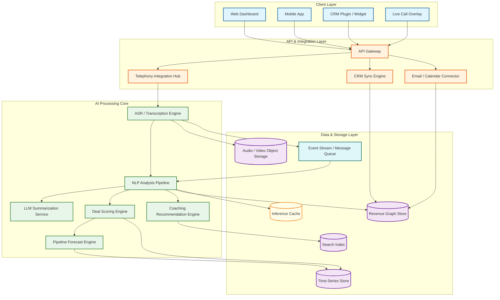
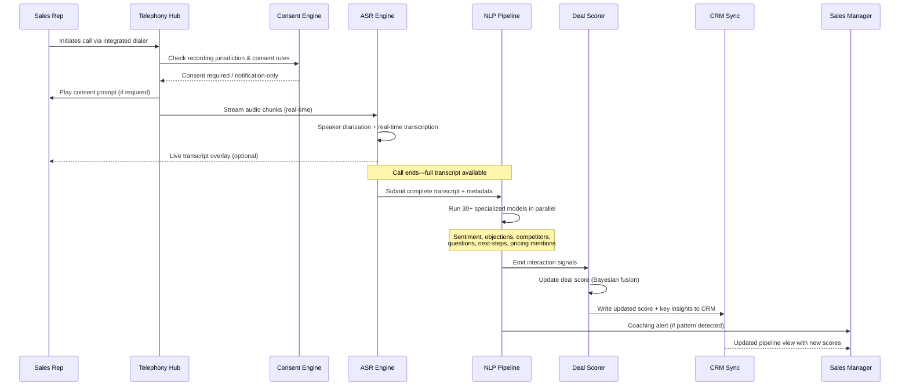

# AI-Native Revenue Intelligence Platform Design (Gong / Clari / Salesforce Einstein)

## System Overview

An AI-Native Revenue Intelligence Platform captures, transcribes, and analyzes every customer interaction---phone calls, video meetings, emails, and chat messages---to generate deal health scores, pipeline forecasts, rep coaching insights, and win/loss analyses that transform subjective sales intuition into data-driven revenue operations. Systems like Gong, Clari, Chorus (ZoomInfo), and Salesforce Einstein Revenue Intelligence build a "revenue graph" by stitching together multi-modal interaction data with CRM activity signals, then applying a layered AI architecture---large language models for conversation understanding, specialized small models for domain-specific tasks (sentiment detection, objection classification, competitor mention extraction), and time-series forecasting models for pipeline prediction---to deliver actionable intelligence at every level of the revenue organization, from individual rep coaching to board-level revenue forecasting. The core engineering challenge is building a system that ingests hundreds of thousands of concurrent audio/video streams, processes them through real-time ASR (automatic speech recognition) and NLP pipelines with sub-minute latency, maintains a continuously-updated probabilistic model of every deal in the pipeline, and surfaces contextual coaching recommendations---all while enforcing strict call-recording consent laws, data residency requirements, and enterprise-grade access controls across a multi-tenant architecture.

---

## Key Characteristics

| Characteristic | Description |
|---------------|-------------|
| **Read/Write Pattern** | Write-heavy during business hours (call ingestion, transcript processing, CRM sync); read-heavy for dashboards and coaching (deal reviews, pipeline views, rep scorecards); batch-heavy for model retraining and forecast generation |
| **Latency Sensitivity** | Multi-tier---real-time for live call coaching overlays (<2s); near-real-time for post-call insights (<5 min); batch-tolerant for pipeline forecasting (hourly) and model retraining (daily/weekly) |
| **Consistency Model** | Eventual consistency for interaction data (transcripts, analysis results propagate within minutes); strong consistency for deal scores and forecast snapshots (point-in-time accuracy for sales reviews); causal consistency for coaching feedback (must reference the correct conversation context) |
| **Data Volume** | Very High---thousands of hours of audio/video per day; millions of transcript segments; hundreds of millions of CRM activity signals; terabytes of raw audio with petabytes in long-term archival |
| **Architecture Model** | Event-driven streaming pipeline (call events → ASR → NLP → insight generation → CRM writeback); layered AI engine (LLM + specialized small models + forecasting models); revenue graph connecting interactions to deals to accounts to pipeline |
| **Regulatory Burden** | High---two-party consent laws for call recording (varies by jurisdiction), GDPR/CCPA for personal data in transcripts, SOC 2 Type II for enterprise SaaS, data residency requirements, PCI-DSS if payment discussions are captured |
| **Complexity Rating** | **Very High** |

---

## Quick Navigation

| Document | Description |
|----------|-------------|
| [01 - Requirements & Estimations](./01-requirements-and-estimations.md) | Functional/non-functional requirements, capacity planning, SLOs |
| [02 - High-Level Design](./02-high-level-design.md) | Architecture diagrams, data flow, key decisions |
| [03 - Low-Level Design](./03-low-level-design.md) | Data models, API design, algorithms (pseudocode) |
| [04 - Deep Dive & Bottlenecks](./04-deep-dive-and-bottlenecks.md) | Conversation processing pipeline, forecast engine, deal scoring deep dives |
| [05 - Scalability & Reliability](./05-scalability-and-reliability.md) | Audio/NLP processing scaling, fault tolerance, disaster recovery |
| [06 - Security & Compliance](./06-security-and-compliance.md) | Call recording consent, data privacy, threat model, compliance frameworks |
| [07 - Observability](./07-observability.md) | Metrics, logging, tracing, alerting for AI pipelines |
| [08 - Interview Guide](./08-interview-guide.md) | 45-min pacing, trade-offs, trap questions, scoring rubric |
| [09 - Insights](./09-insights.md) | Key architectural insights, patterns, lessons |

---

## What Differentiates This from Related Systems

| Aspect | Revenue Intelligence (This) | CRM System | Business Intelligence Platform | Sales Engagement Platform | Contact Center |
|--------|---------------------------|------------|-------------------------------|--------------------------|----------------|
| **Core Function** | AI-driven analysis of customer interactions to predict revenue outcomes and coach sellers | Record of customer/deal data entered manually or via integrations | Interactive data exploration and visualization via dashboards | Orchestrated outbound sequences (email cadences, call tasks) | Inbound/outbound customer support with routing and queue management |
| **Data Source** | Raw audio/video recordings, transcripts, emails, CRM signals---captured automatically | Manual entry, form submissions, and integration syncs | Structured data from warehouses and databases | Engagement metrics (opens, clicks, replies) from outbound sequences | Call recordings and tickets for quality assurance |
| **AI Role** | Central---conversation understanding, deal scoring, pipeline prediction, coaching generation | Supplementary---lead scoring, next-best-action suggestions | Supplementary---NLQ (natural language query), anomaly detection | Peripheral---send-time optimization, template suggestions | Moderate---intent routing, sentiment detection, agent assist |
| **Output** | Deal risk alerts, pipeline forecasts, coaching recommendations, win/loss analyses, talk-track adherence scores | Contact records, opportunity stages, activity logs | Charts, dashboards, reports, alerts | Sequenced touchpoints, engagement analytics | Resolved tickets, CSAT scores, handle-time metrics |
| **User Persona** | Sales reps, managers, VPs of Sales, RevOps, CRO | Sales reps, managers, marketing, customer success | Analysts, executives, data teams | SDRs, AEs, sales ops | Support agents, QA managers, contact center ops |
| **Revenue Prediction** | Core capability---probabilistic forecasting using interaction signals, CRM data, and historical patterns | Basic---weighted pipeline based on stage probabilities | None---visualizes data, does not predict outcomes | None---measures engagement, not deal outcomes | None---focused on service metrics, not revenue |

---

## What Makes This System Unique

1. **The Revenue Graph as a Unified Intelligence Layer**: Unlike CRM systems that store discrete records (contacts, opportunities, activities) in normalized tables, a revenue intelligence platform constructs a "revenue graph"---a connected data structure linking every interaction (call, email, meeting) to participants, deals, accounts, and pipeline stages. This graph enables queries that CRM data alone cannot answer: "Which competitor was mentioned across all calls for deals in Stage 3 that closed-lost last quarter?" or "What is the average number of executive sponsor touches in deals that closed above $500K?" The graph's power comes from connecting unstructured interaction data (transcripts, sentiment, topics) with structured CRM data (stage, amount, close date) through entity resolution and temporal alignment.

2. **Multi-Modal AI Pipeline with Specialized Model Orchestration**: The AI architecture is not a single model but an orchestration of specialized models operating at different granularities. A large language model handles open-ended conversation summarization and question answering. Approximately 30--50 specialized small models handle focused tasks: sentiment classification, objection detection, competitor mention extraction, talk-to-listen ratio computation, question rate analysis, monologue detection, next-step extraction, and pricing discussion identification. A separate time-series forecasting ensemble handles pipeline prediction. The engineering challenge is orchestrating these models with different latency profiles, accuracy characteristics, and resource requirements into a coherent pipeline that produces consistent, timely insights.

3. **Continuous Deal Scoring with Bayesian Signal Fusion**: Deal health scoring is not a one-time classification but a continuously-updated probability estimate that fuses heterogeneous signals---interaction frequency, sentiment trends, stakeholder engagement breadth, CRM field changes, email response latency, and competitor mention frequency---using a Bayesian framework. Each signal has a different reliability, timeliness, and predictive power that varies by deal size, sales cycle stage, and industry. The scoring engine must update in near-real-time as new signals arrive while maintaining calibrated probability estimates (a deal scored at 70% should close 70% of the time across a statistically significant sample).

4. **Consent-Aware, Jurisdiction-Sensitive Call Processing**: Unlike most SaaS platforms where data handling is uniform, a revenue intelligence platform must enforce jurisdiction-specific call recording consent laws at the point of capture. Two-party consent states/countries require explicit opt-in from all participants before recording begins. The system must determine the recording jurisdiction (based on participant locations, not the rep's location), enforce the appropriate consent workflow, handle partial-consent scenarios (some participants consent, others do not), and maintain an auditable consent chain for every recorded interaction. This legal requirement drives architectural decisions throughout the system---from the call integration layer to transcript storage to data retention policies.

5. **Closed-Loop Forecast Calibration**: Pipeline forecasting must be continuously calibrated against actual outcomes. When the model predicts 75% probability for a cohort of deals and only 60% close, the system must detect this miscalibration, diagnose whether it's due to a systematic bias (optimistic reps), a market shift (new competitor entry), or a model degradation (training data drift), and automatically adjust. This closed-loop calibration distinguishes a revenue intelligence platform from a static scoring tool---it learns from its own prediction errors and improves over time.

---

## Quick Reference: Scale Numbers

| Metric | Value | Notes |
|--------|-------|-------|
| Enterprise customers | ~5,000 | Mid-market to large enterprise; 50--50,000 reps per customer |
| Total sales reps tracked | ~2M | Across all tenants; each generating 5--15 calls/day |
| Calls recorded per day | ~15M | Peak during business hours; 60% video, 40% audio-only |
| Average call duration | ~28 min | Ranges from 5-min cold calls to 90-min demos |
| Audio hours ingested per day | ~7M hours | ~25 PB raw audio per day before compression |
| Transcription throughput | ~7M hours/day | Must complete within 5 min of call end |
| Transcript segments per day | ~2B | Average ~140 segments per 28-min call |
| NLP inferences per day | ~60B | ~30 models × 2B segments (not all models run on all segments) |
| CRM sync events per day | ~500M | Bi-directional: CRM → platform and platform → CRM |
| Active deals tracked | ~25M | Across all tenants; each with a continuously-updated score |
| Pipeline forecast refreshes per day | ~50K | Per-tenant hourly refreshes + on-demand recalculations |
| Coaching recommendations per day | ~10M | Personalized per rep based on recent call analysis |
| Model retraining frequency | Weekly | Per-tenant models retrained on rolling 12-month data |
| Transcript storage (compressed) | ~50 PB | Growing at ~2 PB/month; 7-year retention for compliance |
| Audio storage (compressed) | ~500 PB | Tiered: hot (30 days), warm (1 year), cold (archival) |

---

## Architecture Overview (Conceptual)

---

## Key Trade-Offs in Revenue Intelligence Platform Design

| Trade-Off | Option A | Option B | This System's Choice |
|-----------|----------|----------|---------------------|
| **Transcription Strategy** | In-house ASR models (lower latency, higher cost, full control) | Third-party ASR service (faster time-to-market, vendor dependency) | Hybrid---in-house models for high-volume languages with fine-tuned sales vocabulary; third-party fallback for long-tail languages |
| **Model Architecture** | Single large model for all NLP tasks (simpler pipeline, higher per-inference cost) | Many specialized small models (complex orchestration, lower per-task cost, higher accuracy) | Ensemble of ~40 specialized small models orchestrated by a routing layer, with LLM for open-ended tasks---matches Gong's proven production architecture |
| **Deal Scoring Update** | Batch scoring (hourly/daily; simpler, predictable load) | Real-time scoring (on every signal; complex, spiky load) | Near-real-time with event-driven updates: score refreshes within 5 minutes of new signal arrival; batch recalibration nightly |
| **Revenue Graph Storage** | Property graph database (natural model, complex scaling) | Relational with graph-like queries (mature tooling, join complexity) | Property graph for relationship traversal and pattern queries; relational for transactional CRM sync data; materialized views bridge both |
| **Forecast Model** | Global model across all tenants (larger training set, less personalization) | Per-tenant models (personalized, cold-start problem, higher compute) | Hierarchical---global base model fine-tuned per tenant with transfer learning; new tenants start with global model and specialize as data accumulates |
| **Audio Storage** | Store all audio indefinitely (simplifies compliance, high storage cost) | Delete after transcript extraction (low cost, loses re-analysis capability) | Tiered retention---hot storage 30 days, warm 1 year, cold archival 7+ years with lifecycle policies; re-transcription possible from any tier |
| **Call Recording Consent** | Always require explicit consent (safest, some call friction) | Rely on notification-only where legally permitted (less friction, legal risk) | Jurisdiction-aware consent engine: two-party consent in required jurisdictions, notification-only where permitted, with configurable per-tenant policy overrides |

---

## Call Processing Flow

---

## Related Designs

| Design | Relevance |
|--------|-----------|
| [9.9 - CRM System Design](../9.9-crm-system-design/) | Primary integration target; deal records, pipeline stages, and contact data originate from CRM |
| [9.10 - Business Intelligence Platform](../9.10-business-intelligence-platform/) | Revenue dashboards and forecast visualizations share BI platform patterns |
| [1.5 - Distributed Log-Based Broker](../1.5-distributed-log-based-broker/) | Event streaming backbone for call events, NLP results, and CRM sync |
| [5.1 - Video Streaming Platform](../5.1-video-streaming-platform/) | Audio/video ingestion and processing pipeline patterns apply to call recording |

---

## Sources

- Gong Engineering --- Revenue AI Operating System Architecture and Mission Andromeda Platform
- Clari --- Revenue Operations Data Hub Architecture and RevDB Forecasting Engine
- Salesforce Einstein --- Sales Cloud AI Pipeline Forecasting and Opportunity Scoring Architecture
- Chorus / ZoomInfo --- Conversation Intelligence Transcription and NLP Pipeline Design
- People.ai --- Activity Capture and Revenue Graph Construction Methodology
- NVIDIA --- Real-Time Conversational AI and ASR Pipeline Architecture
- Outreach --- Revenue Forecasting Methods and Sales Engagement Integration Patterns
- Gartner --- Market Guide for Revenue Intelligence Platforms (2025)
- Forrester --- The Forrester Wave: Conversation Intelligence for B2B (2025)
- Momentum.io --- AI Sales Coaching Agent Architecture (Retropilot/Autopilot Framework)
