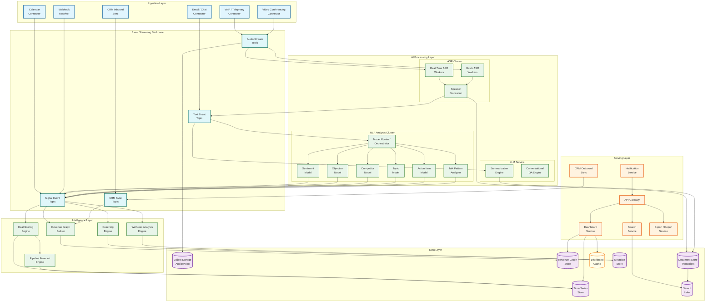
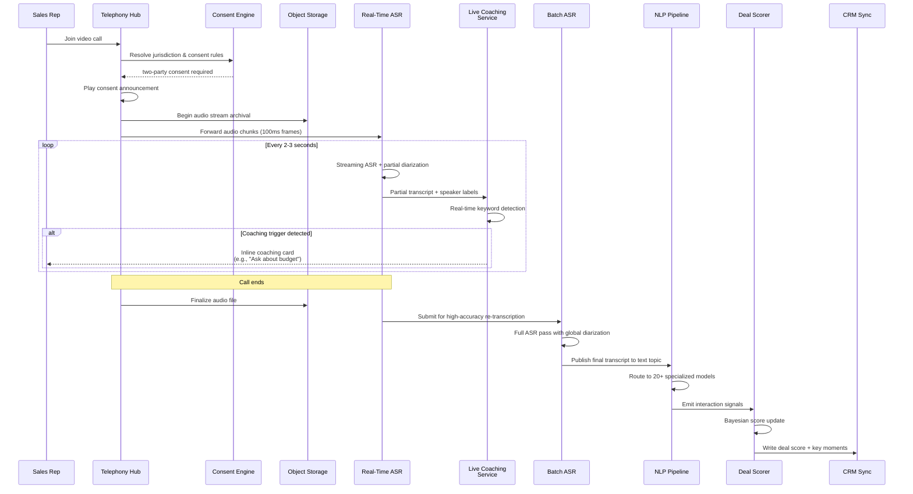
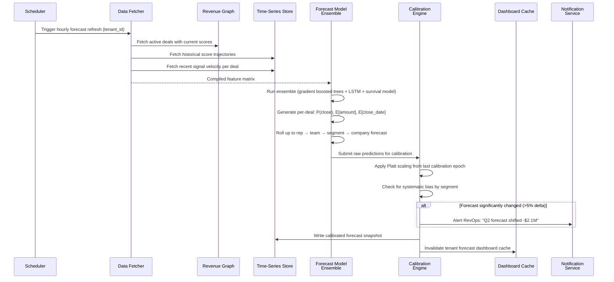
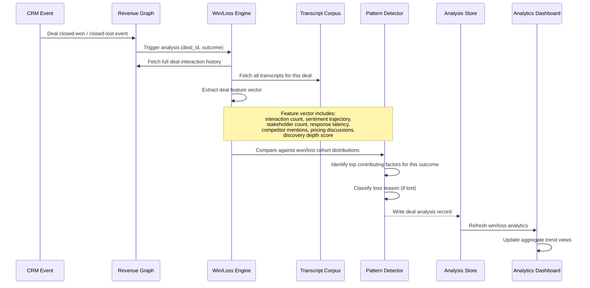

# AI-Native Revenue Intelligence Platform --- High-Level Design

## 1. System Architecture

The platform follows an event-driven, layered architecture with five distinct tiers: an ingestion layer that captures multi-modal interaction data, a processing layer that runs ASR and NLP pipelines, an intelligence layer that computes deal scores and forecasts, a serving layer that delivers insights through dashboards and APIs, and a data layer that persists the revenue graph, time-series data, and raw media.



---

## 2. Data Flow Architecture

### 2.1 Primary Data Flow: Call → Insight → CRM

The canonical data flow follows a linear pipeline with fan-out at the NLP stage:

```
Call Recording → Audio Storage → ASR/Diarization → Transcript Storage
    → NLP Model Router → [Sentiment, Objection, Competitor, Topic, Action, Talk Pattern]
    → Signal Aggregation → Deal Score Update → Forecast Recalculation
    → CRM Writeback → Manager Dashboard Refresh
```

**Key Design Decision**: The pipeline is event-driven with each stage publishing to the event stream rather than calling downstream services directly. This decouples processing stages, enables independent scaling, and provides natural retry/dead-letter handling.

### 2.2 Secondary Data Flows

| Flow | Path | Trigger |
|------|------|---------|
| Email analysis | Email Connector → Text Event Topic → NLP Router → Signal Aggregation | New email captured |
| CRM signal | CRM Inbound Sync → CRM Topic → Graph Builder → Deal Score Update | CRM field change (stage, amount, close date) |
| Calendar signal | Calendar Connector → Signal Topic → Graph Builder | Meeting scheduled/completed |
| Forecast refresh | Scheduler → Forecast Engine → Time-Series Store → Dashboard Cache Invalidation | Hourly schedule or on-demand |
| Coaching alert | Coaching Engine → Notification Service → Manager (email/Slack/in-app) | Pattern threshold exceeded |
| Search indexing | Document Store → Search Indexer → Search Index | New transcript available |
| Win/loss analysis | Deal closed event → Win/Loss Engine → Metadata Store → Analytics Dashboard | CRM deal closed-won or closed-lost |

---

## 3. Sequence Diagrams

### 3.1 Real-Time Call Processing with Live Coaching



### 3.2 Pipeline Forecast Generation



### 3.3 Win/Loss Analysis Flow



---

## 4. Component Deep Dive

### 4.1 Telephony Integration Hub

The telephony hub abstracts 50+ communication platform integrations behind a unified audio capture interface.

**Architecture Pattern**: Adapter pattern with per-provider connectors implementing a common interface.

| Component | Responsibility |
|-----------|---------------|
| Provider Adapters | Platform-specific API integration (webhook registration, OAuth, audio stream protocols) |
| Audio Normalizer | Converts diverse audio formats (G.711, Opus, AAC) to a canonical PCM format for ASR |
| Consent Engine | Determines jurisdiction, enforces consent rules, manages recording state |
| Stream Router | Routes audio to real-time ASR (if live coaching enabled) and object storage simultaneously |
| Metadata Enricher | Attaches meeting context (participants, deal association, calendar event) to the audio stream |

**Key Design Decision**: Audio is written to object storage before any processing begins. If ASR or NLP fails, the audio is preserved for reprocessing. This "store first, process later" pattern ensures no data loss even during processing pipeline failures.

### 4.2 ASR / Transcription Engine

Two operating modes serve different latency requirements:

| Mode | Latency | Accuracy (WER) | Use Case |
|------|---------|----------------|----------|
| Real-time streaming | <2 seconds | 15--18% | Live call coaching overlays |
| Batch high-accuracy | <5 minutes | 8--12% | Post-call transcript for NLP analysis and storage |

**Speaker diarization** runs as a post-processing step on the full audio file. The batch ASR pass produces a final transcript with speaker labels aligned to CRM contact records through a combination of:
1. Meeting metadata (participant list from calendar invite)
2. Voice enrollment (optional per-user voice fingerprint)
3. Contextual cues (the ASR detects "Hi, this is [Name]" patterns)

### 4.3 NLP Model Router / Orchestrator

The model router is the traffic controller for the NLP pipeline. Given a transcript, it determines which models to invoke, in what order, and how to merge their outputs.

**Routing Logic**:
1. **Content-based routing**: Short calls (<5 min) skip discovery analysis models. Calls flagged as "internal" skip competitor detection.
2. **Priority-based routing**: Models that feed deal scoring (sentiment, objection, competitor) run first; models for coaching (talk patterns, methodology adherence) run second.
3. **Result merging**: Each model produces typed annotations on transcript segments. The router merges these into a unified annotation layer, resolving conflicts (e.g., two models disagree on segment sentiment) using confidence scores and priority rules.

### 4.4 Revenue Graph Builder

The revenue graph connects entities across the revenue lifecycle:

```
Account → Opportunity → Interaction → Participant → Transcript Segment → Annotation
    ↕           ↕            ↕              ↕
Contact    Deal Score    Signal Event    Voice Profile
```

**Graph operations that power core features**:

| Operation | Graph Query | Feature |
|-----------|------------|---------|
| Buying committee mapping | All participants connected to a deal across interactions, weighted by interaction count and recency | Deal scoring, stakeholder analysis |
| Engagement velocity | Rate of new interactions per deal over time, compared to historical won-deal patterns | Deal risk flagging |
| Cross-account intelligence | Competitor mentions aggregated across all deals involving the same competitor, segmented by outcome | Win/loss analysis, competitive intelligence |
| Rep conversation patterns | Aggregate talk metrics across a rep's recent interactions, trended over time | Coaching recommendations |

### 4.5 Deal Scoring Engine

The deal scoring engine maintains a continuously-updated probability for each active deal using a Bayesian signal fusion approach:

**Signal categories and weights**:

| Signal Category | Example Signals | Typical Weight Range |
|----------------|-----------------|---------------------|
| Interaction frequency | Calls/week, email response time, meeting cadence | 15--20% |
| Sentiment trajectory | Average sentiment per call, sentiment trend (improving/declining) | 10--15% |
| Stakeholder engagement | Number of unique contacts engaged, executive sponsor involvement | 15--20% |
| CRM progression | Stage changes, amount changes, close date movements | 20--25% |
| Conversation quality | Discovery depth, objection handling quality, next-step clarity | 10--15% |
| Competitive pressure | Competitor mention frequency and sentiment | 5--10% |
| Historical similarity | Distance to historical won/lost deal cluster centroids | 10--15% |

### 4.6 Pipeline Forecast Engine

The forecast engine operates at three levels:

1. **Deal-level**: Probability of close, expected amount, expected close date (with confidence intervals)
2. **Roll-up level**: Aggregated forecasts for rep → team → segment → company with uncertainty propagation
3. **Category level**: Assignment to commit / best case / pipeline / omit with explanation

**Model ensemble**:
- Gradient-boosted trees for deal-level classification (close/no-close)
- LSTM for temporal pattern recognition (deal velocity, engagement cadence)
- Survival analysis for time-to-close prediction
- Weighted average with learned combination weights per deal segment

### 4.7 CRM Sync Engine

Bi-directional sync with CRM systems is the most integration-sensitive component.

**Inbound sync** (CRM → Platform):
- Webhook-based for real-time field changes (stage, amount, close date, owner)
- Polling-based fallback when webhooks are unavailable
- Full reconciliation daily to catch missed events

**Outbound sync** (Platform → CRM):
- Batched writes to respect CRM API rate limits (typically 10K--100K API calls/day per org)
- Priority queue: deal score updates > call activity logs > coaching notes
- Conflict detection: if a CRM field was modified by a human since last sync, platform defers to human edit

---

## 5. Key Architectural Decisions

### 5.1 Event-Driven Pipeline vs. Request-Response

**Decision**: Event-driven (event streaming backbone between all processing stages)

**Rationale**:
- **Decoupled scaling**: ASR can scale independently of NLP; deal scoring can scale independently of forecast generation
- **Natural backpressure**: If NLP lags behind ASR, events queue in the stream rather than causing timeouts
- **Replay capability**: Re-processing historical data (e.g., after model improvement) is a simple consumer reset
- **Audit trail**: The event stream is an immutable log of all signals and state changes

**Trade-off**: Increased operational complexity (stream management, consumer group coordination, exactly-once semantics) vs. simpler request-response. Justified by the scale of data flow (60B+ inferences/day).

### 5.2 Specialized Small Models vs. Single Large Model

**Decision**: Ensemble of ~40 specialized small models + LLM for open-ended tasks

**Rationale**:
- **Cost**: Specialized models are 100--1000× cheaper per inference than LLMs
- **Latency**: Small models complete in 1--10ms; LLMs require 500ms--5s
- **Accuracy**: Task-specific fine-tuned models outperform general LLMs on structured extraction tasks
- **Interpretability**: Small model outputs (scores, classifications) are directly interpretable; LLM outputs require post-processing

**Trade-off**: Higher engineering cost to develop and maintain 40+ models vs. simpler single-model architecture. Justified by the 60B daily inference volume where per-inference cost dominates.

### 5.3 Revenue Graph: Property Graph vs. Relational

**Decision**: Hybrid---property graph for relationship traversal, relational for transactional CRM sync

**Rationale**:
- **Graph queries**: "Find all contacts who participated in calls for deals that closed-lost with competitor X mentioned" is natural in a graph database but requires multiple joins in relational
- **CRM sync**: Bi-directional sync with CRM requires ACID transactions and foreign-key relationships better served by relational storage
- **Materialized bridge**: Graph query results are materialized into relational views for dashboard queries that need SQL compatibility

### 5.4 Forecast Model: Global vs. Per-Tenant

**Decision**: Hierarchical---global base model with per-tenant fine-tuning via transfer learning

**Rationale**:
- **Cold start**: New tenants need reasonable predictions from day one; global model provides this
- **Personalization**: After sufficient data (typically 2 quarters), per-tenant fine-tuning captures company-specific patterns (sales cycle length, deal size distribution, seasonal patterns)
- **Privacy**: Global model trained on anonymized, aggregated features; per-tenant models never see other tenants' data

### 5.5 Audio Storage: Full Retention vs. Transcript-Only

**Decision**: Full audio retention with tiered storage lifecycle

**Rationale**:
- **Re-analysis**: ASR and NLP models improve over time; retaining audio enables re-transcription with better models
- **Compliance**: Some regulations require original recording retention for 5--7 years
- **Dispute resolution**: Audio is the source of truth when transcript accuracy is questioned
- **Cost management**: Tiered storage (hot → warm → cold) keeps costs manageable; cold archival storage is very cheap per GB

---

## 6. Cross-Cutting Concerns

### 6.1 Multi-Tenancy

| Concern | Strategy |
|---------|----------|
| Data isolation | Logical isolation: tenant_id in every table/document; physical isolation for enterprise tier (dedicated graph DB instances) |
| Compute isolation | Shared GPU pools with per-tenant quotas and priority scheduling; dedicated processing lanes for premium tenants |
| Noisy neighbor prevention | Per-tenant rate limits on API calls, ASR submissions, and NLP queue depth; circuit breakers per tenant |
| Model isolation | Global models shared; per-tenant fine-tuned models stored in tenant-scoped model registry |

### 6.2 Idempotency

Every processing stage must be idempotent because event replay and at-least-once delivery are inherent in the event-driven architecture:

- **ASR**: Same audio file re-submitted produces same transcript (deterministic model inference)
- **NLP**: Same transcript re-analyzed produces same annotations (model version pinned per analysis run)
- **Deal scoring**: Score update is idempotent given the same signal set (score is a pure function of current signals)
- **CRM writeback**: Uses external IDs and upsert semantics; duplicate writes are no-ops

### 6.3 Feature Flags & Gradual Rollout

New AI models are rolled out using a canary strategy:
1. Shadow mode: new model runs alongside production, results logged but not surfaced
2. A/B test: 5% of interactions use new model, quality metrics compared
3. Gradual rollout: 5% → 25% → 50% → 100% over 2 weeks
4. Rollback: instant revert to previous model version if quality degrades
