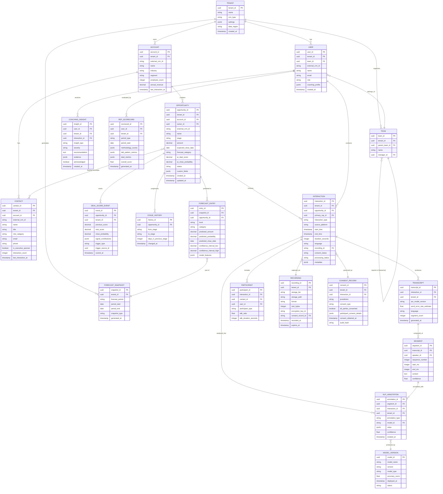

# AI-Native Revenue Intelligence Platform --- Low-Level Design

## 1. Data Model

### 1.1 Entity Relationship Diagram



### 1.2 Revenue Graph Schema (Property Graph)

The revenue graph extends the relational model with rich relationship semantics:

**Node Types**:

| Node | Key Properties | Description |
|------|---------------|-------------|
| Account | name, industry, segment, arr | Top-level organization |
| Opportunity | stage, amount, close_date, ai_score | Revenue opportunity |
| Contact | name, title, role_category | Individual stakeholder |
| User (Rep) | name, team, role | Sales representative |
| Interaction | type, timestamp, duration | Call, email, or meeting |
| Topic | name, category | Detected discussion topic |
| Competitor | name | Mentioned competitor |

**Edge Types**:

| Edge | From → To | Properties |
|------|-----------|------------|
| OWNS | Account → Opportunity | created_at |
| WORKS_AT | Contact → Account | title, department |
| PARTICIPATED_IN | Contact → Interaction | talk_ratio, sentiment_avg |
| CONDUCTED | User → Interaction | role (host, participant) |
| RELATED_TO | Interaction → Opportunity | attribution_confidence |
| MENTIONED | Interaction → Competitor | count, sentiment, context |
| DISCUSSED | Interaction → Topic | duration_seconds, depth_score |
| INFLUENCES | Contact → Opportunity | influence_score, engagement_recency |
| REPORTS_TO | User → User | hierarchy |

---

## 2. API Design

### 2.1 Core API Endpoints

#### Interactions API

```
POST   /v1/interactions
       Create a new interaction record (called by telephony hub after call)
       Body: { opportunity_id, participants[], source_platform, metadata }
       Returns: { interaction_id, processing_status: "queued" }

GET    /v1/interactions/{interaction_id}
       Retrieve interaction with transcript, annotations, and summary
       Query params: include=transcript,annotations,summary,recording_url
       Returns: { interaction, transcript?, annotations?, summary?, recording_url? }

GET    /v1/interactions
       List interactions with filtering
       Query params: opportunity_id, user_id, date_from, date_to, type, page, limit
       Returns: { items[], pagination }

GET    /v1/interactions/{interaction_id}/transcript
       Retrieve full transcript with speaker labels and timestamps
       Query params: format=segments|plaintext, include_annotations=true
       Returns: { segments[{ speaker, start_ms, end_ms, text, annotations[] }] }

GET    /v1/interactions/{interaction_id}/moments
       Retrieve key moments (objections, pricing, next steps) with timestamps
       Query params: type=objection|competitor|pricing|action_item|question
       Returns: { moments[{ type, timestamp_ms, content, confidence }] }
```

#### Deal Scoring API

```
GET    /v1/opportunities/{opportunity_id}/score
       Retrieve current deal score with signal breakdown
       Returns: {
           score: 0.73,
           close_probability: 0.68,
           risk_level: "medium",
           signals: {
               interaction_frequency: { value: 0.8, weight: 0.18, trend: "stable" },
               sentiment_trajectory: { value: 0.65, weight: 0.12, trend: "declining" },
               stakeholder_breadth: { value: 0.45, weight: 0.17, trend: "improving" },
               ...
           },
           comparable_deals: { won_similarity: 0.71, lost_similarity: 0.43 },
           last_updated: "2026-03-09T14:30:00Z"
       }

GET    /v1/opportunities/{opportunity_id}/score/history
       Retrieve score change history with trigger events
       Query params: from, to, granularity=daily|weekly
       Returns: { history[{ timestamp, score, delta, trigger }] }

GET    /v1/opportunities/{opportunity_id}/risks
       Retrieve active risk flags for a deal
       Returns: { risks[{ type, severity, description, evidence[], recommended_action }] }

POST   /v1/scoring/recalculate
       Trigger on-demand score recalculation for specific deals
       Body: { opportunity_ids[] }
       Returns: { job_id, estimated_completion }
```

#### Pipeline Forecasting API

```
GET    /v1/forecasts/current
       Retrieve latest forecast for current period
       Query params: period=Q2-2026, level=company|segment|team|rep, breakdown_by=category
       Returns: {
           period: "Q2-2026",
           total_predicted: 45200000,
           confidence_interval: { low: 41800000, high: 48600000 },
           categories: {
               commit: { amount: 28500000, deal_count: 142 },
               best_case: { amount: 11200000, deal_count: 87 },
               pipeline: { amount: 5500000, deal_count: 203 }
           },
           ai_vs_rep_delta: -1200000,
           last_refreshed: "2026-03-09T15:00:00Z"
       }

GET    /v1/forecasts/snapshots
       List historical forecast snapshots for trend analysis
       Query params: period, from, to
       Returns: { snapshots[{ timestamp, predicted, actual?, accuracy? }] }

POST   /v1/forecasts/scenario
       Run what-if scenario analysis
       Body: {
           base_forecast_id,
           adjustments: [
               { opportunity_id: "...", override_probability: 0.9 },
               { segment: "enterprise", probability_boost: 0.1 }
           ]
       }
       Returns: { scenario_forecast, delta_from_base }

GET    /v1/forecasts/accuracy
       Retrieve forecast accuracy metrics for closed periods
       Query params: periods=Q1-2026,Q4-2025
       Returns: { periods[{ period, predicted, actual, accuracy_pct, bias }] }
```

#### Coaching API

```
GET    /v1/users/{user_id}/coaching/scorecard
       Retrieve rep coaching scorecard
       Query params: period=last_30_days|last_quarter
       Returns: {
           overall_score: 78,
           methodology_adherence: { meddic_score: 72, areas: [...] },
           talk_patterns: { talk_ratio: 0.62, avg_monologue: 45s, question_rate: 8.2 },
           deal_metrics: { win_rate: 0.34, avg_cycle_days: 48 },
           trend: "improving",
           recommendations: [{ area, insight, suggested_action, priority }]
       }

GET    /v1/users/{user_id}/coaching/insights
       List coaching insights for a rep
       Query params: type, severity, acknowledged, page, limit
       Returns: { items[{ insight_id, type, severity, recommendation, evidence }] }

POST   /v1/users/{user_id}/coaching/insights/{insight_id}/acknowledge
       Mark a coaching insight as acknowledged by rep or manager
       Body: { action_taken: "reviewed_with_manager" }

GET    /v1/teams/{team_id}/coaching/leaderboard
       Retrieve team coaching leaderboard
       Query params: metric=overall|methodology|talk_patterns, period
       Returns: { rankings[{ user, score, trend, top_strength, improvement_area }] }
```

#### Win/Loss Analysis API

```
GET    /v1/analytics/win-loss
       Retrieve win/loss analysis with pattern breakdowns
       Query params: period, segment, product, rep_id, loss_reason
       Returns: {
           summary: { total_closed: 450, won: 287, lost: 163, win_rate: 0.638 },
           patterns: {
               won: { avg_interactions: 12.3, avg_stakeholders: 4.2, ... },
               lost: { avg_interactions: 7.1, avg_stakeholders: 2.1, ... }
           },
           top_loss_reasons: [{ reason, count, pct, trend }],
           competitor_analysis: [{ competitor, encounters, win_rate_against }]
       }

GET    /v1/analytics/win-loss/deal/{opportunity_id}
       Retrieve post-mortem analysis for a specific closed deal
       Returns: {
           outcome, contributing_factors[], comparison_to_cohort,
           key_moments[], loss_reason?, recommendations[]
       }
```

#### Search API

```
POST   /v1/search/transcripts
       Full-text search across transcripts with filters
       Body: {
           query: "pricing objection enterprise tier",
           filters: { date_from, date_to, opportunity_id, user_id, outcome },
           highlight: true,
           page, limit
       }
       Returns: {
           results[{ interaction_id, segment, highlight, score, context }],
           facets: { topics[], speakers[], outcomes[] },
           total_count
       }
```

### 2.2 Webhook / Event API

```
POST   /v1/webhooks
       Register a webhook for event notifications
       Body: {
           url: "https://customer.example.com/webhook",
           events: ["deal.score_changed", "forecast.refreshed", "coaching.insight_created"],
           filters: { min_score_delta: 0.1 }
       }

Events emitted:
- deal.score_changed       { opportunity_id, old_score, new_score, trigger }
- deal.risk_flagged        { opportunity_id, risk_type, severity }
- forecast.refreshed       { period, total_predicted, delta }
- coaching.insight_created { user_id, insight_type, severity }
- interaction.analyzed     { interaction_id, opportunity_id, summary }
- call.recording_ready     { interaction_id, recording_url, duration }
```

---

## 3. Core Algorithms (Pseudocode)

### 3.1 Deal Scoring --- Bayesian Signal Fusion

```
FUNCTION compute_deal_score(opportunity_id):
    // Fetch current signal values from revenue graph
    signals = fetch_signals(opportunity_id)

    // Signal definitions with learned weights per tenant
    signal_defs = load_signal_definitions(opportunity.tenant_id)

    // Compute prior from historical base rate for this deal segment
    segment = classify_deal_segment(opportunity)
    prior = historical_win_rate(segment)  // e.g., 0.35 for enterprise deals

    // Bayesian update: fuse each signal as evidence
    log_odds = log(prior / (1 - prior))

    FOR EACH signal_def IN signal_defs:
        signal_value = signals[signal_def.name]

        IF signal_value IS NULL:
            CONTINUE  // Missing signal contributes no evidence

        // Compute likelihood ratio for this signal value
        // P(signal_value | win) / P(signal_value | lose)
        lr = signal_def.likelihood_ratio_function(signal_value, segment)

        // Weight the evidence by signal reliability
        weighted_log_lr = signal_def.weight * log(lr)

        log_odds = log_odds + weighted_log_lr

    // Convert back to probability
    raw_score = 1.0 / (1.0 + exp(-log_odds))

    // Apply calibration correction (Platt scaling from last calibration epoch)
    calibration = load_calibration(opportunity.tenant_id, segment)
    calibrated_score = calibration.a * raw_score + calibration.b

    // Clamp to [0.01, 0.99] to avoid extreme probabilities
    final_score = clamp(calibrated_score, 0.01, 0.99)

    // Compute signal contribution breakdown for explainability
    contributions = {}
    FOR EACH signal_def IN signal_defs:
        contributions[signal_def.name] = {
            value: signals[signal_def.name],
            weight: signal_def.weight,
            contribution: signal_def.weight * log(signal_def.likelihood_ratio_function(...)),
            trend: compute_trend(opportunity_id, signal_def.name, window=14_days)
        }

    RETURN {
        score: final_score,
        close_probability: final_score,
        risk_level: classify_risk(final_score, contributions),
        signal_contributions: contributions,
        comparable_deals: find_comparable_deals(opportunity_id, segment)
    }
```

### 3.2 Pipeline Forecast --- Ensemble Prediction

```
FUNCTION generate_forecast(tenant_id, forecast_period):
    // Step 1: Fetch all active opportunities for this tenant
    opportunities = fetch_active_opportunities(tenant_id, forecast_period)

    // Step 2: Build feature matrix for each opportunity
    feature_matrix = []
    FOR EACH opp IN opportunities:
        features = extract_features(opp)
        // Features include:
        //   - current_deal_score, score_velocity (delta over last 14 days)
        //   - days_in_current_stage, stage_vs_median_ratio
        //   - interaction_count_last_14d, interaction_velocity
        //   - stakeholder_count, executive_involved (boolean)
        //   - sentiment_avg, sentiment_trend_slope
        //   - competitor_mentioned (boolean), objection_count
        //   - amount, deal_age_days, historical_segment_win_rate
        //   - rep_historical_win_rate, rep_forecast_accuracy
        feature_matrix.append({ opp_id: opp.id, features: features })

    // Step 3: Run ensemble models
    FOR EACH entry IN feature_matrix:
        // Model 1: Gradient boosted trees (close probability)
        gbt_prob = gbt_model.predict_probability(entry.features)

        // Model 2: LSTM temporal model (uses score trajectory time series)
        trajectory = fetch_score_trajectory(entry.opp_id, window=90_days)
        lstm_prob = lstm_model.predict(trajectory, entry.features)

        // Model 3: Survival model (time-to-close distribution)
        survival_curve = survival_model.predict(entry.features)
        close_by_period_end = survival_curve.cdf(days_until_period_end)

        // Ensemble combination with learned weights
        weights = load_ensemble_weights(tenant_id, entry.features.segment)
        combined_prob = (
            weights.gbt * gbt_prob +
            weights.lstm * lstm_prob +
            weights.survival * close_by_period_end
        )

        // Amount prediction (regression with uncertainty)
        predicted_amount = amount_model.predict(entry.features)
        amount_ci = amount_model.confidence_interval(entry.features, alpha=0.1)

        // Close date prediction
        predicted_close = survival_curve.median()

        entry.prediction = {
            probability: combined_prob,
            amount: predicted_amount,
            amount_ci: amount_ci,
            close_date: predicted_close,
            category: assign_category(combined_prob, entry.features)
        }

    // Step 4: Roll-up aggregation with uncertainty propagation
    rep_forecasts = {}
    FOR EACH entry IN feature_matrix:
        rep = entry.features.owner_id
        IF rep NOT IN rep_forecasts:
            rep_forecasts[rep] = { weighted_amount: 0, deals: [], ci_variance: 0 }

        expected = entry.prediction.probability * entry.prediction.amount
        rep_forecasts[rep].weighted_amount += expected
        rep_forecasts[rep].deals.append(entry)

        // Propagate uncertainty (sum of variances for independent deals)
        variance = compute_prediction_variance(entry.prediction)
        rep_forecasts[rep].ci_variance += variance

    // Roll up: rep → team → segment → company
    company_forecast = roll_up_hierarchy(rep_forecasts, org_hierarchy)

    // Step 5: Compare AI forecast vs. rep-submitted forecast
    rep_submitted = fetch_rep_submitted_forecasts(tenant_id, forecast_period)
    variance_report = compare_forecasts(company_forecast, rep_submitted)

    // Step 6: Create snapshot
    snapshot = create_forecast_snapshot(
        tenant_id, forecast_period, company_forecast, variance_report
    )

    RETURN snapshot
```

### 3.3 Conversation Analysis --- NLP Model Orchestration

```
FUNCTION analyze_conversation(transcript_id):
    transcript = load_transcript(transcript_id)
    segments = transcript.segments

    // Step 1: Determine which models to run (content-based routing)
    call_metadata = load_interaction_metadata(transcript.interaction_id)
    model_set = determine_model_set(call_metadata)
    // Rules:
    //   - Internal calls → skip competitor detection, pricing analysis
    //   - Calls < 5 min → skip discovery depth, methodology adherence
    //   - Demo calls → include feature discussion, technical depth models
    //   - First calls → include discovery quality, qualification models

    // Step 2: Pre-process segments for batch efficiency
    batched_segments = batch_segments(segments, batch_size=64)

    // Step 3: Run fast models in parallel (< 10ms per segment)
    fast_results = {}
    PARALLEL FOR EACH model IN model_set.fast_models:
        // Fast models: sentiment, talk_pattern, filler_word, question_detection
        FOR EACH batch IN batched_segments:
            results = model.infer_batch(batch)
            fast_results[model.name].extend(results)

    // Step 4: Run context-dependent models sequentially (need fast model outputs)
    context_results = {}
    FOR EACH model IN model_set.context_models:
        // Context models: objection_detection (needs sentiment context),
        //   competitor_extraction (needs topic context),
        //   action_item_extraction (needs speaker role context)
        context = build_model_context(fast_results, call_metadata)
        FOR EACH batch IN batched_segments:
            results = model.infer_batch(batch, context)
            context_results[model.name].extend(results)

    // Step 5: Run LLM summarization (expensive, once per conversation)
    summary_input = prepare_summary_input(
        segments, fast_results, context_results, call_metadata
    )
    summary = llm_service.generate_summary(summary_input)
    action_items = llm_service.extract_action_items(summary_input)

    // Step 6: Merge and resolve annotation conflicts
    all_annotations = merge_annotations(fast_results, context_results)
    resolved = resolve_conflicts(all_annotations)
    // Conflict resolution: if two models annotate the same segment with
    // different sentiments, use the model with higher confidence score.
    // If confidence is within 0.05, use the domain-specific model.

    // Step 7: Compute conversation-level metrics
    metrics = {
        overall_sentiment: weighted_average(resolved.sentiment_scores),
        sentiment_trajectory: compute_trajectory(resolved.sentiment_scores),
        talk_to_listen_ratio: compute_ratio(segments, call_metadata.rep_speaker_id),
        longest_monologue: find_longest_monologue(segments),
        question_rate: count_questions(resolved) / transcript.duration_minutes,
        objection_count: count_by_type(resolved, "objection"),
        competitor_mentions: extract_unique(resolved, "competitor"),
        action_items: action_items,
        discovery_depth: score_discovery(resolved, call_metadata.methodology)
    }

    // Step 8: Emit signals for deal scoring
    signals = convert_to_deal_signals(metrics, resolved, call_metadata)
    publish_to_signal_topic(signals)

    // Step 9: Store results
    store_annotations(transcript_id, resolved)
    store_summary(transcript_id, summary)
    store_metrics(transcript_id, metrics)

    RETURN { annotations: resolved, summary: summary, metrics: metrics }
```

### 3.4 Rep Coaching Score --- Methodology Adherence

```
FUNCTION compute_rep_coaching_score(user_id, period):
    // Fetch all interactions for this rep in the period
    interactions = fetch_rep_interactions(user_id, period)
    methodology = load_tenant_methodology(user_id)  // e.g., MEDDIC, BANT, Challenger

    // Define methodology criteria and their scoring rubrics
    criteria = methodology.scoring_criteria
    // For MEDDIC: Metrics, Economic_Buyer, Decision_Criteria,
    //             Decision_Process, Identify_Pain, Champion

    rep_scores = { criteria_scores: {}, pattern_scores: {}, deal_scores: {} }

    // Score methodology adherence per interaction
    FOR EACH interaction IN interactions:
        annotations = load_annotations(interaction.id)
        transcript = load_transcript(interaction.id)

        FOR EACH criterion IN criteria:
            // Check if rep addressed this criterion in the conversation
            evidence = find_evidence(annotations, transcript, criterion)
            // Evidence: specific transcript segments where the criterion was discussed
            // e.g., for "Economic_Buyer": did the rep ask who makes the budget decision?

            IF evidence.found:
                quality = assess_quality(evidence, criterion.rubric)
                // Quality: 0-100 based on rubric
                // e.g., "Asked about budget owner" = 60
                //        "Confirmed budget owner and approval process" = 90
            ELSE:
                quality = 0

            rep_scores.criteria_scores[criterion.name].append({
                interaction_id: interaction.id,
                score: quality,
                evidence: evidence
            })

    // Aggregate criteria scores
    FOR EACH criterion IN criteria:
        scores = rep_scores.criteria_scores[criterion.name]
        rep_scores.criteria_scores[criterion.name] = {
            avg_score: average(scores.score),
            consistency: stddev(scores.score),  // Low stddev = consistent application
            trend: linear_regression_slope(scores, by_date),
            coverage: count(s for s in scores if s.score > 0) / len(scores)
        }

    // Compute talk pattern metrics
    FOR EACH interaction IN interactions:
        metrics = load_interaction_metrics(interaction.id)
        rep_scores.pattern_scores.talk_ratios.append(metrics.talk_to_listen_ratio)
        rep_scores.pattern_scores.monologue_durations.append(metrics.longest_monologue)
        rep_scores.pattern_scores.question_rates.append(metrics.question_rate)
        rep_scores.pattern_scores.filler_rates.append(metrics.filler_word_rate)

    // Compute deal outcome metrics for this period
    deals = fetch_rep_deals(user_id, period)
    rep_scores.deal_scores = {
        win_rate: count(d for d in deals if d.won) / len(deals),
        avg_deal_size: average(d.amount for d in deals if d.won),
        avg_cycle_days: average(d.cycle_days for d in deals if d.closed),
        pipeline_coverage: sum(d.amount for d in deals if d.open) / quota
    }

    // Generate composite score
    weights = methodology.score_weights  // configurable per tenant
    overall = (
        weights.methodology * average_criteria_score(rep_scores.criteria_scores) +
        weights.talk_patterns * score_talk_patterns(rep_scores.pattern_scores) +
        weights.deal_outcomes * score_deal_outcomes(rep_scores.deal_scores)
    )

    // Generate coaching recommendations
    recommendations = []
    FOR EACH criterion IN criteria:
        IF rep_scores.criteria_scores[criterion.name].avg_score < criterion.threshold:
            recommendations.append({
                area: criterion.name,
                current_score: rep_scores.criteria_scores[criterion.name].avg_score,
                target_score: criterion.threshold,
                suggestion: criterion.coaching_suggestion,
                exemplar: find_best_example(criterion, top_performers),
                priority: "high" IF criterion.weight > 0.15 ELSE "medium"
            })

    // Identify talk pattern improvements
    IF average(rep_scores.pattern_scores.talk_ratios) > 0.65:
        recommendations.append({
            area: "talk_to_listen_ratio",
            insight: "You're talking more than listening. Target: 40-60% talk ratio.",
            priority: "high"
        })

    IF average(rep_scores.pattern_scores.monologue_durations) > 90:
        recommendations.append({
            area: "monologue_length",
            insight: "Your longest monologues average over 90s. Break with questions.",
            priority: "medium"
        })

    RETURN {
        user_id: user_id,
        period: period,
        overall_score: overall,
        methodology_scores: rep_scores.criteria_scores,
        talk_patterns: summarize_patterns(rep_scores.pattern_scores),
        deal_metrics: rep_scores.deal_scores,
        recommendations: sort_by_priority(recommendations),
        peer_comparison: compute_peer_percentile(user_id, overall)
    }
```

### 3.5 Win/Loss Pattern Detection

```
FUNCTION analyze_win_loss_patterns(tenant_id, analysis_period):
    // Fetch all closed deals in the analysis period
    closed_deals = fetch_closed_deals(tenant_id, analysis_period)

    won_deals = filter(closed_deals, status="closed-won")
    lost_deals = filter(closed_deals, status="closed-lost")

    // Extract feature vectors for each deal
    FUNCTION extract_deal_features(deal):
        interactions = fetch_deal_interactions(deal.id)
        RETURN {
            interaction_count: len(interactions),
            unique_contacts: count_unique_contacts(interactions),
            executive_involvement: has_executive_contact(interactions),
            avg_sentiment: average_sentiment(interactions),
            sentiment_slope: sentiment_trend_slope(interactions),
            competitor_mentioned: any_competitor_mentions(interactions),
            competitor_count: count_unique_competitors(interactions),
            objection_count: count_objections(interactions),
            avg_response_time_hours: avg_email_response_time(deal.id),
            discovery_depth_score: avg_discovery_score(interactions),
            days_in_pipeline: deal.cycle_days,
            stage_velocity: avg_days_per_stage(deal.id),
            amount: deal.amount,
            deal_age_at_close: deal.cycle_days,
            meeting_cadence_regularity: cadence_regularity_score(interactions),
            multi_thread: unique_contacts > 1
        }

    won_features = [extract_deal_features(d) for d in won_deals]
    lost_features = [extract_deal_features(d) for d in lost_deals]

    // Statistical comparison: identify features with significant differences
    significant_features = []
    FOR EACH feature_name IN feature_names:
        won_dist = [f[feature_name] for f in won_features]
        lost_dist = [f[feature_name] for f in lost_features]

        // Mann-Whitney U test (non-parametric, handles non-normal distributions)
        u_stat, p_value = mann_whitney_u(won_dist, lost_dist)
        effect_size = compute_cohens_d(won_dist, lost_dist)

        IF p_value < 0.05 AND abs(effect_size) > 0.3:
            significant_features.append({
                feature: feature_name,
                won_median: median(won_dist),
                lost_median: median(lost_dist),
                effect_size: effect_size,
                p_value: p_value,
                direction: "higher_wins" IF median(won_dist) > median(lost_dist)
                           ELSE "lower_wins"
            })

    // Loss reason classification using NLP on final-stage interactions
    loss_reasons = {}
    FOR EACH deal IN lost_deals:
        final_interactions = fetch_final_stage_interactions(deal.id, last_n=3)
        annotations = merge_annotations_for_interactions(final_interactions)

        reason = classify_loss_reason(annotations, deal)
        // Categories: price, competition, no_decision, timing, product_fit,
        //             champion_left, budget_cut, internal_politics
        loss_reasons[reason] = loss_reasons.get(reason, 0) + 1

    // Competitive analysis
    competitor_analysis = {}
    FOR EACH deal IN closed_deals:
        competitors = extract_competitors(deal.id)
        FOR EACH comp IN competitors:
            IF comp NOT IN competitor_analysis:
                competitor_analysis[comp] = { won: 0, lost: 0 }
            IF deal.status == "closed-won":
                competitor_analysis[comp].won += 1
            ELSE:
                competitor_analysis[comp].lost += 1

    FOR EACH comp IN competitor_analysis:
        total = competitor_analysis[comp].won + competitor_analysis[comp].lost
        competitor_analysis[comp].win_rate = competitor_analysis[comp].won / total
        competitor_analysis[comp].total_encounters = total

    RETURN {
        summary: {
            total_closed: len(closed_deals),
            won: len(won_deals),
            lost: len(lost_deals),
            win_rate: len(won_deals) / len(closed_deals)
        },
        significant_patterns: sort_by_effect_size(significant_features),
        loss_reasons: sort_by_count(loss_reasons),
        competitor_analysis: sort_by_encounters(competitor_analysis),
        recommendations: generate_strategic_recommendations(
            significant_features, loss_reasons, competitor_analysis
        )
    }
```

---

## 4. Data Partitioning Strategy

### 4.1 Partition Keys

| Data Store | Partition Key | Rationale |
|-----------|---------------|-----------|
| Interactions / Transcripts | tenant_id + date_range | Queries are always tenant-scoped; date range enables time-based partition pruning |
| NLP Annotations | tenant_id + interaction_id | Co-located with transcript for join efficiency |
| Deal Scores (time-series) | tenant_id + opportunity_id | Score history queries are per-deal |
| Revenue Graph | tenant_id | Entire tenant graph traversed for cross-deal queries |
| Forecast Snapshots | tenant_id + period | Forecasts queried per tenant per period |
| Audio/Video Objects | tenant_id + date + interaction_id | Enables lifecycle management (hot → warm → cold) by date |
| Search Index | tenant_id | Tenant isolation in search; per-tenant index shards |

### 4.2 Index Strategy

| Table / Collection | Indexes | Purpose |
|-------------------|---------|---------|
| Interaction | (tenant_id, opportunity_id, start_time) | Fetch interactions for a deal, time-ordered |
| Interaction | (tenant_id, primary_rep_id, start_time) | Fetch rep's recent interactions |
| Segment | (transcript_id, sequence_number) | Sequential segment retrieval |
| NLP_Annotation | (interaction_id, annotation_type) | Filter annotations by type |
| Deal_Score_Event | (opportunity_id, scored_at DESC) | Score history timeline |
| Opportunity | (tenant_id, stage, ai_deal_score) | Dashboard: deals by stage sorted by score |
| Opportunity | (tenant_id, expected_close_date, status) | Forecast: active deals closing in period |
| Coaching_Insight | (user_id, created_at DESC, acknowledged) | Rep coaching feed |
| Search Index | full-text on Segment.content with tenant_id filter | Transcript search |
