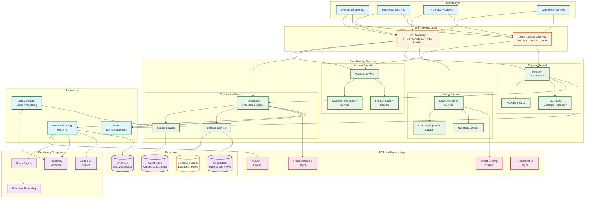
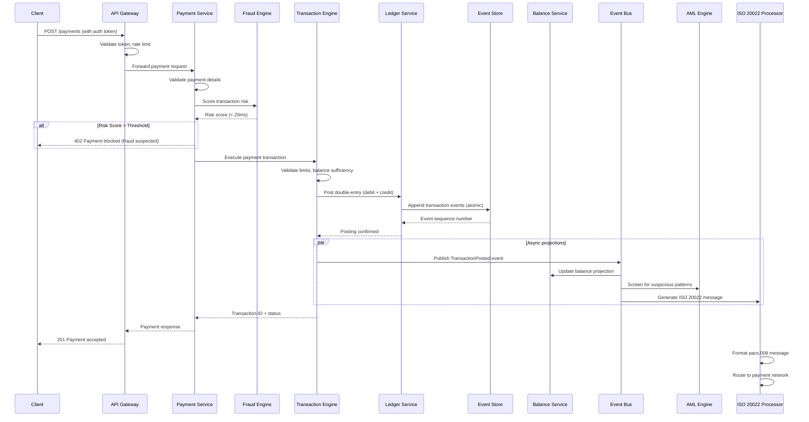
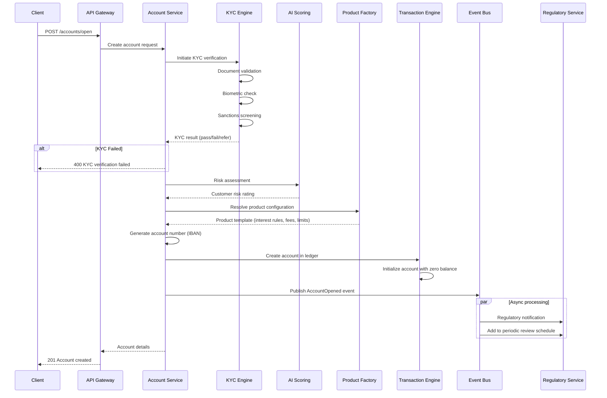

# High-Level Design — AI-Native Core Banking Platform

## 1. System Architecture



---

## 2. Architectural Layers

### 2.1 Channel and API Gateway Layer

The gateway layer serves as the single entry point for all traffic—retail banking channels, corporate channels, third-party providers (TPPs), and internal operations.

**API Gateway** handles:
- TLS termination and mutual TLS (mTLS) for TPP connections
- OAuth 2.0 / OpenID Connect token validation
- Rate limiting (per-client, per-API, per-entity)
- Request routing and format normalization
- API versioning and backward compatibility

**Open Banking Gateway** adds:
- PSD2/PSD3 consent management
- Strong Customer Authentication (SCA) orchestration
- TPP certificate validation (eIDAS qualified certificates)
- Regulatory-mandated API endpoints (AISP, PISP, CBPII)
- Consent-scoped data filtering

### 2.2 Core Banking Services Layer

Services are organized by **bounded contexts** following domain-driven design:

| Domain | Services | Responsibility |
|---|---|---|
| **Account** | Account, Customer, Product Factory | Account lifecycle, KYC, product configuration |
| **Transaction** | Transaction Engine, Ledger, Balance | Double-entry posting, event sourcing, balance projection |
| **Payment** | Payment Orchestrator, FX, ISO 20022 | Payment routing, currency conversion, message transformation |
| **Lending** | Loan Origination, Loan Management, Collateral | Credit lifecycle from application to closure |
| **Deposit** | Deposit Service, Interest Engine | Term deposits, savings, interest accrual |

Each service:
- Owns its data (database-per-service pattern)
- Communicates via events for cross-domain workflows
- Exposes synchronous APIs for query operations
- Maintains independent deployment and scaling

### 2.3 AI/ML Intelligence Layer

Embedded intelligence services operate in two modes:

**Inline (synchronous):** Fraud detection and sanctions screening execute within the transaction processing path. The fraud model returns a risk score within 20ms, and the transaction engine uses this score to approve, flag, or block the transaction.

**Asynchronous:** Credit scoring, AML pattern analysis, and personalization run on event streams. They consume transaction events and produce enriched signals that feed back into decision-making.

### 2.4 Data Layer (Event-Sourced + CQRS)

```
┌─────────────────────────────────────────────────┐
│                  Write Path (Commands)           │
│                                                  │
│  Transaction → Validate → Post to Event Store    │
│                              │                   │
│                    ┌─────────┴──────────┐        │
│                    │  Event Store        │        │
│                    │  (Append-Only Log)  │        │
│                    └─────────┬──────────┘        │
│                              │                   │
│              ┌───────────────┼───────────────┐   │
│              ▼               ▼               ▼   │
│     Balance Projection  GL Projection  Audit Log │
│              │               │               │   │
│              ▼               ▼               ▼   │
│         Read Store      GL Store       Audit DB  │
│                                                  │
│                  Read Path (Queries)              │
│  Balance Inquiry → Read Store → Cached Response  │
└─────────────────────────────────────────────────┘
```

**Write path:** All mutations flow through the Transaction Processing Engine, which validates business rules, applies the double-entry posting, and appends events to the immutable Event Store. This is the single source of truth.

**Read path:** Multiple projections consume events asynchronously to build optimized read models—balance projections for real-time queries, GL projections for accounting, regulatory projections for compliance, and analytics projections for business intelligence.

---

## 3. Core Data Flows

### 3.1 Real-Time Payment Processing Flow



### 3.2 Account Opening Flow



### 3.3 Multi-Currency Transfer Flow

```
1. Client initiates cross-currency transfer (USD → EUR)
2. Payment Service receives request with source/target currencies
3. FX Rate Service fetches current rate with spread
4. Client confirms rate (rate locked for 30 seconds)
5. Transaction Engine creates compound transaction:
   a. Debit source account (USD) — entry pair in USD
   b. Credit FX position account (USD) — internal entry
   c. Debit FX position account (EUR) — internal entry
   d. Credit target account (EUR) — entry pair in EUR
   e. Record FX P&L entry for spread — GL entry
6. All 5 entry pairs committed atomically
7. ISO 20022 pacs.008 generated for cross-border leg (if applicable)
8. Currency positions updated in real-time
```

---

## 4. Key Architectural Decisions

### 4.1 Event Sourcing for the Ledger

| Decision | Event-sourced append-only ledger as the single source of truth |
|---|---|
| **Context** | Banking requires complete auditability, regulatory reconstruction, and zero data loss |
| **Decision** | All financial state changes are captured as immutable events; current state is derived via projection |
| **Rationale** | Eliminates reconciliation errors, provides built-in audit trail, enables point-in-time queries, supports regulatory reconstruction, and reduces audit preparation time by ~65% |
| **Trade-off** | Higher storage cost, increased read latency for un-cached queries, complexity in event schema evolution |
| **Mitigation** | Periodic snapshots reduce replay cost; CQRS separates read/write concerns; schema registry manages evolution |

### 4.2 CQRS for Read/Write Separation

| Decision | Separate command (write) and query (read) models |
|---|---|
| **Context** | Write operations require strong consistency and ACID guarantees; read operations need low latency and flexible query patterns |
| **Decision** | Commands go through the Transaction Engine → Event Store; queries served from materialized read stores |
| **Rationale** | Eliminates read/write contention on the ledger, enables independent scaling of reads vs. writes, allows multiple projection formats |
| **Trade-off** | Eventual consistency between write and read models; increased system complexity |
| **Mitigation** | Balance projection lag < 100ms; critical paths (insufficient funds check) read from write store; version-stamped projections for consistency |

### 4.3 Account-Level Partitioning

| Decision | Partition data by account ID for horizontal scaling |
|---|---|
| **Context** | Need to distribute 100M+ accounts across multiple nodes while maintaining per-account ordering |
| **Decision** | Consistent hashing on account ID determines data placement; all operations for an account route to the same partition |
| **Rationale** | Provides strong ordering within accounts, enables horizontal scaling, avoids cross-partition transactions for single-account operations |
| **Trade-off** | Cross-account transactions (transfers) span partitions; hot accounts (high-volume corporate) may create partition hotspots |
| **Mitigation** | Two-phase commit for cross-partition transactions; dedicated partitions for known hot accounts; sub-account spreading for ultra-high-volume accounts |

### 4.4 Synchronous Fraud Scoring in Transaction Path

| Decision | Inline ML-based fraud scoring for every transaction |
|---|---|
| **Context** | Fraud losses must be prevented at the point of transaction, not detected after the fact |
| **Decision** | Fraud engine called synchronously during transaction processing with strict 20ms SLA |
| **Rationale** | Prevents fraudulent transactions before they settle, reducing loss exposure to near-zero for detectable patterns |
| **Trade-off** | Adds latency to every transaction; fraud engine becomes a critical-path dependency |
| **Mitigation** | Pre-computed feature store reduces inference time; circuit breaker falls back to rule-based scoring; model canary deployment prevents regressions |

### 4.5 ISO 20022 as Canonical Message Format

| Decision | Use ISO 20022 as the internal canonical format for all payment messages |
|---|---|
| **Context** | Multiple payment networks use different formats (MT, ISO 20022, proprietary); format translation is error-prone |
| **Decision** | All internal payment processing uses ISO 20022 data model; translate to/from external formats at the boundary |
| **Rationale** | Rich structured data supports STP (straight-through processing), reduces transformation errors, future-proofs as networks migrate to ISO 20022 |
| **Trade-off** | Legacy systems may not support ISO 20022 natively; message size is larger than legacy formats |
| **Mitigation** | Adapter layer handles MT ↔ ISO 20022 translation; message compression for storage; phased migration of legacy integrations |

---

## 5. Inter-Service Communication

### 5.1 Communication Patterns

| Pattern | Usage | Example |
|---|---|---|
| **Synchronous (request-reply)** | Critical-path operations requiring immediate response | Balance inquiry, fraud scoring, limit check |
| **Asynchronous (event-driven)** | Cross-domain state propagation | TransactionPosted → AML screening, GL posting |
| **Choreography** | Loosely-coupled multi-step processes | Account opening triggers KYC, regulatory notification |
| **Orchestration (saga)** | Multi-step transactions requiring coordination | Cross-border payment with FX, compliance, and settlement |

### 5.2 Saga Pattern for Distributed Transactions

Cross-border payments span multiple services and cannot use a single database transaction:

```
SAGA: CrossBorderPayment
  Step 1: Reserve funds (debit hold on source account)
    Compensate: Release hold

  Step 2: Perform FX conversion
    Compensate: Reverse FX position

  Step 3: Compliance screening (AML, sanctions)
    Compensate: Release hold, log screening result

  Step 4: Generate ISO 20022 message
    Compensate: Cancel message

  Step 5: Submit to payment network
    Compensate: Initiate return/recall

  Step 6: Confirm settlement
    Compensate: N/A (terminal state)

  On any step failure: Execute compensating actions in reverse order
```

---

## 6. Deployment Topology

### 6.1 Multi-Region Active-Active

```
Region A (Primary)                  Region B (Secondary)
┌──────────────────────┐           ┌──────────────────────┐
│ API Gateway Cluster  │◄─────────►│ API Gateway Cluster  │
│ Core Services Pods   │           │ Core Services Pods   │
│ Event Store (Leader) │──sync────►│ Event Store (Follower)│
│ Read Store Replicas  │           │ Read Store Replicas  │
│ ML Model Serving     │           │ ML Model Serving     │
│ HSM Cluster          │           │ HSM Cluster          │
└──────────────────────┘           └──────────────────────┘
         │                                    │
         ▼                                    ▼
   ┌──────────┐                        ┌──────────┐
   │ Region A │                        │ Region B │
   │ DR Site  │                        │ DR Site  │
   └──────────┘                        └──────────┘

Global Load Balancer: Routes based on latency + account affinity
Replication: Synchronous for Event Store (RPO=0)
             Asynchronous for Read Store (< 100ms lag)
```

### 6.2 Environment Strategy

| Environment | Purpose | Data |
|---|---|---|
| **Production** | Live banking operations | Real customer data, full encryption |
| **Pre-Production** | Final validation before release | Anonymized production mirror |
| **UAT** | Business acceptance testing | Synthetic data matching production patterns |
| **Staging** | Integration testing | Synthetic data, connected to sandbox payment networks |
| **Development** | Developer experimentation | Generated test data, mocked external services |
| **Sandbox** | TPP developer testing | Open Banking sandbox with test accounts |

---

*Next: [Low-Level Design →](./03-low-level-design.md)*
